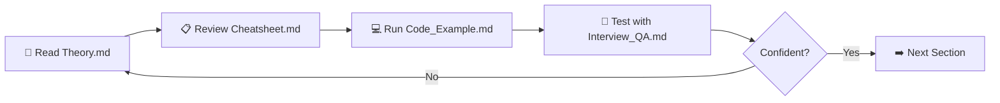

# How to Use This Repo

This repo is designed so that a complete beginner can become comfortable with Apache Airflow by reading, running, and practicing — in that order.

---

## File Types in Each Section

Every section folder contains up to four files. Here is what each one does and when to use it.

| File | Purpose | When to Read It |
|------|---------|-----------------|
| `Theory.md` | Story-based explanation of the concept. No jargon without explanation. Includes diagrams. | Read this **first**. Always. |
| `Cheatsheet.md` | Compact reference table. Commands, parameters, comparisons. No narrative. | Read after Theory. **Revisit often** while coding. |
| `Code_Example.md` | Fully commented, runnable Python code. Real DAGs you can copy and modify. | Read after Cheatsheet. **Run it locally**. |
| `Interview_QA.md` | Questions and detailed answers, from beginner to advanced. | Read last. Use to **test yourself** before moving on. |

---

## Suggested Learning Order for Each Section

Follow this loop for every section:



---

## Folder Structure

```
Airflow/
├── 00_Learning_Guide/           ← Start here
│   ├── Learning_Path.md
│   ├── How_to_Use_This_Repo.md  ← You are here
│   └── Progress_Tracker.md
│
├── 01_Beginner/                 🟢 Modules 01–05
│   ├── 01_What_is_Airflow/
│   ├── 02_Airflow_3_Architecture/
│   ├── 03_Installation_and_Setup/
│   ├── 04_Your_First_DAG/
│   └── 05_Core_Operators/
│
├── 02_Intermediate/             🟡 Modules 06–13
│   ├── 06_All_Operators/        ← 8 operator sub-folders
│   ├── 07_Sensors/              ← 4 sensor sub-folders
│   ├── 08_Executors/            ← 4 executor sub-folders
│   ├── 09_Connections_and_Hooks/
│   ├── 10_Variables_and_Config/
│   ├── 11_XComs_and_TaskFlow/
│   ├── 12_Jinja_Templates_Macros/
│   └── 13_DAG_Params_and_Runtime/
│
├── 03_Advanced/                 🔴 Modules 14–22
├── 04_Expert/                   🟣 Modules 23–29
├── 05_Airflow_3_Features/       🔵 Modules 30–36
├── 06_Airflow_on_Cloud/         ☁️  Modules 37–40
├── 07_Integrations/             🔗 Modules 41–44
└── 08_Projects/                 🏗️ 6 end-to-end projects
```

---

## Tips for Hands-On Practice

### 1. Run Airflow Locally First
Do not try to learn Airflow without a running instance. Section 02 walks you through a Docker Compose setup that takes about 15 minutes. Get that working before anything else.

### 2. Break the Code on Purpose
Once you get a code example working, change something deliberately. Delete a dependency. Break the schedule. See what error appears. Errors are your best teachers.

### 3. Use the Airflow UI While Reading
Keep the Airflow UI open in a browser tab (default: `http://localhost:8080`) while you read Theory files. When the theory says "the Scheduler marks the task as queued", go look at the UI and find that state yourself.

### 4. Write Your Own DAGs
After each Code Example, write a small variation from scratch. Do not copy-paste. Writing forces you to recall and actually learn.

### 5. Use the Cheatsheet as Your Desktop Reference
Print or pin the Cheatsheet for each section. While you are building something, you will constantly want to look up parameter names, cron syntax, and operator arguments.

### 6. Do Not Skip the Interview Q&A
Even if you are not job hunting. The questions force you to explain concepts clearly — which proves you actually understand them, not just recognize them.

---

## Prerequisites

| Skill | Level Needed |
|-------|-------------|
| Python | Comfortable writing functions and classes |
| Command line (bash) | Basic — `cd`, `ls`, running scripts |
| Docker | Helpful but not required — Section 02 explains it |
| SQL | Basic — helpful for understanding metadata DB |

---

## 📂 Navigation

⬅️ **Prev:** [Learning Path](./Learning_Path.md) | 🏠 **[Home](../00_Learning_Guide/Learning_Path.md)** | ➡️ **Next:** [Progress Tracker](./Progress_Tracker.md)
