# Apache Airflow — Complete Learning Path

Welcome to the Airflow learning repo. This guide is your map — where to start, where you're going, and how the 8 sections connect.

---

## Full Learning Path

```mermaid
flowchart TD
    A([🚀 Start Here]) --> B1

    subgraph B["🟢 Beginner"]
        B1[01 · What is Airflow]
        B1 --> B2[02 · Airflow 3 Architecture]
        B2 --> B3[03 · Installation & Setup]
        B3 --> B4[04 · Your First DAG]
        B4 --> B5[05 · Core Operators]
    end

    B5 --> C1

    subgraph C["🟡 Intermediate"]
        C1[06 · All Operators]
        C1 --> C2[07 · Sensors]
        C2 --> C3[08 · Executors]
        C3 --> C4[09 · Connections & Hooks]
        C4 --> C5[10 · Variables & Config]
        C5 --> C6[11 · XComs & TaskFlow]
        C6 --> C7[12 · Jinja Templates]
        C7 --> C8[13 · DAG Params & Runtime]
    end

    C8 --> D1

    subgraph D["🔴 Advanced"]
        D1[14 · Branching & Control Flow]
        D1 --> D2[15 · Task Groups]
        D2 --> D3[16 · Dynamic Task Mapping]
        D3 --> D4[17 · Deferrable Operators]
        D4 --> D5[18 · Callbacks & SLAs]
        D5 --> D6[19 · Pools & Resources]
        D6 --> D7[20 · Monitoring & Alerting]
        D7 --> D8[21 · Testing DAGs]
        D8 --> D9[22 · Custom Timetables]
    end

    D9 --> E1

    subgraph E["🟣 Expert"]
        E1[23 · Plugins & Customization]
        E1 --> E2[24 · Custom Operators & Hooks]
        E2 --> E3[25 · Secrets & Security]
        E3 --> E4[26 · REST API]
        E4 --> E5[27 · Performance Optimization]
        E5 --> E6[28 · Remote Logging]
        E6 --> E7[29 · DAG Patterns & Best Practices]
    end

    E7 --> F1

    subgraph F["🔵 Airflow 3"]
        F1[30 · What's New in Airflow 3]
        F1 --> F2[31 · Asset-Driven Scheduling]
        F2 --> F3[32 · DAG Versioning]
        F3 --> F4[33 · New Auth Manager]
        F4 --> F5[34 · Edge Executor]
        F5 --> F6[35 · Event-Driven Scheduling]
        F6 --> F7[36 · Object Storage API]
    end

    F7 --> G([✅ Airflow Engineer])

    style A fill:#FF6B35,color:#fff
    style G fill:#10b981,color:#fff
```

---

## All 8 Sections at a Glance

| # | Section | Modules | Est. Time |
|---|---------|---------|-----------|
| 🟢 01 | **Beginner** | What is Airflow, Architecture, Install, First DAG, Core Operators | 6–8 hrs |
| 🟡 02 | **Intermediate** | All Operators, Sensors, Executors, Connections, XComs, Jinja | 12–15 hrs |
| 🔴 03 | **Advanced** | Branching, Dynamic Tasks, Deferrable Ops, Testing, Timetables | 15–18 hrs |
| 🟣 04 | **Expert** | Plugins, Custom Operators, Secrets, REST API, Performance | 12–15 hrs |
| 🔵 05 | **Airflow 3 Features** | Assets, DAG Versioning, Auth Manager, Edge Executor | 10–12 hrs |
| ☁️ 06 | **Cloud** | AWS EKS, MWAA, GCP Composer, Deployment Patterns | 8–10 hrs |
| 🔗 07 | **Integrations** | dbt, Spark, Great Expectations, KubernetesPodOperator | 8–10 hrs |
| 🏗️ 08 | **Projects** | 6 end-to-end projects from beginner to expert | 15+ hrs |

**Total estimated time: ~90–100 hours**

---

## Learning Tracks

### Track 1 — Beginner (Sections 01–02, modules 01–08)
**Goal:** Understand Airflow and build real pipelines that connect to external systems.

| Module | Key Outcome |
|--------|------------|
| 01 · What is Airflow | You can explain Airflow to anyone |
| 02 · Airflow 3 Architecture | You understand every component |
| 03 · Installation & Setup | You have Airflow 3 running locally |
| 04 · Your First DAG | You write and trigger a working DAG |
| 05 · Core Operators | You use Bash, Python, and Email operators |
| 06 · All Operators | You connect to Postgres, S3, HTTP, K8s |
| 07 · Sensors | You wait for files, APIs, and external tasks |
| 08 · Executors | You understand how Airflow scales |

**Prerequisite:** Basic Python.

---

### Track 2 — Intermediate (Sections 02–03, modules 09–18)
**Goal:** Build production-grade pipelines with proper config, data flow, and error handling.

| Module | Key Outcome |
|--------|------------|
| 09 · Connections & Hooks | You manage credentials properly |
| 10 · Variables & Config | You parameterize pipelines |
| 11 · XComs & TaskFlow | You pass data between tasks safely |
| 12 · Jinja Templates | You write dynamic SQL and commands |
| 13 · DAG Params & Runtime | You parameterize DAG runs at trigger time |
| 14 · Branching & Control Flow | You build conditional pipelines |
| 15 · Task Groups | You organize complex DAGs visually |
| 16 · Dynamic Task Mapping | You expand tasks dynamically at runtime |

**Prerequisite:** Beginner track complete.

---

### Track 3 — Advanced/Expert (Sections 03–04, modules 17–29)
**Goal:** Design, extend, test, optimize, and fully own Airflow.

| Module | Key Outcome |
|--------|------------|
| 17 · Deferrable Operators | You reduce worker resource waste |
| 18–22 · Monitoring, Testing, Timetables | You build observable, testable pipelines |
| 23–24 · Plugins, Custom Operators | You extend Airflow for your org |
| 25 · Secrets | You handle credentials at enterprise scale |
| 26–29 · API, Performance, Patterns | You optimize and architect Airflow systems |

**Prerequisite:** Intermediate track complete.

---

### Track 4 — Airflow 3 Specialist (Section 05)
**Goal:** Master the new features in Airflow 3 that change how you design pipelines.

| Module | Key Outcome |
|--------|------------|
| 30 · What's New | You understand all breaking changes |
| 31 · Assets | You build event-driven, data-aware pipelines |
| 32 · DAG Versioning | You manage DAG lifecycle |
| 33–36 · Auth, Edge, Object Storage | You use the full Airflow 3 feature set |

---

## How to Use This Path

1. Follow sections in order — each builds on the last.
2. For each topic: **Theory → Cheatsheet → Code → Interview Q&A**.
3. Don't skip the Interview Q&A — it reveals what you don't actually understand yet.
4. Track your progress in [Progress_Tracker.md](./Progress_Tracker.md).

---

## 📂 Navigation

🏠 **[Home](../README.md)** &nbsp;|&nbsp; ➡️ **Next:** [How to Use This Repo](./How_to_Use_This_Repo.md)
