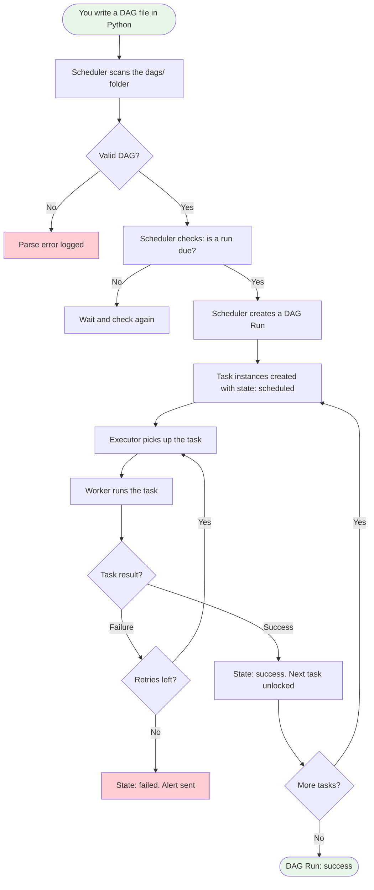
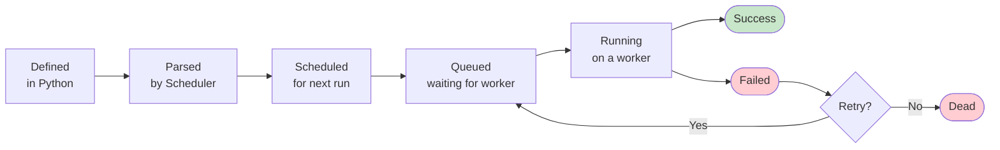
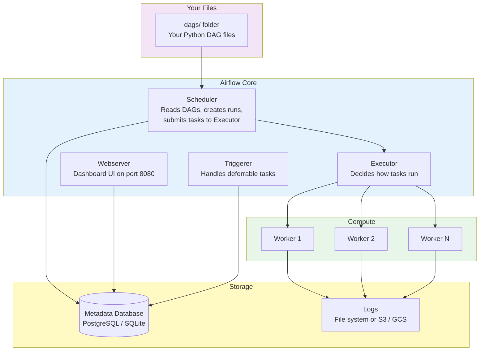

# 01 · Core Concepts — Theory

---

## 📌 Learning Priority

**Must Learn** — core concepts, needed to understand the rest of this file:
[What is Airflow](#what-is-apache-airflow) · [How It Works](#how-it-works--step-by-step) · [DAG concept](#dag--the-central-concept) · [Task concept](#task--the-unit-of-work)

**Should Learn** — important for real projects and interviews:
[Why It Exists](#why-it-exists) · [Core Components](#core-components) · [Common Mistakes](#common-mistakes-)

**Good to Know** — useful in specific situations, not needed daily:
[Real-World Usage](#real-world-usage) · [DAG Lifecycle](#dag-lifecycle)

**Reference** — skim once, look up when needed:
[Architecture Overview](#architecture-overview) · [Connection to Other Concepts](#connection-to-other-concepts-)

---

## The Story 📖

Imagine you are the head chef at a busy restaurant. Every morning, dozens of dishes need to be prepared — soups, mains, desserts — each with their own recipe, their own timing, and their own dependencies. The dessert cannot be plated before the main course is cooked. The sauce must be reduced before it can be poured.

Now imagine you are trying to manage all of this with sticky notes on a whiteboard. Every morning you write down what needs to happen, in what order, at what time. When a dish fails, you scribble it out and start over. When the kitchen gets busier, you hire more cooks, but now you have to coordinate five people with sticky notes. It works — barely.

Then someone hands you a kitchen management system. You write the recipe once, in a structured format. The **sous-chef (Scheduler)** reads your recipe book every few seconds, sees what is due, and assigns work. The **line cooks (Workers)** execute the tasks. A **notice board (Metadata Database)** tracks every dish's status in real time. A **head waiter (Webserver)** lets you see everything from a dashboard.

You never write on sticky notes again.

That kitchen management system is **Apache Airflow**.

---

## What is Apache Airflow?

Apache Airflow is an open-source platform for **authoring, scheduling, and monitoring workflows** (also called pipelines).

A workflow is a sequence of tasks that need to run in a particular order. Common examples:

- Pull data from an API every night, transform it, load it into a database.
- Train a machine learning model every Sunday, evaluate it, and deploy it if it beats the previous version.
- Send a daily report email after aggregating sales data.

Airflow lets you write these workflows as **Python code**, which means they are version-controlled, testable, and reusable.

**Key point:** Airflow is a *workflow orchestrator*, not a data processing tool. It tells other systems what to do and when — it does not process the data itself.

---

## Why It Exists

### The problem with cron jobs

Before tools like Airflow existed, engineers used `cron` to schedule tasks. Cron is a Unix utility that runs commands on a schedule (e.g., "run this script at 2am every day"). It works well for simple, independent tasks.

But cron has serious limitations:

| Problem | Why It Hurts |
|---------|-------------|
| No dependency management | Task B cannot wait for Task A to succeed — you just hope the timing is right |
| No visibility | You cannot see which jobs ran, which failed, or how long they took |
| No retries | If a job fails, it fails silently |
| No backfilling | If a job misses a run, there is no easy way to catch up |
| No alerting | You find out about failures from angry colleagues |
| Not version-controlled | Cron config lives on a server, not in Git |

Airflow solves all of these problems.

### What makes Airflow different

- You define task **dependencies** explicitly — task B only runs after task A succeeds.
- Every run is **logged** and visible in the UI.
- Failed tasks can be **retried** automatically.
- You can **backfill** missed runs for any date range.
- You can **trigger alerts** on failure.
- Workflows are defined in **Python files** that live in Git.

---

## How It Works — Step by Step

Here is how Airflow processes your workflow from start to finish.

### DAG Lifecycle

A DAG goes through these states from creation to completion:

---

## The Technical Side

### Core Components

Airflow is made up of several components that work together. Each one has a specific job.

#### 1. Scheduler
The brain of Airflow. It continuously reads your DAG files, determines which tasks are due to run, and sends them to the Executor. It also monitors running tasks and updates their state in the Metadata Database.

The Scheduler runs as a separate process (or pod in Kubernetes). It does NOT run your tasks directly — it just orchestrates them.

#### 2. Webserver
The dashboard. A Flask-based web application that reads from the Metadata Database and shows you the status of all your DAGs, runs, and tasks. It also lets you manually trigger DAGs, clear failed tasks, and view logs.

Default port: **8080**.

#### 3. Metadata Database
The single source of truth. A relational database (PostgreSQL in production, SQLite by default) that stores everything: DAG definitions, task states, connections, variables, user accounts, and logs metadata.

Both the Scheduler and Webserver read from and write to this database constantly.

#### 4. Executor
Defines *how* tasks are run. The Executor receives task instructions from the Scheduler and decides whether to run them in the same process, on a separate machine, or in a container. Common executors: `SequentialExecutor`, `LocalExecutor`, `CeleryExecutor`, `KubernetesExecutor`.

#### 5. Worker
The muscle. Workers are the processes (or pods) that actually run your task code. Depending on the Executor, workers may be the same process as the Scheduler (SequentialExecutor) or completely separate machines (CeleryExecutor).

#### 6. Triggerer
A newer component introduced in Airflow 2.2. It runs lightweight deferrable tasks — tasks that spend most of their time waiting (for an HTTP response, a file to appear, etc.). Instead of occupying a full worker slot while waiting, deferrable tasks yield control back to the Triggerer, freeing the worker for other work.

### Architecture Overview

### DAG — The Central Concept

DAG stands for **Directed Acyclic Graph**. This is a graph theory term:

- **Directed**: edges have a direction (A → B means A runs before B)
- **Acyclic**: no cycles allowed (A cannot depend on B if B depends on A)
- **Graph**: a set of nodes (tasks) connected by edges (dependencies)

In Airflow, a DAG is a Python file that describes:
- Which tasks to run
- In what order
- On what schedule
- With what configuration

### Task — The Unit of Work

A **Task** is one unit of work inside a DAG. A task is created from an **Operator**. An Operator is a template for a type of task:

- `BashOperator` — runs a bash command
- `PythonOperator` — runs a Python function
- `EmailOperator` — sends an email
- And hundreds more

---

## Real-World Usage

Airflow is used by companies of all sizes for data engineering, MLOps, and DevOps automation. Common use cases:

| Use Case | Example |
|----------|---------|
| ETL pipelines | Extract from API, transform with pandas, load to Snowflake |
| ML model training | Fetch training data → train model → evaluate → deploy if better |
| Report generation | Aggregate DB data → format report → email to stakeholders |
| Data quality checks | Run tests on tables, alert if row counts drop |
| Cross-system coordination | Trigger a Spark job, wait for it to finish, then run next step |

**Who uses Airflow:** Airbnb (invented it), Lyft, Twitter, Adobe, PayPal, NASA, and thousands more.

---

## Common Mistakes ⚠️

**1. Using Airflow for real-time streaming**
Airflow is a batch orchestrator. It is not designed for sub-minute schedules or real-time event processing. Use Kafka, Flink, or similar tools for that.

**2. Putting heavy computation in the DAG file itself**
The Scheduler parses your DAG file every 30 seconds. Any code at the top level of the file runs during parsing. Keep DAG files lightweight — put computation inside task functions.

**3. Treating task order as time-based**
Dependency means "this must succeed before that starts", not "this starts at time X and that starts at time X+5 minutes". Do not use `sleep()` to simulate dependencies.

**4. Not setting `start_date` correctly**
`start_date` is the date of the *first* run. It must be a fixed date in the past, not `datetime.now()`. Using `datetime.now()` causes confusing behavior because the value changes every time the file is parsed.

**5. Assuming workers share memory**
Each task runs in its own process (often on a different machine). You cannot pass Python objects directly between tasks — use XComs for small values or external storage for large ones.

---

## Connection to Other Concepts 🔗

| Concept | Relationship |
|---------|-------------|
| **DAGs** (Section 03) | The Python files that define your workflows. The core of everything you write in Airflow. |
| **Operators** (Section 04) | The building blocks of tasks. You use operators to create tasks inside DAGs. |
| **Executors** (Section 06) | Determine how tasks are distributed and run. Choosing the right executor is key to scaling. |
| **Connections & Hooks** (Section 07) | How Airflow connects to external systems like databases, S3, APIs. |
| **XComs** (Section 09) | The mechanism for passing data between tasks within a DAG run. |

---

## What You Learned

- Apache Airflow is a **workflow orchestration platform** — it schedules and monitors pipelines.
- It solves the core problems of cron: no visibility, no dependencies, no retries.
- The main components are the **Scheduler, Webserver, Metadata Database, Executor, Worker, and Triggerer**.
- A **DAG** is a Python file describing tasks and their dependencies.
- A **Task** is a unit of work, created using an **Operator**.

## Try This

1. In one sentence, explain Airflow to a colleague who only knows cron jobs.
2. Draw the Airflow architecture on paper from memory. Label each component.
3. Name a workflow in your current job or a project that Airflow could automate.

## Next Step

Get Airflow running on your machine. Section 02 walks you through the full setup.

---

🚀 **Apply this:** Build your first real ETL pipeline → [Project 01 — Forex ETL Pipeline](../../09_Capstone_Projects/01_Forex_ETL_Pipeline/01_MISSION.md)
## 📂 Navigation

⬅️ **Prev:** [Progress Tracker](../00_Learning_Guide/Progress_Tracker.md) | 🏠 **[Home](../00_Learning_Guide/Learning_Path.md)** | ➡️ **Next:** [02 · Installation & Setup — Theory](../02_Installation_and_Setup/Theory.md)
