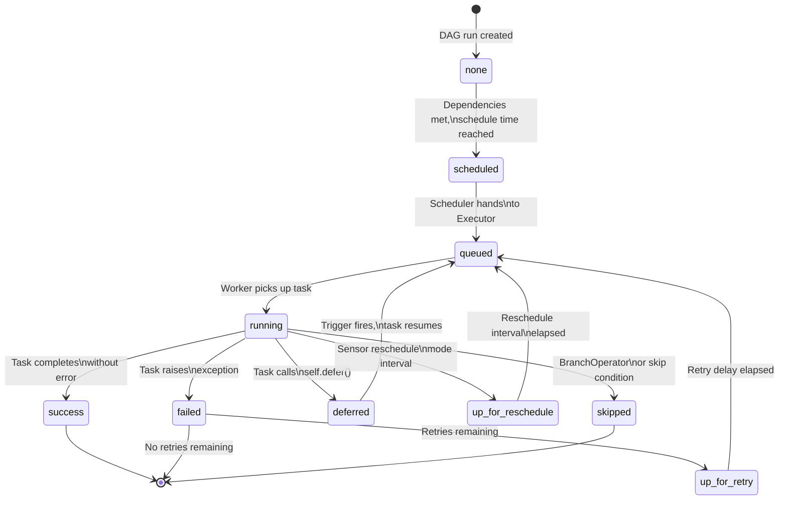
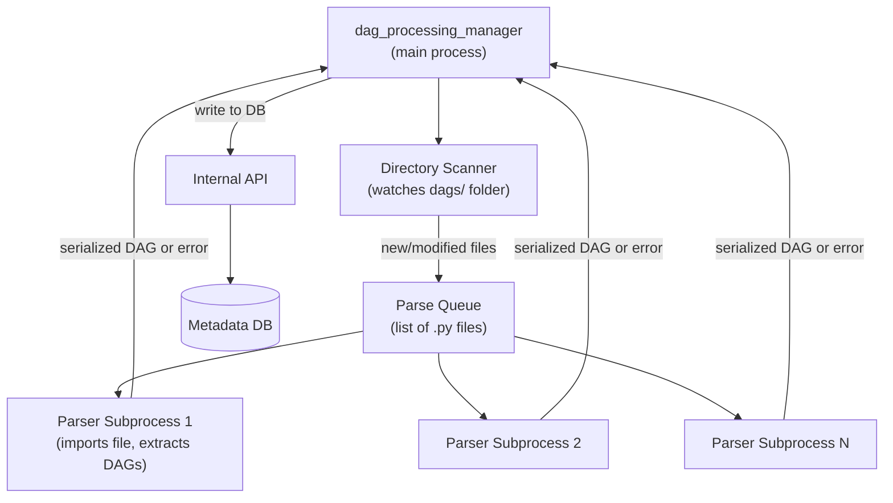
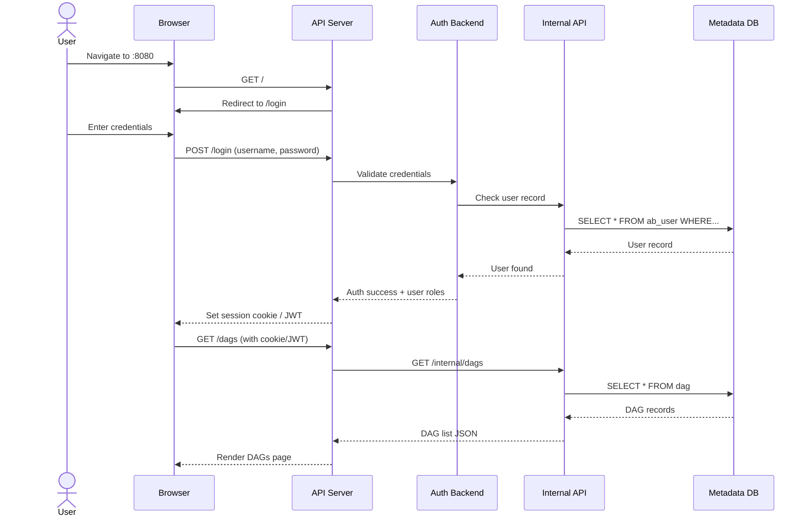
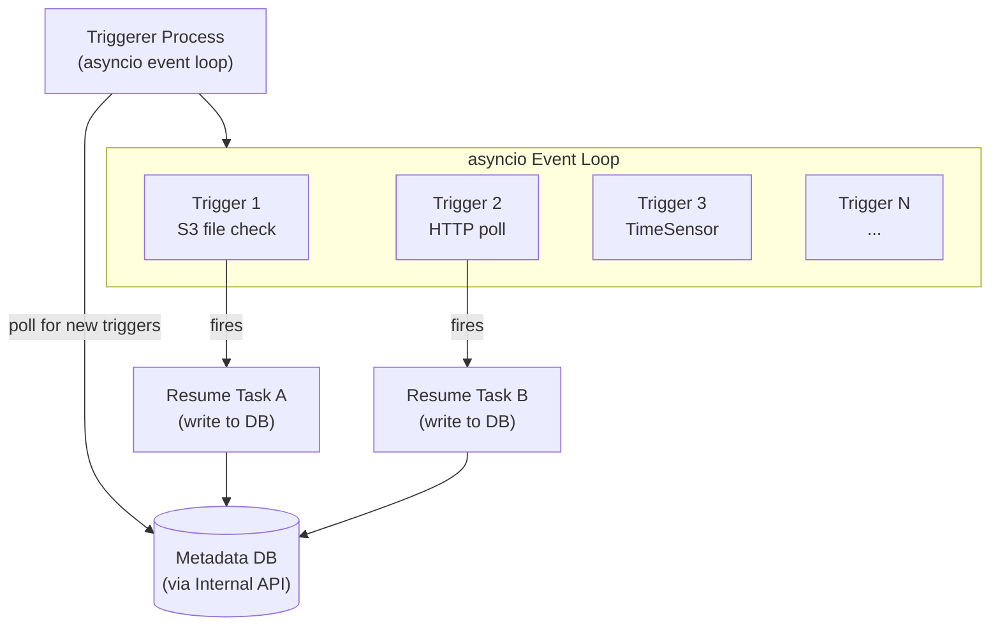

# Airflow 3 Architecture — Component Deep Dive

## 1. Scheduler — Internal Mechanics

### The Scheduling Loop

The Scheduler runs a continuous heartbeat loop. Every `scheduler_heartbeat_sec` seconds (default: 5), it performs the following sequence:

```
Scheduler Heartbeat
├── 1. Check for DAGs with elapsed schedule interval
│       → Create new DagRun records
├── 2. Evaluate task dependencies for all active DagRuns
│       → Move eligible tasks from None → Scheduled
├── 3. Move Scheduled tasks → Queued
│       → Submit to Executor
├── 4. Check Executor for completed tasks
│       → Update TaskInstance state in DB
├── 5. Detect zombie tasks
│       → Mark stale Running tasks as Failed
└── 6. Apply retry logic
        → Move Failed tasks to Up_For_Retry → Queued
```

### Task State Machine

Every task instance moves through a defined set of states. Here is the complete state machine:



### Heartbeat Configuration

```ini
[scheduler]
scheduler_heartbeat_sec = 5          # How often the scheduler loop runs
min_file_process_interval = 30       # Min seconds between DAG file re-parses (v2 only, now in dag_processor)
dag_dir_list_interval = 300          # How often to scan for new DAG files
zombie_detection_interval = 10       # How often to check for zombie tasks
scheduler_zombie_task_threshold = 300 # Seconds before a running task is considered a zombie
max_dagruns_to_create_per_loop = 10  # Max DAG runs to create per heartbeat cycle
```

### High Availability Mode

Airflow 3 supports running multiple Schedulers simultaneously. They use **optimistic locking** at the database level (via the Internal API) to prevent two Schedulers from scheduling the same task. If one Scheduler crashes, the others continue without interruption.

```bash
# Start two schedulers on different machines — they coordinate automatically
airflow scheduler  # Machine A
airflow scheduler  # Machine B
```

---

## 2. DAG Processor — Internal Mechanics

### The File Processing Loop

The DAG Processor runs a `dag_processing_manager` process that:
1. Scans the `dags/` folder for `.py` files and subdirectories.
2. Maintains a queue of files to process.
3. Spawns subprocess workers to parse individual files.
4. Collects results and writes them to the Metadata Database.
5. Tracks parse times and flags slow files.



### Serialization Format

When a DAG is parsed, its structure is serialized into a JSON representation and stored in the `dag` table's `data` column. This JSON includes:
- DAG metadata: `dag_id`, `schedule_interval`, `start_date`, `default_args`, `tags`
- Task list: each task's `task_id`, `task_type`, operator class, dependencies
- Task parameters: all operator arguments that are JSON-serializable

**What is NOT serialized:** Callables (Python functions used in PythonOperator) are referenced by name, not serialized as code. The actual function execution happens when a Worker picks up the task and imports the DAG file itself.

### Partial Parsing

To speed up parsing, the DAG Processor supports **partial parsing**: if a DAG file has not changed since the last parse (based on file hash), it skips the full re-import and uses the cached result. This is controlled by:

```ini
[dag_processor]
min_file_process_interval = 30   # Minimum seconds between re-parses of the same file
```

### Import Error Handling

If a DAG file raises any exception during import (syntax error, import error, undefined variable), the DAG Processor:
1. Catches the exception.
2. Writes the error message and traceback to the `import_error` table.
3. Displays the error in the Airflow UI under "Import Errors".
4. Continues processing other files — one bad file does not block others.
5. Retries parsing the file on the next scan cycle.

```python
# This will appear as an import error in the UI:
from nonexistent_library import something  # ImportError

# This will also appear as an import error:
dag = DAG("my_dag", start_date=undefined_variable)  # NameError
```

---

## 3. API Server — Internal Mechanics

### Technology Stack

The Airflow 3 API Server is built on **FastAPI** (moved from Flask/FAB in Airflow 2). It uses:
- **FastAPI** for the REST API layer
- **Uvicorn** or **Gunicorn** as the ASGI server
- **Starlette** for middleware (auth, CORS, etc.)
- The React-based **Airflow UI** is served as static files from the same process

### Authentication Flow



### Stateless Design

The API Server stores no session state in memory. Each request is authenticated independently (via session cookie backed by the database, or JWT token). This means:
- Any API Server instance can serve any request.
- You can kill and restart any API Server instance without affecting active sessions.
- You can add API Server instances dynamically under a load balancer.

### REST API Endpoints (Key Examples)

```
GET    /api/v1/dags                    # List all DAGs
GET    /api/v1/dags/{dag_id}           # Get DAG details
PATCH  /api/v1/dags/{dag_id}           # Update DAG (e.g., pause/unpause)
GET    /api/v1/dags/{dag_id}/dagRuns   # List DAG runs
POST   /api/v1/dags/{dag_id}/dagRuns   # Trigger a DAG run
GET    /api/v1/tasks/{dag_id}/{task_id} # Get task details
GET    /api/v1/taskInstances           # Query task instances
POST   /api/v1/variables               # Create a variable
GET    /api/v1/connections             # List connections
GET    /api/v1/health                  # Health check
```

---

## 4. Metadata Database — Key Tables

### Table: `dag`

Stores the serialized definition of each DAG.

| Column | Type | Description |
|---|---|---|
| `dag_id` | VARCHAR | Unique DAG identifier |
| `is_paused` | BOOLEAN | Whether the DAG is paused |
| `is_active` | BOOLEAN | Whether the DAG file still exists |
| `last_parsed_time` | DATETIME | When the DAG Processor last parsed this DAG |
| `data` | JSON | Full serialized DAG structure |
| `schedule_interval` | TEXT | Cron expression or timedelta |
| `next_dagrun` | DATETIME | When the next run should be created |

### Table: `dag_run`

One record per execution of a DAG.

| Column | Type | Description |
|---|---|---|
| `id` | INTEGER | Auto-increment primary key |
| `dag_id` | VARCHAR | References `dag.dag_id` |
| `run_id` | VARCHAR | Unique run identifier (e.g., `scheduled__2024-01-15T00:00:00+00:00`) |
| `state` | VARCHAR | `queued`, `running`, `success`, `failed` |
| `execution_date` | DATETIME | The logical execution date |
| `start_date` | DATETIME | Actual start time |
| `end_date` | DATETIME | Actual end time |
| `run_type` | VARCHAR | `scheduled`, `manual`, `backfill`, `dataset_triggered` |

### Table: `task_instance`

One record per task per DAG run.

| Column | Type | Description |
|---|---|---|
| `task_id` | VARCHAR | Task identifier |
| `dag_id` | VARCHAR | DAG identifier |
| `run_id` | VARCHAR | References `dag_run.run_id` |
| `state` | VARCHAR | Current state (see state machine) |
| `start_date` | DATETIME | When the task started running |
| `end_date` | DATETIME | When the task finished |
| `duration` | FLOAT | Runtime in seconds |
| `try_number` | INTEGER | Which attempt (1 = first try) |
| `hostname` | VARCHAR | Worker hostname |
| `executor_config` | JSON | Per-task executor configuration |

### Table: `xcom`

Stores cross-task communication values.

| Column | Type | Description |
|---|---|---|
| `dag_id` | VARCHAR | DAG identifier |
| `task_id` | VARCHAR | Task that pushed the value |
| `run_id` | VARCHAR | DAG run identifier |
| `key` | VARCHAR | XCom key (default: `return_value`) |
| `value` | BLOB | Pickled value |
| `timestamp` | DATETIME | When the XCom was pushed |

### Table: `variable`

Key-value store for Airflow Variables.

| Column | Type | Description |
|---|---|---|
| `id` | INTEGER | Primary key |
| `key` | VARCHAR | Variable name |
| `val` | TEXT | Variable value (encrypted if fernet key set) |
| `is_encrypted` | BOOLEAN | Whether `val` is encrypted |

### Table: `connection`

Stores connection configurations.

| Column | Type | Description |
|---|---|---|
| `conn_id` | VARCHAR | Connection identifier |
| `conn_type` | VARCHAR | Type: `postgres`, `s3`, `http`, etc. |
| `host` | VARCHAR | Host address |
| `schema` | VARCHAR | Database/schema name |
| `login` | VARCHAR | Username |
| `password` | TEXT | Password (encrypted) |
| `port` | INTEGER | Port number |
| `extra` | TEXT | JSON string for additional config |

### Table: `trigger`

Stores active deferral triggers (used by the Triggerer component).

| Column | Type | Description |
|---|---|---|
| `id` | INTEGER | Primary key |
| `classpath` | VARCHAR | Python class path of the trigger |
| `kwargs` | JSON | Arguments to instantiate the trigger |
| `created_date` | DATETIME | When the trigger was registered |
| `triggerer_id` | INTEGER | Which Triggerer instance owns this trigger |

---

## 5. Triggerer — Internal Mechanics

### How Deferral Works

The deferral mechanism has three phases:

**Phase 1: Task defers**
```python
# Inside a deferrable operator's execute() method:
def execute(self, context):
    # Instead of blocking here, we defer:
    self.defer(
        trigger=S3KeyTrigger(bucket_name="my-bucket", key="my-file.csv"),
        method_name="execute_complete",  # Method to call when trigger fires
        timeout=timedelta(hours=1)
    )
    # Execution stops here. Worker slot is freed.
```

**Phase 2: Triggerer monitors**
```python
# The Triggerer runs an asyncio event loop:
async def run(self):
    while True:
        # Check all registered triggers asynchronously
        for trigger in await self.get_triggers():
            asyncio.create_task(self.monitor_trigger(trigger))
        await asyncio.sleep(1)

async def monitor_trigger(self, trigger):
    async for event in trigger.run():
        # Trigger fired! Resume the task.
        await self.resume_task(trigger, event)
```

**Phase 3: Task resumes**
```python
# When the trigger fires, this method is called on the operator:
def execute_complete(self, context, event):
    # event contains data from the trigger
    if event["status"] == "success":
        return event["file_content"]
    raise AirflowException("Trigger reported failure")
```

### Async Event Loop Architecture



The key insight is that `asyncio` allows thousands of concurrent I/O-bound waits in a single thread. Each trigger is a coroutine that `await`s on an I/O operation. While one trigger is waiting for a network response, the event loop runs other triggers. No blocking. No threads.

---

## 6. Internal API — Why It Exists and How It Works

### The Problem It Solves

In a distributed Airflow deployment with CeleryExecutor:
- The Scheduler runs on machine A.
- The API Server runs on machine B.
- Workers run on machines C, D, E, ...
- DAG Processor runs on machine A.

In Airflow 2, all of these machines needed:
- The `sql_alchemy_conn` database connection string.
- Network access to the PostgreSQL port (5432).
- Proper database connection pool configuration.

This is a significant operational and security burden. Every machine is a potential vector for database credential exposure.

### The Airflow 3 Solution

In Airflow 3, only one service — the Internal API (which runs as part of the API Server process) — has direct database access. All other components make HTTP calls to the Internal API.

Workers on machines C, D, E only need:
- The URL of the Internal API (e.g., `http://airflow-api-server:8080/internal/`)
- An internal API auth token (much simpler to rotate than database credentials)
- No PostgreSQL access required

### How Components Use the Internal API

Each Airflow component uses a Python client that wraps the Internal API:

```python
# Example: how the Scheduler creates a DagRun via Internal API
from airflow.api_internal.internal_api_call import InternalApiConfig

# The Scheduler doesn't do this:
# session.add(DagRun(...))  # REMOVED in v3

# The Scheduler does this:
dag_run = create_dag_run(dag_id="my_dag", execution_date=now())
# Which internally calls:
# POST http://internal-api/dag-runs  {"dag_id": "my_dag", ...}
```

### Internal API vs Public REST API

| | Internal API | Public REST API |
|---|---|---|
| Consumer | Airflow components (Scheduler, Workers, etc.) | External users, CI/CD, scripts |
| Authentication | Internal token / same-host trust | Basic auth, OAuth2, JWT |
| Endpoint prefix | `/internal/` | `/api/v1/` |
| Stability guarantee | May change between versions | Stable, versioned |
| Direct access | Not intended for users | Intended for users |
