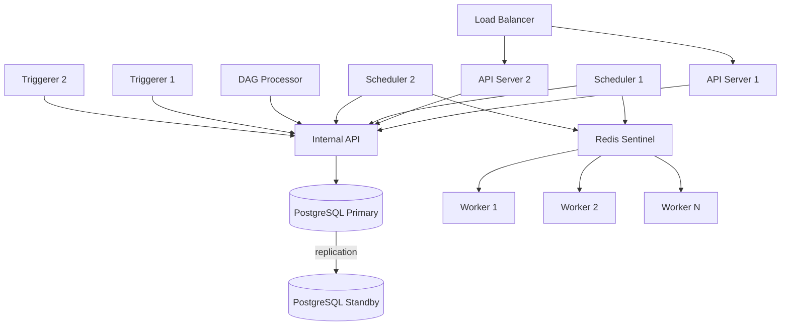

# Airflow 3 Architecture — Interview Q&A

## Beginner Questions

---

**Q1. What are the main components of Airflow 3?**

Airflow 3 has the following core components:

1. **API Server** — serves the Web UI and REST API (port 8080). New in v3, replaces the old Webserver.
2. **Scheduler** — reads scheduled DAGs and task instances from the database, determines what runs next, and hands off tasks to the Executor.
3. **DAG Processor** — a new standalone process that reads DAG Python files, parses them, and serializes the DAG structure into the Metadata Database.
4. **Executor** — the pluggable component that determines *how* tasks are run (locally, via Celery, Kubernetes, or Edge).
5. **Worker** — the actual process that runs your task code.
6. **Triggerer** — handles deferrable operators using an async event loop, freeing worker slots during long waits.
7. **Internal API** — an HTTP interface (new in v3) through which all components communicate instead of accessing the database directly.
8. **Metadata Database** — PostgreSQL or MySQL database that stores DAG definitions, DAG runs, task states, connections, variables, and XComs.
9. **Message Broker** — Redis or RabbitMQ, used only with CeleryExecutor as a task queue.

---

**Q2. What does the Scheduler do in Airflow 3?**

The Scheduler is responsible for determining *when* tasks should run. It:
- Polls the Metadata Database (via the Internal API) for DAGs whose schedule interval has elapsed.
- Creates new DAG runs for those DAGs.
- Evaluates task dependencies and transitions eligible task instances from `scheduled` → `queued` state.
- Submits queued tasks to the Executor.
- Monitors running tasks and handles retries.

**Important Airflow 3 change:** The Scheduler no longer parses DAG files. In Airflow 2, DAG parsing was done inside the Scheduler. In Airflow 3, a separate DAG Processor handles all parsing.

---

**Q3. What is the Metadata Database? What is stored in it?**

The Metadata Database is the central store of truth for Airflow. It is a relational database — PostgreSQL (recommended) or MySQL.

It stores:
- **DAG definitions** (serialized by the DAG Processor)
- **DAG runs** — every execution of every DAG, with start time, end time, state
- **Task instances** — every individual task execution, with its state and duration
- **XComs** — data passed between tasks
- **Variables** — key-value configuration pairs
- **Connections** — database URIs, API credentials, SSH keys
- **Import errors** — DAG files that failed to parse
- **Trigger records** — active deferrable operator triggers

It does NOT store: log file content (stored on disk/S3/GCS), or your actual data pipeline outputs.

---

## Intermediate Questions

---

**Q4. What changed in Airflow 3 architecture compared to Airflow 2?**

The most significant changes are:

1. **DAG Processor is now standalone.** In Airflow 2, the Scheduler also parsed DAG files internally. In Airflow 3, a dedicated `airflow dag-processor` process handles this. This means a broken DAG file can no longer crash the Scheduler.

2. **Webserver replaced by API Server.** The old Airflow 2 `airflow webserver` served only the UI. Airflow 3's `airflow api-server` serves both the Web UI and the REST API in one stateless process.

3. **Internal API replaces direct database access.** In Airflow 2, the Scheduler, Webserver, and Workers all made direct SQL connections to the database. In Airflow 3, only the Internal API has direct database access. All other components communicate via HTTP to the Internal API.

4. **Edge Executor is new.** Airflow 3 introduces a lightweight Edge Executor for running tasks on remote or resource-constrained machines without Celery or Kubernetes.

5. **`db init` is replaced by `db migrate`.** The initialization command changed.

---

**Q5. What is the DAG Processor and why was it separated from the Scheduler?**

The DAG Processor is a standalone Airflow 3 component (`airflow dag-processor`) that:
- Watches the `dags/` folder for Python files.
- Imports each file as a Python module to extract DAG definitions.
- Serializes the DAG structure into the Metadata Database via the Internal API.
- Reports parse errors, import errors, and parse timing.

**Why separated:** In Airflow 2, if a DAG file had a slow import (e.g., a heavy library), a syntax error, or caused an infinite loop, it could slow down or crash the entire Scheduler, blocking all scheduling. By isolating parsing into its own process, Airflow 3 ensures the Scheduler is never affected by bad DAG files. Additionally, this separation allows the DAG Processor to be optimized, scaled, and monitored independently.

---

**Q6. What is the API Server in Airflow 3? How is it different from the old Webserver?**

| | Airflow 2 Webserver | Airflow 3 API Server |
|---|---|---|
| Serves Web UI | Yes | Yes |
| Serves REST API | Separate service | Yes (same process) |
| Stateless | No (session state) | Yes |
| Scales horizontally | Difficult | Yes (behind load balancer) |
| Start command | `airflow webserver` | `airflow api-server` |
| DB access | Direct SQL | Via Internal API only |

The API Server is stateless, meaning each request is self-contained. This makes it easy to run multiple instances behind a load balancer for high availability.

---

**Q7. What is the Triggerer and when would you use it?**

The Triggerer is an Airflow component that manages deferrable operators. It runs an `asyncio` event loop, allowing it to monitor thousands of external conditions concurrently using a single process.

**When to use it:** Any time you use sensors or operators that support deferral — for example, waiting for a file in S3, waiting for a Spark job to complete, or waiting for an HTTP endpoint to return a certain status. Without the Triggerer, these waits would block a Worker slot for their entire duration.

**How it works:**
1. A deferrable operator calls `self.defer(trigger=MyTrigger(...), method_name="execute_complete")`.
2. The task is suspended; the Worker slot is freed immediately.
3. A Trigger record is written to the Metadata Database.
4. The Triggerer picks up the Trigger and monitors the condition asynchronously.
5. When the condition is met, the Triggerer resumes the task.

---

## Advanced Questions

---

**Q8. How does the Internal API improve Airflow 3 security and scalability?**

In Airflow 2, every major component — the Scheduler, Webserver, and Workers — held direct database credentials and made SQL connections to the Metadata Database. This created several problems:
- **Security risk:** Database credentials had to be distributed to many machines, including Worker machines in remote locations.
- **Connection pool pressure:** Every component maintained its own pool of database connections, leading to connection exhaustion under load.
- **Tight coupling:** Any change to the database schema required updating all components simultaneously.

In Airflow 3, **only the Internal API has direct database access.** All other components communicate via HTTP to the Internal API. This means:
- Database credentials are kept in one place only.
- Remote Workers (including Edge Workers) only need network access to the Internal API endpoint — no database access required.
- The Internal API can implement caching, rate limiting, and query optimization in one place.
- The database can be replaced or migrated without updating every component's configuration.

---

**Q9. How does DAG parsing work end-to-end in Airflow 3?**

1. A developer writes a DAG Python file and places it in the `dags/` folder.
2. The DAG Processor's `dag_processing_manager` detects the new or modified file.
3. The manager spawns a subprocess to import the file as a Python module.
4. The subprocess extracts all `DAG` objects defined in the file.
5. Each DAG is serialized into JSON format and written to the `dag` table in the Metadata Database via the Internal API.
6. If the file fails to import (syntax error, missing library, etc.), the error is written to the `import_error` table and shown in the UI.
7. The Scheduler reads the serialized DAG definitions on its next heartbeat. It never reads the original Python file.
8. The Scheduler evaluates the schedule interval and creates a new `dag_run` record when it is time.

**Key insight:** The Scheduler and Workers operate on the *serialized* DAG, not the Python source. Changes to a DAG file take effect only after the next parsing cycle.

---

**Q10. Design a highly available Airflow 3 deployment.**

A highly available Airflow 3 deployment should eliminate single points of failure for every component:

**Database:** Use PostgreSQL with streaming replication (primary + standby) or a managed service like AWS RDS Multi-AZ.

**API Server:** Run 2+ instances behind a load balancer (e.g., AWS ALB, Nginx). Since the API Server is stateless, any instance can serve any request.

**Scheduler:** Run 2+ Scheduler instances. Airflow supports multiple active Schedulers using distributed locking (via the database) to prevent duplicate task scheduling. This was introduced in Airflow 2.2 and works in Airflow 3.

**DAG Processor:** Run one instance per environment. If it crashes, the Scheduler continues running from serialized DAGs. A supervisor or container orchestration system (Kubernetes) should restart it automatically.

**Triggerer:** Run 2+ Triggerer instances. Airflow distributes trigger ownership across instances, so if one crashes, another picks up its triggers.

**Workers:** Run N Worker nodes with CeleryExecutor. Workers are naturally stateless — add or remove them without affecting scheduling.

**Message Broker:** Use Redis Sentinel or Redis Cluster for broker HA, or RabbitMQ with mirrored queues.



---

**Q11. How does Airflow handle component failures?**

**Scheduler failure:** If a Scheduler crashes, any in-flight task state is preserved in the Metadata Database. When the Scheduler restarts, it reads the current state and resumes. With multiple Schedulers (HA), the remaining instance(s) continue without interruption.

**DAG Processor failure:** The Scheduler continues running from the last serialized DAGs in the database. DAG changes won't be picked up until the processor restarts, but no data loss occurs. A supervisor should auto-restart the process.

**Worker failure:** Any tasks that were `running` on the failed worker are eventually detected as zombies by the Scheduler (via the `scheduler_zombie_task_threshold` config). The Scheduler marks them as `failed` and applies retry logic.

**API Server failure:** Users can't access the UI or REST API, but all scheduling and task execution continues unaffected. With multiple API Server instances behind a load balancer, individual instance failures are transparent to users.

**Triggerer failure:** Triggers that were owned by the failed Triggerer become unowned. Other Triggerer instances (if running HA) or the restarted Triggerer will pick them up and continue monitoring.

**Database failure:** This is the most critical failure. All Airflow components depend on the Internal API, which depends on the database. This is why database HA (Postgres replication, RDS Multi-AZ) is the most important resilience investment for production Airflow deployments.

---

**Q12. What is the task state machine in Airflow 3?**

A task instance progresses through these states:

```
none → scheduled → queued → running → success
                                    ↘ failed → up_for_retry → queued
                                    ↘ up_for_reschedule (sensors)
                                    ↘ deferred (deferrable operators)
                                    ↘ skipped
                                    ↘ removed
```

- `none` — task exists in the DAG but hasn't been evaluated yet.
- `scheduled` — the Scheduler has determined this task is ready to run.
- `queued` — handed off to the Executor, waiting for a Worker slot.
- `running` — a Worker is actively executing the task.
- `success` — task completed without error.
- `failed` — task raised an exception. If retries remain, goes to `up_for_retry`.
- `up_for_retry` — waiting for the retry delay to expire, then returns to `queued`.
- `deferred` — task has deferred itself using the Triggerer mechanism. Not occupying a Worker slot.
- `up_for_reschedule` — used by sensors that poke at intervals (non-deferrable mode).
- `skipped` — task was intentionally skipped (e.g., by branching logic).
- `removed` — task existed in a previous DAG version but no longer exists in the current version.

---

**Q13. What is the difference between LocalExecutor and CeleryExecutor?**

| | LocalExecutor | CeleryExecutor |
|---|---|---|
| Where tasks run | Subprocesses on the Scheduler machine | Separate Worker machines |
| Message broker needed | No | Yes (Redis or RabbitMQ) |
| Multi-node | No | Yes |
| Setup complexity | Simple | More complex |
| Best for | Development, small workloads | Production, parallel workloads |
| Horizontal scaling | No | Yes (add Worker nodes) |

---

**Q14. Why does the Airflow 3 architecture improve DAG file security?**

In Airflow 2, because Workers ran tasks directly and also had access to DAG files, a malicious or buggy DAG could potentially access database credentials (stored in `airflow.cfg` on the same machine). In Airflow 3:

1. The DAG Processor is the only component that opens and imports DAG files. Workers receive serialized task instructions, not raw Python.
2. Workers access the Metadata Database only through the Internal API — they don't need `sql_alchemy_conn` credentials.
3. Edge Workers can run in completely isolated networks with only HTTP access to the Internal API endpoint.

This means DAG authors need fewer privileges than before, and a compromised DAG file has fewer attack surfaces.

---

**Q15. How would you troubleshoot a DAG that is not appearing in the Airflow 3 UI?**

Step-by-step:

1. **Check DAG Processor logs.** Since the DAG Processor is now a separate process, start here. Look for import errors or parse timeouts.
   ```bash
   # Docker Compose
   docker compose logs airflow-dag-processor

   # Kubernetes
   kubectl logs -l component=dag-processor
   ```

2. **Check for import errors in the UI.** The Airflow UI has an "Import Errors" section that shows files that failed to parse.

3. **Verify the DAG file is in the correct folder.** The `dags/` folder location is configured by `dags_folder` in `[core]`.

4. **Check that the DAG is not paused.** New DAGs are paused by default. Look for the toggle in the UI.

5. **Check the `dag_id` is unique.** If two DAG files define a DAG with the same `dag_id`, one will silently overwrite the other.

6. **Check the parsing interval.** The DAG Processor may not have run yet. Check `dag_file_processor_timeout` and `min_file_process_interval` config values.

7. **Manually trigger a parse.** Restart the DAG Processor process to force an immediate re-parse cycle.

8. **Check Python environment.** If the DAG imports a library that isn't installed in the Airflow environment, the import will fail silently or with an error in the processor logs.
