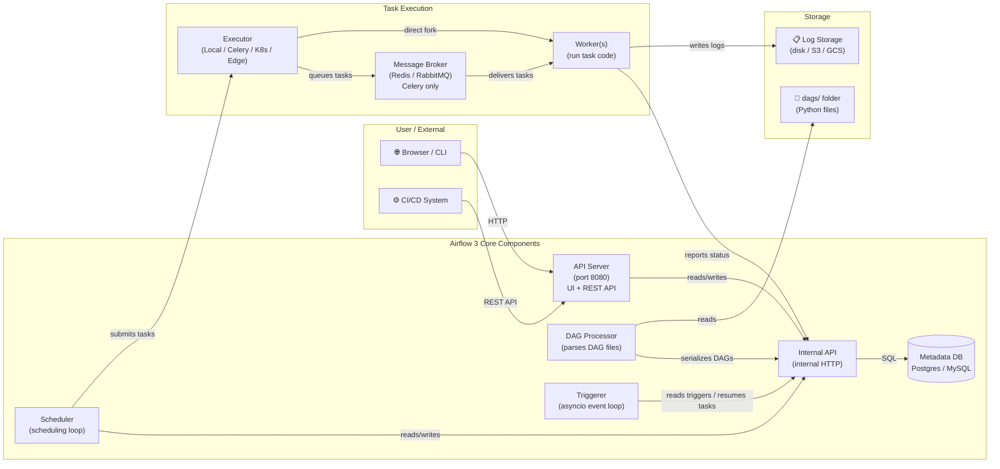
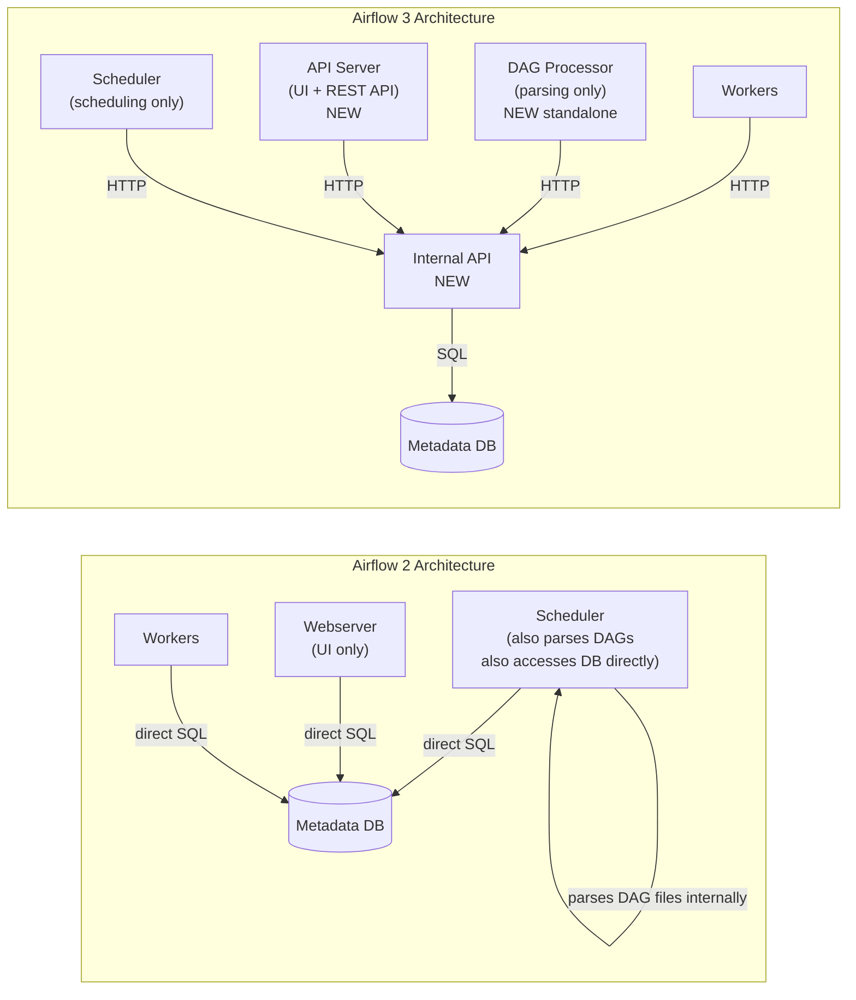
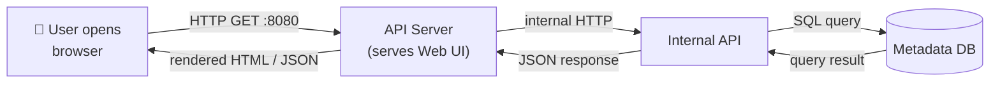
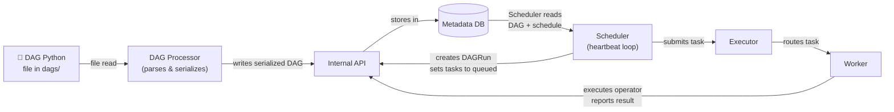
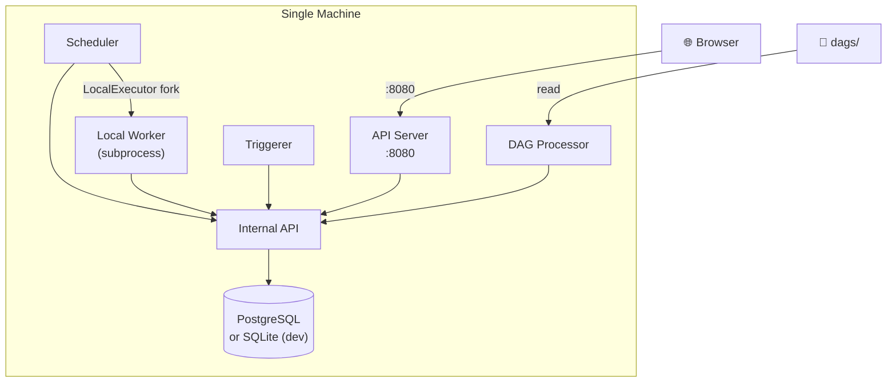
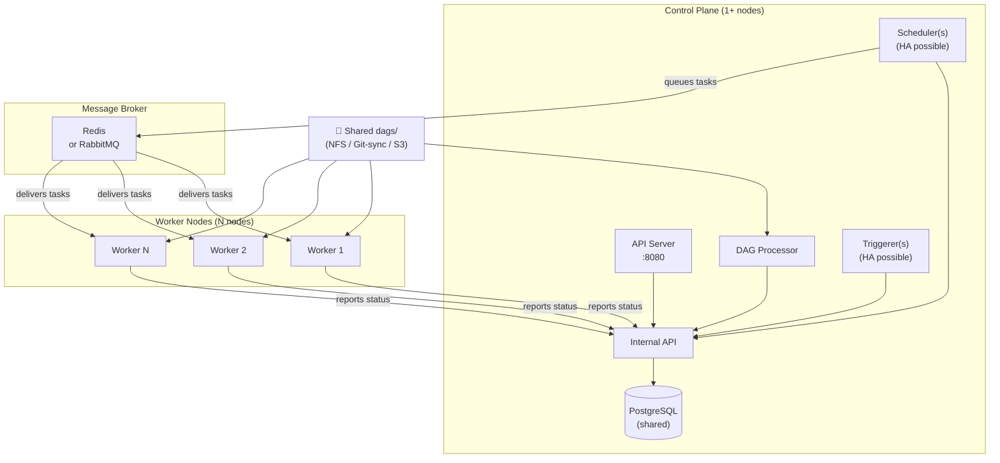

# Airflow 3 Architecture — The Complete Guide

## 📂 Navigation
⬅️ **Prev:** [What is Airflow](../01_What_is_Airflow/Theory.md) | 🏠 **[Home](../../00_Learning_Guide/Learning_Path.md)** | ➡️ **Next:** [Installation and Setup](../03_Installation_and_Setup/Theory.md)

---

## The Restaurant Chain Analogy

Think of Airflow like a restaurant chain's central operations system.

- The **Head Office (Scheduler)** decides what needs to happen and when. It reviews the daily plan, looks at all the pending tasks, and marks them as ready to go — but it doesn't actually read the recipe books anymore.
- The **Kitchen Display System (API Server)** shows everything to managers and takes new orders. Every time a manager opens the dashboard or calls the API, they're talking to this system.
- The **Recipe Parser (DAG Processor)** reads and validates all the recipe files. It is the only one who opens the recipe books, checks them for errors, and puts a clean summary into the central database.
- The **HR Department (Executor)** assigns work to the right staff based on the type of task and available resources.
- The **Workers** actually cook the food. They receive their instructions, execute the task, and report back.
- The **Async Chef (Triggerer)** handles the slow-cook items — like a sous-vide steak that takes 4 hours — without blocking any other workers. It just keeps an eye on things and pings the team when something is ready.
- The **Central Filing Cabinet (Metadata Database)** holds every record: every recipe, every order, every outcome, every staff assignment.
- The **Intercom System (Internal API)** is how all these departments talk to each other — no one rummages directly through the filing cabinet anymore; they call the intercom and ask.

This separation is the **defining architectural change of Airflow 3**.

---

## Why the Architecture Changed

In Airflow 2, the Scheduler was doing too many jobs at once: it parsed DAG files, scheduled tasks, and served some internal needs. As deployments scaled, this became a bottleneck and a security concern (because many components had direct database access).

Airflow 3 splits responsibilities cleanly:

- DAG parsing is isolated into its own process.
- The UI and REST API are served by a dedicated API Server.
- Components communicate through a structured Internal API rather than hitting the database directly.
- A new Edge Executor supports lightweight, remote deployments.

---

## Component Overview

### 1. Scheduler

The Scheduler is the brain of the operation, but in Airflow 3 it has been **deliberately simplified**.

**What it does:**
- Reads the task instances that are stored in the Metadata Database (which were put there by the DAG Processor).
- Evaluates which task instances are ready to run based on their dependencies, schedule intervals, and any other conditions.
- Transitions task instances from `scheduled` → `queued` state.
- Sends queued task instances to the Executor for actual execution.
- Monitors running tasks and handles retries and failures.

**What it no longer does in Airflow 3 (key change):**
- It does **NOT** parse DAG files. In Airflow 2, the Scheduler also ran the DAG parsing process internally. In Airflow 3, DAG parsing is entirely handled by the standalone DAG Processor.

**Configuration:**
- Config section: `[scheduler]`
- Heartbeat interval: `scheduler_heartbeat_sec` (default: 5 seconds)
- Process name: `airflow scheduler`
- Can be scaled: Yes — multiple schedulers can run simultaneously (HA mode, introduced in Airflow 2.2 and continued in v3)

**How it works internally:**
Every heartbeat, the Scheduler:
1. Checks the Metadata Database (via Internal API) for DAG runs that are due.
2. Creates new DAG runs for any DAGs whose schedule interval has passed.
3. Resolves task dependencies and marks eligible tasks as `scheduled`.
4. Moves `scheduled` tasks to `queued` and hands them off to the Executor.

---

### 2. API Server (NEW in Airflow 3)

The API Server is a **brand new component** in Airflow 3. It completely replaces the old Webserver.

**What it does:**
- Serves the **Web UI** (the visual dashboard you open in your browser).
- Serves the **REST API** (used by CI/CD tools, external scripts, and the Airflow CLI).
- Both the UI and the REST API are served from the **same process** on the same port.
- Communicates with the Metadata Database through the Internal API — it is **stateless** by design.

**Why this is important:**
In Airflow 2, the Webserver served the UI but had a mixed relationship with the database and the scheduler. In Airflow 3, the API Server is a clean, stateless HTTP service. Because it is stateless, you can run multiple instances behind a load balancer for high availability and horizontal scaling.

**Key facts:**
- Default port: **8080**
- Process name: `airflow api-server`
- Config section: `[api]`
- Can be scaled: Yes — stateless, runs multiple instances behind a load balancer
- Authentication: Supports FAB (Flask AppBuilder) auth, OAuth2, and more

---

### 3. DAG Processor (NEW as standalone in Airflow 3)

The DAG Processor is the component responsible for reading your DAG Python files and turning them into structured data in the Metadata Database.

**What it does:**
- Watches the `dags/` folder for new or modified DAG files.
- Parses each DAG file by importing it as a Python module.
- Serializes the DAG structure into the Metadata Database.
- Reports import errors, parse times, and warnings.
- Runs completely independently of the Scheduler.

**Why this is a key architectural change:**
In Airflow 2, DAG parsing was done *inside* the Scheduler process. This meant a slow or broken DAG file could slow down or crash the Scheduler itself. In Airflow 3, the DAG Processor runs in its own process (`dag_processing_manager`). If a DAG file causes an import error, only the DAG Processor is affected — the Scheduler keeps running.

**Configuration:**
- Config section: `[dag_processor]`
- Parsing interval: `dag_file_processor_timeout`
- Process name: `airflow dag-processor`
- Can be scaled: Limited — typically one instance, but the processor manages multiple parsing subprocesses internally

---

### 4. Internal API (NEW in Airflow 3)

The Internal API is the communication backbone of Airflow 3. It is **not a user-facing component** — you never interact with it directly — but it is arguably the most important architectural change in v3.

**What it does:**
- Provides a structured HTTP interface through which all Airflow components communicate.
- The Scheduler, API Server, DAG Processor, Workers, and Triggerer all read from and write to the Metadata Database **through this API**, not by making direct SQL connections.

**Why it matters:**

In Airflow 2, most components had direct database access. This meant:
- Every component needed database credentials.
- The database was a shared global state accessible from everywhere.
- Scaling required careful management of database connection pools.

In Airflow 3, only the Internal API has direct database access. Everything else talks to the Internal API. This means:
- Better security: database credentials are kept in fewer places.
- Better modularity: components can be updated or replaced without touching the database layer.
- Better scalability: the Internal API can be optimized as a single service.
- Easier remote deployments: a Worker running in a remote data center or edge environment only needs network access to the Internal API, not to the database.

---

### 5. Metadata Database

The Metadata Database is the single source of truth for everything Airflow knows.

**What is stored:**
| Table | What it holds |
|---|---|
| `dag` | DAG definitions (serialized by DAG Processor) |
| `dag_run` | Every DAG run: its state, start time, end time, run ID |
| `task_instance` | Every task instance: its state, start time, duration, try number |
| `xcom` | Cross-task communication values |
| `variable` | Airflow Variables (key-value store) |
| `connection` | Connection definitions (db URIs, API keys, etc.) |
| `log` | Log metadata (not the log content itself — that goes to log storage) |
| `import_error` | DAG files that failed to parse, and their error messages |
| `trigger` | Active triggers registered by deferrable operators |

**What is NOT stored:**
- The actual log file content (stored in log storage: local disk, S3, GCS, etc.)
- The DAG Python source code (stored in the `dags/` folder)
- Task output data (that goes to your own data storage)

**Recommended database:** PostgreSQL 12+. MySQL is also supported. SQLite is only for local development and is not suitable for production or multi-component setups.

**Configuration:**
- Config key: `sql_alchemy_conn` in `[database]` section
- Connection pool: managed by SQLAlchemy

---

### 6. Executor

The Executor determines **how** tasks are run. It is a pluggable component configured in `airflow.cfg`.

**What it does:**
- Receives queued task instances from the Scheduler.
- Decides where and how to run each task.
- Reports status back to the Scheduler.

**Executor types:**

| Executor | Best For | Requires |
|---|---|---|
| `LocalExecutor` | Single-node, moderate workloads | PostgreSQL or MySQL |
| `CeleryExecutor` | Multi-node, distributed workloads | Redis or RabbitMQ + Celery workers |
| `KubernetesExecutor` | Cloud-native, dynamic task isolation | Kubernetes cluster |
| `CeleryKubernetesExecutor` | Mixed workloads | Both of the above |
| `EdgeExecutor` | Edge/remote deployments (NEW in v3) | Edge Agent |

**Configuration:**
- Config key: `executor` in `[core]` section
- Example: `executor = CeleryExecutor`

---

### 7. Worker

Workers are the processes that **actually run your task code**.

**What they do:**
- Receive a task from the Executor.
- Set up the task environment.
- Execute the operator's `execute()` method.
- Report the result (success, failure) back via the Internal API.

**Worker slots:** Each worker process has a configurable number of "slots" — the number of tasks it can run concurrently. In CeleryExecutor, this is set with `worker_concurrency`. In LocalExecutor, it is `parallelism`.

**Deployment:**
- `LocalExecutor`: Workers run as subprocesses on the same machine as the Scheduler.
- `CeleryExecutor`: Workers run on separate machines, consuming tasks from the message broker queue.
- `KubernetesExecutor`: Each task gets its own ephemeral Pod — there are no persistent workers.

---

### 8. Triggerer

The Triggerer is the component that makes **deferrable operators** possible.

**The problem it solves:**
Imagine a sensor that waits for a file to appear in S3. Without deferral, it occupies an entire Worker slot for the entire duration of the wait — potentially hours. If you have 100 such sensors, you need 100 worker slots just to wait.

**How the Triggerer works:**
- Runs an `asyncio` event loop (not a thread pool) — this allows it to handle thousands of concurrent waits on a single process.
- When a deferrable operator calls `self.defer(trigger=SomeTrigger(...))`, the task is suspended and a `Trigger` record is written to the Metadata Database.
- The Triggerer picks up the trigger, runs it in its async event loop.
- When the trigger condition is met (file appears, HTTP response received, etc.), the Triggerer wakes the task back up, which re-enters the queue as a new task instance.
- The original Worker slot is **freed immediately** when the task defers.

**Result:** You can monitor thousands of external conditions with a single Triggerer process and zero blocked Worker slots.

**Configuration:**
- Process name: `airflow triggerer`
- Config section: `[triggerer]`
- Can be scaled: Yes — multiple Triggerer instances can run for HA

---

### 9. Message Broker (CeleryExecutor only)

When using CeleryExecutor, a message broker is required as the task queue between the Scheduler and the Workers.

**What it does:**
- Holds the list of tasks waiting to be picked up by a worker.
- Workers poll the broker for new tasks.
- Redis is the most commonly used option; RabbitMQ is also supported.

**This component is NOT needed for:**
- `LocalExecutor`
- `KubernetesExecutor`
- `EdgeExecutor`

---

### 10. Edge Executor (NEW in Airflow 3)

The Edge Executor is a new executor type designed for **edge deployments** — situations where you need to run Airflow tasks on remote, resource-constrained, or isolated machines that cannot run a full Celery or Kubernetes setup.

**Use cases:**
- IoT data pipelines running on edge devices.
- On-premises machines with restricted network access.
- Lightweight deployments without a full container orchestration platform.

**How it works:**
- A lightweight `EdgeWorker` agent runs on the remote machine.
- The agent communicates with the central Airflow deployment via the Internal API (HTTP only — no direct database access required).
- The central Airflow instance manages scheduling; the edge worker just executes tasks.

---

## Architecture Diagrams

### Full Airflow 3 Architecture



---

### Airflow 2 vs Airflow 3 Architecture Comparison



---

### Request Flow: User Opens Browser



---

### DAG File to Task Execution Flow



---

### Single-Node Deployment



---

### Multi-Node Deployment (CeleryExecutor)



---

## Component Reference Tables

### Airflow 2 vs Airflow 3 — What Changed

| Component | Airflow 2 | Airflow 3 | Change |
|---|---|---|---|
| Scheduler | Parses DAGs + schedules tasks + direct DB access | Schedules tasks only, uses Internal API | Reduced scope, no more DAG parsing |
| Webserver | Serves Web UI only | **Replaced by API Server** | Now serves UI AND REST API together |
| API Server | Did not exist as a standalone component | New standalone process | Brand new in Airflow 3 |
| DAG Processor | Built into the Scheduler | **New standalone process** | Fully separated from Scheduler |
| Internal API | Did not exist | New HTTP communication layer | All components use it instead of direct DB |
| Triggerer | Available since Airflow 2.2 | Continues, now uses Internal API | Minor update |
| Edge Executor | Did not exist | New lightweight executor | Brand new in Airflow 3 |
| Metadata DB | Direct SQL from most components | Only accessible via Internal API | Improved security and isolation |

---

### Component Quick Reference

| Component | Port | Process Name | Config Section | Scalable? |
|---|---|---|---|---|
| API Server | 8080 | `airflow api-server` | `[api]` | Yes (stateless, behind LB) |
| Scheduler | — | `airflow scheduler` | `[scheduler]` | Yes (HA mode, 2+ instances) |
| DAG Processor | — | `airflow dag-processor` | `[dag_processor]` | Limited (one manager, N subprocesses) |
| Triggerer | — | `airflow triggerer` | `[triggerer]` | Yes (multiple instances) |
| Worker (Celery) | — | `airflow celery worker` | `[celery]` | Yes (add more worker nodes) |
| Internal API | (embedded) | part of api-server | `[api]` | Via API Server scaling |
| Metadata DB | 5432 (Postgres) | postgres | `[database]` | Via Postgres HA (Patroni etc.) |
| Message Broker | 6379 (Redis) | redis-server | `[celery]` | Via Redis Cluster / Sentinel |

---

## Common Mistakes

### Mistake 1: Running airflow webserver in Airflow 3
In Airflow 2, you started the UI with `airflow webserver`. In Airflow 3, the command is `airflow api-server`. Running `airflow webserver` in v3 will fail or behave unexpectedly.

```bash
# WRONG (Airflow 2 command)
airflow webserver

# CORRECT (Airflow 3 command)
airflow api-server
```

### Mistake 2: Assuming the Scheduler still parses DAGs
Many Airflow 2 tutorials tell you to watch Scheduler logs to debug DAG parsing issues. In Airflow 3, DAG parsing happens in the DAG Processor. If your DAG is not showing up, check the DAG Processor logs, not the Scheduler logs.

### Mistake 3: Using SQLite in a multi-component setup
SQLite does not support concurrent writes from multiple processes. If you run even two Airflow processes (e.g., Scheduler + API Server) with SQLite, you will get database lock errors. Always use PostgreSQL for anything beyond a single-process test.

### Mistake 4: Forgetting to run the DAG Processor
When starting Airflow 3 manually (not via Docker Compose), it is easy to forget to start the DAG Processor as a separate process. Without it, your DAGs will never appear in the UI — even if the files are in the right folder.

```bash
# You need ALL of these running:
airflow api-server &
airflow scheduler &
airflow dag-processor &   # ← easy to forget!
airflow triggerer &        # ← if using deferrable operators
```

### Mistake 5: Direct database queries for debugging
With the Internal API architecture, directly querying the database with SQL `SELECT` statements for debugging is no longer the recommended approach (and in some secured deployments, you may not have direct DB access). Use the REST API or the CLI instead.

```bash
# BETTER than direct SQL
airflow dags list
airflow tasks list my_dag
airflow dag-runs list --dag-id my_dag
```

### Mistake 6: Not understanding DAG Serialization
The DAG Processor serializes DAGs into the Metadata Database. The Scheduler reads the *serialized* version, not the original Python file. This means changes to your DAG file are not immediately reflected in the Scheduler — you must wait for the next parsing cycle. You can reduce the parsing interval in config to speed this up.

---

## Summary

Airflow 3's architecture follows a clean **separation of concerns** principle:

1. **DAG Processor** — the only component that reads Python files.
2. **Scheduler** — the only component that makes scheduling decisions.
3. **API Server** — the only component that serves external traffic.
4. **Workers** — the only components that execute task code.
5. **Triggerer** — the only component that manages async waits.
6. **Internal API** — the only component with direct database access.

This separation makes Airflow 3 more secure, more scalable, and easier to debug than Airflow 2.

---

## 📂 Navigation
⬅️ **Prev:** [What is Airflow](../01_What_is_Airflow/Theory.md) | 🏠 **[Home](../../00_Learning_Guide/Learning_Path.md)** | ➡️ **Next:** [Installation and Setup](../03_Installation_and_Setup/Theory.md)
