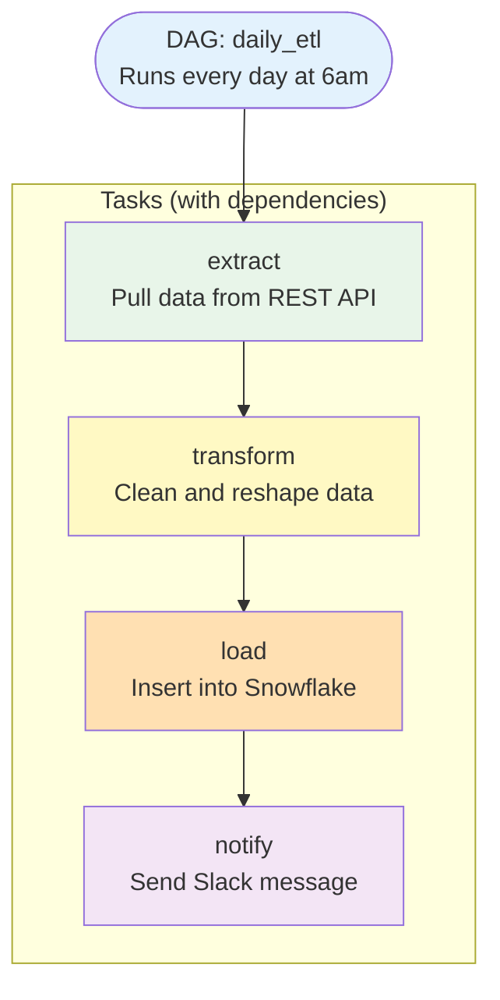
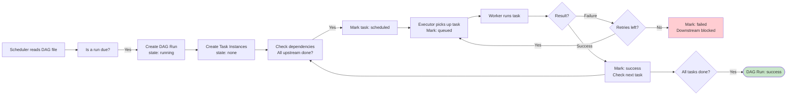
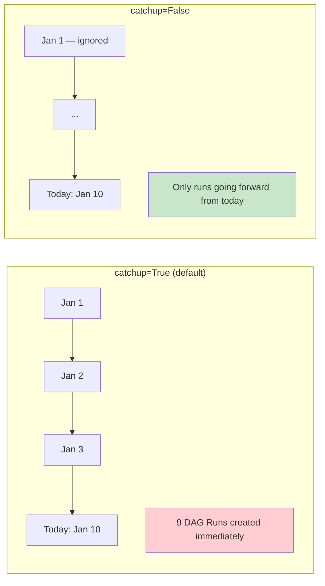

# 03 · DAGs Deep Dive — Theory

---

## 📌 Learning Priority

**Must Learn** — core concepts, needed to understand the rest of this file:
[What is a DAG](#what-is-a-dag) · [DAG File Structure](#dag-file-structure) · [Task Dependencies](#task-dependencies) · [Key DAG Parameters](#key-dag-parameters)

**Should Learn** — important for real projects and interviews:
[DAG Run vs Task Instance](#dag-run-vs-task-instance) · [Catchup](#catchup--a-common-source-of-confusion) · [Common Mistakes](#common-mistakes-️)

**Good to Know** — useful in specific situations, not needed daily:
[schedule_interval Cron](#schedule_interval--cron-expressions) · [Real-World Usage](#real-world-usage)

**Reference** — skim once, look up when needed:
[A Complete Simple DAG](#a-complete-simple-dag) · [Connection to Other Concepts](#connection-to-other-concepts-)

---

## The Story 📖

Imagine you are a pastry chef, and someone hands you a recipe card for a layered chocolate cake.

The recipe card tells you:
- **What to make**: chocolate cake (that is the `dag_id`)
- **When to start making it**: every Sunday morning (that is the `schedule_interval`)
- **The first time you made it**: January 1st (that is the `start_date`)
- **The steps**: melt chocolate → mix batter → bake layers → cool → frost → decorate (those are the tasks)
- **The rules**: you cannot frost before baking. You cannot decorate before frosting (those are the dependencies)

The recipe card does not bake the cake itself — it just describes how. Every Sunday, the kitchen manager (the Scheduler) reads the card, sees it is time to bake, and creates a new **baking session** (a DAG Run). Each step is assigned to a cook (a Worker).

If the chocolate does not melt properly, you do not throw out the whole cake. You retry just the melting step. If it keeps failing, the rest of the cake is put on hold until you resolve it.

That recipe card is a **DAG**. The baking session is a **DAG Run**. Each step being executed right now is a **Task Instance**.

---

## What is a DAG?

DAG stands for **Directed Acyclic Graph**. It is both a concept from computer science and the Python file you write in Airflow.

Breaking down the name:
- **Directed**: arrows point in one direction. Task A → Task B means A must finish before B starts.
- **Acyclic**: no loops. Task A cannot eventually depend on itself.
- **Graph**: a set of nodes (tasks) connected by edges (dependencies).

In practice, a DAG in Airflow is a **Python file** that defines:
- Which tasks to run
- In what order
- On what schedule
- Starting from what date
- With what default settings

The DAG file is a definition, not an execution. Writing a DAG does not run anything. The Scheduler reads the file and creates actual runs.

---

## Why It Exists

Before DAGs, orchestration was done with:
- **Cron** — no dependencies, no visibility, no retries
- **Shell scripts** that call each other — tangled, hard to test, no history
- **Manual coordination** — someone emails someone else to "run the next step"

The DAG model solves these problems by forcing you to:
1. Express your workflow as a formal graph (dependencies are explicit, not implicit)
2. Write it in code (version-controlled, testable, reviewable)
3. Let the orchestration platform handle scheduling, retries, and monitoring

---

## How It Works — Step by Step

### A Sample ETL DAG

Let us trace a simple ETL pipeline: extract data from an API, transform it, load it to a warehouse, then send a notification.



### How a DAG Run flows



---

## The Technical Side

### DAG File Structure

A minimal valid DAG file has three parts: imports, default args, and the DAG context.

```python
# Part 1: Imports
from airflow import DAG
from airflow.operators.bash import BashOperator
from airflow.operators.python import PythonOperator
from datetime import datetime, timedelta

# Part 2: Default arguments applied to all tasks
default_args = {
    "owner": "data-team",
    "retries": 2,
    "retry_delay": timedelta(minutes=5),
    "email_on_failure": True,
    "email": ["alerts@company.com"],
}

# Part 3: DAG definition
with DAG(
    dag_id="daily_sales_etl",          # Unique identifier for this DAG
    description="Daily ETL for sales", # Shown in the UI
    default_args=default_args,          # Applied to all tasks unless overridden
    start_date=datetime(2024, 1, 1),    # First interval starts here
    schedule_interval="0 6 * * *",      # Run at 6am every day
    catchup=False,                      # Do not run missed historical intervals
    tags=["etl", "sales"],              # Tags for filtering in UI
    max_active_runs=1,                  # Only one run at a time
) as dag:

    # Tasks go here (inside the with block)
    pass
```

### Key DAG Parameters

| Parameter | Type | Required? | Description |
|-----------|------|-----------|-------------|
| `dag_id` | str | Yes | Unique name for the DAG. Must be unique across all DAGs. |
| `start_date` | datetime | Yes | The date the first interval begins. Must be static (not `datetime.now()`). |
| `schedule_interval` | str or timedelta | No | How often to run. `None` = manual only. |
| `catchup` | bool | No (default: True) | Whether to backfill missed runs since `start_date`. |
| `default_args` | dict | No | Task-level defaults (retries, email, owner, etc.) |
| `description` | str | No | Description shown in the UI. |
| `tags` | list[str] | No | Tags for filtering in the UI. |
| `max_active_runs` | int | No | Max concurrent DAG runs. Useful to prevent overlap. |
| `on_failure_callback` | callable | No | Function to call if any task fails. |

### Task Dependencies

Dependencies are set using the `>>` (right shift) and `<<` (left shift) operators.

```python
# A >> B means: B depends on A (A must succeed before B starts)
extract >> transform >> load >> notify

# A << B means: A depends on B (same as B >> A)
notify << load << transform << extract

# Multiple dependencies
extract >> [transform_a, transform_b]   # Both run after extract
[transform_a, transform_b] >> load      # Load runs after BOTH transforms

# Explicit set_upstream / set_downstream (equivalent to << and >>)
transform.set_upstream(extract)
load.set_downstream(notify)
```

### DAG Run vs Task Instance

These two terms are frequently confused.

| Concept | What It Is | Analogy |
|---------|-----------|---------|
| **DAG Run** | One complete execution of the full DAG for a specific `logical_date` | One complete baking of the cake |
| **Task Instance** | One execution of a specific task within a specific DAG Run | One step (e.g., "bake layers") in one baking session |

A DAG with 4 tasks, run for 7 days, creates:
- 7 DAG Runs
- 28 Task Instances (7 × 4)

You can see both in the Airflow UI. The Grid View shows all DAG Runs as columns and all tasks as rows.

### schedule_interval — Cron Expressions

The `schedule_interval` accepts either a cron expression string or a preset alias.

**Cron format:** `minute hour day-of-month month day-of-week`

| Preset | Equivalent Cron | Meaning |
|--------|----------------|---------|
| `@once` | (one-time trigger) | Run exactly once |
| `@hourly` | `0 * * * *` | Every hour at :00 |
| `@daily` | `0 0 * * *` | Every day at midnight |
| `@weekly` | `0 0 * * 0` | Every Sunday at midnight |
| `@monthly` | `0 0 1 * *` | First day of each month at midnight |
| `@yearly` | `0 0 1 1 *` | Every January 1st at midnight |
| `None` | N/A | Manual trigger only |

**Custom examples:**

```
0 6 * * 1-5     → 6am Monday–Friday
*/15 * * * *    → Every 15 minutes
0 0 1,15 * *    → 1st and 15th of every month at midnight
```

Use [crontab.guru](https://crontab.guru) to validate cron expressions.

### Catchup — A Common Source of Confusion

`catchup=True` (the default) means: if `start_date` is in the past and there are missed intervals, create a DAG Run for each one.

**Example:**
- `start_date = 2024-01-01`
- `schedule_interval = "@daily"`
- Today is `2024-01-10`
- Airflow sees 9 missed daily intervals and creates 9 DAG Runs at once

For most workflows, `catchup=False` is what you want — it tells Airflow to only run from now forward.

Use `catchup=True` when:
- You have a data pipeline and want to process historical data from `start_date`
- You are doing a planned backfill

Use `catchup=False` when:
- You just want a DAG to run going forward from today



### A Complete Simple DAG

```python
from airflow import DAG
from airflow.operators.python import PythonOperator
from datetime import datetime, timedelta

# Default arguments applied to every task in this DAG
default_args = {
    "owner": "data-team",
    "retries": 1,
    "retry_delay": timedelta(minutes=2),
}

def extract():
    print("Extracting data from API...")
    # In real life, call an API here

def transform():
    print("Transforming data...")
    # In real life, reshape/clean the data here

def load():
    print("Loading data into warehouse...")
    # In real life, write to a database here

with DAG(
    dag_id="simple_etl",
    default_args=default_args,
    start_date=datetime(2024, 1, 1),
    schedule_interval="@daily",
    catchup=False,
    description="A simple ETL example",
    tags=["example"],
) as dag:

    extract_task = PythonOperator(
        task_id="extract",
        python_callable=extract,
    )

    transform_task = PythonOperator(
        task_id="transform",
        python_callable=transform,
    )

    load_task = PythonOperator(
        task_id="load",
        python_callable=load,
    )

    # Set execution order
    extract_task >> transform_task >> load_task
```

---

## Real-World Usage

| Pattern | Description |
|---------|-------------|
| Linear ETL | `extract >> transform >> load` — most common pattern |
| Fan-out | `extract >> [transform_a, transform_b, transform_c] >> merge` |
| Fan-in | Wait for multiple sources before processing |
| Conditional | Use BranchPythonOperator to choose paths at runtime (Section 10) |
| Sensor-gated | DAG waits for a file or event before processing (Section 05) |
| Parametrized | DAG reads from Airflow Variables to change behavior without editing code |

---

## Common Mistakes ⚠️

**1. Using `datetime.now()` as `start_date`**
The DAG file is parsed every 30 seconds. `datetime.now()` changes on every parse. Airflow will recalculate what runs are due on every parse and behave unpredictably. Always use a fixed date: `datetime(2024, 1, 1)`.

**2. Not setting `catchup=False` by default**
If you create a DAG with `start_date` two years ago and forget to set `catchup=False`, Airflow will create hundreds of historical runs immediately. This can flood your metadata database and executor queue.

**3. Defining tasks outside the `with DAG(...)` block**
Tasks must be created inside the DAG context. If you define a task outside the `with` block, Airflow cannot associate it with the DAG.

**4. Using the `dag_id` that already exists**
If two DAG files define the same `dag_id`, Airflow will show only one of them (whichever was parsed last). Always use unique `dag_id` values.

**5. Expensive imports at the module level**
Anything at the top level of a DAG file runs every 30 seconds when the Scheduler parses the file. Avoid database queries, API calls, or slow file reads at the module level. Put them inside task functions.

**6. Confusing `schedule_interval` timing**
A DAG with `schedule_interval="@daily"` and `start_date=2024-01-01` does NOT run on January 1st. It runs on January 2nd, covering the interval from January 1st. The run is triggered *after* the interval ends.

---

## Connection to Other Concepts 🔗

| Concept | Relationship |
|---------|-------------|
| **Operators** (Section 04) | Every task in a DAG is created from an Operator. Operators define what the task actually does. |
| **Sensors** (Section 05) | A special type of task that waits for an external condition before the DAG proceeds. |
| **XComs** (Section 09) | The mechanism for passing data between tasks within a DAG run. |
| **Branching** (Section 10) | A pattern for making DAGs conditional — different tasks run based on runtime data. |
| **Variables** (Section 08) | Key-value pairs stored in Airflow that DAGs can read to change behavior dynamically. |

---

## What You Learned

- A DAG is a Python file that defines a workflow: tasks, dependencies, and a schedule.
- Key parameters: `dag_id`, `start_date`, `schedule_interval`, `catchup`, `default_args`.
- Dependencies use the `>>` operator: `task_a >> task_b` means task_b runs after task_a.
- A **DAG Run** is one execution of the whole workflow for a specific logical date.
- A **Task Instance** is one execution of a single task within a DAG Run.
- `catchup=False` is usually what you want for new DAGs.

## Try This

1. Create a DAG with 3 tasks in a linear chain. Trigger it manually from the UI.
2. Add a second task that runs in parallel with the second task (fan-out pattern).
3. Change the `schedule_interval` to `@hourly` and observe how often new runs are created.
4. Set `catchup=True` with a `start_date` from a week ago and watch what happens.

## Next Step

You know the DAG container. Now learn what goes inside it — the Operators that define what each task actually does.

---

🚀 **Apply this:** Write a real DAG from scratch → [Project 01 — Forex ETL Pipeline](../../09_Capstone_Projects/01_Forex_ETL_Pipeline/01_MISSION.md)
## 📂 Navigation

⬅️ **Prev:** [02 · Installation & Setup — Theory](../02_Installation_and_Setup/Theory.md) | 🏠 **[Home](../00_Learning_Guide/Learning_Path.md)** | ➡️ **Next:** [04 · Operators](../04_Operators/Theory.md)
