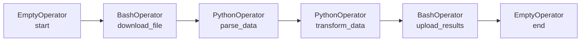

# Core Operators — BashOperator, PythonOperator, EmptyOperator

🚀 **Apply this:** Use operators in a real pipeline → [Project 02 — Simple File Processing](../../09_Capstone_Projects/02_Simple_File_Processing/01_MISSION.md)
## 📂 Navigation
⬅️ **Prev:** [Your First DAG](../04_Your_First_DAG/Theory.md) | 🏠 **[Home](../../00_Learning_Guide/Learning_Path.md)** | ➡️ **Next:** [DAG Scheduling](../../02_Intermediate/06_DAG_Scheduling/Theory.md)

---

## 📌 Learning Priority

**Must Learn** — core concepts, needed to understand the rest of this file:
[BashOperator](#operator-1-bashoperator) · [PythonOperator](#operator-2-pythonoperator) · [EmptyOperator](#operator-3-emptyoperator)

**Should Learn** — important for real projects and interviews:
[The context Dictionary](#the-context-dictionary) · [When to Use Each Operator](#summary-when-to-use-each-operator)

**Good to Know** — useful in specific situations, not needed daily:
[Complete Pipeline Example](#a-complete-pipeline-using-all-three) · [The 8020 Rule](#the-8020-rule-of-operators)

**Reference** — skim once, look up when needed:
[BashOperator Key Parameters](#key-parameters) · [PythonOperator Key Parameters](#key-parameters-1)

---

## The 80/20 Rule of Operators

Before you learn all 50+ operators in Airflow, master three. These three operators cover roughly 80% of real-world pipeline use cases:

1. **BashOperator** — run any shell command or script.
2. **PythonOperator** — run any Python function.
3. **EmptyOperator** — create structure, mark boundaries, serve as anchors.

Think of them as the hammer, screwdriver, and measuring tape of the Airflow toolbox. Once you are comfortable with these three, every other operator is just a specialized version of one of them.

---

## Operator 1: BashOperator

### What It Does

`BashOperator` executes a bash command or a bash script in a subprocess on the Worker. The worker creates a new subprocess, runs your command, and then the subprocess exits.

**Real-world uses:**
- Run a shell script that processes files.
- Call a command-line tool (like `dbt run`, `spark-submit`, or `python my_script.py`).
- Copy files between locations.
- Trigger an external system via a CLI.

### Key Parameters

| Parameter | Type | Required | Description |
|---|---|---|---|
| `task_id` | str | Yes | Unique identifier for this task in the DAG |
| `bash_command` | str | Yes | The shell command or script to run |
| `env` | dict | No | Environment variables to set for the subprocess |
| `append_env` | bool | No | If True, merge `env` with current environment (default: False) |
| `output_encoding` | str | No | Encoding for command output (default: `utf-8`) |
| `skip_on_exit_code` | int | No | Exit code that should cause a SKIP (not failure) |
| `cwd` | str | No | Working directory for the command |
| `do_xcom_push` | bool | No | Push last line of stdout to XCom (default: True) |

### Code Example

```python
from airflow.sdk import DAG
from airflow.operators.bash import BashOperator
from datetime import datetime

with DAG(
    dag_id="bash_operator_example",
    start_date=datetime(2024, 1, 1),
    schedule="@daily",
    catchup=False,
) as dag:

    # Simple command
    print_date = BashOperator(
        task_id="print_date",
        bash_command="date",
    )

    # Multi-line command with variables
    process_files = BashOperator(
        task_id="process_files",
        bash_command="""
            echo "Processing files for {{ ds }}"
            ls -la /tmp/
            echo "Done"
        """,
    )

    # Using environment variables
    run_with_env = BashOperator(
        task_id="run_with_env",
        bash_command="echo $MY_VAR",
        env={"MY_VAR": "hello from airflow"},
        append_env=True,  # Also include system environment
    )

    # Exit code 99 → SKIP the task instead of failing
    conditional_task = BashOperator(
        task_id="conditional_task",
        bash_command="exit 99",
        skip_on_exit_code=99,
    )

    print_date >> process_files >> run_with_env
```

### When to Use BashOperator

- You already have shell scripts that do the work.
- You need to call CLI tools (`aws`, `gcloud`, `dbt`, `spark-submit`).
- You need to run a Python script as a subprocess (e.g., `python scripts/my_etl.py`).
- You need to do filesystem operations (move files, create directories).

### Important Gotchas

**1. Jinja templating in bash_command**
The `bash_command` string is Jinja-templated, so you can use `{{ ds }}`, `{{ execution_date }}`, etc. But be careful: `{{ }}` in a bash string means Airflow variable, not bash variable. Use `$VAR` for bash variables.

**2. Script files need a trailing space**
If you pass a file path to `bash_command` (instead of a command string), you must add a trailing space:
```python
bash_command="scripts/my_script.sh "  # Note the trailing space
```

**3. The subprocess inherits the Airflow environment**
Unless you set `append_env=False`, your bash command runs with all the environment variables of the Airflow Worker process. This can be both useful and dangerous.

---

## Operator 2: PythonOperator

### What It Does

`PythonOperator` calls a Python function that you define. It is the most flexible operator because any Python code can go inside the function.

**Real-world uses:**
- Data transformation with pandas or polars.
- API calls with requests or httpx.
- Database queries with SQLAlchemy.
- Machine learning model training or prediction.
- Business logic that is too complex for a single bash command.

### Key Parameters

| Parameter | Type | Required | Description |
|---|---|---|---|
| `task_id` | str | Yes | Unique identifier for this task |
| `python_callable` | callable | Yes | The Python function to call |
| `op_args` | list | No | Positional arguments to pass to the function |
| `op_kwargs` | dict | No | Keyword arguments to pass to the function |
| `templates_dict` | dict | No | Dict of Jinja-templated values, passed to the function as `templates_dict` |
| `do_xcom_push` | bool | No | Push return value to XCom (default: True) |

### Code Example

```python
from airflow.sdk import DAG
from airflow.operators.python import PythonOperator
from datetime import datetime


def say_hello(name: str) -> str:
    """A simple function that returns a greeting."""
    greeting = f"Hello, {name}!"
    print(greeting)  # This goes to the task logs
    return greeting  # Return value is pushed to XCom automatically


def fetch_data(execution_date: str, **context) -> list:
    """
    Functions can accept Airflow context variables.
    The 'context' dict contains all template variables.
    """
    print(f"Fetching data for execution date: {execution_date}")

    # Simulate fetching some data
    data = [
        {"id": 1, "value": 100},
        {"id": 2, "value": 200},
    ]
    print(f"Fetched {len(data)} records")
    return data


def process_data(**context) -> int:
    """
    Pull data from XCom (pushed by the previous task)
    and process it.
    """
    # Pull the return value from fetch_data
    task_instance = context["task_instance"]
    raw_data = task_instance.xcom_pull(task_ids="fetch_data")

    total = sum(item["value"] for item in raw_data)
    print(f"Total value: {total}")
    return total


with DAG(
    dag_id="python_operator_example",
    start_date=datetime(2024, 1, 1),
    schedule="@daily",
    catchup=False,
) as dag:

    # Simple call with op_kwargs
    greet = PythonOperator(
        task_id="greet",
        python_callable=say_hello,
        op_kwargs={"name": "Airflow 3"},
    )

    # Using Airflow context variables
    fetch = PythonOperator(
        task_id="fetch_data",
        python_callable=fetch_data,
        op_kwargs={"execution_date": "{{ ds }}"},  # Jinja template
    )

    # Pulling XCom from previous task
    process = PythonOperator(
        task_id="process_data",
        python_callable=process_data,
    )

    greet >> fetch >> process
```

### The `context` Dictionary

When a Python function accepts `**context`, Airflow passes a dictionary with all template variables and metadata about the current run. Key items:

| Key | Description |
|---|---|
| `ds` | Execution date as `YYYY-MM-DD` string |
| `ts` | Execution timestamp as ISO format string |
| `execution_date` | Execution datetime object |
| `dag` | The DAG object |
| `task` | The task object |
| `task_instance` | The TaskInstance object (for XCom, etc.) |
| `run_id` | The DAG run ID |
| `next_ds` | Next execution date |
| `prev_ds` | Previous execution date |

### When to Use PythonOperator

- You are writing new ETL logic in Python.
- You need full access to Python libraries.
- You want type-safe, testable code.
- You need to interact with XCom (pass data between tasks).

> **Pro tip for Airflow 3:** Instead of `PythonOperator`, you can use the `@task` decorator for cleaner syntax. The `@task` decorator creates a Python operator under the hood:
> ```python
> from airflow.sdk import task
>
> @task
> def my_function():
>     return 42
> ```
> Both approaches work. The decorator syntax is more concise; `PythonOperator` gives you more explicit control.

---

## Operator 3: EmptyOperator

### What It Does

`EmptyOperator` does nothing. It executes, marks itself as successful, and exits immediately. It contains no logic.

**But that makes it incredibly useful for:**
- **Pipeline anchors** — a single "start" or "end" task that other tasks depend on, making the DAG graph cleaner and more readable.
- **Conditional branching join points** — when multiple branches in a pipeline need to converge, use an EmptyOperator as the join node.
- **Work-in-progress placeholders** — mark a task's place in the DAG while you are still writing its actual logic.
- **Documentation nodes** — with a well-named `task_id`, EmptyOperator tasks can document the structure of a pipeline.

### Key Parameters

| Parameter | Type | Required | Description |
|---|---|---|---|
| `task_id` | str | Yes | Unique identifier |
| `trigger_rule` | str | No | When to trigger this task (default: `all_success`) |

### Code Example

```python
from airflow.sdk import DAG
from airflow.operators.empty import EmptyOperator
from airflow.operators.python import PythonOperator
from datetime import datetime


def extract(): return [1, 2, 3]
def transform_a(): print("transform A")
def transform_b(): print("transform B")
def load_results(): print("loading results")


with DAG(
    dag_id="empty_operator_example",
    start_date=datetime(2024, 1, 1),
    schedule="@daily",
    catchup=False,
) as dag:

    # Pipeline anchor — clear single entry point
    start = EmptyOperator(task_id="start")

    # Placeholder for a task still being developed
    validate_inputs = EmptyOperator(task_id="validate_inputs")

    extract_data = PythonOperator(
        task_id="extract_data",
        python_callable=extract,
    )

    # Two parallel transformation tasks
    transform_a_task = PythonOperator(
        task_id="transform_a",
        python_callable=transform_a,
    )

    transform_b_task = PythonOperator(
        task_id="transform_b",
        python_callable=transform_b,
    )

    # Join node — waits for both transform tasks
    # trigger_rule="none_failed_min_one_success" means:
    # run if at least one upstream task succeeded and none failed
    join = EmptyOperator(
        task_id="join",
        trigger_rule="none_failed_min_one_success",
    )

    load = PythonOperator(
        task_id="load",
        python_callable=load_results,
    )

    # Clear end anchor
    end = EmptyOperator(task_id="end")

    # Define the flow
    start >> validate_inputs >> extract_data
    extract_data >> [transform_a_task, transform_b_task]
    [transform_a_task, transform_b_task] >> join
    join >> load >> end
```

---

## A Complete Pipeline Using All Three

Here is how the three operators work together in a realistic pattern:



- `start` and `end` (EmptyOperator) — clean boundaries.
- `download_file` (BashOperator) — calls a CLI tool to download a file from an FTP server.
- `parse_data` and `transform_data` (PythonOperator) — Python functions that process the data.
- `upload_results` (BashOperator) — calls the AWS CLI to upload the result to S3.

---

## Summary: When to Use Each Operator

| Use Case | Operator |
|---|---|
| Run a shell script or CLI tool | BashOperator |
| Run Python logic, transformations, API calls | PythonOperator |
| Provide a start/end anchor for the DAG | EmptyOperator |
| Mark a task as "TODO" while developing | EmptyOperator |
| Create a join point after parallel branches | EmptyOperator |
| Call `dbt run`, `spark-submit`, `aws s3 cp` | BashOperator |
| Use pandas, requests, SQLAlchemy | PythonOperator |

---

## 📂 Navigation
⬅️ **Prev:** [Your First DAG](../04_Your_First_DAG/Theory.md) | 🏠 **[Home](../../00_Learning_Guide/Learning_Path.md)** | ➡️ **Next:** [DAG Scheduling](../../02_Intermediate/06_DAG_Scheduling/Theory.md)
