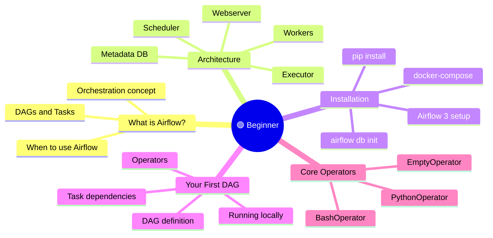
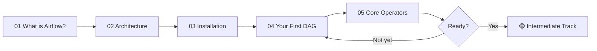

⬅️ [Learning Guide](../00_Learning_Guide/Readme.md) &nbsp;|&nbsp; 🏠 [Home](../00_Learning_Guide/Readme.md) &nbsp;|&nbsp; [Intermediate Track ➡️](../02_Intermediate/Readme.md)

---

# 🟢 Beginner Track

> *You've heard the word "orchestration" thrown around in data engineering. This is where you learn what it actually means — and build your first working pipeline.*

**[Start Here → What is Airflow? (Theory.md)](01_What_is_Airflow/Theory.md)**

---

## At a Glance

| | |
|---|---|
| **Topics** | 5 modules |
| **Est. Time** | 6–8 hours |
| **Prerequisites** | Python basics, basic CLI knowledge |
| **Unlocks** | 🟡 Intermediate Track |

---

## Section Map

---

## Topics

| Module | File | Description |
|--------|------|-------------|
| 01 | [What is Airflow? → Theory.md](01_What_is_Airflow/Theory.md) | The orchestration problem, what Airflow solves, DAG mental model |
| 01 | [What is Airflow? → Cheatsheet.md](01_What_is_Airflow/Cheatsheet.md) | Key terms and concepts at a glance |
| 01 | [What is Airflow? → Interview Q&A](01_What_is_Airflow/Interview_QA.md) | Common interview questions on Airflow basics |
| 02 | [Airflow 3 Architecture → Theory.md](02_Airflow_3_Architecture/Theory.md) | Scheduler, Webserver, Executor, Workers, Metadata DB |
| 02 | [Airflow 3 Architecture → Cheatsheet.md](02_Airflow_3_Architecture/Cheatsheet.md) | Component quick reference |
| 02 | [Airflow 3 Architecture → Interview Q&A](02_Airflow_3_Architecture/Interview_QA.md) | Architecture interview prep |
| 03 | [Installation & Setup → Theory.md](03_Installation_and_Setup/Theory.md) | Installing Airflow 3, initialising the DB, first run |
| 03 | [Installation & Setup → Cheatsheet.md](03_Installation_and_Setup/Cheatsheet.md) | Installation commands quick reference |
| 03 | [Installation & Setup → Interview Q&A](03_Installation_and_Setup/Interview_QA.md) | Setup and config interview questions |
| 04 | [Your First DAG → Theory.md](04_Your_First_DAG/Theory.md) | Writing a DAG file, operators, task dependencies |
| 04 | [Your First DAG → Code Example](04_Your_First_DAG/Code_Example.md) | Fully working first DAG with comments |
| 04 | [Your First DAG → Cheatsheet.md](04_Your_First_DAG/Cheatsheet.md) | DAG syntax quick reference |
| 04 | [Your First DAG → Interview Q&A](04_Your_First_DAG/Interview_QA.md) | DAG authoring interview questions |
| 05 | Core Operators | BashOperator, PythonOperator, EmptyOperator in depth |

---

## Learning Path

---

## Before You Start

- You need Python 3.8+ installed (`python --version`)
- Basic terminal/CLI comfort (navigating folders, running commands)
- You do NOT need Docker yet — we start with pip install
- Budget 1–2 hours per module; don't rush the first DAG

---

⬅️ [Learning Guide](../00_Learning_Guide/Readme.md) &nbsp;|&nbsp; 🏠 [Home](../00_Learning_Guide/Readme.md) &nbsp;|&nbsp; [Intermediate Track ➡️](../02_Intermediate/Readme.md)

