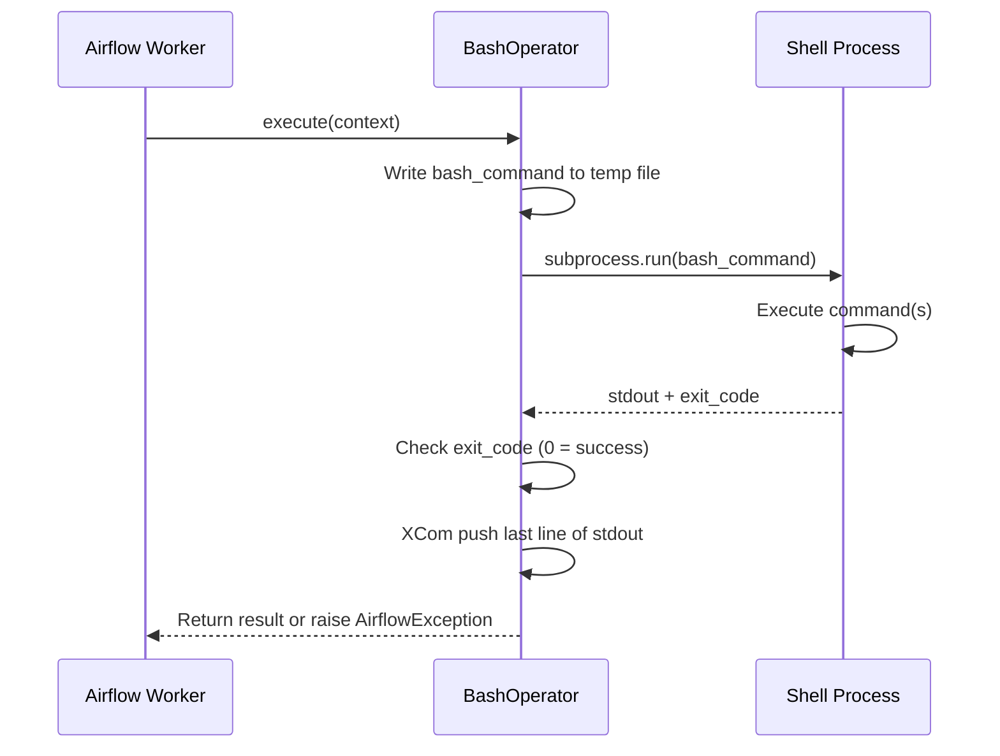

# BashOperator — Theory

## The Command Line Inside Your Pipeline

Sometimes all you need is a quick shell command. Zip a file. Run a Python script. Call a CLI tool. Copy some files from one folder to another. Check if a service is running.

You don't always need to write a Python function, set up a connection, or install a provider package. Sometimes `bash myscript.sh` is all you need.

**BashOperator is your command line inside Airflow.** It lets you run any shell command directly from a DAG task — the same commands you'd type in your terminal, running as part of your orchestrated pipeline.

Think of it like hiring a contractor who knows exactly one thing: running shell commands. You hand them a command, they run it, they tell you if it succeeded (exit code 0) or failed (non-zero exit code).

---

## What BashOperator Does

When Airflow runs a BashOperator task, it:

1. Creates a temporary bash script file
2. Writes your command(s) into it
3. Executes it in a subprocess
4. Captures the output
5. Returns the last line of stdout as the task's result (available via XCom)
6. Checks the exit code — non-zero means failure



---

## The bash_command Parameter

This is the only required parameter (besides `task_id`). It accepts:

**A single command:**
```python
BashOperator(
    task_id="say_hello",
    bash_command="echo 'Hello from Airflow'",
)
```

**A multi-line string:**
```python
BashOperator(
    task_id="multi_step",
    bash_command="""
        mkdir -p /data/output
        python /scripts/process.py
        echo "Done"
    """,
)
```

**A path to a bash script file** (must end with a space if using Jinja templating to avoid template resolution on the filename):
```python
BashOperator(
    task_id="run_script",
    bash_command="/opt/airflow/scripts/cleanup.sh ",  # trailing space is intentional
)
```

---

## Environment Variables

You can pass custom environment variables to the subprocess using the `env` parameter. These are merged with the current process environment:

```python
BashOperator(
    task_id="process_with_env",
    bash_command="python /scripts/extract.py",
    env={
        "DB_HOST": "localhost",
        "DB_PORT": "5432",
        "DATA_DATE": "{{ ds }}",   # Jinja template — injects execution date
    },
)
```

Inside your script, access them normally:
```python
import os
db_host = os.environ["DB_HOST"]
```

If you want to **only** have the vars you define (and not inherit the system environment), use `append_env=False` (default is `True`, meaning it inherits everything).

---

## Getting Output Back: XCom from Bash

BashOperator automatically pushes the **last line of stdout** to XCom with the key `return_value`. You can use this in downstream tasks:

```python
# Task 1: run bash and capture output
get_count = BashOperator(
    task_id="get_count",
    bash_command="wc -l /data/input.csv | awk '{print $1}'",
)

# Task 2: pull the value from XCom
def check_count(**context):
    count = context["ti"].xcom_pull(task_ids="get_count")
    print(f"Row count: {count}")

check_task = PythonOperator(
    task_id="check_count",
    python_callable=check_count,
)

get_count >> check_task
```

---

## Error Handling

BashOperator determines success or failure based on the **exit code**:

- Exit code `0` → task **succeeds**
- Any other exit code → task **fails** with `AirflowException`

```bash
# This will FAIL the task (exit code 1)
ls /nonexistent/path

# This will SUCCEED the task (exit code 0)
ls /tmp
```

You can override which exit code means "skip" (not fail) using `skip_exit_code`:

```python
BashOperator(
    task_id="optional_step",
    bash_command="python /scripts/optional_process.py",
    skip_exit_code=99,  # Exit code 99 means "skip this task, not fail"
)
```

---

## Working Directory

Use `cwd` to set the working directory for the bash command:

```python
BashOperator(
    task_id="run_in_data_dir",
    bash_command="python process.py",
    cwd="/opt/airflow/data",
)
```

Without `cwd`, the command runs from the Airflow home directory.

---

## Full Working Code Example

```python
from datetime import datetime
from airflow import DAG
from airflow.operators.bash import BashOperator

with DAG(
    dag_id="bash_operator_example",
    start_date=datetime(2024, 1, 1),
    schedule_interval="@daily",
    catchup=False,
) as dag:

    # Simple command
    check_disk = BashOperator(
        task_id="check_disk_space",
        bash_command="df -h /",
    )

    # Command with environment variables and Jinja templating
    process_data = BashOperator(
        task_id="process_daily_data",
        bash_command="""
            echo "Processing data for date: $EXECUTION_DATE"
            python /opt/airflow/scripts/process.py --date=$EXECUTION_DATE
        """,
        env={"EXECUTION_DATE": "{{ ds }}"},
        retries=2,
    )

    # Capture output for downstream tasks
    get_row_count = BashOperator(
        task_id="count_output_rows",
        bash_command="wc -l /opt/airflow/data/output.csv | awk '{print $1}'",
    )

    check_disk >> process_data >> get_row_count
```

---

## When to Use BashOperator

**Good for:**
- Running existing shell scripts or CLI tools
- Quick file operations (copy, move, compress)
- Running Python scripts that are not part of the DAG codebase
- Calling system commands (`df`, `curl`, `aws cli`, etc.)
- Glue tasks that just need a quick command

**Not ideal for:**
- Complex Python logic (use `PythonOperator` instead)
- Tasks that need Airflow connections (use the appropriate provider operator)
- Anything requiring structured error handling (Python is better here)

---

## Navigation

**Prev:** [Operators Theory](../Theory.md) | **Home:** [Learning Path](../../00_Learning_Guide/Learning_Path.md) | **Next:** [PythonOperator Theory](../02_PythonOperator/Theory.md)
