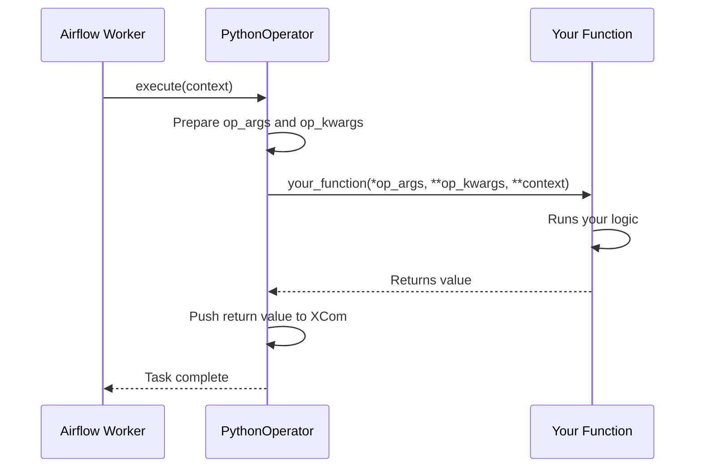

# PythonOperator — Theory

## The Most Flexible Tool in Your Toolbox

If BashOperator is the command-line contractor, **PythonOperator is the in-house developer**. You write any Python function you want, and Airflow calls it at the right time in your pipeline.

Need to call a REST API and parse the JSON response? Write a Python function.
Need to clean and reshape a dataset? Write a Python function.
Need to send a Slack message based on some business logic? Write a Python function.

**PythonOperator is the "do anything" operator.** It is the most used operator in production Airflow pipelines, because Python can interact with virtually any system, library, or API.

The mental model is simple: you define a regular Python function, you hand it to `PythonOperator`, and Airflow calls it when the task runs. Your function can receive parameters, access task context, read from XCom, and push results back.

---

## 📌 Learning Priority

**Must Learn** — core concepts, needed to understand the rest of this file:
[How PythonOperator Works](#how-pythonoperator-works) · [python_callable Parameter](#the-python_callable-parameter) · [Returning Values for XCom](#returning-values-for-xcom)

**Should Learn** — important for real projects and interviews:
[op_args and op_kwargs](#passing-arguments-op_args-and-op_kwargs) · [Accessing Task Context](#accessing-task-context) · [When to Use PythonOperator](#when-to-use-pythonoperator)

**Good to Know** — useful in specific situations, not needed daily:
[Full Working Code Example](#full-working-code-example)

**Reference** — skim once, look up when needed:
[Context Keys Table](#accessing-task-context)

---

## How PythonOperator Works



The key method: `execute()` calls your callable. Any value you `return` is automatically pushed to XCom.

---

## The python_callable Parameter

This is the only required parameter (besides `task_id`). It takes a **reference to a Python function** — not a function call.

```python
# Define your function OUTSIDE the DAG definition
def my_processing_function():
    print("Running!")
    return "done"

# Pass the reference (no parentheses) to python_callable
my_task = PythonOperator(
    task_id="my_task",
    python_callable=my_processing_function,  # Reference, not my_processing_function()
)
```

Important: the function must be **importable** by the Airflow worker. Keep your function either in the DAG file itself, or in a module that workers can import.

---

## Passing Arguments: op_args and op_kwargs

You can pass arguments to your function two ways:

### op_args — positional arguments
```python
def greet(name, greeting):
    print(f"{greeting}, {name}!")

greet_task = PythonOperator(
    task_id="greet",
    python_callable=greet,
    op_args=["Alice", "Hello"],  # Passed as positional args
)
```

### op_kwargs — keyword arguments
```python
def process_data(source_path, output_path, date):
    print(f"Processing {source_path} for {date} -> {output_path}")

process_task = PythonOperator(
    task_id="process",
    python_callable=process_data,
    op_kwargs={
        "source_path": "/data/input",
        "output_path": "/data/output",
        "date": "{{ ds }}",   # Jinja templating works here!
    },
)
```

`op_kwargs` is more common and more readable than `op_args`. Prefer it for clarity.

---

## Accessing Task Context

The `context` dictionary is automatically passed to your function as keyword arguments. It contains everything about the current DAG run.

```python
def my_function(**context):
    # Access run metadata
    execution_date = context["execution_date"]
    dag_run = context["dag_run"]
    run_id = context["run_id"]
    task_instance = context["ti"]  # The TaskInstance object

    print(f"Running for: {execution_date}")
    print(f"DAG run ID: {run_id}")
```

Common context keys:

| Key | What it contains |
|---|---|
| `ti` or `task_instance` | The TaskInstance object (use for XCom) |
| `execution_date` | The logical execution date (pendulum datetime) |
| `ds` | Execution date as string `YYYY-MM-DD` |
| `ds_nodash` | Execution date as string `YYYYMMDD` |
| `run_id` | Unique ID for this DAG run |
| `dag` | The DAG object |
| `dag_run` | The DagRun object |
| `task` | The Task (operator) object |
| `prev_ds` | Previous execution date string |
| `next_ds` | Next execution date string |

---

## Returning Values for XCom

Any value you `return` from your function is pushed to XCom with the key `return_value`:

```python
def extract_record_count(**context):
    # ... do some work ...
    count = 1542
    return count  # This goes to XCom automatically

extract_task = PythonOperator(
    task_id="extract",
    python_callable=extract_record_count,
)

# Downstream task can pull it:
def validate_count(**context):
    count = context["ti"].xcom_pull(task_ids="extract")
    print(f"Got {count} records")

validate_task = PythonOperator(
    task_id="validate",
    python_callable=validate_count,
)
```

---

## Full Working Code Example

```python
from datetime import datetime, timedelta
import requests
from airflow import DAG
from airflow.operators.python import PythonOperator

def fetch_weather_data(city: str, api_key: str, **context):
    """Fetch weather data for a city and return it."""
    execution_date = context["ds"]

    print(f"Fetching weather for {city} on {execution_date}")

    response = requests.get(
        "https://api.openweathermap.org/data/2.5/weather",
        params={"q": city, "appid": api_key, "units": "metric"},
        timeout=30,
    )
    response.raise_for_status()

    data = response.json()
    temp = data["main"]["temp"]
    description = data["weather"][0]["description"]

    print(f"Weather in {city}: {temp}°C, {description}")

    # Return value is pushed to XCom automatically
    return {"city": city, "temp": temp, "description": description, "date": execution_date}


def save_weather_to_file(**context):
    """Pull weather data from XCom and save it to a file."""
    ti = context["ti"]
    execution_date = context["ds"]

    # Pull the dict returned by the previous task
    weather = ti.xcom_pull(task_ids="fetch_weather")

    output_path = f"/tmp/weather_{execution_date}.txt"
    with open(output_path, "w") as f:
        f.write(f"Date: {weather['date']}\n")
        f.write(f"City: {weather['city']}\n")
        f.write(f"Temp: {weather['temp']}°C\n")
        f.write(f"Conditions: {weather['description']}\n")

    print(f"Weather data saved to {output_path}")
    return output_path


with DAG(
    dag_id="python_operator_example",
    start_date=datetime(2024, 1, 1),
    schedule_interval="@daily",
    catchup=False,
    default_args={"retries": 1, "retry_delay": timedelta(minutes=2)},
) as dag:

    fetch_weather = PythonOperator(
        task_id="fetch_weather",
        python_callable=fetch_weather_data,
        op_kwargs={
            "city": "London",
            "api_key": "{{ var.value.openweather_api_key }}",
        },
    )

    save_weather = PythonOperator(
        task_id="save_weather",
        python_callable=save_weather_to_file,
    )

    fetch_weather >> save_weather
```

---

## When to Use PythonOperator

**Good for:**
- Any custom Python logic
- API calls and data parsing
- Data transformation and validation
- Reading/writing files with Python libraries
- Complex business logic
- When you need access to the task context
- As a fallback when no dedicated operator exists

**Not ideal for:**
- Tasks that need full isolation (use `DockerOperator` or `KubernetesPodOperator`)
- Simple shell commands (use `BashOperator`)
- Long-running ML training jobs (use dedicated ML operators or Docker)

---

## Navigation

**Prev:** [BashOperator Theory](../01_BashOperator/Theory.md) | **Home:** [Learning Path](../../00_Learning_Guide/Learning_Path.md) | **Next:** [PostgresOperator Theory](../03_PostgresOperator/Theory.md)
