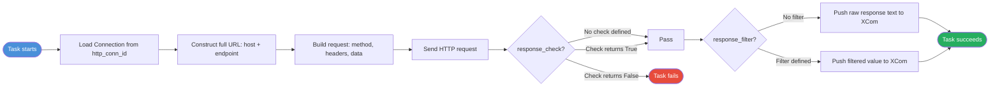

# HttpOperator in Apache Airflow 3

## 📂 Navigation
⬅️ **Prev:** | 🏠 **[Home](../../../00_Learning_Guide/Learning_Path.md)** | ➡️ **Next: [Code Examples](./Code_Example.md)**

---

## The Story: Calling External Services from Your Pipeline

Your pipeline needs to talk to the outside world. Maybe it needs to:

- Trigger a model retraining job via a POST to a machine learning platform API
- Fetch exchange rates from a financial data API before running currency conversions
- Call a webhook to notify a downstream system that new data is ready
- Check whether a third-party service is healthy before proceeding

In all these cases, you need to make an HTTP request from inside a DAG task. You could write a `@task` function that uses Python's `requests` library, but Airflow provides a purpose-built operator for this: `HttpOperator` (called `SimpleHttpOperator` in older versions).

`HttpOperator` handles the connection management, retries, response validation, and — crucially — keeps your HTTP credentials out of your DAG code by storing them in Airflow's Connection store.

---

## What Is HttpOperator?

`HttpOperator` (from the `apache-airflow-providers-http` package) makes an HTTP request to an endpoint and optionally:

- Validates the response using a `response_check` callable
- Extracts a value from the response using `response_filter`
- Passes the response to downstream tasks via XCom

In Airflow 3, the operator is available as `HttpOperator` from `airflow.providers.http.operators.http`. The old name `SimpleHttpOperator` still works as an alias.

---

## Setup: Installing the Provider and Creating a Connection

### Install the provider

```bash
pip install apache-airflow-providers-http
```

### Create an HTTP Connection in the Airflow UI

1. Navigate to **Admin → Connections**
2. Click **+** to add a new connection
3. Fill in:
   - **Connection ID**: `my_api` (used as `http_conn_id` in the operator)
   - **Connection Type**: `HTTP`
   - **Host**: `https://api.example.com` (base URL — no trailing slash)
   - **Login**: your API username or key name (optional)
   - **Password**: your API key or token (optional)
   - **Extra** (JSON): `{"Authorization": "Bearer YOUR_TOKEN"}` for header-based auth

### Create via CLI

```bash
airflow connections add 'my_api' \
  --conn-type 'http' \
  --conn-host 'https://api.example.com' \
  --conn-extra '{"Authorization": "Bearer sk-abc123"}'
```

---

## Key Parameters

| Parameter | Type | Default | Description |
|---|---|---|---|
| `http_conn_id` | `str` | `"http_default"` | Airflow Connection ID for the base URL and auth |
| `endpoint` | `str` | required | URL path appended to the base host (e.g. `/v1/jobs`) |
| `method` | `str` | `"POST"` | HTTP method: `GET`, `POST`, `PUT`, `PATCH`, `DELETE` |
| `data` | `str \| dict \| None` | `None` | Request body. Dict is sent as form data; string as raw body |
| `headers` | `dict \| None` | `None` | HTTP headers to add to the request |
| `extra_options` | `dict` | `{}` | Passed directly to `requests.Session.request()` (e.g. `{"verify": False}`, `{"timeout": 30}`) |
| `response_check` | `Callable \| None` | `None` | Function that receives the `Response` object; return `True` to pass, `False` (or raise) to fail |
| `response_filter` | `Callable \| None` | `None` | Function that receives the `Response` object and returns a value pushed to XCom |
| `log_response` | `bool` | `False` | Whether to log the response body |
| `deferrable` | `bool` | `False` | Run in async/deferrable mode (Airflow 2.3+) |

`endpoint` is in `template_fields` — you can use Jinja in it.

---

## Mermaid: HttpOperator Flow



---

## Parameters Deep Dive

### `data` — Request Body

The `data` parameter behaves differently depending on the type you pass:

```python
# Dict → sent as application/x-www-form-urlencoded
data={"field1": "value1", "field2": "value2"}

# String → sent as raw body (use with Content-Type header for JSON)
data='{"key": "value"}'
headers={"Content-Type": "application/json"}

# For JSON APIs, use a serialized string + Content-Type header
import json
data=json.dumps({"query": "SELECT 1", "timeout": 30})
```

### `response_check` — Validate the Response

The `response_check` callable receives a `requests.Response` object. Return `True` to let the task succeed, return `False` or raise an exception to fail it.

```python
def check_success(response):
    # Fail if HTTP status is not 2xx
    response.raise_for_status()
    # Also check the JSON payload
    body = response.json()
    return body.get("status") == "success"
```

### `response_filter` — Extract a Value for XCom

The `response_filter` callable receives a `requests.Response` object and returns whatever value you want to push to XCom for downstream tasks.

```python
def extract_job_id(response):
    return response.json()["job_id"]
```

### `extra_options` — Pass to `requests`

Any keyword argument accepted by `requests.Session.request()` can go here:

```python
extra_options={
    "timeout": 30,           # Request timeout in seconds
    "verify": False,         # Skip TLS verification (not recommended in production)
    "allow_redirects": True, # Follow redirects
}
```

---

## Accessing the Response in Downstream Tasks

`HttpOperator` pushes the response to XCom under the key `"return_value"`. Pull it in a downstream task:

```python
@task
def process_response(**context):
    # Pull from HttpOperator's XCom
    raw_response = context["ti"].xcom_pull(task_ids="call_api")
    # If response_filter was used, this is the filtered value
    # If not, this is the raw response text as a string
    print(f"Response: {raw_response}")
```

---

## Common Patterns

### Pattern 1: GET Request with Date in URL

```python
HttpOperator(
    task_id="fetch_rates",
    http_conn_id="exchange_rate_api",
    endpoint="/rates/{{ ds }}",  # Jinja in endpoint
    method="GET",
    response_filter=lambda r: r.json()["rates"],
    log_response=True,
)
```

### Pattern 2: POST to Trigger a Job

```python
import json

HttpOperator(
    task_id="trigger_training",
    http_conn_id="ml_platform_api",
    endpoint="/v1/training-jobs",
    method="POST",
    headers={"Content-Type": "application/json"},
    data=json.dumps({
        "model_name": "fraud_detector",
        "training_date": "{{ ds }}",
        "hyperparams": {"lr": 0.001, "epochs": 50},
    }),
    response_check=lambda r: r.status_code == 201,
    response_filter=lambda r: r.json()["job_id"],
)
```

### Pattern 3: Health Check Before Proceeding

```python
HttpOperator(
    task_id="check_api_health",
    http_conn_id="downstream_api",
    endpoint="/health",
    method="GET",
    response_check=lambda r: r.json().get("status") == "healthy",
)
```

---

## Key Takeaways

- `HttpOperator` requires the `apache-airflow-providers-http` package.
- Store base URLs and credentials in Airflow Connections — never hardcode them.
- `endpoint` supports Jinja templating.
- Use `response_check` to fail the task on bad responses (e.g. unexpected status codes).
- Use `response_filter` to extract a specific value and push it to XCom.
- For JSON APIs, pass `data` as a serialized string with `headers={"Content-Type": "application/json"}`.
