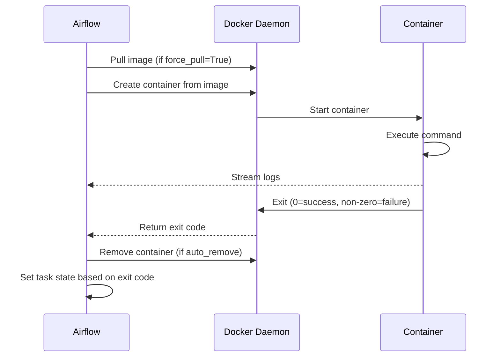

# DockerOperator in Apache Airflow 3

## 📂 Navigation
⬅️ **Prev:** | 🏠 **[Home](../../../00_Learning_Guide/Learning_Path.md)** | ➡️ **Next: [Code Examples](./Code_Example.md)**

---

## The Story: Full Isolation for Your Data Science Team

Your data science team has spent months building a model training pipeline. It uses PyTorch 2.1, a specific version of scikit-learn, and a dozen other packages that are carefully pinned. The problem: your Airflow environment uses Python 3.11 with Airflow's own dependencies. Any attempt to install the data science packages alongside Airflow breaks things — dependency conflicts everywhere.

One solution: run the training script in its own Docker container. The container has exactly the environment the data science team specifies. Airflow does not need to know anything about PyTorch. It just needs to spin up the container, wait for it to finish, and check whether it exited successfully.

That is what `DockerOperator` does. It takes a Docker image, runs a command inside it, and reports success or failure back to the DAG. The container gets full isolation: its own Python environment, its own system packages, its own filesystem — and it can be written in any language.

---

## What Is DockerOperator?

`DockerOperator` (from `apache-airflow-providers-docker`) runs a command inside a Docker container. The container is started fresh for each task execution and cleaned up afterward. Key capabilities:

- Run any Docker image — any language, any dependencies
- Mount host directories into the container (for data access)
- Pass environment variables into the container
- Set CPU and memory resource limits
- Capture container logs into Airflow task logs
- Automatically remove the container after completion

---

## Setup

```bash
pip install apache-airflow-providers-docker
```

Docker must be running on the Airflow worker (or scheduler, for LocalExecutor). For production, the worker nodes need Docker Engine installed and the Airflow process must have permission to talk to the Docker socket.

### Optional: Docker Connection

If Docker is running locally (the default), no connection is needed. For a remote Docker daemon:

1. **Admin → Connections → +**
2. **Connection Type**: `Docker`
3. **Host**: `tcp://docker-host:2375`

---

## Key Parameters

| Parameter | Type | Default | Description |
|---|---|---|---|
| `image` | `str` | required | Docker image to run (e.g. `python:3.11`, `my-repo/my-image:1.0`) |
| `command` | `str \| list` | `None` | Command to run inside the container |
| `environment` | `dict` | `{}` | Environment variables passed to the container |
| `volumes` | `list[str]` | `[]` | Volume mounts in `host_path:container_path[:mode]` format |
| `docker_conn_id` | `str` | `"docker_default"` | Airflow Connection for Docker daemon |
| `auto_remove` | `str` | `"never"` | `"success"`, `"force"`, or `"never"` — when to remove container |
| `working_dir` | `str` | `None` | Working directory inside the container |
| `network_mode` | `str` | `None` | Docker network mode (`"bridge"`, `"host"`, etc.) |
| `mem_limit` | `str` | `None` | Memory limit (e.g. `"512m"`, `"2g"`) |
| `cpu_shares` | `int` | `None` | CPU share weighting (default 1024) |
| `cpus` | `float` | `None` | Number of CPUs to allocate (e.g. `0.5`, `2.0`) |
| `entrypoint` | `str \| list` | `None` | Override the image's entrypoint |
| `force_pull` | `bool` | `False` | Always pull the latest version of the image |
| `retrieve_output` | `bool` | `False` | Retrieve the last line of stdout as an XCom value |
| `retrieve_output_path` | `str` | `None` | Path inside container to write output for XCom retrieval |
| `port_bindings` | `dict` | `{}` | Port mappings (usually not needed for batch tasks) |
| `dns` | `list` | `[]` | Custom DNS servers |
| `tty` | `bool` | `False` | Allocate a pseudo-TTY |

---

## How auto_remove Works

| Value | Behavior |
|---|---|
| `"never"` | Container is kept after the task finishes (useful for debugging) |
| `"success"` | Container is removed only if the task succeeds; kept on failure for inspection |
| `"force"` | Container is always removed, regardless of outcome |

For production use `"force"` to avoid accumulating stopped containers. For debugging, use `"success"` so failed containers are available for `docker inspect` or `docker logs`.

---

## Volume Mounts

Volumes let you share data between the host filesystem and the container. The format is `host_path:container_path[:mode]` where mode is `ro` (read-only) or `rw` (read-write, default).

```python
volumes=[
    "/opt/airflow/data:/data:rw",           # Read-write data directory
    "/opt/scripts:/scripts:ro",              # Read-only scripts
    "/opt/airflow/output:/output:rw",        # Output directory
    "/tmp/run_{{ ds_nodash }}:/tmp/run:rw",  # Date-stamped temp dir (Jinja works here)
]
```

Note: `volumes` is in `template_fields` so Jinja expressions work inside volume strings.

---

## Resource Limits

```python
DockerOperator(
    task_id="train_model",
    image="ml-team/trainer:latest",
    command="train.py",
    # Memory: refuse to run if container would exceed 4GB
    mem_limit="4g",
    # CPU: allocate 2 full CPUs
    cpus=2.0,
    # Alternative: use CPU shares (relative weighting, not hard limit)
    # cpu_shares=2048  # Twice the default weight of 1024
)
```

---

## Mermaid: DockerOperator Lifecycle



---

## Use Cases

| Use Case | Why DockerOperator |
|---|---|
| ML model training | Isolate ML framework from Airflow dependencies |
| R scripts | Run R in a container without installing R on Airflow workers |
| Legacy scripts | Run old Python 2 scripts or apps with fixed old dependencies |
| Node.js / Go / Rust processes | Any language that isn't Python |
| Reproducible science | Pin exact versions in a Docker image for reproducibility |
| Security isolation | Sensitive logic runs in a container, not in the Airflow process |

---

## Limitations and Considerations

- **Docker must be installed** on every Airflow worker node that might run the task.
- **Volume paths are host paths** — they must exist on the worker executing the task, which can be unpredictable in distributed setups. For Kubernetes, use `KubernetesPodOperator` instead.
- **Secrets management**: Use `environment` to pass secrets as env vars, but retrieve them from Airflow's secrets backend rather than hardcoding.
- **Large images**: Pulling a multi-GB image on first run can cause task timeouts. Pre-pull images on worker startup or use `force_pull=False` with a pinned tag.
- **Not deferrable**: DockerOperator blocks the worker slot for the entire container runtime. Long-running containers tie up workers.

---

## Key Takeaways

- `DockerOperator` solves the dependency isolation problem — run any code in any environment.
- Always use `auto_remove="force"` in production to avoid accumulating stopped containers.
- Pass configuration via `environment` dict and data via `volumes` mounts.
- For distributed Kubernetes environments, prefer `KubernetesPodOperator`.
- Use `retrieve_output=True` to capture a return value from the container for XCom.
