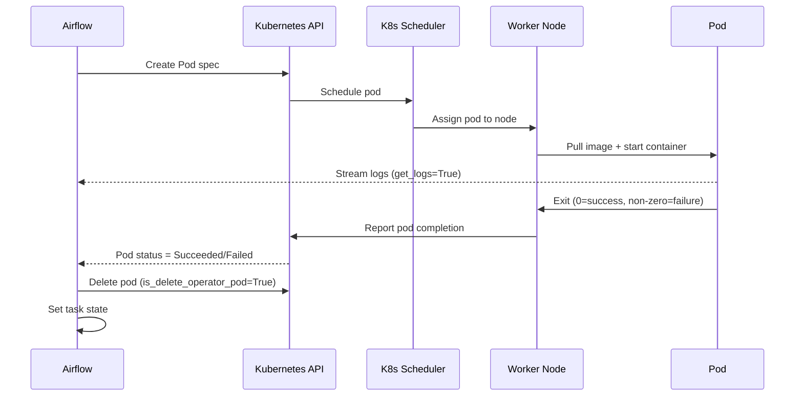

# KubernetesPodOperator in Apache Airflow 3

## 📂 Navigation
⬅️ **Prev:** | 🏠 **[Home](../../../00_Learning_Guide/Learning_Path.md)** | ➡️ **Next: [Code Examples](./Code_Example.md)**

---

## The Story: Cloud-Native Task Isolation

Your company has standardized on Kubernetes. Every service runs in a pod. Your data platform team uses EKS (or GKE, or AKS). Airflow itself runs in the cluster.

Now your pipelines need to do serious work: train a large ML model, run a Spark job, execute a complex R script, process a terabyte of data. Running these inside the Airflow worker process would consume all its resources and affect other running tasks.

The solution is `KubernetesPodOperator`. Each task spins up its own Kubernetes pod, runs to completion, and the pod is cleaned up. The pod gets its own CPU and memory allocation, its own network identity, its own service account — complete isolation. If the task fails catastrophically, it does not affect any other running tasks or the Airflow scheduler.

This is the natural evolution from `DockerOperator` for Kubernetes environments: instead of talking to a Docker daemon on the local machine, you talk to the Kubernetes API, and the cluster handles scheduling the pod on whatever node has available resources.

---

## What Is KubernetesPodOperator?

`KubernetesPodOperator` (from `apache-airflow-providers-cncf-kubernetes`) creates a Kubernetes Pod, waits for it to complete, streams its logs to the Airflow task log, and sets the task state based on the pod's exit code. After the task completes, the pod is optionally deleted.

Key characteristics:
- Any Docker image, any language, any dependencies
- Full Kubernetes resource management (CPU limits, memory limits, GPU requests)
- Kubernetes RBAC integration (service accounts, pod security policies)
- Native Kubernetes secrets and ConfigMaps as environment variables or volume mounts
- Works in-cluster (Airflow runs in the same Kubernetes cluster) or out-of-cluster (via a kubeconfig file)

---

## Setup

```bash
pip install apache-airflow-providers-cncf-kubernetes
```

### Airflow Running Inside Kubernetes (`in_cluster=True`)

When Airflow itself runs in a Kubernetes cluster (the common production setup), the operator authenticates using the pod's service account. No additional configuration is needed:

```python
KubernetesPodOperator(
    task_id="my_task",
    in_cluster=True,    # Use the pod's service account token
    namespace="airflow",
    image="python:3.11",
    ...
)
```

Make sure the Airflow worker service account has permission to create/delete pods in the target namespace.

### Airflow Running Outside Kubernetes (`config_file`)

For local development or when Airflow runs outside the cluster:

```python
KubernetesPodOperator(
    task_id="my_task",
    in_cluster=False,
    config_file="/path/to/kubeconfig",  # Or use ~/.kube/config
    namespace="data-pipelines",
    image="python:3.11",
    ...
)
```

---

## Key Parameters

| Parameter | Type | Default | Description |
|---|---|---|---|
| `name` | `str` | required | Pod name prefix (Airflow appends a unique suffix) |
| `namespace` | `str` | `"default"` | Kubernetes namespace to create the pod in |
| `image` | `str` | required | Docker image to use for the pod's container |
| `cmds` | `list[str]` | `[]` | Entrypoint command (overrides image's ENTRYPOINT) |
| `arguments` | `list[str]` | `[]` | Arguments to the entrypoint (overrides image's CMD) |
| `env_vars` | `list[V1EnvVar]` | `[]` | Environment variables |
| `env_from` | `list[V1EnvFromSource]` | `[]` | Env vars from ConfigMaps or Secrets |
| `in_cluster` | `bool` | `True` | Use in-cluster service account auth |
| `config_file` | `str` | `None` | Path to kubeconfig file (for out-of-cluster use) |
| `cluster_context` | `str` | `None` | kubeconfig context to use |
| `resources` | `k8s.V1ResourceRequirements` | `None` | CPU/memory requests and limits |
| `volume_mounts` | `list[V1VolumeMount]` | `[]` | Mount paths inside the container |
| `volumes` | `list[V1Volume]` | `[]` | Volume definitions (PVC, ConfigMap, Secret, emptyDir) |
| `get_logs` | `bool` | `True` | Stream pod logs to the Airflow task log |
| `is_delete_operator_pod` | `bool` | `True` | Delete the pod after completion |
| `image_pull_policy` | `str` | `"IfNotPresent"` | `"Always"`, `"IfNotPresent"`, or `"Never"` |
| `image_pull_secrets` | `list[V1LocalObjectReference]` | `[]` | Kubernetes Secrets for private registries |
| `service_account_name` | `str` | `"default"` | K8s service account for the pod |
| `labels` | `dict` | `{}` | Labels to attach to the pod |
| `annotations` | `dict` | `{}` | Annotations to attach to the pod |
| `node_selector` | `dict` | `{}` | Constrain pod to nodes with matching labels |
| `tolerations` | `list[V1Toleration]` | `[]` | Allow scheduling on tainted nodes |
| `affinity` | `V1Affinity` | `None` | Advanced node/pod scheduling constraints |
| `do_xcom_push` | `bool` | `False` | Write `result.json` inside container to push XCom |
| `startup_timeout_seconds` | `int` | `120` | Seconds to wait for pod to become Running |
| `kubernetes_conn_id` | `str` | `"kubernetes_default"` | Airflow Connection for Kubernetes API |

---

## Mermaid: KubernetesPodOperator Lifecycle



---

## Resource Configuration

Use `V1ResourceRequirements` from the Kubernetes Python client:

```python
from kubernetes.client import models as k8s

resources = k8s.V1ResourceRequirements(
    requests={
        "cpu": "500m",       # 0.5 CPU cores
        "memory": "512Mi",   # 512 MB RAM
    },
    limits={
        "cpu": "2000m",      # Max 2 CPU cores
        "memory": "4Gi",     # Max 4 GB RAM
    },
)

# For GPU workloads:
gpu_resources = k8s.V1ResourceRequirements(
    limits={
        "nvidia.com/gpu": "1"   # Request 1 GPU
    }
)
```

---

## Environment Variables

```python
from kubernetes.client import models as k8s

env_vars = [
    # Literal value
    k8s.V1EnvVar(name="ENVIRONMENT", value="production"),

    # Value from a Kubernetes Secret
    k8s.V1EnvVar(
        name="DB_PASSWORD",
        value_from=k8s.V1EnvVarSource(
            secret_key_ref=k8s.V1SecretKeySelector(
                name="db-credentials",
                key="password",
            )
        ),
    ),

    # Value from a ConfigMap
    k8s.V1EnvVar(
        name="APP_CONFIG",
        value_from=k8s.V1EnvVarSource(
            config_map_key_ref=k8s.V1ConfigMapKeySelector(
                name="app-config",
                key="config.yaml",
            )
        ),
    ),
]
```

---

## XCom Push from a Pod

When `do_xcom_push=True`, the operator expects the container to write a JSON file at `/airflow/xcom/return.json`. The contents of that file become the XCom `return_value`.

```python
# In your container script:
import json, os
os.makedirs("/airflow/xcom", exist_ok=True)
with open("/airflow/xcom/return.json", "w") as f:
    json.dump({"records_processed": 42000, "status": "success"}, f)
```

```python
# In the DAG:
KubernetesPodOperator(
    task_id="process_data",
    do_xcom_push=True,
    ...
)

# Downstream:
@task
def handle_result(**context):
    result = context["ti"].xcom_pull(task_ids="process_data")
    print(f"Records: {result['records_processed']}")
```

---

## When to Use KubernetesPodOperator vs DockerOperator

| Criterion | DockerOperator | KubernetesPodOperator |
|---|---|---|
| **Infrastructure** | Docker on Airflow worker machine | Kubernetes cluster |
| **Scaling** | Limited to one machine | Cluster-wide — any available node |
| **Resource limits** | Docker-level limits | Kubernetes quota and limits |
| **Secrets** | Environment variables | K8s Secrets, Vault, etc. |
| **Networking** | Docker networks | K8s network policies |
| **Best for** | Local dev, single-machine setups | Production cloud environments |

---

## Key Takeaways

- `KubernetesPodOperator` is the production standard for Kubernetes-based Airflow deployments.
- Set `in_cluster=True` when Airflow runs inside the cluster — it uses the service account automatically.
- Always set CPU/memory `requests` and `limits` to enable proper cluster scheduling.
- Use `is_delete_operator_pod=True` in production to avoid pod accumulation.
- Pass secrets via `env_vars` referencing Kubernetes Secrets — never hardcode credentials.
- Use `do_xcom_push=True` and write to `/airflow/xcom/return.json` to return values to the DAG.
