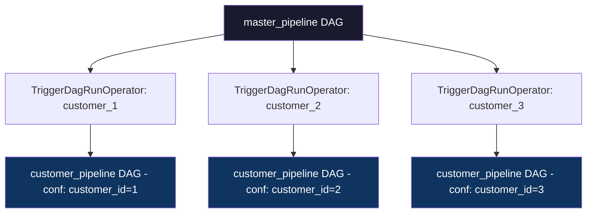

# TriggerDagRunOperator — Theory

## One DAG Calling Another

Imagine a master pipeline that orchestrates work for hundreds of customers. Every night, it needs to run the same processing logic — but separately for each customer, with their own settings, data paths, and schedules.

You could build one giant DAG with hundreds of branches. But that becomes unmaintainable fast. What if each customer had their own sub-pipeline DAG, and the master DAG simply called them?

**TriggerDagRunOperator is the "call your colleague" button.** It triggers another DAG to run — from inside your current DAG. You can pass configuration data to it, and optionally wait for it to finish before moving on.

Think of it like a manager delegating work. The manager's DAG runs, identifies what needs to be done, then tells the specialist DAGs: "Hey, run now with these parameters." The specialists each do their job independently, and the manager either waits for them or moves on to the next task.

---

## When to Use TriggerDagRunOperator

This operator is perfect for:

- **Master/sub-pipeline patterns**: one orchestrator DAG triggers many worker DAGs
- **Cross-team pipelines**: Team A's DAG triggers Team B's DAG when data is ready
- **Fan-out workflows**: one event kicks off parallel sub-pipelines for different segments
- **Scheduled re-runs**: manually trigger a historical backfill DAG



---

## Key Parameters

### trigger_dag_id (required)
The `dag_id` of the DAG you want to trigger:

```python
TriggerDagRunOperator(
    task_id="trigger_child",
    trigger_dag_id="my_child_dag",   # Must match the dag_id exactly
)
```

### conf — Passing Data to the Triggered DAG

Pass a dictionary of configuration to the triggered DAG. The triggered DAG accesses it via `dag_run.conf`:

```python
# In the triggering DAG:
TriggerDagRunOperator(
    task_id="trigger_with_config",
    trigger_dag_id="process_customer",
    conf={"customer_id": 42, "date": "{{ ds }}", "region": "EU"},
)

# In the triggered DAG:
def process_customer(**context):
    customer_id = context["dag_run"].conf.get("customer_id")
    region = context["dag_run"].conf.get("region", "US")  # Default value
    print(f"Processing customer {customer_id} in region {region}")
```

### wait_for_completion

By default, `TriggerDagRunOperator` fires and forgets — it triggers the DAG and immediately succeeds. Set `wait_for_completion=True` to block until the triggered DAG finishes:

```python
TriggerDagRunOperator(
    task_id="trigger_and_wait",
    trigger_dag_id="critical_sub_pipeline",
    wait_for_completion=True,     # Block until triggered DAG is done
    poke_interval=30,             # Check status every 30 seconds
    allowed_states=["success"],   # Only succeed if triggered DAG succeeds
    failed_states=["failed"],     # Fail this task if triggered DAG fails
)
```

### reset_dag_run

If a run with the same execution date already exists, reset it instead of failing:

```python
TriggerDagRunOperator(
    task_id="trigger_idempotent",
    trigger_dag_id="my_sub_dag",
    reset_dag_run=True,  # Re-run even if already exists
)
```

### execution_date

By default, the triggered DAG runs with the current timestamp. You can override this:

```python
from airflow.utils import timezone

TriggerDagRunOperator(
    task_id="trigger_with_specific_date",
    trigger_dag_id="my_dag",
    execution_date="{{ ds }}",  # Use parent DAG's execution date
)
```

---

## Full Working Code Example

```python
from datetime import datetime, timedelta
from airflow import DAG
from airflow.operators.python import PythonOperator
from airflow.operators.trigger_dagrun import TriggerDagRunOperator

# --- Master DAG ---
with DAG(
    dag_id="master_pipeline",
    start_date=datetime(2024, 1, 1),
    schedule_interval="@daily",
    catchup=False,
) as master_dag:

    def get_active_customers(**context):
        """Fetch list of customers that need processing today."""
        # In real life: query a database for active customers
        customers = [101, 102, 103]
        print(f"Found {len(customers)} customers to process")
        return customers

    get_customers = PythonOperator(
        task_id="get_active_customers",
        python_callable=get_active_customers,
    )

    # Trigger sub-pipeline for each customer
    # In practice, you'd generate these dynamically
    trigger_customer_1 = TriggerDagRunOperator(
        task_id="trigger_customer_101",
        trigger_dag_id="customer_pipeline",
        conf={"customer_id": 101, "date": "{{ ds }}"},
        wait_for_completion=True,
        poke_interval=30,
        reset_dag_run=True,
    )

    trigger_customer_2 = TriggerDagRunOperator(
        task_id="trigger_customer_102",
        trigger_dag_id="customer_pipeline",
        conf={"customer_id": 102, "date": "{{ ds }}"},
        wait_for_completion=True,
        poke_interval=30,
        reset_dag_run=True,
    )

    get_customers >> [trigger_customer_1, trigger_customer_2]


# --- Child DAG (customer_pipeline) ---
with DAG(
    dag_id="customer_pipeline",
    start_date=datetime(2024, 1, 1),
    schedule_interval=None,   # Only runs when triggered
    catchup=False,
) as child_dag:

    def process_customer_data(**context):
        """Access conf passed from the triggering DAG."""
        dag_run = context["dag_run"]
        customer_id = dag_run.conf.get("customer_id")
        date = dag_run.conf.get("date")

        if not customer_id:
            raise ValueError("customer_id not provided in conf")

        print(f"Processing customer {customer_id} for date {date}")
        # ... actual processing logic here

    process = PythonOperator(
        task_id="process_customer",
        python_callable=process_customer_data,
    )
```

---

## Cross-DAG Communication Patterns

```
Pattern 1: Fire and Forget (simple)
─────────────────────────────────────
Master DAG triggers child → moves on immediately
Use when: child DAG runs independently and failure is OK

Pattern 2: Wait for Completion (strict)
────────────────────────────────────────
Master DAG triggers child → waits for success
Use when: downstream tasks depend on child DAG's result

Pattern 3: Fan-Out (parallel)
──────────────────────────────
Master DAG triggers multiple child DAGs in parallel
Use when: running same pipeline for multiple tenants/segments

Pattern 4: Event-Driven
────────────────────────
Child DAG has schedule_interval=None → only runs via trigger
Use when: child should never run independently
```

---

## Important Notes

- The **triggered DAG must exist** (be parsed by Airflow) before you trigger it. If the DAG file hasn't been processed yet, the trigger will fail.
- Set `schedule_interval=None` on child DAGs that should only run when triggered — prevents them from running on their own schedule.
- When `wait_for_completion=True`, your triggering task will hold a worker slot for the duration of the child DAG's run. For long child DAGs, this consumes resources.
- `conf` values must be JSON-serializable (strings, numbers, lists, dicts).

---

## Navigation

**Prev:** [S3Operator Theory](../04_S3Operator/Theory.md) | **Home:** [Learning Path](../../00_Learning_Guide/Learning_Path.md) | **Next:** [05 — Sensors](../../05_Sensors/Theory.md)
