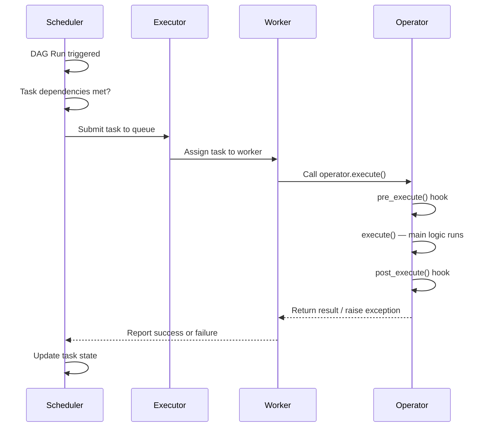

# 04 — Operators: The Specialist Workers of Your Pipeline

## The Kitchen Analogy

Imagine your data pipeline is a restaurant kitchen. Data comes in as raw ingredients, gets processed, transformed, and served as a final product. Now, not everyone in the kitchen does the same job.

- The **dishwasher** runs shell commands — just give them a bash command and they execute it. That's your `BashOperator`.
- The **chef** writes complex recipes in Python — custom logic, API calls, transformations. That's your `PythonOperator`.
- The **storeroom manager** talks to the database — fetching ingredients, logging what was used. That's your `PostgresOperator`.
- The **delivery coordinator** moves things between locations — from local to S3, from one system to another. That's your `Transfer Operator`.
- The **lookout** stands at the door waiting for a delivery before the kitchen can start. That's your `Sensor`.

Each operator is a **specialist**. You assign them a task, they do their job, and they report back whether they succeeded or failed.

---

## What Is an Operator?

In Apache Airflow, an **operator** defines a single unit of work in a DAG. When you write a DAG, each node in the graph is a task — and each task is powered by an operator.

Think of it this way:
- A **DAG** is the recipe card (the plan, the schedule, the order of steps)
- A **Task** is one step in that recipe ("chop onions")
- An **Operator** is the tool used to execute that step (the knife, the cutting board)

```python
from airflow.operators.bash import BashOperator

chop_onions = BashOperator(
    task_id="chop_onions",
    bash_command="python chop.py --ingredient=onions",
)
```

Here, `chop_onions` is the **task**, and `BashOperator` is the **operator** that runs the shell command.

---

## The 4 Types of Operators

Airflow organizes operators into four broad categories:

```mermaid
graph TD
    A[Airflow Operators] --> B[Action Operators]
    A --> C[Transfer Operators]
    A --> D[Sensor Operators]
    A --> E[Utility Operators]

    B --> B1[BashOperator]
    B --> B2[PythonOperator]
    B --> B3[PostgresOperator]
    B --> B4[EmailOperator]
    B --> B5[DockerOperator]

    C --> C1[LocalFilesystemToS3Operator]
    C --> C2[S3ToRedshiftOperator]
    C --> C3[GCSToBigQueryOperator]
    C --> C4[SFTPOperator]

    D --> D1[FileSensor]
    D --> D2[HttpSensor]
    D --> D3[ExternalTaskSensor]
    D --> D4[S3KeySensor]

    E --> E1[BranchPythonOperator]
    E --> E2[TriggerDagRunOperator]
    E --> E3[EmptyOperator]
    E --> E4[LatestOnlyOperator]

    style A fill:#1a1a2e,color:#fff
    style B fill:#16213e,color:#fff
    style C fill:#0f3460,color:#fff
    style D fill:#533483,color:#fff
    style E fill:#e94560,color:#fff
```



### 1. Action Operators
These **do things** — run a command, execute a function, call an API, write to a database.

| Operator | What it does |
|---|---|
| `BashOperator` | Runs a shell/bash command |
| `PythonOperator` | Calls a Python function |
| `PostgresOperator` | Executes SQL on a Postgres DB |
| `EmailOperator` | Sends an email |
| `DockerOperator` | Runs a Docker container |

### 2. Transfer Operators
These **move data** from one system to another. They are the delivery trucks of your pipeline.

| Operator | What it does |
|---|---|
| `LocalFilesystemToS3Operator` | Uploads local file to S3 |
| `S3ToRedshiftOperator` | Copies S3 data into Redshift |
| `GCSToBigQueryOperator` | Loads GCS file into BigQuery |
| `SFTPOperator` | Transfers files over SFTP |

### 3. Sensor Operators
These **wait** for a condition to be true before proceeding. They keep poking until the condition is met (or they time out).

| Sensor | What it waits for |
|---|---|
| `FileSensor` | A file to appear on disk |
| `HttpSensor` | An HTTP endpoint to return success |
| `ExternalTaskSensor` | Another DAG's task to complete |
| `S3KeySensor` | A key to appear in S3 |

### 4. Utility / Control Flow Operators
These **control how the DAG flows** — branching, triggering other DAGs, or acting as placeholders.

| Operator | What it does |
|---|---|
| `BranchPythonOperator` | Chooses which branch to follow |
| `TriggerDagRunOperator` | Triggers another DAG |
| `EmptyOperator` | Does nothing (used as a placeholder) |
| `LatestOnlyOperator` | Skips if not the latest run |

---

## The BaseOperator: The Parent of All Operators

Every operator in Airflow inherits from `BaseOperator`. This is the foundation class that gives all operators their common powers.

When you use any operator, you are always working with `BaseOperator` parameters under the hood:

```python
from airflow.models import BaseOperator

# Every operator inherits these parameters:
task = SomeOperator(
    task_id="my_task",           # Required: unique name within the DAG
    dag=dag,                     # Which DAG this task belongs to
    retries=3,                   # How many times to retry on failure
    retry_delay=timedelta(minutes=5),  # Wait time between retries
    depends_on_past=False,       # Must previous run succeed first?
    email_on_failure=True,       # Email alert on failure
    email_on_retry=False,        # Email alert on retry
    execution_timeout=timedelta(hours=1),  # Kill task if it runs too long
    pool="default_pool",         # Which resource pool to use
    priority_weight=1,           # Priority in the queue
    start_date=datetime(2024, 1, 1),  # When this task can start being scheduled
)
```

These parameters come from `BaseOperator` — they work the same way for **every single operator** in Airflow.

---

## Operator Lifecycle

When Airflow runs a task, the operator goes through a defined lifecycle:



The key method is `execute()` — every operator implements this. It is the actual work the operator does.

If `execute()` raises an exception, the task is marked as **failed**. If it returns normally, the task is **success**.

---

## How to Choose the Right Operator

Use this decision guide when building a task:

| What do you need to do? | Use this operator |
|---|---|
| Run a shell command or script | `BashOperator` |
| Run custom Python logic | `PythonOperator` |
| Query or write to Postgres | `PostgresOperator` |
| Upload/download from S3 | `LocalFilesystemToS3Operator` / `S3Operator` |
| Send an email notification | `EmailOperator` |
| Wait for a file to appear | `FileSensor` |
| Wait for an API to be ready | `HttpSensor` |
| Wait for another DAG's task | `ExternalTaskSensor` |
| Choose a branch based on logic | `BranchPythonOperator` |
| Trigger another DAG | `TriggerDagRunOperator` |
| Mark a start/end point | `EmptyOperator` |
| Run a Docker container | `DockerOperator` |

**General Rule:** If there is a built-in operator for your use case, use it. If not, `PythonOperator` with a custom function is almost always the right fallback.

---

## Custom Operators

When built-in operators don't cover your use case, you can create your own by subclassing `BaseOperator`:

```python
from airflow.models import BaseOperator
from airflow.utils.decorators import apply_defaults

class MyCustomOperator(BaseOperator):

    def __init__(self, my_param: str, **kwargs):
        super().__init__(**kwargs)
        self.my_param = my_param

    def execute(self, context):
        self.log.info(f"Running with param: {self.my_param}")
        # Your custom logic here
        return "result"
```

The only requirement: implement the `execute(self, context)` method.

---

## Key Takeaways

- An **operator** defines what a task does — it is the tool, not the task itself
- All operators inherit from **BaseOperator**, giving them shared parameters like `retries`, `timeout`, `pool`
- There are 4 categories: **Action**, **Transfer**, **Sensor**, and **Utility**
- The main method is `execute()` — this is where the real work happens
- When in doubt, use **PythonOperator** — it can do almost anything
- Built-in operators exist for most common integrations (databases, cloud storage, HTTP, email)

---

## Navigation

**Prev:** [03 — DAGs](../03_DAGs/Theory.md) | **Home:** [Learning Path](../00_Learning_Guide/Learning_Path.md) | **Next:** [05 — Sensors](../05_Sensors/Theory.md)
