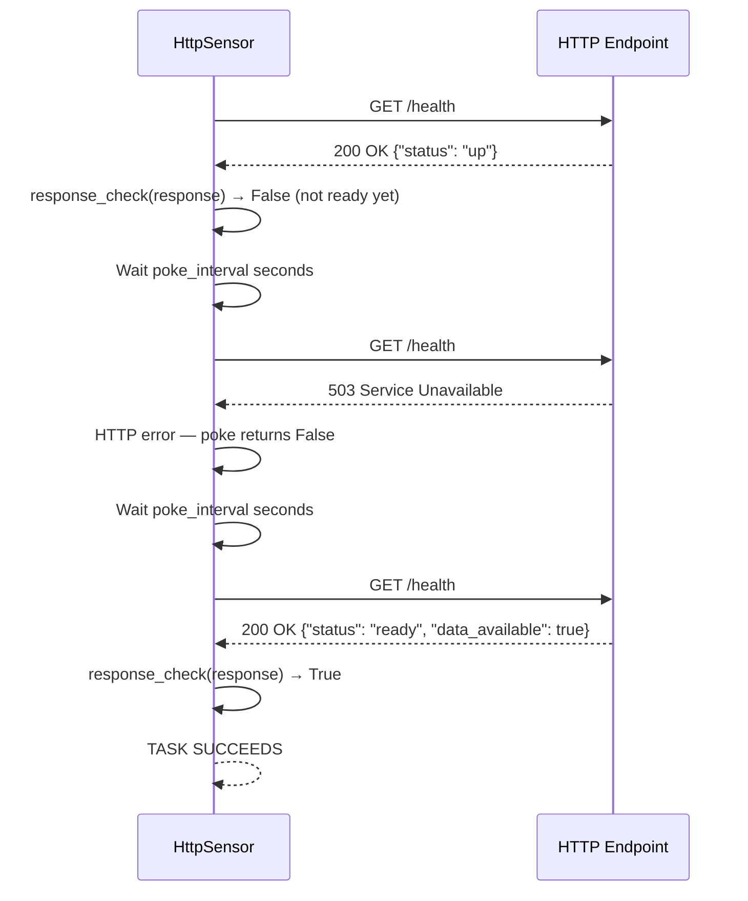

# HttpSensor — Theory

## The API Health Guard

Your pipeline needs to call an external API. You could just call it and handle errors if it's down. But what if the API is under maintenance every morning from 3–5am, right when your pipeline runs? What if the API only serves data after 7am?

Failing your pipeline and retrying is messy. Better to have a dedicated gate that holds the pipeline at the door until the API is actually ready.

**HttpSensor polls an HTTP endpoint on a regular interval until it gets a healthy response.** Think of it as the pipeline's security guard who calls the building's front desk every few minutes: "Are you open yet?" Once the front desk says "Yes, come on in," the guard waves the pipeline through.

This is especially valuable when:
- APIs have maintenance windows you can't control
- Data APIs are only populated after a certain time each morning
- You want to confirm an upstream service is healthy before sending it requests

---

## 📌 Learning Priority

**Must Learn** — core concepts, needed to understand the rest of this file:
[How HttpSensor Works](#how-httpsensor-works) · [response_check](#response_check) · [HTTP Connection Setup](#prerequisites-setting-up-the-http-connection)

**Should Learn** — important for real projects and interviews:
[Key Parameters](#key-parameters) · [Full Working Example](#full-working-code-example)

**Good to Know** — useful in specific situations, not needed daily:
[When to Use HttpSensor](#when-to-use-httpsensor)

**Reference** — skim once, look up when needed:
[Navigation](#navigation)

---

## How HttpSensor Works

`HttpSensor` makes an HTTP request to the endpoint on each `poke()`. It determines success based on the HTTP status code and an optional custom `response_check` function.



---

## Prerequisites: Setting Up the HTTP Connection

Before using `HttpSensor`, configure the HTTP connection in Airflow.

### Install the provider
```bash
pip install apache-airflow-providers-http
```

### Add connection in Airflow UI
1. Go to **Admin → Connections**
2. Click **+** to add new
3. Fill in:

| Field | Value |
|---|---|
| Connection Id | `my_api_conn` |
| Connection Type | `HTTP` |
| Host | `https://api.example.com` |
| Schema | `https` (if not in host) |
| Port | `443` (optional if in host) |

---

## Key Parameters

### http_conn_id
References the connection you created:
```python
HttpSensor(http_conn_id="my_api_conn", ...)
```

### endpoint
The path after the host (relative URL):
```python
# Connection host: https://api.example.com
# endpoint: /v1/status
# Result: GET https://api.example.com/v1/status
HttpSensor(endpoint="/v1/status", ...)
```

### method
HTTP method to use (default `GET`):
```python
HttpSensor(method="POST", ...)
```

### request_params
Query parameters:
```python
HttpSensor(
    endpoint="/data",
    request_params={"date": "{{ ds }}", "format": "json"},
)
# Results in: GET /data?date=2024-01-15&format=json
```

### response_check
A Python function that takes the `response` object and returns `True` (condition met) or `False` (keep waiting):
```python
def check_data_ready(response) -> bool:
    data = response.json()
    return data.get("status") == "ready"

HttpSensor(response_check=check_data_ready, ...)
```

Without `response_check`, any 2xx response counts as success.

### headers
HTTP headers to send with the request:
```python
HttpSensor(
    headers={"Authorization": "Bearer {{ var.value.api_token }}"},
)
```

---

## Full Working Code Example

```python
from datetime import datetime, timedelta
from airflow import DAG
from airflow.providers.http.sensors.http import HttpSensor
from airflow.providers.http.operators.http import SimpleHttpOperator
from airflow.operators.python import PythonOperator
import json

def is_api_ready(response) -> bool:
    """Custom check: API must return 200 with status='ready'."""
    if response.status_code != 200:
        return False
    try:
        data = response.json()
        return data.get("status") == "ready"
    except Exception:
        return False  # Not JSON — keep waiting

def process_api_data(**context):
    ti = context["ti"]
    raw = ti.xcom_pull(task_ids="fetch_api_data")
    data = json.loads(raw)
    print(f"Processing {len(data.get('records', []))} records")


with DAG(
    dag_id="http_sensor_example",
    start_date=datetime(2024, 1, 1),
    schedule_interval="@daily",
    catchup=False,
    default_args={"retries": 1},
) as dag:

    # Gate: wait until API says it's ready for today
    wait_for_api = HttpSensor(
        task_id="wait_for_api_ready",
        http_conn_id="my_data_api",
        endpoint="/v1/status",
        request_params={"date": "{{ ds }}"},
        response_check=is_api_ready,
        poke_interval=120,           # Check every 2 minutes
        timeout=4 * 60 * 60,         # Wait up to 4 hours
        mode="reschedule",
    )

    # Fetch the actual data once the API is ready
    fetch_data = SimpleHttpOperator(
        task_id="fetch_api_data",
        http_conn_id="my_data_api",
        endpoint="/v1/data",
        method="GET",
        data={"date": "{{ ds }}"},
        response_filter=lambda r: r.text,
        log_response=True,
    )

    process = PythonOperator(
        task_id="process_api_data",
        python_callable=process_api_data,
    )

    wait_for_api >> fetch_data >> process
```

---

## When to Use HttpSensor

**Good for:**
- Waiting for APIs with maintenance windows
- Confirming data is available before fetching it
- Health-checking upstream services before calling them
- Waiting for async processing to complete (e.g., job status polling)

**Not ideal for:**
- Simple immediate API calls (use `SimpleHttpOperator` directly)
- Internal services that should always be up (monitor those separately)

---

## Navigation

**Prev:** [FileSensor Theory](../01_FileSensor/Theory.md) | **Home:** [Learning Path](../../00_Learning_Guide/Learning_Path.md) | **Next:** [ExternalTaskSensor Theory](../03_ExternalTaskSensor/Theory.md)
