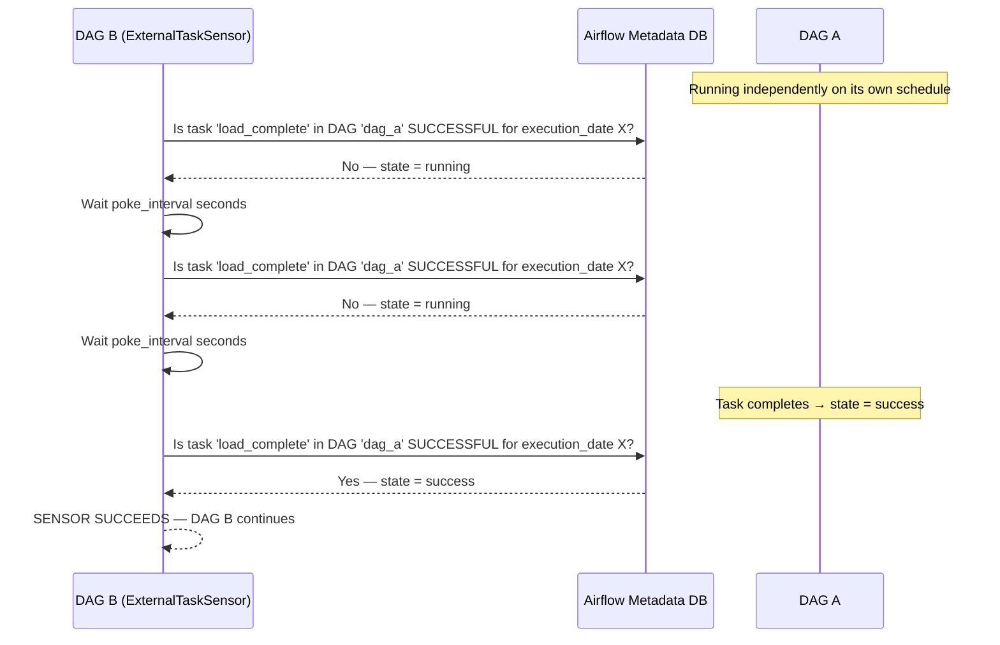

# ExternalTaskSensor — Theory

## When Two DAGs Need to Talk

You have two separate pipelines. DAG A runs every hour — it collects raw data and loads it into a staging table. DAG B runs every 6 hours — it aggregates the staging data into reports.

DAG B needs to wait for DAG A to finish its latest run before it can start aggregating. But they run on different schedules. And they're maintained by different teams. Merging them into one giant DAG would create a mess.

**ExternalTaskSensor is the bridge.** It lets one DAG wait for a specific task in another DAG to complete, across DAG boundaries, without merging the two pipelines.

Think of it like an email notification between colleagues. DAG B posts a lookout (the sensor) at the door. The lookout repeatedly checks whether DAG A's task is in the "success" state. Once it sees the success, it waves DAG B's pipeline through.

---

## 📌 Learning Priority

**Must Learn** — core concepts, needed to understand the rest of this file:
[How ExternalTaskSensor Works](#how-externaltasksensor-works) · [external_dag_id and external_task_id](#external_task_id) · [execution_delta](#execution_delta)

**Should Learn** — important for real projects and interviews:
[Execution Date Matching Problem](#the-execution-date-matching-problem) · [Full Working Example](#full-working-code-example)

**Good to Know** — useful in specific situations, not needed daily:
[allowed_states and failed_states](#allowed_states) · [Common Pitfalls](#common-pitfalls)

**Reference** — skim once, look up when needed:
[Navigation](#navigation)

---

## How ExternalTaskSensor Works

The sensor queries the Airflow metadata database (not the DAG file) to check the state of a task in another DAG. It looks for a TaskInstance with:
- The matching `dag_id`
- The matching `task_id`
- The matching `execution_date`



---

## Key Parameters

### external_dag_id (required)
The `dag_id` of the DAG you're waiting for:
```python
ExternalTaskSensor(
    external_dag_id="upstream_data_pipeline",
)
```

### external_task_id
The specific `task_id` to wait for. If `None`, the sensor waits for the entire DAG run to complete:
```python
ExternalTaskSensor(
    external_dag_id="upstream_dag",
    external_task_id="final_load_task",   # Wait for this specific task
)

ExternalTaskSensor(
    external_dag_id="upstream_dag",
    external_task_id=None,   # Wait for the entire DAG run to succeed
)
```

### execution_delta

This is the trickiest part. The sensor matches execution dates between the two DAGs. If they run on the same schedule, no adjustment is needed. If they run on **different schedules**, you must tell the sensor how far back to look.

```python
from datetime import timedelta

# DAG B runs daily at 6am, DAG A runs daily at 4am
# When DAG B's execution date is 2024-01-15 (6am run),
# look for DAG A's execution date that is 2 hours earlier
ExternalTaskSensor(
    external_dag_id="dag_a",
    execution_delta=timedelta(hours=2),
)
```

### allowed_states
States that count as "success" for the sensor:
```python
ExternalTaskSensor(
    external_dag_id="upstream",
    allowed_states=["success"],   # Default
)
```

### failed_states
States that cause the sensor to fail immediately (rather than keep waiting):
```python
ExternalTaskSensor(
    external_dag_id="upstream",
    failed_states=["failed", "upstream_failed"],
)
```

---

## The Execution Date Matching Problem

This is the most common source of confusion with `ExternalTaskSensor`.

**Scenario:** DAG A runs hourly. DAG B runs daily at midnight. DAG B's execution date is `2024-01-15 00:00:00`. It wants to wait for DAG A's last run of January 14th.

DAG A's last run for that day has execution date `2024-01-14 23:00:00`. The difference is 1 hour.

```python
ExternalTaskSensor(
    external_dag_id="hourly_dag_a",
    execution_delta=timedelta(hours=1),
    # Sensor looks for: current_execution_date - timedelta(hours=1)
)
```

For more complex relationships (e.g., DAG A runs multiple times per day and you want to wait for all of them), use `execution_date_fn`:

```python
def get_most_recent_dag_a_run(dt):
    """Return list of execution dates to check."""
    # Wait for 24 specific hours of DAG A runs
    return [dt - timedelta(hours=h) for h in range(1, 25)]

ExternalTaskSensor(
    external_dag_id="hourly_dag_a",
    execution_date_fn=get_most_recent_dag_a_run,  # Wait for all 24 hourly runs
)
```

---

## Full Working Code Example

```python
from datetime import datetime, timedelta
from airflow import DAG
from airflow.sensors.external_task import ExternalTaskSensor
from airflow.operators.python import PythonOperator

# --- Upstream DAG (runs hourly) ---
with DAG(
    dag_id="hourly_data_loader",
    start_date=datetime(2024, 1, 1),
    schedule_interval="@hourly",
    catchup=False,
) as upstream_dag:

    def load_hourly_data(**context):
        print(f"Loading data for hour: {context['execution_date']}")

    load_data = PythonOperator(
        task_id="load_data",
        python_callable=load_hourly_data,
    )


# --- Downstream DAG (runs daily, waits for upstream) ---
with DAG(
    dag_id="daily_aggregation",
    start_date=datetime(2024, 1, 1),
    schedule_interval="@daily",
    catchup=False,
) as downstream_dag:

    # Wait for the 11pm run of hourly_data_loader (1 hour before midnight)
    wait_for_upstream = ExternalTaskSensor(
        task_id="wait_for_hourly_loader",
        external_dag_id="hourly_data_loader",
        external_task_id="load_data",
        execution_delta=timedelta(hours=1),
        allowed_states=["success"],
        failed_states=["failed", "upstream_failed"],
        poke_interval=60,
        timeout=2 * 60 * 60,
        mode="reschedule",
    )

    def run_aggregation(**context):
        print(f"All upstream data is ready. Running daily aggregation for {context['ds']}")

    aggregate = PythonOperator(
        task_id="run_daily_aggregation",
        python_callable=run_aggregation,
    )

    wait_for_upstream >> aggregate
```

---

## Common Pitfalls

1. **Timezone mismatch**: Both DAGs must use the same timezone, or execution date matching will fail.

2. **Wrong execution_delta**: Off-by-one errors in `execution_delta` are common. Use `execution_date_fn` for complex schedules.

3. **DAG doesn't exist yet**: If the upstream DAG has never run, there's nothing to find in the DB. Set a realistic `timeout` and handle this with monitoring.

4. **Waiting for a DAG that was cleared**: If someone manually clears the upstream DAG's tasks, the sensor may stop seeing "success" states and wait indefinitely.

---

## Navigation

**Prev:** [HttpSensor Theory](../02_HttpSensor/Theory.md) | **Home:** [Learning Path](../../00_Learning_Guide/Learning_Path.md) | **Next:** [06 — Executors](../../06_Executors/Theory.md)
