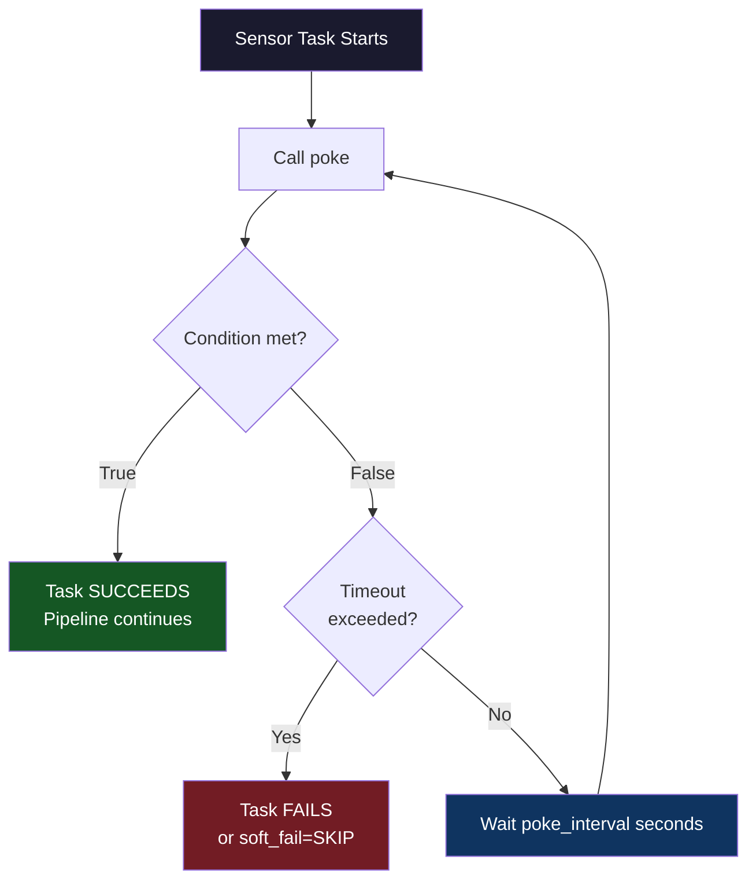

# 05 — Sensors: The Lookouts of Your Pipeline

## The Waiting Game

Every pipeline eventually hits a point where it has to wait. Wait for a file to land. Wait for an API to come back up. Wait for another team's pipeline to finish. Wait for a table to be populated.

You could write a Python function with a `while` loop and a `time.sleep()`. But that blocks a worker, wastes resources, and has no visibility.

**Sensors are Airflow's purpose-built solution for waiting.** A sensor is like a lookout posted at the door. It checks, over and over, whether a condition is true. Once the condition is met, the lookout waves the rest of the pipeline through. If the condition never becomes true within the allowed time, the sensor raises an alarm (fails the task).

---

## 📌 Learning Priority

**Must Learn** — core concepts, needed to understand the rest of this file:
[What Is a Sensor](#what-is-a-sensor) · [poke vs reschedule](#the-two-modes-poke-vs-reschedule) · [timeout vs poke_interval](#timeout-vs-poke_interval)

**Should Learn** — important for real projects and interviews:
[Key Parameters](#key-parameters) · [Sensor Types Overview](#sensor-types-overview) · [soft_fail](#soft_fail-timeout-without-failing)

**Good to Know** — useful in specific situations, not needed daily:
[When to Use Sensors vs Operators](#when-to-use-sensors-vs-operators)

**Reference** — skim once, look up when needed:
[Key Takeaways](#key-takeaways)

---

## What Is a Sensor?

A sensor is a special type of operator that:
1. Calls a `poke()` method on a regular interval
2. `poke()` returns `True` if the condition is met, `False` if not yet
3. If `False`: waits, then tries again
4. If `True`: the task succeeds and the pipeline continues
5. If the timeout is exceeded: the task fails



---

## The Two Modes: poke vs reschedule

This is the most important configuration decision for sensors.

### poke mode (default)

The sensor holds its worker slot for the entire duration it is waiting:

```python
FileSensor(
    task_id="wait_for_file",
    filepath="/data/input.csv",
    poke_interval=60,   # Check every 60 seconds
    timeout=3600,       # Give up after 1 hour
    mode="poke",        # Default — holds worker slot
)
```

**What happens:** The worker process keeps running, sleeping between pokes. It occupies a worker slot the whole time.

**Problem:** If many sensors run simultaneously in `poke` mode, they can starve real work tasks of worker slots. Imagine 20 sensors all waiting, each holding a slot — your pool fills up and no actual tasks can run.

**When to use poke mode:** Only when you expect the condition to be met **very quickly** (seconds to a few minutes). Never use poke mode for sensors that wait hours.

---

### reschedule mode (recommended for long waits)

The sensor releases its worker slot between pokes:

```python
FileSensor(
    task_id="wait_for_file",
    filepath="/data/input.csv",
    poke_interval=300,    # Check every 5 minutes
    timeout=7200,         # Give up after 2 hours
    mode="reschedule",    # Release worker slot between checks
)
```

**What happens:** The sensor pokes, finds the condition not met, releases the worker slot, and schedules itself to be checked again after `poke_interval`. The worker is free to run other tasks between checks.

**When to use reschedule mode:** Whenever you expect to wait more than a few minutes. This is the production best practice.

---

## Key Parameters

| Parameter | Default | Description |
|---|---|---|
| `poke_interval` | `60` | Seconds between each `poke()` call |
| `timeout` | `7 days` | Maximum seconds to wait before failing |
| `mode` | `"poke"` | `"poke"` or `"reschedule"` |
| `soft_fail` | `False` | If `True`, task is marked `skipped` instead of `failed` on timeout |
| `exponential_backoff` | `False` | Increase poke_interval exponentially over time |
| `silent_fail` | `False` | If `True`, log failures as debug rather than error |

---

## timeout vs poke_interval

These two work together but mean different things:

```
Timeline example (poke_interval=60, timeout=300):

00:00 — Sensor starts. Calls poke(). Returns False.
00:01 — Waiting...
01:00 — Calls poke(). Returns False.
01:01 — Waiting...
02:00 — Calls poke(). Returns False.
02:01 — Waiting...
03:00 — Calls poke(). Returns False.
03:01 — Waiting...
04:00 — Calls poke(). Returns False.
04:01 — Waiting...
05:00 — Timeout exceeded (300 seconds). Task FAILS.
```

With `poke_interval=60, timeout=300`, the sensor checks 5 times before giving up.

**Best practice:** Set `timeout` based on how long you're willing to wait. Set `poke_interval` based on how often you want to check (more frequent = more load on the monitored system).

---

## soft_fail: Timeout Without Failing

By default, a sensor that times out fails the task — which can cascade failures through the pipeline. Use `soft_fail=True` to mark the task as **skipped** instead:

```python
optional_file_sensor = FileSensor(
    task_id="wait_for_optional_file",
    filepath="/data/optional_enrichment.csv",
    timeout=1800,        # Wait up to 30 minutes
    soft_fail=True,      # If file never arrives, skip (not fail)
    mode="reschedule",
)
```

Use `soft_fail=True` when the absence of the condition is acceptable — for optional enrichment data, for example.

---

## Sensor Types Overview

| Sensor | Package | What it waits for |
|---|---|---|
| `FileSensor` | `airflow.sensors.filesystem` | A file to appear on disk |
| `S3KeySensor` | `airflow.providers.amazon.aws.sensors.s3` | An object key in S3 |
| `HttpSensor` | `airflow.providers.http.sensors.http` | HTTP endpoint to return success |
| `SqlSensor` | `airflow.providers.common.sql.sensors.sql` | A SQL query to return non-empty result |
| `ExternalTaskSensor` | `airflow.sensors.external_task` | Another DAG's task to complete |
| `TimeSensor` | `airflow.sensors.time` | A specific time of day |
| `DateTimeSensor` | `airflow.sensors.date_time` | A specific datetime |
| `PythonSensor` | `airflow.sensors.python` | Any Python condition to return True |

---

## When to Use Sensors vs Operators

| Use a Sensor when... | Use an Operator when... |
|---|---|
| You need to **wait** for an external condition | You need to **perform** an action |
| The condition may or may not be true yet | The action should run immediately |
| You don't control when the data arrives | You control the timing of the work |
| Example: waiting for a vendor file to land | Example: running your own processing script |

---

## Key Takeaways

- Sensors are for **waiting** — they poll until a condition is met
- Use `mode="reschedule"` for sensors that wait more than a few minutes
- Always set a realistic `timeout` — never let a sensor wait indefinitely
- `soft_fail=True` turns timeout into a skip instead of a failure
- `poke_interval` controls how often you check — don't set it too low on external systems

---

## Navigation

**Prev:** [04 — Operators](../04_Operators/Theory.md) | **Home:** [Learning Path](../00_Learning_Guide/Learning_Path.md) | **Next:** [06 — Executors](../06_Executors/Theory.md)
