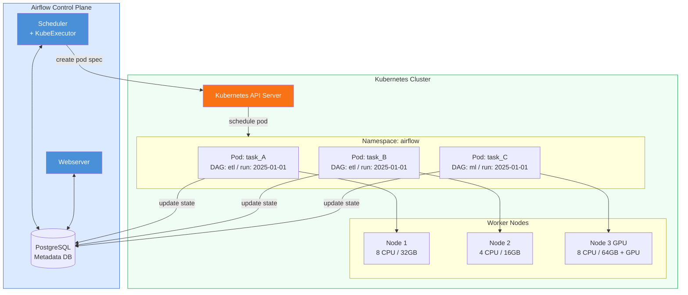

# KubernetesExecutor in Apache Airflow 3

## 📂 Navigation
⬅️ **Prev: [CeleryExecutor](../02_CeleryExecutor/Theory.md)** | 🏠 **[Home](../../../00_Learning_Guide/Learning_Path.md)** | ➡️ **Next: [EdgeExecutor](../04_EdgeExecutor/Theory.md)**

---

## The Story: Every Task Gets Its Own World

Your company runs Airflow on Kubernetes. You have CeleryExecutor with 10 workers — but the setup is painful. When a data scientist needs a new Python library, you rebuild the Celery worker Docker image and redeploy all 10 workers. When a task needs 32 GB of RAM for a specific job, all 10 workers need 32 GB — even though 9 of them are running tasks that need 512 MB. And your workers sit idle overnight, consuming cluster resources and costing money.

A colleague suggests: "What if each task got its own pod? It starts when the task is ready, uses exactly the resources the task needs, runs with the exact Docker image the task requires, and disappears when the task completes."

That is `KubernetesExecutor`.

With KubernetesExecutor, there are no persistent worker processes. When a task is scheduled, Airflow calls the Kubernetes API to create a pod for that task. The pod runs the task, reports success or failure, and terminates. The next task gets a fresh pod. No shared state, no resource waste, no image rebuild sprawl.

---

## What Is KubernetesExecutor?

`KubernetesExecutor` is an Airflow executor that runs **each task instance as a separate Kubernetes pod**. The Airflow scheduler acts as the control plane — it communicates directly with the Kubernetes API server to create and monitor pods.

Key properties:
- **One pod per task**: complete process and filesystem isolation between tasks
- **No idle workers**: pods exist only while tasks are running; zero idle cost
- **Custom resources per task**: each task can request different CPU, memory, and GPU
- **Custom images per task** (via pod override): one task can use `python:3.11`, another can use a custom ML image
- **Kubernetes-native**: leverages namespaces, RBAC, secrets, config maps, and node selectors
- **No message broker**: the scheduler communicates directly with the Kubernetes API — no Redis, no RabbitMQ

---

## Architecture



---

## How It Works: Step by Step

1. **Task becomes ready**: the scheduler detects a task instance in `scheduled` state.
2. **Pod spec creation**: the scheduler builds a Kubernetes pod spec from the pod template file (with task-specific overrides).
3. **Pod submitted**: the scheduler calls the Kubernetes API: `POST /api/v1/namespaces/airflow/pods`.
4. **Kubernetes schedules the pod**: the K8s scheduler finds a suitable node based on resource requests, node selectors, and tolerations.
5. **Pod starts**: the container pulls the Airflow image (if not already cached), initialises the Airflow environment, and runs `airflow tasks run <dag_id> <task_id> <execution_date>`.
6. **Task executes**: the operator's `execute()` method runs. Logs are written to the pod's stdout/stderr.
7. **Task completes**: the pod exits with code 0 (success) or non-zero (failure). Airflow reads the exit code and updates the task state in the metadata DB.
8. **Pod terminates**: unless `delete_worker_pods=False`, the pod is deleted after completion.

Startup overhead: creating and scheduling a pod typically takes **10–30 seconds**. This is the main trade-off compared to CeleryExecutor (< 1 second overhead).

---

## Configuration

### Core Settings

```ini
# airflow.cfg
[core]
executor = KubernetesExecutor

[kubernetes_executor]
# Kubernetes namespace where task pods will be created
namespace = airflow

# Docker image used for task pods
# Must contain Airflow + all required providers/packages
worker_container_repository = myrepo/airflow
worker_container_tag = 3.0.0

# Path to a custom pod template file (YAML)
# Optional — if not set, Airflow uses a sensible default
pod_template_file = /opt/airflow/pod_templates/pod_template.yaml

# Delete pods after they finish (keeps cluster clean)
delete_worker_pods = True

# Kubernetes namespace for the Airflow serviceaccount
# (must have permission to create/list/delete pods)
multi_namespace_mode = False

# In-cluster config (True when Airflow runs inside K8s)
# False for out-of-cluster (kubeconfig file used)
in_cluster = True
```

### Environment Variables

```bash
export AIRFLOW__CORE__EXECUTOR=KubernetesExecutor
export AIRFLOW__KUBERNETES_EXECUTOR__NAMESPACE=airflow
export AIRFLOW__KUBERNETES_EXECUTOR__WORKER_CONTAINER_REPOSITORY=myrepo/airflow
export AIRFLOW__KUBERNETES_EXECUTOR__WORKER_CONTAINER_TAG=3.0.0
export AIRFLOW__KUBERNETES_EXECUTOR__POD_TEMPLATE_FILE=/opt/airflow/pod_template.yaml
export AIRFLOW__KUBERNETES_EXECUTOR__DELETE_WORKER_PODS=True
export AIRFLOW__KUBERNETES_EXECUTOR__IN_CLUSTER=True
```

---

## Pod Template File

The pod template file is a YAML file describing the Kubernetes pod spec that will be used for all task pods. You can customise virtually everything: resource requests/limits, environment variables, volume mounts, tolerations, node selectors, service account, and more.

```yaml
# pod_templates/pod_template.yaml

apiVersion: v1
kind: Pod
metadata:
  name: placeholder-name          # Airflow replaces this with the actual task name
  namespace: airflow
  labels:
    tier: airflow
    component: worker
spec:
  serviceAccountName: airflow-worker   # Must have permission to read secrets, etc.
  restartPolicy: Never                 # Never restart — Airflow manages retries
  tolerations:
    - key: "dedicated"
      operator: "Equal"
      value: "airflow-worker"
      effect: "NoSchedule"
  containers:
    - name: base                        # Main container name MUST be "base"
      image: myrepo/airflow:3.0.0
      imagePullPolicy: IfNotPresent
      resources:
        requests:
          cpu: "500m"
          memory: "512Mi"
        limits:
          cpu: "2"
          memory: "2Gi"
      env:
        - name: AIRFLOW__CORE__EXECUTOR
          value: KubernetesExecutor
        - name: AIRFLOW__DATABASE__SQL_ALCHEMY_CONN
          valueFrom:
            secretKeyRef:
              name: airflow-db-secret
              key: connection
        - name: AIRFLOW__CORE__FERNET_KEY
          valueFrom:
            secretKeyRef:
              name: airflow-fernet-key
              key: fernet-key
      volumeMounts:
        - name: dags
          mountPath: /opt/airflow/dags
          readOnly: true
        - name: logs
          mountPath: /opt/airflow/logs
  volumes:
    - name: dags
      persistentVolumeClaim:
        claimName: airflow-dags-pvc
    - name: logs
      persistentVolumeClaim:
        claimName: airflow-logs-pvc
```

---

## Per-Task Pod Override

You can override the pod template for individual tasks using `executor_config`. This is how you give specific tasks more resources, a different image, or different environment variables.

```python
from airflow.decorators import dag, task
from datetime import datetime


@dag(
    dag_id="per_task_pod_override_demo",
    schedule="@daily",
    start_date=datetime(2025, 1, 1),
    catchup=False,
)
def per_task_pod_override_demo():

    # Default task — uses pod template defaults (512Mi RAM, 500m CPU)
    @task
    def light_validation() -> str:
        print("Quick validation — default pod resources are fine")
        return "ok"

    # Heavy task — override resources for this specific task
    @task(
        executor_config={
            "pod_override": {
                "spec": {
                    "containers": [
                        {
                            "name": "base",
                            "resources": {
                                "requests": {"cpu": "4", "memory": "16Gi"},
                                "limits": {"cpu": "8", "memory": "32Gi"},
                            },
                        }
                    ]
                }
            }
        }
    )
    def heavy_processing(validation_result: str) -> None:
        print(f"Heavy ML training — validation was: {validation_result}")
        print("This pod has 8 CPUs and 32 GB RAM")

    result = light_validation()
    heavy_processing(result)


per_task_pod_override_demo()
```

---

## Namespace and Service Account Setup

The Airflow scheduler needs a Kubernetes service account with permission to create, list, and delete pods in the target namespace.

```yaml
# kubernetes/airflow-rbac.yaml

apiVersion: v1
kind: ServiceAccount
metadata:
  name: airflow-worker
  namespace: airflow

---

apiVersion: rbac.authorization.k8s.io/v1
kind: Role
metadata:
  name: airflow-worker-role
  namespace: airflow
rules:
  - apiGroups: [""]
    resources: ["pods"]
    verbs: ["create", "get", "list", "watch", "delete", "patch", "update"]
  - apiGroups: [""]
    resources: ["pods/log"]
    verbs: ["get", "list"]
  - apiGroups: [""]
    resources: ["pods/exec"]
    verbs: ["create", "get"]

---

apiVersion: rbac.authorization.k8s.io/v1
kind: RoleBinding
metadata:
  name: airflow-worker-rolebinding
  namespace: airflow
subjects:
  - kind: ServiceAccount
    name: airflow-worker
    namespace: airflow
roleRef:
  kind: Role
  name: airflow-worker-role
  apiGroup: rbac.authorization.k8s.io
```

```bash
kubectl apply -f kubernetes/airflow-rbac.yaml
```

---

## Logs

With KubernetesExecutor, task logs are written to the pod's stdout/stderr. The Airflow webserver can fetch them from the pod while it is running. After the pod terminates, logs must come from **remote storage**.

```ini
# airflow.cfg — remote logging (required for KubernetesExecutor in production)
[logging]
remote_logging = True
remote_base_log_folder = s3://my-airflow-logs/
remote_log_conn_id = aws_default
```

Without remote logging, you lose task logs the moment the pod terminates. Always configure remote logging for KubernetesExecutor deployments.

---

## KubernetesExecutor vs CeleryExecutor vs CeleryKubernetesExecutor

| Feature | CeleryExecutor | KubernetesExecutor | CeleryKubernetesExecutor |
|---|---|---|---|
| **Task isolation** | Subprocess on a shared worker | Dedicated pod | Both (queue-based) |
| **Broker required** | Yes (Redis/RabbitMQ) | No | Yes (for Celery tasks) |
| **Idle worker cost** | Yes (workers always running) | No (pods terminate) | Yes (Celery workers) |
| **Task startup overhead** | < 1 second | 10–30 seconds | < 1s (Celery) or 10–30s (K8s) |
| **Custom image per task** | No | Yes (via pod override) | Yes (K8s queue) |
| **Custom resources per task** | No | Yes (via executor_config) | Yes (K8s queue) |
| **K8s required** | No | Yes | Yes |
| **Scaling model** | Add/remove worker machines | K8s cluster autoscaler | Both |
| **Best for** | Multi-machine, no K8s | Cloud-native, K8s-first teams | Mixed workloads on K8s |

---

## Pros and Cons

### Pros

- **Perfect isolation**: tasks cannot interfere with each other; each gets a clean container
- **Zero idle cost**: no workers sitting idle consuming resources between task runs
- **Any resource profile**: a task needing 128 GB RAM gets it; a task needing 100 MB gets that
- **Kubernetes-native secrets**: mount K8s Secrets and ConfigMaps directly in pods
- **Cluster autoscaling**: K8s node autoscaler provisions new nodes when tasks require more capacity
- **No image sprawl management**: custom images are specified per task — no need to bake everything into one worker image

### Cons

- **Pod startup overhead**: 10–30 seconds before a task actually starts executing. Not suitable for tasks that need sub-second latency.
- **Kubernetes required**: significant infrastructure prerequisite. Not practical for teams without K8s expertise.
- **DAG file distribution**: every pod needs access to DAG files. Requires a PVC, Git sync sidecar, or image with DAGs baked in.
- **Remote logging required**: without it, logs vanish when pods terminate.
- **Scheduler becomes the bottleneck**: the scheduler creates all pods via the K8s API. Under very high task throughput (thousands of tasks/minute), the scheduler loop can become a bottleneck.

---

## Key Takeaways

- `KubernetesExecutor` creates **one Kubernetes pod per task instance** — complete isolation, no idle workers.
- The scheduler communicates directly with the **Kubernetes API** — no message broker needed.
- Use the **pod template file** to set default pod configuration (resources, volumes, environment).
- Use **`executor_config` with `pod_override`** to give specific tasks custom resources or images.
- Always configure **remote log storage** (S3, GCS, Azure) — pod logs are lost when pods terminate.
- Pod startup overhead (10–30 seconds) is the main trade-off vs CeleryExecutor.
- KubernetesExecutor is the right choice for **Kubernetes-first teams** who want isolation, autoscaling, and cloud-native secret management.

---

## 📂 Navigation
⬅️ **Prev: [CeleryExecutor](../02_CeleryExecutor/Theory.md)** | 🏠 **[Home](../../../00_Learning_Guide/Learning_Path.md)** | ➡️ **Next: [EdgeExecutor](../04_EdgeExecutor/Theory.md)**
