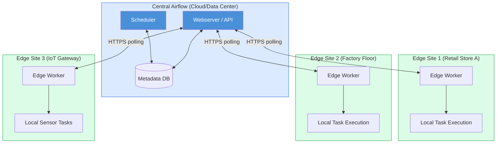

# EdgeExecutor in Apache Airflow 3

## 📂 Navigation
⬅️ **Prev: [LocalExecutor](../01_LocalExecutor/Theory.md)** | 🏠 **[Home](../../../00_Learning_Guide/Learning_Path.md)** | ➡️ **Next:**

---

## The Story: Airflow at the Edge

Your company operates 200 retail stores, each with a local server that processes point-of-sale data, manages local inventory, and runs quality checks. The stores have unreliable internet — sometimes connected, sometimes not. But the data pipelines must keep running regardless.

You want to use Airflow to orchestrate these local pipelines. But traditional executor models don't fit: you can't run a Celery worker that needs a constant connection to a Redis broker. You can't use KubernetesExecutor — there's no Kubernetes cluster at a retail store. You need something lightweight that can run on a modest local machine, execute tasks, and sync back to a central Airflow instance when connectivity is available.

This is the problem Airflow 3's **EdgeExecutor** was designed to solve.

---

## What Is EdgeExecutor?

**EdgeExecutor is new in Apache Airflow 3.** It is a lightweight executor designed for **edge deployments** — environments where compute resources are limited, network connectivity is intermittent or constrained, and the full Airflow infrastructure (Celery + Redis + multiple workers) is impractical.

Edge workers are small, stateless agents that:
1. Poll the central Airflow API for tasks assigned to them
2. Execute tasks locally using minimal resources
3. Report results back to the central Airflow instance
4. Work offline during connectivity gaps and sync when reconnected

The central Airflow deployment (with its scheduler, webserver, and database) can be in the cloud or a data center. The edge workers run on remote, resource-constrained machines — retail stores, factory floors, IoT gateways, remote field stations, branch offices.

---

## Architecture



Key design decisions:
- **HTTP polling, not push**: edge workers poll the central API for tasks. They do not need a persistent connection or a message broker.
- **Stateless workers**: edge workers hold no state beyond the currently executing task. All state lives in the central metadata database.
- **Minimal footprint**: the edge worker binary is small — no Celery, no Redis, no Flower.
- **Works offline**: if connectivity drops mid-task, the task continues executing locally. Results sync when connectivity resumes.

---

## How EdgeExecutor Differs from Other Executors

| Feature | LocalExecutor | CeleryExecutor | KubernetesExecutor | EdgeExecutor (Airflow 3) |
|---|---|---|---|---|
| **Location** | Same machine as scheduler | Dedicated worker machines | Kubernetes pods | Remote edge machines |
| **Network requirement** | None (local) | Persistent broker connection | Kubernetes API | Intermittent HTTP OK |
| **Message broker** | None | Redis / RabbitMQ | None | None |
| **Infrastructure** | Minimal | Medium | Kubernetes cluster | Minimal (HTTP agent) |
| **Parallelism** | Single machine | Horizontal scaling | Pod-level scaling | Per-site scaling |
| **Offline capability** | N/A | No | No | Yes |
| **Footprint** | Medium | Medium | Large | Very small |
| **Best for** | Single-machine prod | High-throughput centralized | Cloud-native | Edge/IoT/remote sites |

---

## Setting Up EdgeExecutor

### Central Airflow Configuration

On the central Airflow instance (scheduler + webserver):

```ini
# airflow.cfg (central instance)
[core]
executor = EdgeExecutor

[edge]
# API endpoint that edge workers will poll
api_url = https://airflow.mycompany.com

# How often edge workers should poll for new tasks (seconds)
task_fetch_interval = 10

# Heartbeat interval — how often edge workers report they are alive
heartbeat_interval = 30

# Worker connection timeout — mark worker as offline after this many seconds
worker_timeout = 120
```

Via environment variables:
```bash
export AIRFLOW__CORE__EXECUTOR=EdgeExecutor
export AIRFLOW__EDGE__API_URL=https://airflow.mycompany.com
```

### Edge Worker Setup

Install a lightweight version of Airflow on the edge machine — only the core and the `apache-airflow-providers-edge` package is needed. No full Airflow installation required.

```bash
# On the edge machine
pip install apache-airflow[edge]
# Or with the provider explicitly:
pip install apache-airflow apache-airflow-providers-edge
```

Start the edge worker:
```bash
airflow edge worker \
  --server-url https://airflow.mycompany.com \
  --worker-name "store-001-worker" \
  --queue "store-001"
```

Key flags:
- `--server-url`: URL of the central Airflow webserver/API
- `--worker-name`: unique identifier for this edge worker
- `--queue`: the task queue this worker listens to (use queue to route tasks to specific edge sites)

---

## Routing Tasks to Specific Edge Workers

Use **queues** to route tasks to specific edge workers. Each edge worker listens on one or more queues, and you specify the queue in the task or operator:

```python
from airflow.decorators import dag, task
from datetime import datetime

@dag(
    dag_id="store_daily_reconciliation",
    schedule="@daily",
    start_date=datetime(2025, 1, 1),
    catchup=False,
)
def store_daily_reconciliation():

    @task(queue="store-001")  # Routes to the edge worker at store 001
    def reconcile_store_001(**context):
        print(f"Reconciling store 001 data for {context['ds']}")
        # This code runs on the edge machine at store 001

    @task(queue="store-002")  # Routes to the edge worker at store 002
    def reconcile_store_002(**context):
        print(f"Reconciling store 002 data for {context['ds']}")

    @task  # Runs on central Airflow (no queue specified = default queue)
    def aggregate_all_stores(**context):
        print("Aggregating results from all stores")

    r1 = reconcile_store_001()
    r2 = reconcile_store_002()
    [r1, r2] >> aggregate_all_stores()


store_daily_reconciliation()
```

---

## Use Cases

| Industry | Use Case | Why EdgeExecutor |
|---|---|---|
| **Retail** | Per-store EOD reconciliation | Each store has local compute; results sync to central |
| **Manufacturing** | Factory-floor quality checks | PLCs and local servers process sensor data locally |
| **IoT / Utilities** | Edge processing of sensor streams | Low-latency local processing, central reporting |
| **Healthcare** | On-premise data processing for compliance | Data cannot leave the site; only results sync |
| **Field Operations** | Remote site pipeline monitoring | Satellite/4G connectivity — intermittent is fine |
| **Branch Offices** | Local ETL before central aggregation | Reduce bandwidth by pre-processing locally |

---

## Limitations and Considerations

- **Airflow 3 only**: EdgeExecutor does not exist in Airflow 2.x. This is a new feature introduced in Airflow 3.
- **DAG file distribution**: Edge workers need access to the DAG files they will execute. You must set up a mechanism to sync DAG files to edge machines (rsync, Git, object storage).
- **No dynamic task mapping across edge sites**: Dynamic task expansion that generates hundreds of tasks works fine, but be mindful that tasks all run on whatever queue they are assigned to.
- **Security**: Edge workers authenticate to the central API using tokens. Ensure HTTPS is used and tokens are rotated.
- **Connectivity gaps**: tasks that have already started will complete locally. Tasks that have not yet been fetched will wait in the queue until the worker reconnects.
- **Not for high-throughput**: EdgeExecutor is designed for low-to-moderate task volumes at each edge site. For high-frequency tasks at edge sites, consider a local Airflow instance with LocalExecutor.

---

## Security Considerations

```bash
# Generate an edge worker token (on the central Airflow instance)
airflow edge token generate --worker-name "store-001-worker"

# Use the token when starting the worker
airflow edge worker \
  --server-url https://airflow.mycompany.com \
  --worker-name "store-001-worker" \
  --token "eyJhbGci..." \
  --queue "store-001"
```

Best practices:
- Use HTTPS for all API communication
- Generate a unique token per edge worker
- Rotate tokens periodically
- Use Airflow's secrets backend for sensitive configuration on edge workers
- Restrict each edge worker's queue to only the tasks it should handle

---

## Key Takeaways

- **EdgeExecutor is new in Airflow 3** — it does not exist in Airflow 2.x.
- It enables Airflow orchestration at **remote, resource-constrained, or intermittently connected sites**.
- Edge workers are **lightweight HTTP polling agents** — no broker, no persistent connection required.
- Use **queues** to route specific tasks to specific edge workers (e.g. per store, per factory).
- The central Airflow instance (scheduler + metadata DB) stays in the cloud or data center.
- Edge workers can continue executing locally during connectivity outages and sync results when reconnected.
- Best for IoT, retail, manufacturing, field operations, and compliance-sensitive on-premise workloads.
