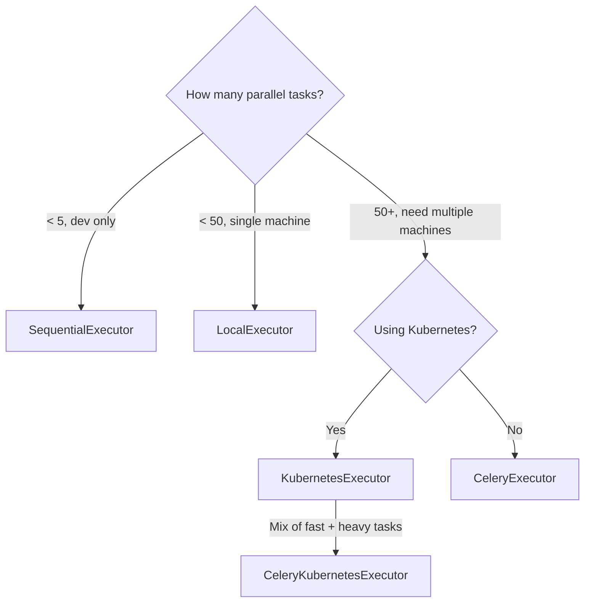

# 06 — Executors: The Engine Room of Airflow

## The Factory Floor Problem

You have a DAG with 20 tasks that could all run in parallel. The scheduler has decided it's time. Now what? Something has to actually run those tasks — pick them up, execute them, track the results.

That something is the **Executor**.

Think of Airflow like a factory. The Scheduler is the foreman who plans the work. The Executor is the factory floor — it decides how the work actually gets done. Does one worker handle everything one at a time? Do you have 10 workers on the same floor? Or do you spin up a brand-new worker machine for every single job?

The answer depends on the executor you configure.

---

## What Is an Executor?

The executor is a component of the Airflow scheduler that determines **how and where tasks run**.

Airflow ships with several built-in executors. You configure which one to use via a single setting:

```ini
# airflow.cfg
[core]
executor = LocalExecutor
```

Or via environment variable:
```bash
AIRFLOW__CORE__EXECUTOR=CeleryExecutor
```

---

## The Four Main Executors

| Executor | Where tasks run | Scale | Use Case |
|----------|----------------|-------|----------|
| **SequentialExecutor** | Scheduler process, one at a time | None | Dev/testing only |
| **LocalExecutor** | Subprocesses on the scheduler machine | Single machine | Small-medium prod |
| **CeleryExecutor** | Separate worker machines via Celery + Redis | Multi-machine | Large-scale prod |
| **KubernetesExecutor** | A new Kubernetes pod per task | K8s cluster | Enterprise / ML workloads |

And in Airflow 3:

| Executor | Description |
|----------|-------------|
| **EdgeExecutor** | Run tasks on remote edge devices, IoT nodes |
| **CeleryKubernetesExecutor** | Hybrid: Celery for fast tasks, K8s for heavy ones |

---

## How to Choose



---

## Sub-Topics in This Section

| Module | What You'll Learn |
|--------|------------------|
| [01 · LocalExecutor](./01_LocalExecutor/Theory.md) | Parallel tasks on one machine using Python multiprocessing |
| [02 · CeleryExecutor](./02_CeleryExecutor/Theory.md) | Distributed workers via Celery + Redis/RabbitMQ |
| [03 · KubernetesExecutor](./03_KubernetesExecutor/Theory.md) | One pod per task on a Kubernetes cluster |
| [04 · EdgeExecutor](./04_EdgeExecutor/Theory.md) | Run tasks at the edge — IoT, remote machines, lightweight workers |

---

## What Every Executor Has in Common

Regardless of which executor you use:

1. The **Scheduler** decides what to run and when
2. The **Executor** receives the task instance and queues it
3. The task instance runs in a **worker** (subprocess, container, or pod)
4. The worker writes logs and updates the task state in the **Metadata DB**
5. The Scheduler reads the updated state and continues the DAG

The executor is swappable — you can switch from LocalExecutor to CeleryExecutor without changing a single DAG.

---

## 📂 Navigation

⬅️ **Prev:** [Sensors](../07_Sensors/Theory.md) &nbsp;&nbsp;&nbsp; ➡️ **Next:** [LocalExecutor](./01_LocalExecutor/Theory.md)

🏠 **[Home](../../README.md)** &nbsp;|&nbsp; 📍 **[Learning Path](../../00_Learning_Guide/Learning_Path.md)**
