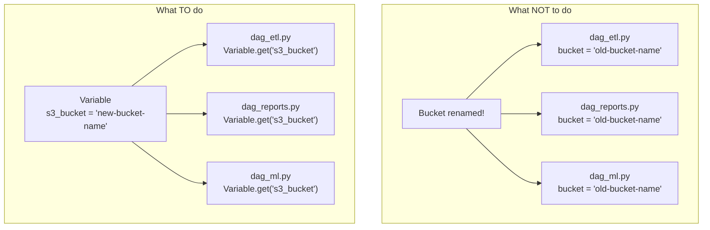
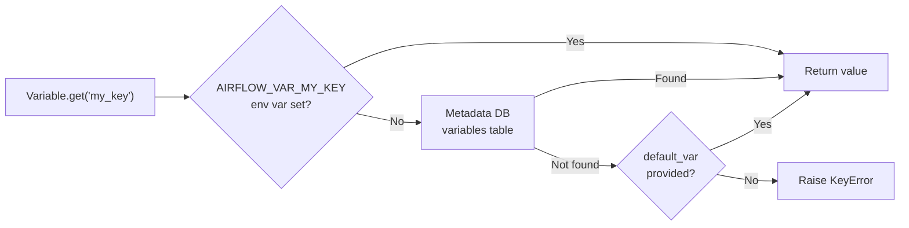

# 08 — Variables and Config

## The Story

A junior engineer joins the team. The pipeline looks clean — tasks run, data flows. Then the cloud team renames an S3 bucket.

The engineer opens the DAG files to update the bucket name. One file. Two files. Five files. Ten. By the time they reach file fifteen they've already introduced a typo in file eight. They deploy, run tests, roll back, fix the typo, redeploy. An afternoon is gone.

**Variables exist so this never happens to you.**

Store your config once — bucket names, environment flags, API endpoints, thresholds — in Airflow's Variable store. Reference each value by a key. When something changes, you update it in one place and every DAG picks it up on the next run. No redeployment. No grep-across-twenty-files. No typos.

---

## What Is an Airflow Variable?

An **Airflow Variable** is a simple key-value pair stored in the metadata database. Keys are strings; values are strings (but you can store JSON and parse it as a dict or list).

Variables are global — any DAG, any task, any file can read them. They are editable at runtime through the UI without touching your code.

---

## Setting Variables

### Method 1 — Airflow UI

Navigate to **Admin → Variables → + (Add a new record)**. Enter a key and a value. For complex config, paste a JSON string into the value field.

### Method 2 — Airflow CLI

```bash
# Set a simple value
airflow variables set s3_bucket my-production-bucket

# Set a JSON value
airflow variables set pipeline_config '{"env": "prod", "retries": 3, "alert_email": "ops@example.com"}'

# Get a value
airflow variables get s3_bucket

# List all variables
airflow variables list

# Delete a variable
airflow variables delete s3_bucket

# Export all variables to a JSON file
airflow variables export variables_backup.json

# Import variables from a JSON file
airflow variables import variables_backup.json
```

### Method 3 — Environment Variables

Prefix the key with `AIRFLOW_VAR_` (uppercase). Airflow reads it at runtime:

```bash
export AIRFLOW_VAR_S3_BUCKET=my-production-bucket
export AIRFLOW_VAR_PIPELINE_CONFIG='{"env": "prod", "retries": 3}'
```

Environment variable variables take precedence over the metadata DB. They are ideal for containers and secrets that should not be stored in a database.

---

## The Problem with Hardcoding vs Using Variables



---

## Using Variables in DAGs

### Variable.get()

```python
from airflow.models import Variable

bucket = Variable.get("s3_bucket")
```

This fetches the value from the metadata DB at **task execution time** — not at parse time. That matters: if you call `Variable.get()` at module level (outside a function), it runs on every scheduler parse cycle and creates unnecessary DB load.

### Variable.get() with a Default

```python
# If the variable doesn't exist, return "default-bucket" instead of raising an error
bucket = Variable.get("s3_bucket", default_var="default-bucket")
```

### JSON Variables

```python
# Stored value: '{"env": "prod", "retries": 3, "alert_email": "ops@example.com"}'
config = Variable.get("pipeline_config", deserialize_json=True)
# config is now a dict: {"env": "prod", "retries": 3, "alert_email": "ops@example.com"}

env = config["env"]           # "prod"
retries = config["retries"]   # 3
```

### How Variable.get() Resolves Values



---

## Jinja Templating for Variables

Some operators support Jinja-templated strings in their parameters. You can inject a Variable's value directly into a SQL query or bash command without writing Python:

```python
from airflow.operators.bash import BashOperator

task = BashOperator(
    task_id="sync_files",
    # {{ var.value.s3_bucket }} renders to the variable's value at runtime
    bash_command="aws s3 sync /tmp/output/ s3://{{ var.value.s3_bucket }}/output/",
)
```

For JSON variables use `var.json`:

```python
bash_command="echo Env is {{ var.json.pipeline_config.env }}"
```

Jinja templates are only rendered when the task actually runs — they are lazy, just like calling `Variable.get()` inside a function.

---

## Best Practices

- **Never hardcode environment-specific config** (bucket names, URLs, thresholds) in DAG files.
- **Call Variable.get() inside task callables**, not at module level, to avoid hammering the metadata DB during DAG parsing.
- **Use `default_var`** so your DAG degrades gracefully if a variable is accidentally deleted.
- **Use JSON variables** for grouping related config values under one key instead of creating many individual keys.
- **Prefix variable keys** by team or DAG to avoid collisions: `etl_s3_bucket`, `ml_batch_size`.
- **Store secrets in a secrets backend**, not as plain-text Variables (use Connections or Vault for passwords).

---

## Key Takeaways

- Variables are key-value pairs stored once and reused everywhere.
- Set them via the UI, CLI, environment variables, or secrets backend.
- Use `Variable.get(key, default_var=..., deserialize_json=True)` inside task functions.
- Jinja templates (`{{ var.value.key }}`) inject variable values directly in operator parameters.
- Centralised config = one change, zero redeployments.

---

## Navigation

**Prev:** [07 — Connections and Hooks](../07_Connections_and_Hooks/Theory.md) | **Home:** [Learning Path](../00_Learning_Guide/Learning_Path.md) | **Next:** [09 — XComs](../09_XComs/Theory.md)
