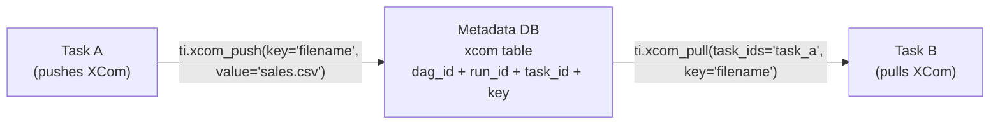

# 09 — XComs

## The Story

Task A hits the S3 API and finds today's latest file: `sales_2024_03_15_v7.csv`. It downloads it, validates it, and marks itself successful. Now Task B needs to process that file — but Task B has no idea which file Task A picked.

You could write the filename to a database, or to a shared file, or create a side-channel... but all of those require extra infrastructure and extra code.

**XComs** — short for **cross-communications** — solve this elegantly. They are Airflow's built-in system for passing small pieces of data between tasks, like a sticky note passed from one worker to the next. Task A pushes a value. Task B pulls it. Both values live in the metadata database, automatically scoped to the DAG run.

---

## 📌 Learning Priority

**Must Learn** — core concepts, needed to understand the rest of this file:
[What Is an XCom](#what-is-an-xcom) · [xcom_push and xcom_pull](#xcom_push-and-xcom_pull) · [XCom Limitations](#xcom-limitations)

**Should Learn** — important for real projects and interviews:
[TaskFlow API Style](#taskflow-api-style-airflow-20) · [Multiple Values and Keys](#multiple-values-and-keys)

**Good to Know** — useful in specific situations, not needed daily:
[XCom Cleanup](#xcom-cleanup) · [How the Data Flows](#how-the-data-flows)

---

## What Is an XCom?

An **XCom** is a key-value record stored in the `xcom` table of Airflow's metadata database. Each record is identified by:

| Field | Purpose |
|---|---|
| `dag_id` | Which DAG it belongs to |
| `run_id` | Which specific run (so parallel runs don't collide) |
| `task_id` | Which task pushed it |
| `key` | A name for the value (default: `"return_value"`) |
| `value` | The serialised data (pickle or JSON) |

XComs are scoped per DAG run, so concurrent runs of the same DAG never share XCom values.

---

## How the Data Flows



---

## xcom_push and xcom_pull

### Pushing a Value

Inside any task callable you have access to the **task instance** (`ti`) via the context:

```python
def task_a(ti, **context):
    filename = find_latest_file()           # returns "sales_2024_03_15_v7.csv"
    ti.xcom_push(key="filename", value=filename)
```

### Pulling a Value

```python
def task_b(ti, **context):
    filename = ti.xcom_pull(task_ids="task_a", key="filename")
    process(filename)
```

### Automatic Push via Return Value

When a Python callable returns a value, Airflow automatically pushes it as an XCom under the key `"return_value"`:

```python
def task_a():
    return "sales_2024_03_15_v7.csv"   # auto-pushed as key="return_value"

def task_b(ti, **context):
    filename = ti.xcom_pull(task_ids="task_a")  # key defaults to "return_value"
    process(filename)
```

---

## TaskFlow API Style (Airflow 2.0+)

The `@task` decorator makes XCom passing invisible. You just return and receive values like ordinary Python functions:

```python
from airflow.decorators import dag, task

@dag(schedule=None, start_date=datetime(2024, 1, 1), catchup=False)
def my_pipeline():

    @task
    def fetch_filename():
        return "sales_2024_03_15_v7.csv"  # automatically pushed as XCom

    @task
    def process_file(filename: str):
        print(f"Processing {filename}")   # filename was automatically pulled

    process_file(fetch_filename())        # Airflow wires the XCom dependency

my_pipeline()
```

Under the hood, Airflow still pushes and pulls XCom values — the decorator just hides the boilerplate.

---

## XCom Limitations

XComs are designed for **small metadata**, not bulk data.

| What XComs are for | What XComs are NOT for |
|---|---|
| A filename, a row count, a status string | A Pandas DataFrame |
| A list of IDs (a few hundred rows) | A CSV with millions of rows |
| A dictionary of config values | Binary files, images |
| A job ID to poll later | Anything measured in MB |

**The rule of thumb:** if the value is bigger than a few kilobytes, write it to S3, GCS, or a database, and pass only the path or identifier as an XCom.

The default XCom backend serialises to the metadata DB. You can swap it for a custom backend (e.g., writing to S3) if you need larger values, but the small-data philosophy still applies.

---

## Multiple Values and Keys

```python
# Push multiple keys from one task
ti.xcom_push(key="filename", value="sales.csv")
ti.xcom_push(key="row_count", value=42_000)

# Pull specific keys
filename = ti.xcom_pull(task_ids="task_a", key="filename")
count    = ti.xcom_pull(task_ids="task_a", key="row_count")

# Pull from multiple tasks at once (returns a list)
results = ti.xcom_pull(task_ids=["extract_task", "validate_task"], key="status")
```

---

## XCom Cleanup

XComs accumulate in the metadata DB over time. Airflow clears them when you clear a task instance from the UI. They are also purged when the DAG run record is deleted. For high-frequency DAGs, configure `max_active_runs` and regularly clean up old run records.

---

## Key Takeaways

- XComs pass small values between tasks within the same DAG run.
- Use `ti.xcom_push` / `ti.xcom_pull` in classic operators, or just return/receive values with `@task`.
- XComs live in the metadata DB — keep them tiny.
- For large data, write to external storage and pass the path as an XCom.
- Each DAG run has its own XCom scope — parallel runs don't interfere.

🚀 **Apply this:** Pass data between tasks in a real pipeline → [Project 03 — Data Quality Pipeline](../../09_Capstone_Projects/03_Data_Quality_Pipeline/01_MISSION.md)
---

## Navigation

**Prev:** [08 — Variables and Config](../08_Variables_and_Config/Theory.md) | **Home:** [Learning Path](../00_Learning_Guide/Learning_Path.md) | **Next:** [10 — Branching and Control Flow](../10_Branching_and_Control_Flow/Theory.md)
