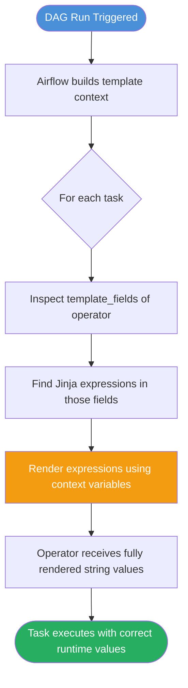

# Jinja Templates & Macros in Apache Airflow 3

## 📂 Navigation
⬅️ **Prev:** | 🏠 **[Home](../../00_Learning_Guide/Learning_Path.md)** | ➡️ **Next: [Cheatsheet](./Cheatsheet.md)**

---

## 📌 Learning Priority

**Must Learn** — core concepts, needed to understand the rest of this file:
[How Jinja Rendering Works](#how-jinja-rendering-works) · [What Are template_fields](#what-are-template_fields) · [Built-In Airflow Macros Complete Reference](#built-in-airflow-macros--complete-reference)

**Should Learn** — important for real projects and interviews:
[Practical Patterns](#practical-patterns) · [Common Mistakes](#common-mistakes)

**Good to Know** — useful in specific situations, not needed daily:
[Custom Macros via Plugins](#custom-macros-via-plugins) · [Adding template_fields to Your Own Operators](#adding-template_fields-to-your-own-operators)

**Reference** — skim once, look up when needed:
[Other macros Helpers](#other-macros-helpers)

---

## The Story: Your DAG Knows What Time It Is

Every time your DAG runs, it carries something precious: context. It knows exactly *when* it is scheduled to run, what the data interval is, what the run ID is, and much more.

Without Jinja templates, you would have to hardcode values or write Python callbacks to inject dates into your operators. With Jinja, you write `{{ ds }}` and Airflow fills in the correct date at runtime — automatically, for every single run.

Imagine you are building a daily ETL pipeline that downloads yesterday's sales file from an FTP server. The filename changes every day: `sales_2025-03-14.csv`, `sales_2025-03-15.csv`, and so on. Without templating you might write:

```python
# Bad: hardcoded, breaks tomorrow
BashOperator(command="download_file.sh sales_2025-03-14.csv")
```

With Jinja:

```python
# Good: self-updating, always correct
BashOperator(bash_command="download_file.sh sales_{{ ds }}.csv")
```

That `{{ ds }}` is replaced with the actual data interval start date every single time the task runs. No code changes. No bugs from forgetting to update a date.

---

## How Jinja Rendering Works

Airflow uses the [Jinja2](https://jinja.palletsprojects.com/) templating engine. Before a task is executed, Airflow inspects every field listed in the operator's `template_fields` tuple and renders any Jinja expressions it finds.



The context is a dictionary populated just before task execution. It contains dates, the DAG run object, the task instance, params, and more — all the macros described in this document.

---

## What Are `template_fields`?

Every Airflow operator defines a class-level tuple called `template_fields`. Only fields listed there are processed by Jinja. Trying to use `{{ ds }}` in a field that is not in `template_fields` will do nothing — the string is passed through as-is.

```python
# From BashOperator source (simplified)
class BashOperator(BaseOperator):
    template_fields: Sequence[str] = ("bash_command", "env")
    #                                  ^^^^^^^^^^^^   ^^^
    #                          These two fields support Jinja
```

To check which fields are templatable for any operator, read its source or the docs, or simply inspect the class:

```python
from airflow.operators.bash import BashOperator
print(BashOperator.template_fields)
# ('bash_command', 'env')
```

---

## Built-In Airflow Macros — Complete Reference

All macros are available inside any `template_fields` value using `{{ macro_name }}` syntax.

### `ds` — Data Interval Start as YYYY-MM-DD

The most commonly used macro. Returns the **start** of the data interval formatted as `YYYY-MM-DD`.

```python
from airflow.decorators import dag, task
from airflow.operators.bash import BashOperator
from datetime import datetime

@dag(schedule="@daily", start_date=datetime(2025, 1, 1))
def my_dag():
    download = BashOperator(
        task_id="download_file",
        bash_command="wget https://data.example.com/sales/{{ ds }}.csv",
        # Renders to: wget https://data.example.com/sales/2025-03-15.csv
    )
```

**Example output:** `2025-03-15`

---

### `ds_nodash` — Date Without Dashes

Same as `ds` but strips the hyphens. Useful for filenames or partition paths that do not allow dashes.

```python
BashOperator(
    task_id="create_partition",
    bash_command="hive -e 'ALTER TABLE sales ADD PARTITION (dt={{ ds_nodash }})'",
    # Renders to: ALTER TABLE sales ADD PARTITION (dt=20250315)
)
```

**Example output:** `20250315`

---

### `ts` — Full ISO 8601 Timestamp

Returns the data interval start as a full ISO 8601 timestamp including time and timezone offset. Use this when you need precision beyond the date.

```python
BashOperator(
    task_id="log_start",
    bash_command="echo 'Pipeline started for interval: {{ ts }}'",
    # Renders to: Pipeline started for interval: 2025-03-15T00:00:00+00:00
)
```

**Example output:** `2025-03-15T00:00:00+00:00`

---

### `ts_nodash` — Timestamp Without Separators

Compact timestamp with no colons, dashes, or dots. Common in filenames that must be sortable and filesystem-safe.

```python
BashOperator(
    task_id="archive",
    bash_command="cp output.csv /archive/output_{{ ts_nodash }}.csv",
    # Renders to: cp output.csv /archive/output_20250315T000000+0000.csv
)
```

**Example output:** `20250315T000000+0000`

---

### `ts_nodash_with_tz` — Timestamp Without Separators but With Timezone

Similar to `ts_nodash` but retains the timezone suffix.

**Example output:** `20250315T000000+0000`

---

### `data_interval_start` — Start of the Data Interval (Airflow 2.2+)

A `pendulum.DateTime` object representing the start of the data interval. This is the Airflow 3 preferred term, replacing the old `execution_date`. You can call pendulum methods on it directly in Jinja.

```python
BashOperator(
    task_id="show_interval",
    bash_command="echo 'Start: {{ data_interval_start }} Day: {{ data_interval_start.day_of_week }}'",
)
```

Since this is a Python object, you can also use it in Python tasks via the context:

```python
@task
def process(**context):
    start = context["data_interval_start"]
    print(f"Processing data from: {start.to_date_string()}")
    print(f"Month: {start.month}, Year: {start.year}")
```

**Example output (Jinja):** `2025-03-15T00:00:00+00:00`

---

### `data_interval_end` — End of the Data Interval

The `pendulum.DateTime` object for the end of the data interval. For a daily DAG scheduled at midnight, `data_interval_start` is `2025-03-15T00:00:00` and `data_interval_end` is `2025-03-16T00:00:00`.

```python
BashOperator(
    task_id="export",
    bash_command=(
        "export_data.py "
        "--from {{ data_interval_start.isoformat() }} "
        "--to {{ data_interval_end.isoformat() }}"
    ),
)
```

**Example output:** `2025-03-16T00:00:00+00:00`

---

### `logical_date` — Logical Execution Date

Equivalent to `data_interval_start`. Kept for compatibility with code that used `execution_date` before Airflow 2.2. In Airflow 3, prefer `data_interval_start` for clarity in new code.

```python
BashOperator(
    task_id="legacy_compat",
    bash_command="python etl.py --date {{ logical_date.strftime('%Y/%m/%d') }}",
)
```

**Example output:** `2025/03/15`

---

### `prev_data_interval_start_success` — Last Successful Run's Start

Returns the `data_interval_start` of the **most recent successful DAG run**. Returns `None` if no prior successful run exists. Extremely useful for incremental loads where you want "everything since the last time we ran successfully."

```python
BashOperator(
    task_id="incremental_load",
    bash_command=(
        "load_incremental.py "
        "--from {{ prev_data_interval_start_success or '1970-01-01' }} "
        "--to {{ ds }}"
    ),
)
```

**Example output:** `2025-03-14T00:00:00+00:00` (or `None` if first run)

---

### `prev_data_interval_end_success` — Last Successful Run's End

Similar to `prev_data_interval_start_success` but gives the *end* of the last successful interval. Use this to avoid overlap or gap between intervals.

```python
BashOperator(
    task_id="no_gap_load",
    bash_command=(
        "load.py "
        "--from {{ prev_data_interval_end_success or '1970-01-01' }} "
        "--to {{ data_interval_end }}"
    ),
)
```

---

### `dag_run` — The DAG Run Object

Gives you the full `DagRun` object. The two most common attributes are:

- `dag_run.run_id`: the unique run identifier (e.g. `scheduled__2025-03-15T00:00:00+00:00`)
- `dag_run.conf`: the JSON configuration dictionary passed when triggering the DAG manually

```python
BashOperator(
    task_id="show_run_info",
    bash_command=(
        "echo 'Run ID: {{ dag_run.run_id }}' && "
        "echo 'Config target: {{ dag_run.conf.get(\"target_table\", \"default\") }}'"
    ),
)
```

**Example `dag_run.run_id`:** `scheduled__2025-03-15T00:00:00+00:00`

---

### `task` — The Current Task Object

The `BaseOperator` instance for the currently executing task. Useful for accessing task metadata programmatically.

```python
BashOperator(
    task_id="self_aware_task",
    bash_command=(
        "echo 'I am task: {{ task.task_id }} in DAG: {{ task.dag_id }}'"
    ),
)
```

**Common attributes:** `task.task_id`, `task.dag_id`, `task.owner`, `task.retries`, `task.upstream_task_ids`

---

### `ti` / `task_instance` — The Task Instance Object

Both `ti` and `task_instance` refer to the same `TaskInstance` object. The task instance combines the task definition with the specific run, and carries XCom push/pull methods.

```python
BashOperator(
    task_id="instance_info",
    bash_command=(
        "echo 'Attempt: {{ ti.try_number }} of {{ ti.max_tries + 1 }}'"
    ),
)
```

**Common attributes:**
- `ti.task_id` — task identifier
- `ti.dag_id` — DAG identifier
- `ti.run_id` — run identifier
- `ti.try_number` — current attempt number (1-based)
- `ti.state` — current state
- `ti.xcom_push(key, value)` / `ti.xcom_pull(task_ids, key)` — XCom access

```python
@task
def use_task_instance(**context):
    ti = context["ti"]
    print(f"This is attempt {ti.try_number}")
    ti.xcom_push(key="status", value="done")
```

---

### `params` — DAG and Task Parameters

Access typed parameters defined on the DAG or task. These are defined as `Param` objects and can be overridden at trigger time.

```python
from airflow.models.param import Param

@dag(
    schedule="@daily",
    start_date=datetime(2025, 1, 1),
    params={
        "environment": Param("production", type="string"),
        "batch_size": Param(1000, type="integer"),
    }
)
def parameterized_dag():
    BashOperator(
        task_id="run_etl",
        bash_command=(
            "etl.py --env {{ params.environment }} --batch {{ params.batch_size }}"
        ),
    )
```

---

### `macros.ds_add(ds, days)` — Date Arithmetic

Part of the `macros` module. Adds (or subtracts) a number of days to a `YYYY-MM-DD` date string and returns a new `YYYY-MM-DD` string. Negative values go backwards in time.

```python
BashOperator(
    task_id="rolling_window",
    bash_command=(
        "query.py "
        "--start {{ macros.ds_add(ds, -7) }} "   # 7 days ago
        "--end   {{ macros.ds_add(ds, 0) }}"      # today (same as ds)
    ),
)
```

**Example:** If `ds` is `2025-03-15`, then `macros.ds_add(ds, -7)` returns `2025-03-08`.

---

### `macros.ds_format(ds, from_fmt, to_fmt)` — Date Reformatting

Parses a date string using `from_fmt` and returns it reformatted as `to_fmt`. Both format strings use Python's `strftime`/`strptime` directives.

```python
BashOperator(
    task_id="reformat_date",
    bash_command=(
        "upload.sh /data/{{ macros.ds_format(ds, '%Y-%m-%d', '%Y/%m/%d') }}/sales.csv"
        # Renders to: /data/2025/03/15/sales.csv
    ),
)
```

---

### Other `macros.*` Helpers

| Macro | Description | Example |
|---|---|---|
| `macros.datetime` | Python `datetime` class | `{{ macros.datetime(2025, 1, 1) }}` |
| `macros.timedelta` | Python `timedelta` class | `{{ macros.timedelta(days=7) }}` |
| `macros.dateutil` | The `dateutil` library | `{{ macros.dateutil.relativedelta.relativedelta(months=1) }}` |
| `macros.uuid` | The `uuid` module | `{{ macros.uuid.uuid4() }}` |
| `macros.random` | Python `random` module | `{{ macros.random.randint(1, 100) }}` |
| `macros.time` | Python `time` module | `{{ macros.time.time() }}` |
| `macros.json` | Python `json` module | `{{ macros.json.dumps({'key': 'val'}) }}` |

---

## Custom Macros via Plugins

You can register your own Python functions as Jinja macros by adding them to an Airflow plugin. They become available as `{{ macros.my_function(...) }}` in all templates.

```python
# plugins/my_macros_plugin.py
from airflow.plugins_manager import AirflowPlugin

def fiscal_quarter(ds: str) -> str:
    """Return the fiscal quarter (Q1/Q2/Q3/Q4) for a given YYYY-MM-DD date."""
    from datetime import date
    d = date.fromisoformat(ds)
    return f"Q{(d.month - 1) // 3 + 1}"

class MyMacrosPlugin(AirflowPlugin):
    name = "my_macros_plugin"
    macros = [fiscal_quarter]
```

Usage in a DAG:

```python
BashOperator(
    task_id="quarterly_report",
    bash_command=(
        "report.py --quarter {{ macros.fiscal_quarter(ds) }}"
        # Renders to: report.py --quarter Q1
    ),
)
```

---

## Adding `template_fields` to Your Own Operators

When you build a custom operator, declare which fields should be Jinja-rendered:

```python
from airflow.models import BaseOperator
from typing import Sequence

class MyApiOperator(BaseOperator):
    # Declare these fields as templatable
    template_fields: Sequence[str] = ("endpoint", "payload")

    def __init__(self, endpoint: str, payload: str, **kwargs):
        super().__init__(**kwargs)
        self.endpoint = endpoint
        self.payload = payload

    def execute(self, context):
        # By the time execute() is called, self.endpoint and self.payload
        # have already been rendered by Jinja
        print(f"Calling: {self.endpoint}")
        print(f"With: {self.payload}")
```

---

## Practical Patterns

### Pattern 1: Partitioned S3 Paths

```python
S3CreateObjectOperator(
    task_id="upload_to_s3",
    s3_key="data/year={{ data_interval_start.year }}/month={{ data_interval_start.month:02d }}/day={{ data_interval_start.day:02d }}/sales.parquet",
    # Renders to: data/year=2025/month=03/day=15/sales.parquet
)
```

### Pattern 2: Rolling 30-Day Window

```python
BashOperator(
    task_id="rolling_metric",
    bash_command=(
        "compute_metric.py "
        "--window-start {{ macros.ds_add(ds, -30) }} "
        "--window-end {{ ds }}"
    ),
)
```

### Pattern 3: Conditional on Weekday

```python
BashOperator(
    task_id="day_aware",
    bash_command=(
        ""
        "run_monday_report.py"
        ""
        "run_daily_report.py"
        ""
    ),
)
```

### Pattern 4: Using `dag_run.conf` for Dynamic Paths

```python
BashOperator(
    task_id="dynamic_source",
    bash_command=(
        "process.py --source {{ dag_run.conf.get('source_path', '/default/path') }}"
    ),
)
```

---

## Common Mistakes

| Mistake | Problem | Fix |
|---|---|---|
| Using `{{ ds }}` in a non-template field | String passed as-is, not rendered | Check `template_fields` for the operator |
| Expecting `execution_date` in Airflow 3 | Deprecated, may not exist | Use `data_interval_start` or `logical_date` |
| Using `{{ ds }}` in `@task` function body | Jinja does not run inside Python | Use `context["ds"]` or `context["data_interval_start"]` |
| `prev_data_interval_start_success` on first run | Returns `None` | Use `or 'fallback_date'` in the template |

---

## Key Takeaways

- Jinja templates are rendered **at task execution time**, not when the DAG is parsed.
- Only fields listed in `template_fields` are rendered.
- `ds` = data interval start as `YYYY-MM-DD`. It is the most-used macro.
- `data_interval_start` and `data_interval_end` are `pendulum.DateTime` objects — call methods on them.
- `dag_run.conf` lets you pass runtime configuration when triggering a DAG manually.
- The `macros.*` namespace provides date arithmetic, formatting, and Python stdlib access.
- Custom macros can be added via plugins and are available project-wide.
