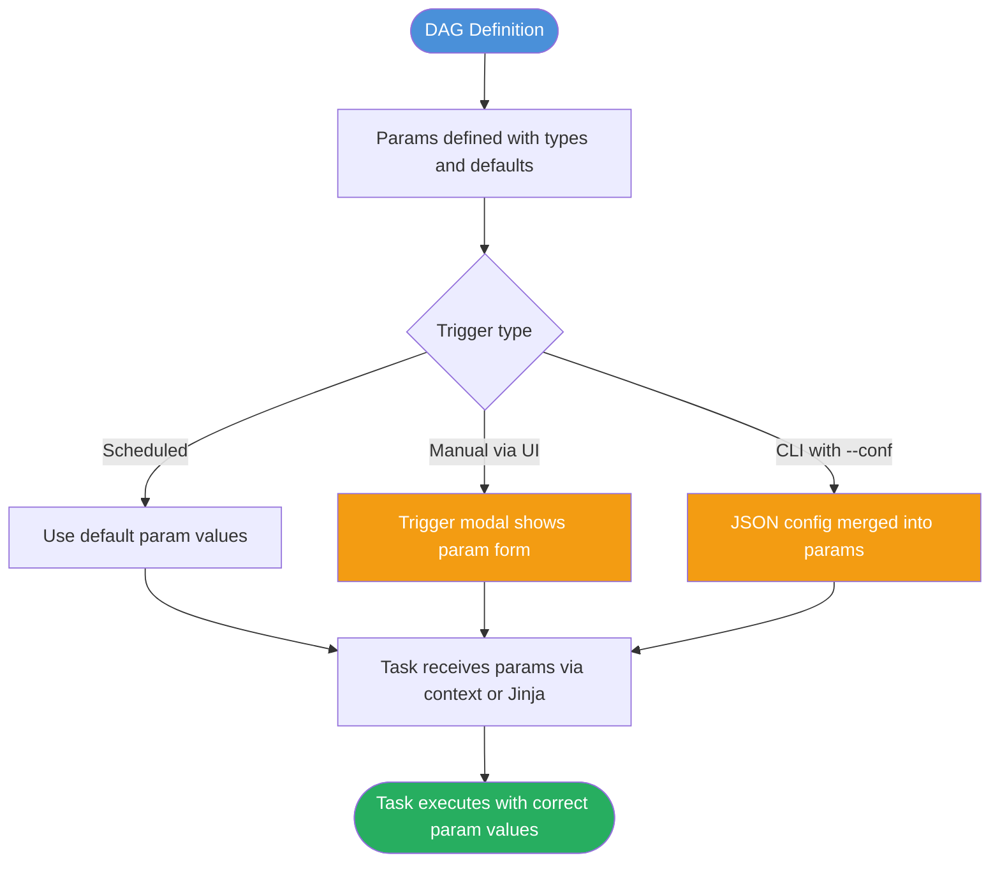

# DAG Params and Runtime Configuration in Apache Airflow 3

## 📂 Navigation
⬅️ **Prev:** | 🏠 **[Home](../../00_Learning_Guide/Learning_Path.md)** | ➡️ **Next: [Cheatsheet](./Cheatsheet.md)**

---

## The Story: Reprocessing Without Touching Code

Your ETL DAG runs every night and processes yesterday's data. It works perfectly. Then one morning your manager walks in: "We found a data quality issue from last quarter. Can you reprocess January through March?"

Without Params, you would have to edit the DAG code, deploy it, run it, then edit it back. That is error-prone and slow.

With Params, the conversation goes differently: "Sure, just trigger the DAG with `{'start_date': '2024-01-01', 'end_date': '2024-03-31'}` — the UI even shows a form for it." The manager opens the Airflow UI, fills in two date fields, clicks Trigger, and the reprocessing starts.

That is what DAG Params are for: **typed, validated, named inputs** that let you influence what a DAG run does at the moment it is triggered — without changing any code.

---

## What Are Params?

A `Param` is a named, typed parameter with an optional default value, description, and validation constraints. Params are defined on the DAG and optionally on individual tasks. They are:

- **Typed**: `string`, `integer`, `float`, `boolean`, `array`, `object`
- **Validated**: Airflow rejects triggers that pass invalid values
- **Documented**: descriptions and examples appear in the trigger UI form
- **Defaulted**: the DAG runs normally (with defaults) on a scheduled trigger



---

## Defining Params

### In the `@dag` Decorator

```python
from airflow.decorators import dag, task
from airflow.models.param import Param
from datetime import datetime

@dag(
    dag_id="reprocess_sales",
    schedule="@daily",
    start_date=datetime(2025, 1, 1),
    params={
        "start_date": Param(
            "2025-01-01",
            type="string",
            format="date",
            description="Start of the reprocessing window (YYYY-MM-DD)",
        ),
        "end_date": Param(
            "2025-01-31",
            type="string",
            format="date",
            description="End of the reprocessing window (YYYY-MM-DD)",
        ),
        "environment": Param(
            "production",
            type="string",
            enum=["development", "staging", "production"],
            description="Target environment for processing",
        ),
        "dry_run": Param(
            False,
            type="boolean",
            description="If true, log actions without writing data",
        ),
        "batch_size": Param(
            1000,
            type="integer",
            minimum=1,
            maximum=100000,
            description="Number of records per batch",
        ),
    },
)
def reprocess_sales():
    ...
```

### In the `DAG()` Constructor (Traditional Style)

```python
from airflow import DAG
from airflow.models.param import Param

with DAG(
    dag_id="reprocess_sales",
    schedule="@daily",
    start_date=datetime(2025, 1, 1),
    params={
        "start_date": Param("2025-01-01", type="string", format="date"),
        "batch_size": Param(1000, type="integer", minimum=1),
    },
) as dag:
    ...
```

---

## Param Types

| Type | JSON Schema Type | Python Equivalent | Example Default |
|---|---|---|---|
| `"string"` | `string` | `str` | `"production"` |
| `"integer"` | `integer` | `int` | `1000` |
| `"number"` | `number` | `float` | `0.95` |
| `"boolean"` | `boolean` | `bool` | `False` |
| `"array"` | `array` | `list` | `["table_a", "table_b"]` |
| `"object"` | `object` | `dict` | `{"key": "value"}` |

### String Subtypes (via `format`)

The `format` field adds extra validation for strings:

| Format | Validates as |
|---|---|
| `"date"` | `YYYY-MM-DD` |
| `"date-time"` | ISO 8601 datetime |
| `"time"` | `HH:MM:SS` |
| `"uri"` | URI string |

### Enum Constraint

```python
"region": Param(
    "us-east-1",
    type="string",
    enum=["us-east-1", "eu-west-1", "ap-southeast-1"],
)
```

### Numeric Constraints

```python
"workers": Param(
    4,
    type="integer",
    minimum=1,
    maximum=64,
    multipleOf=1,
)
```

---

## Accessing Params in Tasks

### Method 1: Jinja Template (in `template_fields`)

```python
from airflow.operators.bash import BashOperator

BashOperator(
    task_id="run_reprocess",
    bash_command=(
        "reprocess.py "
        "--start {{ params.start_date }} "
        "--end {{ params.end_date }} "
        "--env {{ params.environment }} "
        "--batch {{ params.batch_size }}"
    ),
)
```

### Method 2: Python Context (in `@task`)

```python
@task
def run_reprocess(**context):
    params = context["params"]
    start = params["start_date"]
    end = params["end_date"]
    env = params["environment"]
    dry_run = params["dry_run"]
    batch_size = params["batch_size"]

    if dry_run:
        print(f"[DRY RUN] Would process {start} to {end} in {env}")
    else:
        print(f"Processing {start} to {end} in {env} with batches of {batch_size}")
```

### Method 3: `get_current_context()` (Airflow 3)

```python
from airflow.operators.python import get_current_context

def my_callable():
    context = get_current_context()
    params = context["params"]
    return params["environment"]
```

---

## Overriding Params at Runtime

### Via the Airflow UI

In Airflow 3, triggering a DAG manually opens a modal with a **dynamically generated form** based on the `Param` definitions:

- `string` params → text input box
- `integer`/`number` params → number input with min/max constraints displayed
- `boolean` params → toggle/checkbox
- `enum` params → dropdown selector
- `array` params → JSON array input
- `format: "date"` params → date picker

To trigger with custom values:
1. Open the DAG in the Airflow UI
2. Click **Trigger DAG** (the play button)
3. Fill in the param form fields
4. Click **Trigger**

### Via the CLI

```bash
# Single string value
airflow dags trigger reprocess_sales \
  --conf '{"start_date": "2024-01-01", "end_date": "2024-03-31"}'

# Multiple params including non-string types
airflow dags trigger reprocess_sales \
  --conf '{
    "start_date": "2024-01-01",
    "end_date": "2024-03-31",
    "environment": "staging",
    "dry_run": true,
    "batch_size": 500
  }'
```

### Via the REST API (Airflow 3)

```bash
curl -X POST "http://localhost:8080/api/v1/dags/reprocess_sales/dagRuns" \
  -H "Content-Type: application/json" \
  -u "airflow:airflow" \
  -d '{
    "conf": {
      "start_date": "2024-01-01",
      "end_date": "2024-03-31",
      "environment": "staging"
    }
  }'
```

---

## `dag_run.conf` vs `params` — The Key Difference

This is a common source of confusion:

| | `params` | `dag_run.conf` |
|---|---|---|
| **Defined where** | In the DAG code as `Param` objects | Not defined — set at trigger time |
| **Type validation** | Yes — enforced at trigger | No — untyped raw dict |
| **Default values** | Yes | No |
| **UI form** | Yes — typed form fields | Raw JSON textarea only |
| **Scheduled runs** | Uses defaults | Empty dict `{}` |
| **Access in Jinja** | `{{ params.my_param }}` | `{{ dag_run.conf.get('key') }}` |
| **Access in Python** | `context["params"]["my_param"]` | `context["dag_run"].conf.get("key")` |
| **Best for** | Structured, validated inputs | Ad-hoc overrides, unstructured data |

**Relationship:** When you trigger a DAG with `--conf`, the JSON values in `conf` are **merged into params** for the run, overriding the defaults. So `params` always contains the final resolved values. `dag_run.conf` contains only what was explicitly passed at trigger time.

```python
# If triggered with --conf '{"environment": "staging"}'
# params["environment"] == "staging"  (conf overrode the default)
# dag_run.conf == {"environment": "staging"}  (only what was passed)
# params["batch_size"] == 1000  (default, not in conf)
# dag_run.conf.get("batch_size") == None  (not in conf)
```

---

## New in Airflow 3: Improved Params UI

Airflow 3 significantly upgraded the trigger modal:

1. **Typed form rendering**: Params with `type="integer"` render as number inputs. Params with `enum` render as dropdowns. Date-format strings render as date pickers.

2. **Validation at trigger time**: If you enter a string where an integer is expected, the form rejects it before the DAG run is created — no wasted runs.

3. **Rich descriptions**: The `description` field of each `Param` appears as helper text next to the form field.

4. **JSON Schema under the hood**: Param definitions map directly to JSON Schema. You can use any valid JSON Schema constraint — `pattern` for regex validation, `examples`, `title`, etc.

```python
"email": Param(
    "ops@example.com",
    type="string",
    format="idn-email",
    title="Notification Email",
    description="Send completion notification to this address",
    examples=["team@example.com", "ops@company.org"],
),
```

---

## Advanced: Task-Level Params

Params can also be defined at the task level, scoped to just that task:

```python
@task(
    params={
        "output_format": Param("parquet", type="string", enum=["parquet", "csv", "json"])
    }
)
def export_data(**context):
    fmt = context["params"]["output_format"]
    print(f"Exporting as {fmt}")
```

Task-level params are merged with DAG-level params. Task params take precedence in case of name collision.

---

## Complete Working Example

```python
from airflow.decorators import dag, task
from airflow.models.param import Param
from airflow.operators.bash import BashOperator
from datetime import datetime

@dag(
    dag_id="parameterized_etl",
    schedule="@daily",
    start_date=datetime(2025, 1, 1),
    catchup=False,
    params={
        "source_table": Param(
            "orders",
            type="string",
            enum=["orders", "customers", "products"],
            description="Source table to process",
        ),
        "start_date": Param(
            "{{ ds }}",
            type="string",
            format="date",
            description="Override start date (defaults to DAG run date)",
        ),
        "limit": Param(
            None,
            type=["integer", "null"],
            description="Row limit for testing. Leave empty for full load.",
        ),
        "notify": Param(True, type="boolean", description="Send Slack notification on complete"),
    },
)
def parameterized_etl():

    extract = BashOperator(
        task_id="extract",
        bash_command=(
            "extract.py "
            "--table {{ params.source_table }} "
            "--date {{ params.start_date }} "
            "--limit {{ params.limit }}"
        ),
    )

    @task
    def transform(**context):
        params = context["params"]
        print(f"Transforming {params['source_table']}")
        return {"rows_processed": 42}

    @task
    def notify_if_enabled(stats: dict, **context):
        if context["params"]["notify"]:
            print(f"Sending notification: {stats}")

    result = transform()
    extract >> result
    notify_if_enabled(result)


parameterized_etl()
```
