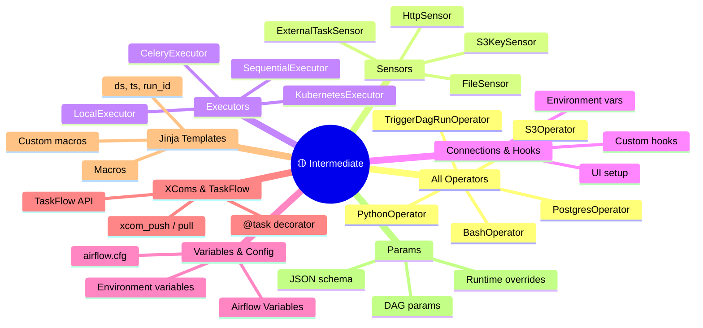
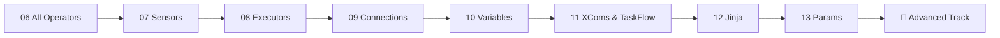

⬅️ [Beginner Track](../01_Beginner/Readme.md) &nbsp;|&nbsp; 🏠 [Home](../00_Learning_Guide/Readme.md) &nbsp;|&nbsp; [Advanced Track ➡️](../03_Advanced/Readme.md)

---

# 🟡 Intermediate Track

> *You can write a DAG. Now it's time to make it production-worthy — real operators, real sensors, real connections to external systems, and clean data passing between tasks.*

**[Start Here → All Operators (Theory.md)](06_All_Operators/Theory.md)**

---

## At a Glance

| | |
|---|---|
| **Topics** | 8 modules |
| **Est. Time** | 12–15 hours |
| **Prerequisites** | 🟢 Beginner Track complete |
| **Unlocks** | 🔴 Advanced Track |

---

## Section Map

---

## Topics

| Module | File | Description |
|--------|------|-------------|
| 06 | [All Operators → Theory.md](06_All_Operators/Theory.md) | Overview of all built-in operators, when to use each |
| 06 | [All Operators → Comparison](06_All_Operators/Operators_Comparison.md) | Side-by-side comparison table |
| 06 | [BashOperator → Theory](06_All_Operators/01_BashOperator/Theory.md) | Running shell commands from Airflow |
| 06 | [BashOperator → Code](06_All_Operators/01_BashOperator/Code_Example.md) | Working examples |
| 06 | [PythonOperator → Theory](06_All_Operators/02_PythonOperator/Theory.md) | Calling Python functions, passing context |
| 06 | [PythonOperator → Code](06_All_Operators/02_PythonOperator/Code_Example.md) | Working examples |
| 06 | [PostgresOperator → Theory](06_All_Operators/03_PostgresOperator/Theory.md) | Running SQL against PostgreSQL |
| 06 | [PostgresOperator → Code](06_All_Operators/03_PostgresOperator/Code_Example.md) | Working examples |
| 06 | [S3Operator → Theory](06_All_Operators/04_S3Operator/Theory.md) | Interacting with AWS S3 |
| 06 | [S3Operator → Code](06_All_Operators/04_S3Operator/Code_Example.md) | Working examples |
| 06 | [TriggerDagRunOperator → Theory](06_All_Operators/08_TriggerDagRunOperator/Theory.md) | Triggering other DAGs programmatically |
| 06 | [TriggerDagRunOperator → Code](06_All_Operators/08_TriggerDagRunOperator/Code_Example.md) | Working examples |
| 07 | [Sensors → Theory.md](07_Sensors/Theory.md) | How sensors work, poke vs reschedule mode |
| 07 | [FileSensor → Theory](07_Sensors/01_FileSensor/Theory.md) | Waiting for files to appear |
| 07 | [FileSensor → Code](07_Sensors/01_FileSensor/Code_Example.md) | Working examples |
| 07 | [HttpSensor → Theory](07_Sensors/02_HttpSensor/Theory.md) | Polling HTTP endpoints |
| 07 | [HttpSensor → Code](07_Sensors/02_HttpSensor/Code_Example.md) | Working examples |
| 07 | [ExternalTaskSensor → Theory](07_Sensors/03_ExternalTaskSensor/Theory.md) | Waiting for tasks in other DAGs |
| 08 | Executors → Theory.md | SequentialExecutor vs LocalExecutor vs Celery vs Kubernetes |
| 09 | [Connections & Hooks → Theory.md](09_Connections_and_Hooks/Theory.md) | Storing credentials, using hooks |
| 09 | [Connections & Hooks → Code](09_Connections_and_Hooks/Code_Example.md) | Custom hook examples |
| 10 | [Variables & Config → Theory.md](10_Variables_and_Config/Theory.md) | Airflow Variables, config files, env vars |
| 10 | [Variables & Config → Code](10_Variables_and_Config/Code_Example.md) | Runtime variable access patterns |
| 11 | [XComs & TaskFlow → Theory.md](11_XComs_and_TaskFlow/Theory.md) | Data passing between tasks, TaskFlow API |
| 11 | [XComs & TaskFlow → Code](11_XComs_and_TaskFlow/Code_Example.md) | @task decorator patterns |
| 12 | [Jinja Templates → Theory.md](12_Jinja_Templates_Macros/Theory.md) | Templated fields, built-in macros |
| 12 | [Jinja Templates → Macros Reference](12_Jinja_Templates_Macros/Macros_Reference.md) | All built-in macros listed |
| 13 | Params → Theory.md | DAG params, runtime overrides, UI triggers |

---

## Learning Path

---

## Before You Start

- Complete the Beginner Track — especially "Your First DAG"
- Have a working local Airflow 3 instance running
- Recommended: spin up a PostgreSQL instance (Docker) for the database operator examples

---

⬅️ [Beginner Track](../01_Beginner/Readme.md) &nbsp;|&nbsp; 🏠 [Home](../00_Learning_Guide/Readme.md) &nbsp;|&nbsp; [Advanced Track ➡️](../03_Advanced/Readme.md)

