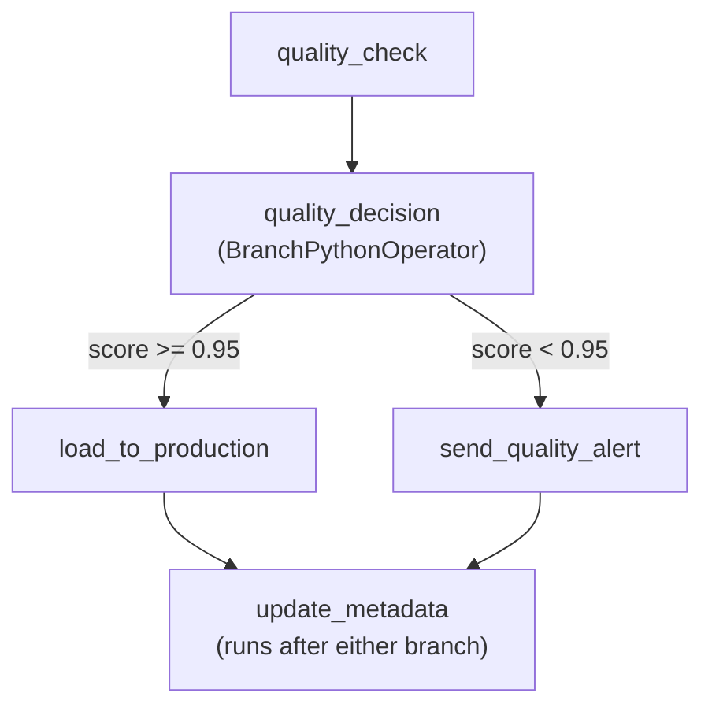
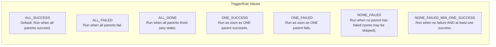

# 10 — Branching and Control Flow

## The Story

Not all pipelines are straight lines.

Your ETL reads a file, but what if the file is empty? Your data quality check runs, but what if 5% of rows are null? Your report generates, but what if it's a weekend and nobody needs it until Monday?

Real pipelines branch. They make decisions. Sometimes a path succeeds and you go left. Sometimes it fails and you go right. Sometimes you send an alert, sometimes you skip it entirely.

**Branching is Airflow's if/else statement.**

Instead of writing complex conditional logic inside a single task, you model the decision itself as a task in the DAG. The DAG graph shows the possible paths. Operators and TriggerRules give you precise control over when tasks run — and when they don't.

---

## 📌 Learning Priority

**Must Learn** — core concepts, needed to understand the rest of this file:
[BranchPythonOperator](#branchpythonoperator) · [TriggerRule](#triggerrule) · [ShortCircuitOperator](#shortcircuitoperator)

**Should Learn** — important for real projects and interviews:
[Practical Patterns](#practical-patterns)

**Reference** — skim once, look up when needed:
[TriggerRule Reference Table](#triggerrule-reference-table)

---

## BranchPythonOperator

`BranchPythonOperator` calls a Python function that returns the **task_id** of the branch to follow. All other downstream tasks are **skipped** (marked with `SKIPPED` status — not failed).

```python
from airflow.operators.python import BranchPythonOperator

def decide_branch():
    quality_score = run_quality_check()
    if quality_score >= 0.95:
        return "load_to_production"    # return the task_id to run
    else:
        return "send_quality_alert"   # return a different task_id

branch = BranchPythonOperator(
    task_id="quality_decision",
    python_callable=decide_branch,
)
```

You can return a list to follow multiple branches simultaneously:

```python
def multi_branch():
    return ["notify_slack", "update_dashboard"]
```

### What the Graph Looks Like



The `update_metadata` task needs special treatment — by default it requires ALL upstream tasks to succeed, but `load_to_production` and `send_quality_alert` are mutually exclusive. This is where **TriggerRule** comes in.

---

## TriggerRule

Every task has a `trigger_rule` parameter that controls when it is eligible to run. The default is `ALL_SUCCESS`.



### TriggerRule Reference Table

| Rule | Task runs when... | Common use case |
|---|---|---|
| `ALL_SUCCESS` (default) | Every parent succeeded | Normal pipeline step |
| `ALL_FAILED` | Every parent failed | Last-resort fallback |
| `ALL_DONE` | Every parent finished (any state) | Cleanup after anything |
| `ONE_SUCCESS` | At least one parent succeeded | Fan-in race — take first winner |
| `ONE_FAILED` | At least one parent failed | Alert on first failure |
| `NONE_FAILED` | No parent failed (skipped is OK) | Join after a branch |
| `NONE_FAILED_MIN_ONE_SUCCESS` | No failure AND at least one success | Join after a branch (stricter) |

### Fixing the Join After a Branch

```python
join_task = PythonOperator(
    task_id="update_metadata",
    python_callable=update_metadata,
    trigger_rule="none_failed",   # runs whether load_to_production or send_quality_alert ran
)
```

Without `none_failed`, the join task would be skipped because one of its parents was skipped.

---

## ShortCircuitOperator

`ShortCircuitOperator` calls a Python function that returns `True` or `False`. If it returns `False`, **all downstream tasks are skipped** — the entire remainder of the pipeline short-circuits. There is no alternative branch; it either continues or it doesn't.

```python
from airflow.operators.python import ShortCircuitOperator

def is_weekday(**context):
    return context["execution_date"].weekday() < 5  # Monday=0, Sunday=6

gate = ShortCircuitOperator(
    task_id="weekday_gate",
    python_callable=is_weekday,
)

gate >> generate_report >> send_email  # both are skipped on weekends
```

### BranchPythonOperator vs ShortCircuitOperator

| | BranchPythonOperator | ShortCircuitOperator |
|---|---|---|
| Returns | A `task_id` (or list) | `True` / `False` |
| When False/other branch | Other tasks are skipped | All downstream are skipped |
| Has alternative path | Yes | No |
| Use when | Routing between paths | Stop-or-continue gate |

---

## Practical Patterns

### Quality Gate

```
extract → validate → [ShortCircuit: is_quality_ok?] → load → report
                                                   ↓ (if False: all downstream skipped)
```

### A/B Routing

```
check_experiment → [Branch: which_variant?] → variant_a_task
                                            → variant_b_task
                                            → [join: NONE_FAILED] → record_result
```

### Conditional Notification

```
main_task → [trigger_rule=ONE_FAILED] → send_failure_alert
```

A notification task with `trigger_rule="one_failed"` placed downstream of multiple tasks will fire as soon as any one of them fails — without blocking the others.

---

## Key Takeaways

- `BranchPythonOperator` routes to one (or more) task IDs; all others are skipped.
- `ShortCircuitOperator` is a simple True/False gate that stops the entire downstream.
- `TriggerRule` controls when a task is eligible given its parents' outcomes.
- After a branch, use `trigger_rule="none_failed"` on join tasks so they aren't skipped.
- Model decisions as tasks — it makes the DAG graph self-documenting.

🚀 **Apply this:** Use BranchPythonOperator in an MLOps loop → [Project 08 — ML Model Retraining Pipeline](../../09_Capstone_Projects/08_ML_Retraining_Pipeline/01_MISSION.md)
---

## Navigation

**Prev:** [09 — XComs](../09_XComs/Theory.md) | **Home:** [Learning Path](../00_Learning_Guide/Learning_Path.md) | **Next:** [11 — Pools and Concurrency](../11_Pools_and_Concurrency/Theory.md)
