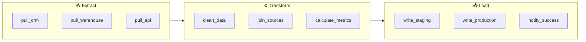

# 15 — Task Groups

## The Story

Your DAG has 20 tasks and the graph view looks like spaghetti.

Extract from 5 sources, validate each one, transform each one, merge, load, notify — all as individual tasks spread across the canvas with arrows flying everywhere. You spend five minutes just figuring out which task belongs to which stage.

**Task Groups are Airflow's way to organize related tasks into collapsible visual groups — like folders for your tasks.**

Click to expand, click to collapse. The graph stays readable. Your teammates can understand the pipeline structure at a glance. And unlike the old approach, Task Groups are just Python — no extra DAG files, no separate workers, no scheduler overhead.

One important note before we dive in: if you've seen Airflow tutorials from before Airflow 2, you may have seen **SubDAGs**. They were the original grouping mechanism and they caused a long list of production problems. They have been **completely removed in Airflow 3**. `TaskGroup` is the replacement — simpler, safer, and better in every measurable way.

---

## What is a TaskGroup?

A `TaskGroup` is a visual and logical container for a set of tasks within a single DAG. Tasks inside a group are displayed together in the UI and can be collapsed into a single node.

Under the hood, Task Groups are a UI and organizational concept — the tasks still run as normal tasks on your workers. There is no extra process, no extra DAG file, and no deadlock risk.

```python
from airflow.utils.task_group import TaskGroup

with TaskGroup("extract") as extract_group:
    task_a = PythonOperator(task_id="pull_api", ...)
    task_b = PythonOperator(task_id="read_s3", ...)

# All task IDs become: "extract.pull_api", "extract.read_s3"
```

---

## TaskGroup Syntax

```python
from airflow import DAG
from airflow.utils.task_group import TaskGroup
from airflow.operators.python import PythonOperator
from datetime import datetime

with DAG("my_dag", start_date=datetime(2024, 1, 1), schedule="@daily") as dag:

    with TaskGroup("stage_one") as stage_one:
        t1 = PythonOperator(task_id="step_a", python_callable=step_a)
        t2 = PythonOperator(task_id="step_b", python_callable=step_b)

    with TaskGroup("stage_two") as stage_two:
        t3 = PythonOperator(task_id="step_c", python_callable=step_c)

    stage_one >> stage_two
```

Key points:
- Use `with TaskGroup("name") as group_var:` — the context manager registers all tasks defined inside
- Task IDs inside the group are **prefixed**: `stage_one.step_a`, `stage_one.step_b`
- You set dependencies **between groups** using the group variable, just like tasks

---

## prefix_group_id Parameter

By default, Airflow prefixes every task ID with the group name. You can disable this with `prefix_group_id=False`, but this is rarely a good idea — you lose the namespacing that prevents task ID collisions when the same task names appear in multiple groups.

```python
# Default — task ID becomes "my_group.my_task"
with TaskGroup("my_group") as g:
    t = PythonOperator(task_id="my_task", ...)

# prefix_group_id=False — task ID stays "my_task" (no prefix)
with TaskGroup("my_group", prefix_group_id=False) as g:
    t = PythonOperator(task_id="my_task", ...)
```

Recommendation: always keep the default `prefix_group_id=True` unless you have a very specific reason.

---

## Nested Task Groups

Groups can be nested to any depth. This is useful for representing hierarchical pipeline structures (e.g., a "processing" group containing "validate" and "transform" sub-groups).

```python
with TaskGroup("processing") as processing:
    with TaskGroup("validate") as validate:
        check_schema = PythonOperator(task_id="check_schema", ...)
        check_nulls  = PythonOperator(task_id="check_nulls",  ...)

    with TaskGroup("transform") as transform:
        normalize = PythonOperator(task_id="normalize", ...)
        enrich    = PythonOperator(task_id="enrich",    ...)

    validate >> transform

# Task IDs:
# processing.validate.check_schema
# processing.validate.check_nulls
# processing.transform.normalize
# processing.transform.enrich
```

In the Airflow UI, "processing" is a top-level collapsible group. Expanding it reveals "validate" and "transform" as nested collapsible sub-groups.

---

## Labels in the UI

When you name your `TaskGroup`, that name becomes the **label shown in the graph view**. Choosing clear, descriptive names makes the DAG self-documenting:

```python
with TaskGroup("01_extract_raw_data")  as extract:   ...
with TaskGroup("02_validate_quality")  as validate:  ...
with TaskGroup("03_transform_and_load") as load:     ...
```

Numbers at the front ensure the groups appear in logical order (alphabetically) when listed in the UI.

---

## Why SubDAGs Were Removed

SubDAGs were Airflow's original grouping mechanism. They worked by treating a group of tasks as a separate mini-DAG, executed by a special `SubDagOperator`. They caused serious problems:

| Problem | Detail |
|---|---|
| Deadlocks | SubDAGs ran in their own pool slot. If the pool was full, SubDAGs would deadlock waiting for slots they couldn't get. |
| Scheduler confusion | The SubDAG had its own DAG run, separate state, and separate history — confusing and hard to reason about. |
| Performance | Each SubDag was a fully loaded DAG object — extra overhead for the scheduler and metadata database. |
| Complexity | SubDAGs required a separate Python function that returned a DAG object. Nested state management was fragile. |
| Visibility | You couldn't see inside a SubDAG from the parent DAG's graph — you had to navigate away to a separate DAG page. |

**Airflow 3 removes SubDAGs entirely.** If you have legacy code using `SubDagOperator`, it will break. Migrate to `TaskGroup` — the code is simpler and the result is better.

**Migration is straightforward:**
```python
# Old SubDAG pattern (Airflow 1/2, no longer works in Airflow 3)
# from airflow.operators.subdag import SubDagOperator
# subdag_task = SubDagOperator(task_id="my_group", subdag=create_subdag())

# New TaskGroup pattern (Airflow 3)
with TaskGroup("my_group") as my_group:
    task_a = PythonOperator(task_id="step_a", ...)
    task_b = PythonOperator(task_id="step_b", ...)
```

---

## Practical Pattern: Group by ETL Stage

The most common pattern is organizing an ETL pipeline into three groups:



This pattern gives you:
- A readable pipeline at the group level (Extract → Transform → Load)
- Drilldown visibility when you need to debug an individual task
- The ability to re-run an entire group on failure with a single click in the UI

---

## Key Takeaways

- `TaskGroup` organizes tasks into collapsible visual groups in the Airflow UI.
- Use `with TaskGroup("name") as group:` — all tasks defined inside are in the group.
- Task IDs are prefixed with the group name by default (`group.task_id`).
- Groups can be nested to represent hierarchical structures.
- Dependencies between groups work exactly like dependencies between tasks.
- SubDAGs are **completely removed** in Airflow 3 — TaskGroup is the replacement.
- TaskGroup has zero runtime overhead — it is a UI and organizational concept only.

---

## Navigation

**Prev:** [14 — Branching and Control Flow](../14_Branching_and_Control_Flow/Theory.md) | **Home:** [Learning Path](../../00_Learning_Guide/Learning_Path.md) | **Next:** [16 — Dynamic Task Mapping](../16_Dynamic_Task_Mapping/Theory.md)
