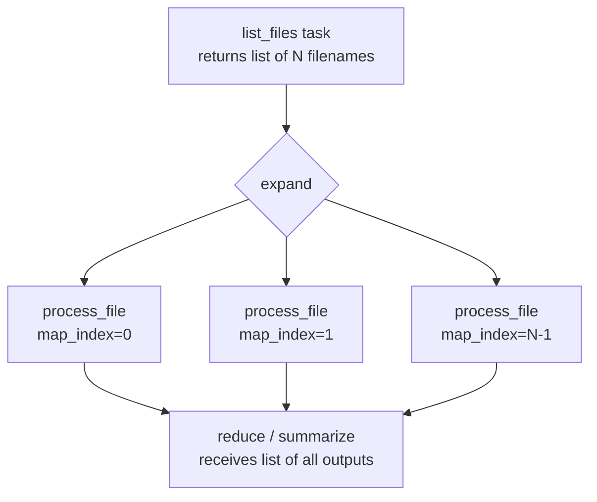

# 16 — Dynamic Task Mapping

## The Story

You need to process 50 customer files, but you don't know at DAG write time how many there will be.

Monday it's 50 files. Tuesday it's 3 files. Next month a new customer joins and it's 51 files. If you hard-code 50 tasks, you have a problem. If you write a loop that generates tasks at parse time, you still have a problem — the loop runs when Airflow loads the DAG file, not when the DAG runs, so it always generates the same number of tasks.

**Dynamic Task Mapping lets you create tasks at runtime based on actual data.** One task per file. One task per customer. One task per partition. Whatever you need — Airflow figures out the count when the DAG actually executes, not when it's parsed.

This is Airflow 3's answer to "I need a variable number of parallel tasks."

---

## expand() — Expand a Single Parameter

`expand()` is the core mechanism. You call it on an operator's parameter to tell Airflow: "don't pass this as a single value — pass each item in this list as a separate task instance."

```python
from airflow.decorators import task

@task
def process_file(filename: str):
    print(f"Processing {filename}")

# This creates ONE task per filename — at runtime
process_file.expand(filename=["file_a.csv", "file_b.csv", "file_c.csv"])
```

Airflow sees the list has 3 items and spawns 3 task instances. Each gets a different `filename` value.

The parameter passed to `expand()` can also be an **XCom result** from a previous task — making the mapping truly dynamic:

```python
@task
def list_files() -> list[str]:
    # This could query S3, read a database, call an API...
    return ["file_a.csv", "file_b.csv", "file_c.csv"]

@task
def process_file(filename: str):
    print(f"Processing {filename}")

files = list_files()
process_file.expand(filename=files)
```

At runtime, `list_files()` runs first and returns a list. Then Airflow creates one `process_file` task for each item in that list.

---

## partial() — Fix Some Params, Expand Others

What if your task takes multiple parameters but you only want to vary one of them? Use `partial()` to "pin" the fixed parameters, then chain `.expand()` for the varying one.

```python
@task
def process_file(filename: str, output_bucket: str, compress: bool):
    print(f"Processing {filename} → s3://{output_bucket}")

# output_bucket and compress are fixed; filename varies
process_file.partial(
    output_bucket="my-processed-bucket",
    compress=True,
).expand(filename=["a.csv", "b.csv", "c.csv"])
```

Think of `partial()` as setting the constants, and `expand()` as setting the variable.

---

## map_index — Accessing the Task Instance's Index

When Airflow creates mapped task instances, each one has a `map_index` — a zero-based integer indicating which item from the expanded list it corresponds to. You can access this in templates:

```python
@task
def process_item(item: str, **context):
    idx = context["task_instance"].map_index
    print(f"Processing item #{idx}: {item}")
```

Or in Jinja templates inside traditional operators:

```python
BashOperator(
    task_id="process",
    bash_command="echo 'Map index: {{ task_instance.map_index }}'",
)
```

The `map_index` is also visible in the Airflow UI — each mapped instance appears as `task_id[0]`, `task_id[1]`, `task_id[2]`, etc.

---

## Cross-Product Mapping (expand Multiple Params)

If you call `expand()` with multiple parameters, Airflow creates a task for every combination — the Cartesian product:

```python
@task
def train_model(algorithm: str, learning_rate: float):
    print(f"Training {algorithm} with lr={learning_rate}")

# 3 algorithms × 3 rates = 9 task instances
train_model.expand(
    algorithm=["random_forest", "xgboost", "neural_net"],
    learning_rate=[0.001, 0.01, 0.1],
)
```

This is powerful for hyperparameter sweeps, multi-region processing, or any case where you need every combination of two or more lists.

---

## expand_kwargs() — Dict-Based Expansion

When your arguments are naturally structured as a list of dictionaries (e.g., from a database query), use `expand_kwargs()` instead of `expand()`.

```python
@task
def load_table(table_name: str, schema: str, truncate: bool):
    print(f"Loading {schema}.{table_name}")

# One task per dict — each dict maps param names to values
load_table.expand_kwargs([
    {"table_name": "orders",    "schema": "raw", "truncate": True},
    {"table_name": "customers", "schema": "raw", "truncate": False},
    {"table_name": "products",  "schema": "raw", "truncate": True},
])
```

`expand_kwargs()` accepts either a static list of dicts, or an XCom result that returns a list of dicts.

---

## Chaining Mapped Tasks

Mapped tasks can be chained. A downstream mapped task receives the output of the upstream mapped task **by index** — mapped instance 0 sends to mapped instance 0, instance 1 to instance 1, and so on.

```python
@task
def extract(source: str) -> dict:
    return {"source": source, "rows": 100}

@task
def transform(raw: dict) -> dict:
    raw["transformed"] = True
    return raw

@task
def load(processed: dict):
    print(f"Loading {processed}")

sources = ["crm", "erp", "api"]
raw_data        = extract.expand(source=sources)
processed_data  = transform.expand(raw=raw_data)
load.expand(processed=processed_data)
```

Each `extract` instance feeds directly into the corresponding `transform` instance. There is no cross-join — it's a 1:1 pairing by map index.

---

## XCom with Mapped Tasks

When mapped tasks push XCom values, the parent task sees them as a **list** — one value per mapped instance:

```python
@task
def process(item: str) -> int:
    return len(item)

@task
def summarize(lengths: list[int]):
    print(f"Total characters: {sum(lengths)}")

items = ["apple", "banana", "cherry"]
lengths = process.expand(item=items)
summarize(lengths)  # receives [5, 6, 6] as a list
```

This is the standard "map then reduce" pattern. The downstream `summarize` task receives all mapped outputs collected into a list.

---

## .filter() for Conditional Mapping

You can filter which mapped instances are created using `.filter()` on the result of a mapped task. Instances where the filter condition evaluates to False are skipped.

Note: `.filter()` is available via the `XComArg` API when using task decorators.

```python
@task
def get_files() -> list[str]:
    return ["report_jan.csv", "report_feb.csv", "empty.csv", "report_mar.csv"]

@task
def should_process(filename: str) -> str | None:
    if filename == "empty.csv":
        return None  # None signals: skip this instance
    return filename

@task
def process(filename: str):
    print(f"Processing {filename}")

files = get_files()
filtered = should_process.expand(filename=files)
# process only runs for non-None results
```

---

## Mermaid Diagram: Dynamic Mapping Flow



---

## Limitations and Best Practices

| Limitation | Detail |
|---|---|
| Max active mapped tasks | Controlled by `max_active_tis_per_dag` and `max_map_length` config |
| Map input must be a list | `expand()` expects a list or XCom-returned list — not a generator |
| No dynamic task IDs | All mapped instances share the same `task_id`, differentiated only by `map_index` |
| Cross-product can explode | 10 × 10 = 100 tasks; make sure the combination count is bounded |
| No per-instance retries config | All mapped instances share the same `retries`, `retry_delay`, etc. |

**Best practices:**
- Use `partial()` for any parameter that doesn't need to vary — it's more explicit and readable.
- Keep the list-producing task simple and fast — it's the bottleneck before mapping starts.
- Set `max_active_tis_per_dag` or use Pools to prevent mapped tasks from overwhelming your workers.
- Test with a small list first — dynamic mapping can create many tasks quickly.

---

## Key Takeaways

- `expand()` creates one task instance per item in a list — evaluated at runtime.
- `partial()` pins fixed parameters; combine with `expand()` for the varying ones.
- `expand_kwargs()` accepts a list of dicts when your inputs are naturally dict-shaped.
- Chained mapped tasks pair 1:1 by `map_index`.
- Downstream "reduce" tasks receive all mapped outputs as a Python list.
- `map_index` is accessible via `context["task_instance"].map_index`.
- Cross-product mapping creates the full Cartesian product of all expanded parameters.

---

## Navigation

**Prev:** [15 — Task Groups](../15_Task_Groups/Theory.md) | **Home:** [Learning Path](../../00_Learning_Guide/Learning_Path.md) | **Next:** [17 — Deferrable Operators](../17_Deferrable_Operators/Theory.md)
