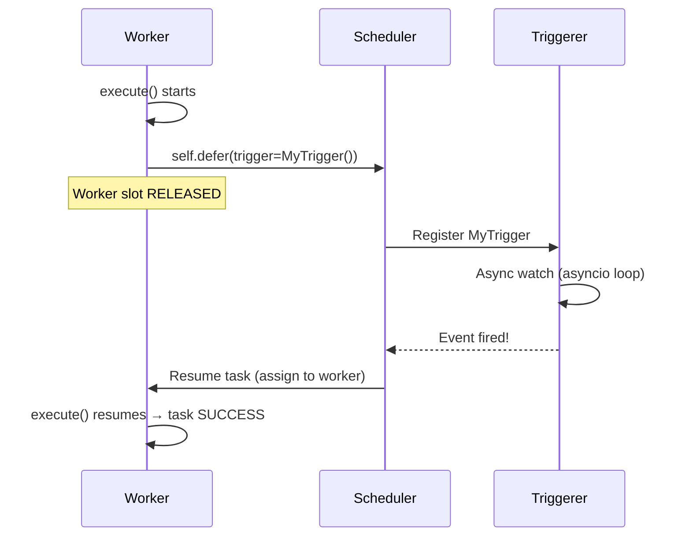

# 17 — Deferrable Operators

## The Story

Old Airflow had a polling problem.

You write a sensor that waits for a file to appear on S3. The file might arrive in 10 minutes or 3 hours — you don't know. So the sensor task sits on a worker, polling every 30 seconds, doing nothing useful in between. One sensor = one worker slot occupied. Ten sensors = ten workers blocked. One hundred sensors waiting overnight = a hundred workers doing nothing but sleeping in a loop, burning through your cluster capacity.

**Deferrable operators solve this.** When a task is waiting for an external event, it releases its worker slot entirely and hands responsibility to a lightweight component called the **Triggerer**. The Triggerer runs a single asyncio event loop that can monitor thousands of events simultaneously — file arrivals, HTTP polling, database queries, time delays — all without blocking any workers.

Workers are expensive. The Triggerer is cheap. Deferrable operators move the "just waiting" work out of workers and into the Triggerer, freeing your workers to run real tasks.

---

## How Deferral Works: Step by Step

1. **Task starts on a worker.** The operator's `execute()` method runs normally.
2. **Task calls `self.defer()`.** Instead of polling in a loop, the task says "I need to wait for event X — here's a Trigger that knows how to watch for it."
3. **Worker slot is released.** The task moves to `DEFERRED` state. The worker is free to pick up another task.
4. **Triggerer takes over.** The Trigger object runs inside the Triggerer's asyncio event loop. It watches for the condition asynchronously — no worker needed.
5. **Event fires.** The condition is met (file appeared, time elapsed, API returned 200, etc.).
6. **Triggerer notifies the scheduler.** The scheduler queues the task to resume.
7. **Task resumes on a worker.** The operator's `execute()` method is called again — but this time `self.defer()` is not called, and the task completes normally.



---

## The Triggerer Component

The Triggerer is a separate Airflow process (like the Scheduler and Webserver). It runs a single Python asyncio event loop that executes all active Trigger objects concurrently.

Key characteristics:
- One Triggerer process can handle **thousands of triggers simultaneously** — they are all async coroutines sharing one thread, not blocking each other.
- If the Triggerer process dies, deferred tasks move back to a queued state and are re-assigned once the Triggerer restarts.
- You can run multiple Triggerer instances for high availability.
- The Triggerer is stateless with respect to the database — all state is in the metadata DB.

Starting the Triggerer:
```bash
airflow triggerer
```

In docker-compose or Kubernetes deployments, the Triggerer is a dedicated service alongside the scheduler and webserver.

---

## BaseTrigger: The Interface

A Trigger is a Python class that extends `BaseTrigger`. It implements two methods:

```python
from airflow.triggers.base import BaseTrigger, TriggerEvent

class MyTrigger(BaseTrigger):

    def __init__(self, some_param: str):
        super().__init__()
        self.some_param = some_param

    def serialize(self) -> tuple[str, dict]:
        """
        Returns a (class_path, kwargs) tuple so the trigger can be
        re-instantiated by the Triggerer process after a restart.
        """
        return (
            "my_package.triggers.MyTrigger",
            {"some_param": self.some_param},
        )

    async def run(self):
        """
        The async coroutine that the Triggerer runs.
        When the condition is met, yield a TriggerEvent.
        """
        while True:
            if await self._check_condition():
                yield TriggerEvent({"result": "done"})
                return
            await asyncio.sleep(10)   # non-blocking sleep
```

The `run()` method is an **async generator** — it yields `TriggerEvent` objects when its condition is met.

---

## self.defer(): The Handoff

Inside an operator's `execute()` method, you call `self.defer()` to hand off to a trigger:

```python
from airflow.models import BaseOperator
from airflow.triggers.base import BaseTrigger, TriggerEvent

class MyDeferrableOperator(BaseOperator):

    def execute(self, context):
        # Do any setup work...
        # Then defer — releases the worker slot
        self.defer(
            trigger=MyTrigger(some_param=self.some_param),
            method_name="execute_complete",   # called when trigger fires
        )

    def execute_complete(self, context, event: dict):
        # This method is called when the trigger yields a TriggerEvent
        # event contains whatever data the trigger passed
        result = event.get("result")
        self.log.info(f"Task resumed with result: {result}")
        return result
```

`method_name` tells Airflow which method to call on the operator when the trigger fires.

---

## Deferrable Versions of Standard Operators

Airflow 3 ships with deferrable versions of the most common sensors and operators. They share the same interface as their non-deferrable counterparts but use `defer()` internally:

| Non-deferrable | Deferrable | Package |
|---|---|---|
| `TimeDeltaSensor` | `TimeDeltaSensorAsync` | `airflow.sensors.time_delta` |
| `DateTimeSensor` | `DateTimeSensorAsync` | `airflow.sensors.date_time` |
| `ExternalTaskSensor` | `ExternalTaskSensorAsync` | `airflow.sensors.external_task` |
| `HttpSensor` | `HttpSensorAsync` | `airflow.providers.http.sensors.http` |
| `S3KeySensor` | `S3KeySensorAsync` | `airflow.providers.amazon.aws.sensors.s3` |
| `GCSObjectExistenceSensor` | `GCSObjectExistenceSensorAsync` | `airflow.providers.google.cloud.sensors.gcs` |
| `DataprocJobSensor` | `DataprocJobAsyncSensor` | `airflow.providers.google.cloud.sensors.dataproc` |

To use them, just swap the class name — the parameters are the same.

---

## Key Takeaways

- Deferrable operators release their worker slot while waiting for an external event.
- The Triggerer process handles all deferred tasks via an async event loop — one process, thousands of events.
- `self.defer(trigger=..., method_name=...)` is the handoff point.
- A `BaseTrigger` subclass implements `run()` (async generator) and `serialize()`.
- Use deferrable operators any time a task spends significant time waiting — sensors, long-running jobs, time delays.
- The Triggerer is a required process when using deferrable operators — it must be running alongside the scheduler.

---

## Navigation

**Prev:** [16 — Dynamic Task Mapping](../16_Dynamic_Task_Mapping/Theory.md) | **Home:** [Learning Path](../../00_Learning_Guide/Learning_Path.md) | **Next:** [18 — Callbacks and SLAs](../18_Callbacks_and_SLAs/Theory.md)
