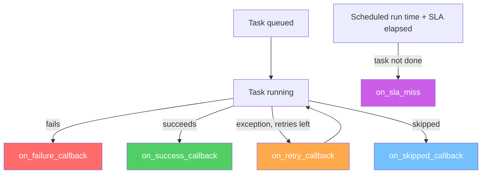

# 18 — Callbacks and SLAs

## The Story

Something went wrong at 3am. Your pipeline failed and nobody knew until morning.

The overnight ETL that feeds the dashboard failed at 2:47am. By 8am, the business team is already in a meeting presenting stale data and nobody has any idea why the numbers look wrong. The engineer who owns the pipeline gets a message at 8:15am: "the data looks off." By the time they find the failure, fix it, and rerun — it's 9:30am.

This is a preventable situation. **Callbacks are your automatic notification system.** Airflow calls your function the moment a task fails, succeeds, or retries. You decide what to do — send a Slack message, fire a PagerDuty alert, write to a logging service. The notification happens in real time, not when someone checks the UI in the morning.

**SLAs are your time guarantees.** You tell Airflow: "this task must finish by X time relative to the DAG run's scheduled time." If it doesn't, Airflow calls your SLA miss handler. You find out your pipeline is running slow before your users do.

---

## Callback Types

### on_failure_callback

Called when a task fails (enters the `FAILED` state). This is the most important callback for production pipelines.

```python
def on_failure(context):
    print(f"Task {context['task_instance'].task_id} FAILED!")

task = PythonOperator(
    task_id="my_task",
    python_callable=my_callable,
    on_failure_callback=on_failure,
)
```

### on_success_callback

Called when a task succeeds. Useful for audit trails, progress updates, or triggering downstream systems.

```python
def on_success(context):
    print(f"Task {context['task_instance'].task_id} succeeded.")

task = PythonOperator(
    task_id="my_task",
    python_callable=my_callable,
    on_success_callback=on_success,
)
```

### on_retry_callback

Called each time a task is retried (before the retry attempt runs). Useful for alerting teams that a task is flapping.

```python
def on_retry(context):
    ti       = context["task_instance"]
    attempt  = ti.try_number
    print(f"Task {ti.task_id} is being retried. Attempt #{attempt}")

task = PythonOperator(
    task_id="my_task",
    python_callable=my_callable,
    retries=3,
    on_retry_callback=on_retry,
)
```

### on_skipped_callback

Called when a task is skipped (e.g., by a ShortCircuitOperator or BranchPythonOperator). Available in Airflow 2.6+.

```python
def on_skipped(context):
    print(f"Task {context['task_instance'].task_id} was skipped.")
```

---

## DAG-Level vs Task-Level Callbacks

Callbacks can be set at two levels:

### Task-level
Set on individual operators — fires only for that specific task.

```python
task = PythonOperator(
    task_id="my_task",
    python_callable=my_callable,
    on_failure_callback=notify_slack,
)
```

### DAG-level
Set on the DAG object — fires for **every task** in the DAG that triggers the event. This is the most common pattern for pipeline-wide notifications.

```python
with DAG(
    dag_id="my_pipeline",
    on_failure_callback=notify_slack,    # fires if ANY task fails
    on_success_callback=notify_success,  # fires when the entire DAG run succeeds
    ...
) as dag:
    ...
```

When a callback is set at both the DAG level and the task level, **both fire** — task-level first, then DAG-level.

---

## The context Dict: What's Inside

Every callback receives a `context` dictionary. It contains everything you need to build a useful notification:

| Key | Type | Contents |
|---|---|---|
| `task_instance` / `ti` | `TaskInstance` | The failing task instance object |
| `task_instance.task_id` | `str` | Task ID |
| `task_instance.dag_id` | `str` | DAG ID |
| `task_instance.run_id` | `str` | The DAG run ID |
| `task_instance.try_number` | `int` | Current attempt number |
| `dag_run` | `DagRun` | The DAG run object |
| `dag_run.logical_date` | `datetime` | The logical date of the run |
| `logical_date` | `datetime` | Same as above (shorthand) |
| `exception` | `Exception` | The exception that caused failure (if applicable) |
| `dag` | `DAG` | The DAG object |
| `conf` | `dict` | The DAG run conf dict |
| `params` | `dict` | DAG params |

Accessing context in a callback:
```python
def my_callback(context):
    ti           = context["task_instance"]
    dag_id       = ti.dag_id
    task_id      = ti.task_id
    logical_date = context["logical_date"]
    exception    = context.get("exception")
```

---

## SLAs (Service Level Agreements)

An SLA is a maximum time budget for a task, measured from the DAG's scheduled execution time (logical date). If the task hasn't **finished** by `scheduled_time + sla`, it's an SLA miss.

```python
from datetime import timedelta

task = PythonOperator(
    task_id="transform_data",
    python_callable=transform,
    sla=timedelta(hours=2),   # must finish within 2 hours of scheduled time
)
```

**Important:** SLA is not a timeout. A timeout (`execution_timeout`) kills the task if it runs too long. An SLA miss just triggers a notification — the task keeps running.

### on_sla_miss Callback

The SLA miss handler is set at the **DAG level only** (not task level). It has a different signature from other callbacks:

```python
def sla_miss_handler(dag, task_list, blocking_task_list, slas, blocking_tis):
    """
    dag:               The DAG object
    task_list:         String list of task IDs that missed their SLA
    blocking_task_list: String list of tasks blocking the SLA tasks
    slas:              List of SlaMiss objects with details
    blocking_tis:      List of TaskInstance objects that are blocking
    """
    print(f"SLA MISS in DAG: {dag.dag_id}")
    print(f"Tasks that missed SLA: {task_list}")

with DAG(
    dag_id="my_pipeline",
    sla_miss_callback=sla_miss_handler,
    ...
) as dag:
    ...
```

---

## Callback Trigger Points — Mermaid Diagram



---

## Practical Patterns

### Slack Notification

```python
def slack_failure_alert(context):
    from airflow.providers.slack.hooks.slack_webhook import SlackWebhookHook

    ti           = context["task_instance"]
    logical_date = context["logical_date"]
    exception    = context.get("exception", "Unknown error")

    message = (
        f":red_circle: *Task Failed*\n"
        f"*DAG:*  `{ti.dag_id}`\n"
        f"*Task:* `{ti.task_id}`\n"
        f"*Run:*  `{ti.run_id}`\n"
        f"*Date:* `{logical_date}`\n"
        f"*Error:* ```{str(exception)[:500]}```"
    )

    hook = SlackWebhookHook(slack_webhook_conn_id="slack_webhook")
    hook.send(text=message)
```

### Email Alert

```python
def email_on_failure(context):
    from airflow.utils.email import send_email

    ti = context["task_instance"]
    send_email(
        to=["ops@example.com"],
        subject=f"[Airflow] FAILED: {ti.dag_id}.{ti.task_id}",
        html_content=f"""
            <h3>Task Failed</h3>
            <p><b>DAG:</b> {ti.dag_id}</p>
            <p><b>Task:</b> {ti.task_id}</p>
            <p><b>Run ID:</b> {ti.run_id}</p>
            <p><b>Exception:</b> {context.get('exception')}</p>
        """,
    )
```

---

## Key Takeaways

- `on_failure_callback`, `on_success_callback`, `on_retry_callback`, and `on_skipped_callback` accept any Python function.
- All callbacks receive a `context` dict containing the task instance, dag run, logical date, and exception.
- Callbacks can be set at the task level or DAG level; DAG-level fires for every task.
- SLA is a maximum elapsed time from scheduled start — a miss triggers `on_sla_miss` but does **not** kill the task.
- `on_sla_miss` has a different signature and is set on the DAG, not individual tasks.
- The most impactful pattern: set `on_failure_callback` at the DAG level with a Slack or PagerDuty notification.

---

## Navigation

**Prev:** [17 — Deferrable Operators](../17_Deferrable_Operators/Theory.md) | **Home:** [Learning Path](../../00_Learning_Guide/Learning_Path.md) | **Next:** [19 — Pools and Resources](../19_Pools_and_Resources/Theory.md)
