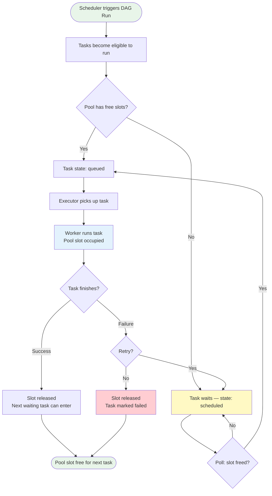

# 11 · Pools & Resources — Theory

---

## The Story

It is 2 AM. Your Airflow scheduler triggers a DAG that kicks off 20 parallel tasks, and every single one of them tries to open a connection to the same production PostgreSQL database. The database has a connection limit of 10. It immediately starts rejecting connections. Tasks fail. Retries pile up. More connection attempts fire. The database crashes. Your on-call phone rings.

This is a real scenario. And it is entirely preventable.

**Pools are Airflow's traffic control system.** You define a named pool with a fixed number of *slots* — say, `db_pool` with 5 slots. You then assign tasks to that pool. No matter how many tasks are scheduled, Airflow will only run 5 of them concurrently. The rest wait in queue, politely, without hammering your database.

Think of a pool like a bouncer at a club. The club (your database) has a maximum capacity of 5. The bouncer (Airflow Pools) counts heads. When 5 people are inside, everyone else waits outside in a line. When someone leaves, the next person in line gets in.

---

## What is a Pool?

A **Pool** is a named resource bucket with a fixed number of concurrent execution slots. Tasks assigned to a pool compete for those slots. When all slots are occupied, additional tasks wait in the `queued` state until a slot is freed.

Pools solve three categories of problems:

| Problem | Example | Pool Solution |
|---------|---------|---------------|
| Database connection limits | 20 tasks, DB allows 5 connections | `db_pool` with 5 slots |
| External API rate limits | API allows 10 req/sec | `api_pool` with 10 slots |
| Resource-heavy processing | ML training consumes all RAM | `ml_pool` with 2 slots |

### The Default Pool

Airflow ships with a built-in pool called **`default_pool`** with **128 slots**. Every task that does not explicitly specify a pool uses `default_pool`. This means by default, up to 128 tasks can run in parallel (subject to other concurrency settings).

---

## How Pools Work — The Full Flow



---

## Creating Pools

### Method 1: Airflow UI

1. Open the Airflow UI at `http://localhost:8080`
2. Navigate to **Admin > Pools**
3. Click the **+** button
4. Fill in:
   - **Pool name**: `db_pool` (no spaces, use underscores)
   - **Slots**: `5`
   - **Description**: `Limits concurrent DB connections to 5`
5. Click **Save**

You will immediately see the pool appear in the list with columns showing: Pool Name, Slots, Running Slots, Queued Slots, Scheduled Slots, Open Slots.

### Method 2: Airflow CLI

```bash
# Create a pool
airflow pools set db_pool 5 "Limits concurrent DB connections to 5"

# Syntax: airflow pools set <pool_name> <slots> <description>

# List all pools
airflow pools list

# Get details of a specific pool
airflow pools get db_pool

# Delete a pool
airflow pools delete db_pool

# Import pools from a JSON file (bulk creation)
airflow pools import pools.json

# Export pools to a JSON file
airflow pools export pools.json
```

**Example `pools.json` for bulk import:**

```json
{
  "db_pool": {
    "description": "Limits concurrent database connections",
    "slots": 5
  },
  "api_pool": {
    "description": "Rate limits external API calls",
    "slots": 10
  },
  "ml_pool": {
    "description": "Resource-heavy ML training tasks",
    "slots": 2
  }
}
```

### Method 3: REST API (Airflow 2.0+)

```bash
curl -X POST "http://localhost:8080/api/v1/pools" \
  -H "Content-Type: application/json" \
  -u "admin:admin" \
  -d '{"name": "db_pool", "slots": 5, "description": "DB connection limiter"}'
```

---

## Assigning Tasks to Pools

Use the `pool` parameter on any operator:

```python
from airflow import DAG
from airflow.operators.python import PythonOperator
from airflow.operators.bash import BashOperator
from datetime import datetime

def query_database(**context):
    # This task will be throttled by db_pool
    print("Running DB query...")

with DAG(
    dag_id="pool_example",
    start_date=datetime(2024, 1, 1),
    schedule_interval="@daily",
    catchup=False,
) as dag:

    # Task assigned to db_pool — competes for one of 5 slots
    extract_task = PythonOperator(
        task_id="extract_from_db",
        python_callable=query_database,
        pool="db_pool",              # Assigns this task to db_pool
        pool_slots=1,                # How many slots this task consumes (default: 1)
    )

    # Task assigned to api_pool
    api_task = BashOperator(
        task_id="call_external_api",
        bash_command="curl https://api.example.com/data",
        pool="api_pool",
        pool_slots=1,
    )

    # Task with no pool= parameter uses default_pool
    transform_task = PythonOperator(
        task_id="transform_data",
        python_callable=lambda: print("Transforming..."),
    )

    extract_task >> transform_task >> api_task
```

### pool_slots Parameter

The `pool_slots` parameter (default: `1`) lets a single task consume multiple slots. Use this for tasks that are exceptionally resource-intensive:

```python
# A heavy ML training task that should block 3 slots worth of capacity
train_model = PythonOperator(
    task_id="train_ml_model",
    python_callable=train_function,
    pool="ml_pool",
    pool_slots=3,   # Counts as 3 tasks against the pool limit
)
```

---

## priority_weight

When multiple tasks are waiting for a pool slot, **`priority_weight`** determines which task gets in next. Higher number = higher priority = runs first.

```python
# These three tasks all compete for db_pool slots.
# When a slot frees up, critical_query runs before bulk_export.

critical_query = PythonOperator(
    task_id="critical_query",
    python_callable=run_critical_query,
    pool="db_pool",
    priority_weight=10,    # High priority — jumps the queue
)

standard_query = PythonOperator(
    task_id="standard_query",
    python_callable=run_standard_query,
    pool="db_pool",
    priority_weight=5,     # Normal priority
)

bulk_export = PythonOperator(
    task_id="bulk_export",
    python_callable=run_bulk_export,
    pool="db_pool",
    priority_weight=1,     # Low priority — waits for everyone else
)
```

**Default `priority_weight` is `1`.** All tasks with the same priority_weight are ordered by their scheduled time (older first).

**Weight rules:**

| Scenario | Behavior |
|----------|----------|
| `priority_weight=10` vs `priority_weight=1` | The weight-10 task always goes first |
| Equal weights, different schedule times | Earlier-scheduled task goes first |
| Equal weights, same schedule time | Arbitrary ordering |

---

## The queue Parameter

The `queue` parameter is related but distinct from pools. While `pool` limits concurrency, `queue` directs tasks to specific **Celery workers** (or worker groups). They can be used together:

```python
# This task goes to the "gpu_workers" Celery queue
# AND is throttled by the ml_pool to max 2 concurrent tasks
train_task = PythonOperator(
    task_id="train_model",
    python_callable=train_function,
    pool="ml_pool",          # Concurrency limit
    queue="gpu_workers",     # Which worker processes this
)
```

| Parameter | Controls | Used With |
|-----------|---------|-----------|
| `pool` | How many tasks run concurrently | Any executor |
| `queue` | Which workers receive the task | CeleryExecutor only |

---

## Practical Use Cases

### 1. Database Rate Limiting

```python
# 15 ETL tasks all need to query the same database
# DB allows max 3 concurrent connections

for table in ["orders", "customers", "products", "inventory", ...]:
    PythonOperator(
        task_id=f"extract_{table}",
        python_callable=extract_table,
        op_kwargs={"table": table},
        pool="db_pool",          # Only 3 run at once
    )
```

### 2. External API Rate Limiting

```python
# REST API allows 5 requests per second
# You have 50 tasks making API calls

for endpoint in api_endpoints:
    PythonOperator(
        task_id=f"fetch_{endpoint}",
        python_callable=fetch_data,
        op_kwargs={"endpoint": endpoint},
        pool="api_pool",         # Throttle to API's capacity
    )
```

### 3. Resource-Heavy Tasks (ML Training)

```python
# ML training uses all 32GB RAM on the worker
# You cannot run more than 1 at a time

train_model = PythonOperator(
    task_id="train_model",
    python_callable=train_sklearn_model,
    pool="ml_training_pool",    # Pool with 1 slot
    priority_weight=10,
)
```

---

## Pools vs Other Concurrency Controls

Airflow has several mechanisms that affect parallelism. Understanding which one to use matters:

| Setting | Scope | Where Configured | Effect |
|---------|-------|-----------------|--------|
| `pool` (task param) | Per pool bucket | DAG code or UI | Limits tasks in that named pool |
| `max_active_tasks_per_dag` | Per DAG | DAG definition | Limits concurrent tasks within one DAG |
| `parallelism` (airflow.cfg) | Global | airflow.cfg | Total tasks across all DAGs |
| `max_active_runs_per_dag` | Per DAG | DAG definition | Limits concurrent DAG runs |

**Key difference — pool vs max_active_tasks_per_dag:**
- `pool` is resource-centric: multiple DAGs share the same pool, throttling a shared resource across all of them.
- `max_active_tasks_per_dag` is DAG-centric: it only limits tasks within one specific DAG.

Use `pool` when the constraint is the *resource* (a specific database, API, or machine). Use `max_active_tasks_per_dag` when the constraint is the *DAG* itself.

---

## Common Mistakes

**1. Forgetting to create the pool before deploying the DAG**
If a task references `pool="db_pool"` but `db_pool` does not exist in Airflow, the task will fail immediately with a `PoolNotFound` error.

**2. Setting pool slots too low**
A pool with 1 slot on a DAG that has 10 dependent tasks will serialize everything, making your pipeline much slower than intended.

**3. Setting pool slots too high**
Defeats the purpose. If your DB allows 5 connections and you set 50 slots, you still crash it.

**4. Not accounting for pool_slots > 1**
If a task uses `pool_slots=3` on a pool with 5 total slots, only 1 such task can run concurrently (it uses 3 of the 5 available slots).

---

## What You Learned

- A **Pool** is a named bucket of slots that limits how many tasks can run concurrently against a resource.
- Create pools via **UI, CLI, or REST API** before referencing them in DAGs.
- Assign tasks to pools with the `pool` parameter. Use `pool_slots` if one task consumes multiple slots worth of resources.
- `priority_weight` controls queue ordering when tasks compete for the same pool slots.
- The `queue` parameter routes tasks to specific Celery workers — different from (but combinable with) pools.
- Use pools when the constraint is a **shared external resource** (DB, API, machine).

---

## 📂 Navigation

⬅️ **Prev:** [10 · Branching & Control Flow — Theory](../10_Branching_Control_Flow/Theory.md) | 🏠 **[Home](../00_Learning_Guide/Learning_Path.md)** | ➡️ **Next:** [12 · Airflow on Cloud — Theory](../12_Airflow_on_Cloud/Theory.md)
