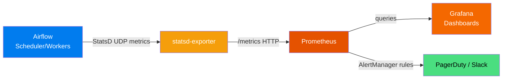

# 20 — Monitoring and Alerting

## The Story

Your Airflow cluster is running 500 tasks a day. How do you know it's healthy? How do you catch slowdowns before users notice?

Last Tuesday the scheduler started falling behind. Tasks were queuing up but nothing was failing — they were just delayed by 20 minutes. Users started noticing stale dashboards. Nobody on the engineering team saw anything because all the tasks eventually succeeded. There were no failures, no callbacks, no alerts. Just slow.

Monitoring is your production safety net. Not just "did it fail?" but "is it healthy? Is it getting slower? Is the scheduler heartbeat normal? Are workers backed up?"

**Airflow emits metrics you can collect, visualize, and alert on.** Combined with the built-in health endpoint, callback-based alerts, and integration with tools like Prometheus and Grafana, you can build a monitoring stack that catches problems before users do.

---

## How Airflow Emits Metrics

Airflow uses the **StatsD protocol** to emit metrics. Every time something happens — a task finishes, a DAG is parsed, a scheduler heartbeat fires — Airflow sends a metric to a StatsD endpoint.

You configure the StatsD target in `airflow.cfg` or environment variables:

```ini
[metrics]
statsd_on      = True
statsd_host    = statsd-exporter    # hostname of your StatsD receiver
statsd_port    = 8125
statsd_prefix  = airflow            # prepended to all metric names
```

---

## Key Metrics Airflow Emits

### Scheduler Metrics

| Metric | What it means |
|---|---|
| `airflow.scheduler_heartbeat` | Fires each scheduler heartbeat cycle — use to detect scheduler death |
| `airflow.scheduler.tasks.starving` | Tasks waiting for resources (executor full) |
| `airflow.scheduler.tasks.executable` | Tasks ready to be scheduled right now |
| `airflow.scheduler.critical_section_duration` | Time spent in the scheduler's critical section — high values = bottleneck |

### Task Metrics

| Metric | What it means |
|---|---|
| `airflow.ti.start.<dag_id>.<task_id>` | Task instance started |
| `airflow.ti.finish.<dag_id>.<task_id>.<state>` | Task instance finished with state |
| `airflow.task_duration` | Time a task took to execute |
| `airflow.task_removed_from_dag` | Task was removed from the DAG (can indicate config drift) |

### DAG Processing Metrics

| Metric | What it means |
|---|---|
| `airflow.dag_processing.total_parse_time` | Time to parse all DAG files |
| `airflow.dag_processing.processes` | Number of DAG file processor processes |
| `airflow.dag.loading_duration.<dag_id>` | How long a specific DAG takes to parse |

### Operator Metrics

| Metric | What it means |
|---|---|
| `airflow.operator_successes_<OperatorName>` | Count of successful operator runs |
| `airflow.operator_failures_<OperatorName>` | Count of failed operator runs |

---

## The Monitoring Stack



1. **Airflow** emits StatsD metrics over UDP.
2. **statsd-exporter** (Prometheus-ecosystem tool) receives StatsD metrics and exposes them as a Prometheus-compatible `/metrics` endpoint.
3. **Prometheus** scrapes the `/metrics` endpoint on a regular interval and stores time-series data.
4. **Grafana** queries Prometheus and visualizes the data in dashboards.
5. **AlertManager** (part of Prometheus) fires alerts to Slack, PagerDuty, or email when metric thresholds are breached.

---

## Built-in Health Check Endpoint

Airflow exposes a `/health` endpoint on the webserver that returns JSON with the status of core components:

```
GET http://your-airflow:8080/health
```

Response:
```json
{
  "metadatabase": {
    "status": "healthy"
  },
  "scheduler": {
    "status": "healthy",
    "latest_scheduler_heartbeat": "2024-01-15T10:30:00+00:00"
  },
  "triggerer": {
    "status": "healthy",
    "latest_triggerer_heartbeat": "2024-01-15T10:30:01+00:00"
  }
}
```

- `status: "healthy"` — component is running normally
- `status: "unhealthy"` — component is not responding (scheduler may be dead, DB may be unreachable)

Use this endpoint in:
- Load balancer health checks
- Kubernetes liveness probes
- External uptime monitors (PingDOM, StatusPage, etc.)
- Automated recovery scripts

---

## Prometheus Scrape Configuration

Add Airflow's metrics exporter to your `prometheus.yml`:

```yaml
scrape_configs:
  - job_name: "airflow"
    static_configs:
      - targets:
          - "statsd-exporter:9102"   # statsd-exporter's Prometheus port
    scrape_interval: 15s
    metrics_path: /metrics
```

Docker Compose addition for statsd-exporter:

```yaml
statsd-exporter:
  image: prom/statsd-exporter:latest
  ports:
    - "9102:9102"    # Prometheus scrape port
    - "9125:8125/udp"  # StatsD receive port (map to 8125 inside container)
  volumes:
    - ./statsd_mapping.yml:/tmp/statsd_mapping.yml
  command: --statsd.mapping-config=/tmp/statsd_mapping.yml
```

---

## Key Grafana Panels to Build

| Panel | Query (PromQL) | Alert threshold |
|---|---|---|
| Scheduler heartbeat | `rate(airflow_scheduler_heartbeat_total[5m])` | Alert if = 0 for 2 min |
| Task success rate | `rate(airflow_ti_finish_total{state="success"}[1h])` | Visual only |
| Task failure rate | `rate(airflow_ti_finish_total{state="failed"}[1h])` | Alert if > 5/hour |
| Avg task duration | `avg(airflow_task_duration_seconds)` | Alert on significant increase |
| DAG parse time | `airflow_dag_processing_total_parse_time_seconds` | Alert if > 30s |
| Queued tasks | `airflow_scheduler_tasks_executable` | Alert if > 50 for 5 min |

---

## DAG-Level Monitoring: Callbacks as Alerts

Callbacks (covered in Topic 18) are part of your monitoring strategy. Prometheus/Grafana tells you about cluster health; callbacks tell you about individual DAG failures:

```python
# In your DAG:
with DAG(
    dag_id="critical_pipeline",
    on_failure_callback=pagerduty_alert,   # pages on-call for any task failure
    ...
) as dag:
    ...
```

**Combine both approaches:**
- Callbacks for task-level failures (fast, contextual, actionable)
- Prometheus/Grafana for cluster-level trends (capacity, throughput, scheduler health)

---

## New Relic / Datadog Integration

Both New Relic and Datadog have StatsD-compatible agents. You can point Airflow's StatsD output directly at the Datadog agent or New Relic infrastructure agent:

```ini
[metrics]
statsd_on   = True
statsd_host = datadog-agent   # or newrelic-infrastructure-agent
statsd_port = 8125
```

The agents forward the metrics to their respective SaaS platforms automatically, where you can build dashboards and alerts using the native UI.

---

## Key Takeaways

- Airflow emits metrics via StatsD — configure `statsd_on=True` in `airflow.cfg`.
- The typical stack is: Airflow → statsd-exporter → Prometheus → Grafana.
- Key metrics to monitor: `scheduler_heartbeat`, `task_duration`, `dag_processing.total_parse_time`, task failure rates.
- The `/health` endpoint is your fastest check for "is Airflow running?" — use it in liveness probes.
- Callbacks handle task-level alerting; Prometheus handles cluster-level monitoring.
- Datadog and New Relic work natively with StatsD — point Airflow's metrics directly at their agents.

---

## Navigation

**Prev:** [19 — Pools and Resources](../19_Pools_and_Resources/Theory.md) | **Home:** [Learning Path](../../00_Learning_Guide/Learning_Path.md) | **Next:** [21 — Testing DAGs](../21_Testing_DAGs/Theory.md)
