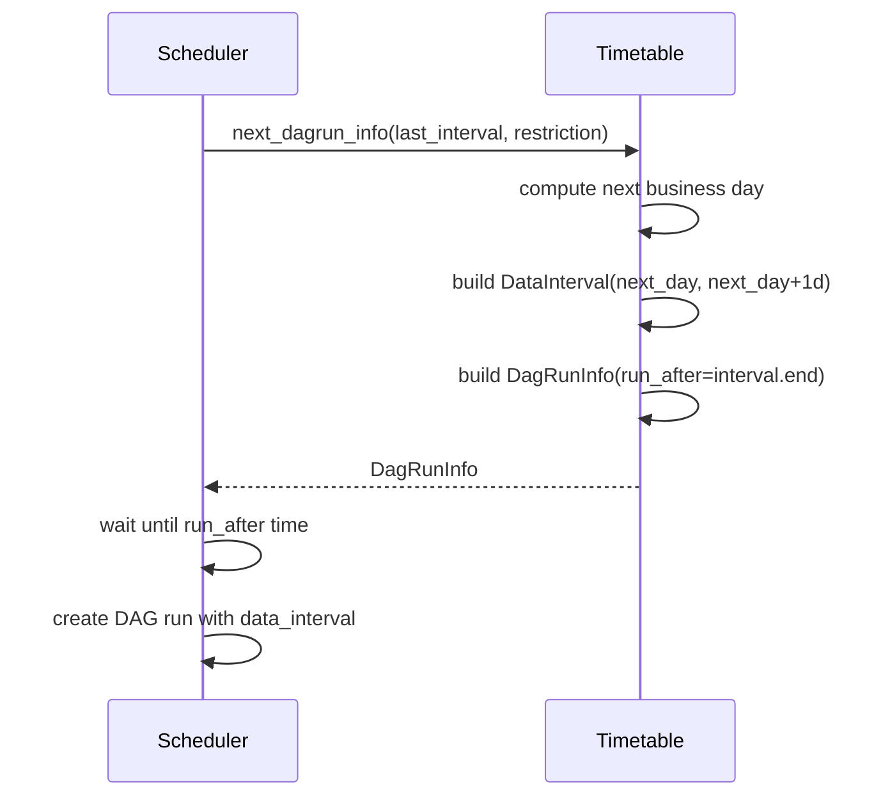

# 22 — Custom Timetables

## The Story

Cron expressions are powerful but limited.

`0 9 * * 1-5` will run every weekday at 9am — but it doesn't know that January 1st is a public holiday. Your finance team needs a report every business day (Monday through Friday, excluding holidays). Or your analytics team needs a run on the last Friday of each month. Or your fiscal calendar doesn't match the Gregorian calendar — Q1 ends in February.

Standard cron can't express any of that.

**Custom Timetables let you define any schedule logic in Python.** You write a class that tells Airflow: "here's the next run time, and here's the data interval it covers." No cron string needed. Any schedule you can express in Python, Airflow can schedule.

---

## What is a Timetable?

A Timetable is a Python class that Airflow uses to determine:
1. When to create the next DAG run
2. What `data_interval_start` and `data_interval_end` to assign to that run

Every schedule in Airflow — including cron strings — is implemented as a timetable internally. `@daily` is a `CronDataIntervalTimetable`. `timedelta(hours=1)` is a `DeltaDataIntervalTimetable`. When you write a custom timetable, you're just implementing the same interface.

---

## The DataInterval Concept

Every DAG run has a **data interval** — a half-open time window `[start, end)` that represents the period of data the run is processing.

```python
from airflow.timetables.base import DataInterval
from pendulum import datetime as pdatetime

interval = DataInterval(
    start=pdatetime(2024, 1, 1, tz="UTC"),
    end=pdatetime(2024, 1, 2, tz="UTC"),
)
```

- `data_interval_start` — the beginning of the data window (inclusive)
- `data_interval_end` — the end of the data window (exclusive)
- The DAG's `logical_date` equals `data_interval_start` by convention

For a daily DAG, each run's interval covers exactly one day. For a weekly DAG, one week. For your custom business-day timetable, you define exactly what the interval covers.

---

## Timetable ABC: Methods to Implement

```python
from airflow.timetables.base import Timetable, DagRunInfo, DataInterval, TimeRestriction
import pendulum


class MyCustomTimetable(Timetable):

    def next_dagrun_info(
        self,
        *,
        last_automated_data_interval: DataInterval | None,
        restriction: TimeRestriction,
    ) -> DagRunInfo | None:
        """
        Called by the scheduler to determine the NEXT run.
        Returns DagRunInfo (when to run + what data interval it covers),
        or None if there should be no next run.
        """
        ...

    def infer_manual_data_interval(self, *, run_after: pendulum.DateTime) -> DataInterval:
        """
        Called when a DAG is triggered manually (not by schedule).
        Returns the DataInterval for the manual run.
        """
        ...
```

### DagRunInfo

`DagRunInfo` packages together the run time and the data interval:

```python
from airflow.timetables.base import DagRunInfo, DataInterval

info = DagRunInfo.interval(
    start=pendulum.datetime(2024, 1, 1, tz="UTC"),
    end=pendulum.datetime(2024, 1, 2, tz="UTC"),
)
# info.run_after = info.data_interval.end
# The scheduler creates the run when clock passes run_after
```

---

## Built-in Timetable Classes

| Class | Use case |
|---|---|
| `CronDataIntervalTimetable` | Cron-based schedule (used internally by cron strings) |
| `DeltaDataIntervalTimetable` | Fixed timedelta between runs |
| `ContinuousTimetable` | Run as fast as possible (no gaps) |
| `EventListTimetable` | Run at specific predefined datetimes |
| `NullTimetable` | Never schedule automatically (manual trigger only) |

---

## Registering a Timetable via Plugin

Custom timetables must be registered through the Airflow plugin system so the scheduler can find and serialize them:

```python
# plugins/my_timetables_plugin.py
from airflow.plugins_manager import AirflowPlugin
from my_timetables import BusinessDayTimetable, EndOfMonthTimetable


class MyTimetablesPlugin(AirflowPlugin):
    name = "my_timetables_plugin"
    timetables = [BusinessDayTimetable, EndOfMonthTimetable]
```

Place this file in the `plugins/` directory. Airflow discovers it automatically. Then use the timetable in a DAG:

```python
from my_timetables import BusinessDayTimetable

with DAG(
    dag_id="business_day_report",
    schedule=BusinessDayTimetable(),
    ...
) as dag:
    ...
```

---

## Timezone-Aware Scheduling

Always use timezone-aware datetimes in timetables. Use `pendulum` (bundled with Airflow) for reliable timezone handling:

```python
import pendulum

# Create timezone-aware datetime
dt = pendulum.datetime(2024, 1, 15, hour=9, tz="America/New_York")

# Convert to UTC for storage
dt_utc = dt.in_tz("UTC")

# Get next occurrence at 9am in a timezone
tz = pendulum.timezone("America/New_York")
```

---

## Mermaid Diagram: How next_dagrun_info() Works



---

## Practical Examples Covered in Code_Example.md

1. **BusinessDayTimetable** — runs Monday through Friday, skips weekends. Each run covers one business day.
2. **EndOfMonthTimetable** — runs on the last day of each month. Each run covers the entire month.

Both are registered via a plugin and used in real DAGs.

---

## Key Takeaways

- A Timetable determines when DAG runs are created and what data interval each run covers.
- Implement `next_dagrun_info()` (scheduler-driven) and `infer_manual_data_interval()` (manual trigger).
- `DataInterval(start, end)` represents the half-open time window `[start, end)` for a run.
- Always use timezone-aware datetimes (pendulum).
- Register timetables via the Airflow plugin system (`AirflowPlugin.timetables`).
- Custom timetables can implement any schedule logic expressible in Python — business days, fiscal quarters, holidays, custom cadences.

---

## Navigation

**Prev:** [21 — Testing DAGs](../21_Testing_DAGs/Theory.md) | **Home:** [Learning Path](../../00_Learning_Guide/Learning_Path.md) | **Next:** [Back to Learning Path](../../00_Learning_Guide/Learning_Path.md)
