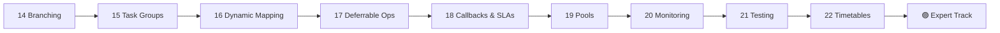

<div align="center">
⬅️ [Intermediate Track](../02_Intermediate/Readme.md) &nbsp;|&nbsp; 🏠 [Home](../00_Learning_Guide/Readme.md) &nbsp;|&nbsp; [Expert Track ➡️](../04_Expert/Readme.md)
</div>

---

# 🔴 Advanced Track

> *Your pipelines work. Now they need to be smart — branching on conditions, scaling with dynamic tasks, recovering from failures, and meeting SLAs. This is where good Airflow engineers separate from great ones.*

**[Start Here → Branching and Control Flow (Theory.md)](14_Branching_and_Control_Flow/Theory.md)**

---

## At a Glance

| | |
|---|---|
| **Topics** | 9 modules |
| **Est. Time** | 15–20 hours |
| **Prerequisites** | 🟡 Intermediate Track complete |
| **Unlocks** | 🟣 Expert Track |

---

## Section Map

```mermaid
mindmap
  root((🔴 Advanced))
    Branching & Control Flow
      BranchPythonOperator
      BranchTaskGroupOperator
      ShortCircuitOperator
      LatestOnlyOperator
    Task Groups
      Organising tasks
      Nested groups
      Dynamic task groups
    Dynamic Task Mapping
      expand()
      map()
      cross_product_arg
      mapped task limits
    Deferrable Operators
      Triggers
      async sensors
      writing deferrable ops
    Callbacks & SLAs
      on_success_callback
      on_failure_callback
      sla_miss_callback
    Pools & Resources
      Slot management
      Priority weights
      Queue assignment
    Monitoring
      Grafana integration
      StatsD metrics
      Airflow UI tips
    Testing
      pytest-airflow
      unit testing DAGs
      integration tests
    Timetables
      Custom schedules
      CronTriggerTimetable
      DataIntervalTimetable
```

---

## Topics

| Module | File | Description |
|--------|------|-------------|
| 14 | [Branching → Theory.md](14_Branching_and_Control_Flow/Theory.md) | BranchPythonOperator, ShortCircuit, conditional logic |
| 14 | [Branching → Code Example](14_Branching_and_Control_Flow/Code_Example.md) | Branching patterns with working code |
| 14 | [Branching → Cheatsheet](14_Branching_and_Control_Flow/Cheatsheet.md) | Quick reference for branching operators |
| 14 | [Branching → Interview Q&A](14_Branching_and_Control_Flow/Interview_QA.md) | Branching interview questions |
| 15 | [Task Groups → Theory.md](15_Task_Groups/Theory.md) | Grouping tasks, improving DAG readability |
| 15 | [Task Groups → Code Example](15_Task_Groups/Code_Example.md) | Nested task groups, dynamic groups |
| 15 | [Task Groups → Cheatsheet](15_Task_Groups/Cheatsheet.md) | TaskGroup syntax reference |
| 16 | Dynamic Task Mapping → Theory.md | expand(), map(), dynamic parallelism |
| 17 | Deferrable Operators → Theory.md | Async operators, Triggers, reducing worker slots |
| 18 | Callbacks & SLAs → Theory.md | on_failure_callback, SLA misses, alerting |
| 19 | [Pools & Resources → Theory.md](19_Pools_and_Resources/Theory.md) | Slot management, priority weights, concurrency |
| 19 | [Pools & Resources → Cheatsheet](19_Pools_and_Resources/Cheatsheet.md) | Pool config quick reference |
| 20 | Monitoring → Theory.md | Metrics, Grafana dashboards, alerting |
| 21 | Testing → Theory.md | Testing DAGs with pytest, CI/CD integration |
| 22 | Timetables → Theory.md | Custom scheduling beyond cron |

---

## Learning Path



---

## Before You Start

- Intermediate Track must be complete — especially XComs and Sensors
- Spin up a Docker Compose environment (Celery executor) for the parallelism examples
- The Dynamic Task Mapping module requires Airflow 2.3+ (fully supported in Airflow 3)

---

<div align="center">
⬅️ [Intermediate Track](../02_Intermediate/Readme.md) &nbsp;|&nbsp; 🏠 [Home](../00_Learning_Guide/Readme.md) &nbsp;|&nbsp; [Expert Track ➡️](../04_Expert/Readme.md)
</div>
