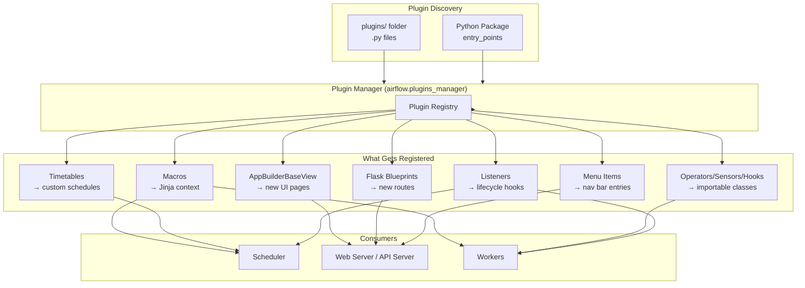

# 23 — Plugins and Customization

## 📂 Navigation
⬅️ **Prev:** | 🏠 **[Home](../../00_Learning_Guide/Learning_Path.md)** | ➡️ **Next:**

---

## The Story

Out of the box Airflow is powerful. But enterprise teams need more — custom UI pages, company-specific macros, proprietary data sources. Airflow's Plugin system lets you extend everything without forking the codebase. A payments team might add a custom "Reconciliation Dashboard" page to the Airflow UI. A data platform team might add custom macros so DAG authors can use `{{ ds_tz("America/New_York") }}`. A compliance team might add a listener that sends every task failure to an audit system. None of this requires modifying Airflow source code.

---

## 1. The AirflowPlugin Class

All plugins are defined by subclassing `airflow.plugins_manager.AirflowPlugin`:

```python
from airflow.plugins_manager import AirflowPlugin

class MyPlugin(AirflowPlugin):
    name = "my_plugin"                      # Required, must be unique
    operators = []                          # Custom operator classes
    sensors = []                            # Custom sensor classes
    hooks = []                              # Custom hook classes
    macros = []                             # Functions exposed as Jinja macros
    flask_blueprints = []                   # Flask Blueprint objects
    appbuilder_views = []                   # AppBuilderBaseView subclasses
    appbuilder_menu_items = []              # Menu entries for custom views
    timetables = []                         # Custom timetable classes
    listeners = []                          # Listener module objects
```

`name` is the only required field. All other attributes default to empty lists — include only what your plugin provides.

---

## 2. What Can Be Plugged In

### Operators, Sensors, Hooks
Register custom operator/sensor/hook classes so they appear in the plugin manager. In Airflow 3 these are primarily for legacy compatibility — the preferred approach is to install them as a regular Python package (pip-installable) and import directly in DAGs.

### Macros
Functions registered in `macros` become available in all Jinja templates across every DAG. They are called as `{{ macros.my_plugin.my_function(args) }}` where `my_plugin` is the plugin `name`.

### Flask Blueprints
A `flask.Blueprint` that adds new routes to the Airflow web application. Used for embedding reports, redirect pages, or custom API endpoints.

### AppBuilderBaseView (UI Pages)
Full web pages integrated into Airflow's UI. They appear in the navigation menu and can render templates. Use Flask-AppBuilder's `expose` decorator to define routes.

### AppBuilderMenuItems
Adds entries to the Airflow top navigation bar. Each item is a dict with `name`, `category`, `category_icon`, and `href` keys.

### Timetables
Custom scheduling logic beyond cron and timedelta — for example, "run every business day", "run on the last Friday of each month". Covered in depth in the DAG Scheduling section.

### Listeners
Hooks into the DAG and task lifecycle. Introduced in Airflow 2.4, significantly expanded in Airflow 3. They replace many use cases that previously required custom callbacks scattered across every DAG.

---

## 3. Plugin Discovery

Airflow discovers plugins through two mechanisms:

### Method 1: The `plugins/` Folder
Place any Python file in the `$AIRFLOW_HOME/plugins/` directory. Airflow scans this directory at startup and imports every `.py` file it finds. Any `AirflowPlugin` subclass in those files is automatically registered.

```
$AIRFLOW_HOME/
├── dags/
├── plugins/
│   ├── my_macro_plugin.py       ← discovered automatically
│   ├── my_ui_plugin.py          ← discovered automatically
│   └── utils/                   ← subdirectories are NOT scanned by default
└── airflow.cfg
```

### Method 2: Python Package Entry Points
For distributed plugins (shared across teams via pip), declare the plugin in `setup.cfg` or `pyproject.toml`:

```toml
# pyproject.toml
[project.entry-points."airflow.plugins"]
my_company_plugin = "my_company_airflow.plugin:MyCompanyPlugin"
```

This is the **preferred production approach** — it allows versioning, testing, and distribution via a private PyPI server.

### Plugin Loading Order
1. Entry points are loaded first
2. Files in `plugins/` are loaded next
3. If two plugins share the same `name`, the later one overwrites the earlier one

### Verifying Loaded Plugins
```bash
airflow plugins list
```

---

## 4. Lazy Loading

Airflow 3 loads plugins lazily by default — they are not imported until they are needed. This prevents slow startup times caused by heavyweight plugin dependencies. The `lazy_load_plugins` setting controls this:

```ini
[core]
lazy_load_plugins = True   # default in Airflow 3
```

If your plugin must run at startup (e.g., to register a connection type), set `lazy_load_plugins = False` or ensure your plugin is a proper package with entry points (which are eager-loaded).

---

## 5. Custom Macros Plugin

Macros registered through a plugin are accessible in all DAG Jinja templates without any per-DAG configuration.

```python
# plugins/date_macros_plugin.py
from datetime import datetime
import pytz
from airflow.plugins_manager import AirflowPlugin


def ds_in_timezone(ds: str, tz_name: str) -> str:
    """Convert execution date string (YYYY-MM-DD) to a timezone-aware ISO string."""
    utc_dt = datetime.strptime(ds, "%Y-%m-%d").replace(tzinfo=pytz.UTC)
    local_dt = utc_dt.astimezone(pytz.timezone(tz_name))
    return local_dt.isoformat()


def format_ds(ds: str, fmt: str) -> str:
    """Reformat execution date string into any strftime format."""
    return datetime.strptime(ds, "%Y-%m-%d").strftime(fmt)


class DateMacrosPlugin(AirflowPlugin):
    name = "date_macros"
    macros = [ds_in_timezone, format_ds]
```

Usage in a DAG template:
```python
BashOperator(
    task_id="print_date",
    bash_command="echo {{ macros.date_macros.format_ds(ds, '%B %d, %Y') }}"
)
```

---

## 6. Custom UI Page with AppBuilderBaseView

Flask-AppBuilder views allow you to add full HTML pages to the Airflow UI. The view class defines routes, the plugin registers it, and `appbuilder_menu_items` adds it to the nav bar.

```python
# plugins/audit_view_plugin.py
from flask import Blueprint
from flask_appbuilder import expose, BaseView as AppBuilderBaseView
from airflow.plugins_manager import AirflowPlugin

# Blueprint is required even if you only use AppBuilderBaseView
audit_bp = Blueprint(
    "audit_bp",
    __name__,
    template_folder="templates",   # plugins/templates/
    static_folder="static",
    static_url_path="/static/audit_bp",
)


class AuditDashboardView(AppBuilderBaseView):
    default_view = "index"

    @expose("/")
    def index(self):
        # Fetch recent task failures from metadata DB
        from airflow.models import TaskInstance
        from airflow.utils.state import State
        from airflow.utils.session import create_session

        with create_session() as session:
            failures = (
                session.query(TaskInstance)
                .filter(TaskInstance.state == State.FAILED)
                .order_by(TaskInstance.end_date.desc())
                .limit(50)
                .all()
            )
        return self.render_template(
            "audit_dashboard.html",
            failures=failures,
        )


audit_view = {"view": AuditDashboardView()}

audit_menu_item = {
    "name": "Audit Dashboard",
    "category": "Compliance",
    "category_icon": "fa-shield",
    "href": "/auditdashboardview/",
}


class AuditPlugin(AirflowPlugin):
    name = "audit_plugin"
    flask_blueprints = [audit_bp]
    appbuilder_views = [audit_view]
    appbuilder_menu_items = [audit_menu_item]
```

Template at `plugins/templates/audit_dashboard.html`:
```html


  <h2>Recent Task Failures</h2>
  <table class="table">
    <thead><tr><th>DAG</th><th>Task</th><th>Run ID</th><th>End Date</th></tr></thead>
    <tbody>
      
      <tr>
        <td>{{ ti.dag_id }}</td>
        <td>{{ ti.task_id }}</td>
        <td>{{ ti.run_id }}</td>
        <td>{{ ti.end_date }}</td>
      </tr>
      
    </tbody>
  </table>

```

---

## 7. Listeners

Listeners are the most powerful addition to the plugin system. Instead of adding `on_failure_callback` to every task in every DAG, you write one listener and it fires for every task state change across the entire Airflow installation.

### Listener Hook Points (Airflow 3)

| Hook Method | Fired When |
|---|---|
| `on_task_instance_running` | Task transitions to RUNNING |
| `on_task_instance_success` | Task transitions to SUCCESS |
| `on_task_instance_failed` | Task transitions to FAILED |
| `on_dag_run_running` | DAG run transitions to RUNNING |
| `on_dag_run_success` | DAG run transitions to SUCCESS |
| `on_dag_run_failed` | DAG run transitions to FAILED |

### Listener Implementation

Listeners use `@hookimpl` from `pluggy` — the same plugin system used by pytest:

```python
# plugins/task_listener_plugin.py
from airflow.listeners import hookimpl
from airflow.plugins_manager import AirflowPlugin
from airflow.models.taskinstance import TaskInstance
import logging

log = logging.getLogger(__name__)


class TaskStateListener:

    @hookimpl
    def on_task_instance_running(
        self, previous_state, task_instance: TaskInstance, session
    ):
        log.info(
            "TASK RUNNING: dag=%s task=%s run_id=%s",
            task_instance.dag_id,
            task_instance.task_id,
            task_instance.run_id,
        )

    @hookimpl
    def on_task_instance_success(
        self, previous_state, task_instance: TaskInstance, session
    ):
        log.info(
            "TASK SUCCESS: dag=%s task=%s duration=%.2fs",
            task_instance.dag_id,
            task_instance.task_id,
            task_instance.duration or 0,
        )

    @hookimpl
    def on_task_instance_failed(
        self, previous_state, task_instance: TaskInstance, session
    ):
        log.error(
            "TASK FAILED: dag=%s task=%s run_id=%s error=%s",
            task_instance.dag_id,
            task_instance.task_id,
            task_instance.run_id,
            task_instance.last_heartbeat_at,
        )
        # Could send PagerDuty alert, write to audit DB, etc.


task_listener = TaskStateListener()


class TaskListenerPlugin(AirflowPlugin):
    name = "task_listener_plugin"
    listeners = [task_listener]
```

### Listeners vs Callbacks

| Feature | Callbacks (`on_failure_callback`) | Listeners |
|---|---|---|
| Scope | Per-task or per-DAG | All tasks/DAGs globally |
| Configuration | In DAG/task definition | In plugin only |
| Code duplication | High (must add to every DAG) | None |
| Introduced | Airflow 1.x | Airflow 2.4 |
| Airflow 3 recommended | For task-specific logic | For platform-wide logic |

---

## 8. Plugin System Architecture



---

## Key Takeaways

- The `AirflowPlugin` class is the single entry point for all customization
- For production, distribute plugins as pip packages using entry points — not files dropped in `plugins/`
- Listeners are the correct Airflow 3 approach to platform-wide observability; reserve callbacks for task-specific logic
- Lazy loading (`lazy_load_plugins = True`) is the default in Airflow 3 — do not add expensive imports at module level in plugin files
- AppBuilderBaseView and `flask_blueprints` give full control over the Airflow web UI without forking
