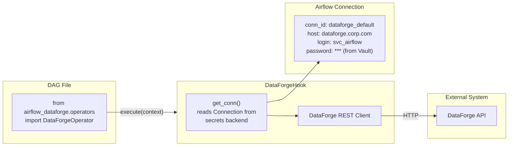

# 24 — Custom Operators and Hooks

## 📂 Navigation
⬅️ **Prev:** | 🏠 **[Home](../../00_Learning_Guide/Learning_Path.md)** | ➡️ **Next:**

---

## The Story

Your company uses an internal data platform — call it "DataForge" — that has no Airflow provider. You could use `BashOperator` with `curl` commands: they'd work, but every DAG author would need to know the exact API endpoint, auth header format, retry logic, and error codes. One change to the DataForge API breaks every DAG simultaneously. Instead, you build a `DataForgeOperator` with a clean interface, proper error handling, and full Airflow integration. DAG authors write `DataForgeOperator(task_id="run_job", job_name="{{ job_name }}")` and never think about HTTP.

This section shows you exactly how to build that.

---

## 1. Building a Custom Operator

### The BaseOperator Contract

Every custom operator inherits from `airflow.models.BaseOperator` and must implement exactly one method:

```python
def execute(self, context: Context) -> Any:
    ...
```

`execute()` is called by the worker when the task runs. The `context` dictionary contains the same keys available in Jinja templates: `ds`, `logical_date`, `dag`, `task`, `task_instance`, `conf`, etc.

Whatever `execute()` returns is pushed to XCom as the task's return value.

### Minimal Custom Operator

```python
from airflow.models import BaseOperator
from airflow.utils.context import Context


class PrintMessageOperator(BaseOperator):

    def __init__(self, message: str, **kwargs):
        super().__init__(**kwargs)
        self.message = message

    def execute(self, context: Context) -> str:
        self.log.info("Message: %s", self.message)
        return self.message
```

Always pass `**kwargs` to `super().__init__()` — this forwards `task_id`, `dag`, `retries`, `retry_delay`, and all other standard parameters.

### template_fields

`template_fields` is a tuple of attribute names that Airflow will render as Jinja templates before calling `execute()`. This makes your operator work natively with `{{ ds }}`, `{{ var.value.my_var }}`, and any other template variable.

```python
class MyOperator(BaseOperator):
    template_fields = ("sql", "bucket_name", "output_path")
    template_ext = (".sql",)  # also render .sql file contents if path is given

    def __init__(self, sql: str, bucket_name: str, output_path: str, **kwargs):
        super().__init__(**kwargs)
        self.sql = sql
        self.bucket_name = bucket_name
        self.output_path = output_path
```

If `sql` is `"SELECT * FROM orders WHERE dt = '{{ ds }}'"`, Airflow replaces `{{ ds }}` before `execute()` runs.

### ui_color and ui_fgcolor

These control the task node color in the Graph view — useful for visual differentiation:

```python
class DataForgeOperator(BaseOperator):
    ui_color = "#4a9eff"      # Node background (hex)
    ui_fgcolor = "#ffffff"    # Text color (hex)
```

### Complete Custom Operator Example

```python
# operators/dataforge_operator.py
from __future__ import annotations

import time
from typing import Any

from airflow.exceptions import AirflowException
from airflow.models import BaseOperator
from airflow.utils.context import Context

from hooks.dataforge_hook import DataForgeHook


class DataForgeOperator(BaseOperator):
    """
    Submits a job to DataForge and waits for it to complete.

    :param job_name: Name of the DataForge job to run (supports templating)
    :param job_params: Optional dict of job parameters
    :param dataforge_conn_id: Airflow connection ID for DataForge
    :param poll_interval: Seconds between status polls
    :param timeout: Maximum seconds to wait for job completion
    """

    template_fields = ("job_name", "job_params")
    ui_color = "#4a9eff"
    ui_fgcolor = "#ffffff"

    def __init__(
        self,
        job_name: str,
        job_params: dict | None = None,
        dataforge_conn_id: str = "dataforge_default",
        poll_interval: int = 30,
        timeout: int = 3600,
        **kwargs,
    ):
        super().__init__(**kwargs)
        self.job_name = job_name
        self.job_params = job_params or {}
        self.dataforge_conn_id = dataforge_conn_id
        self.poll_interval = poll_interval
        self.timeout = timeout

    def execute(self, context: Context) -> dict[str, Any]:
        hook = DataForgeHook(conn_id=self.dataforge_conn_id)
        session = hook.get_conn()

        self.log.info("Submitting DataForge job: %s with params: %s", self.job_name, self.job_params)
        job_id = session.submit_job(self.job_name, self.job_params)
        self.log.info("Job submitted. Job ID: %s", job_id)

        # Poll until completion or timeout
        start = time.monotonic()
        while True:
            elapsed = time.monotonic() - start
            if elapsed > self.timeout:
                hook.cancel_job(job_id)
                raise AirflowException(
                    f"DataForge job {job_id} timed out after {self.timeout}s"
                )

            status = session.get_job_status(job_id)
            self.log.info("Job %s status: %s (elapsed: %.0fs)", job_id, status, elapsed)

            if status == "SUCCESS":
                result = session.get_job_result(job_id)
                self.log.info("Job completed successfully: %s", result)
                return result
            elif status in ("FAILED", "CANCELLED", "ERROR"):
                error_msg = session.get_job_error(job_id)
                raise AirflowException(
                    f"DataForge job {job_id} failed with status={status}: {error_msg}"
                )
            # PENDING or RUNNING — keep polling
            time.sleep(self.poll_interval)
```

---

## 2. Building a Custom Hook

Hooks are the connection layer between Airflow and external systems. A Hook:
- Inherits from `airflow.hooks.base.BaseHook`
- Implements `get_conn()` which returns a connection object
- Reads credentials from an Airflow Connection (not hardcoded)
- Provides helper methods that wrap the external API

### BaseHook Contract

```python
from airflow.hooks.base import BaseHook

class MyHook(BaseHook):
    conn_name_attr = "my_conn_id"           # default conn_id attribute name
    default_conn_name = "my_default"        # default value for conn_id
    conn_type = "my_system"                 # shows in connection type dropdown
    hook_name = "My System"                 # display name in UI

    def __init__(self, conn_id: str = default_conn_name):
        super().__init__()
        self.conn_id = conn_id
        self._conn = None

    def get_conn(self):
        if self._conn is None:
            self._conn = self._build_conn()
        return self._conn

    def _build_conn(self):
        conn = self.get_connection(self.conn_id)
        # Build your connection object using conn.host, conn.login,
        # conn.password, conn.port, conn.schema, conn.extra_dejson
        ...
```

`self.get_connection(self.conn_id)` is inherited from `BaseHook` — it queries the secrets backend and returns an `airflow.models.Connection` object.

---

## 3. Building a Custom Sensor

Sensors inherit from `BaseSensorOperator` and implement `poke(context)`, which returns `True` (condition met, proceed) or `False` (condition not met, wait and retry).

```python
from airflow.sensors.base import BaseSensorOperator
from airflow.utils.context import Context


class DataForgeJobReadySensor(BaseSensorOperator):
    """
    Waits until a DataForge dataset is marked as READY.

    :param dataset_name: Name of the dataset to check
    :param dataforge_conn_id: Airflow connection ID
    """

    template_fields = ("dataset_name",)
    poke_context_fields = ("dataset_name",)  # for deferred mode context

    def __init__(
        self,
        dataset_name: str,
        dataforge_conn_id: str = "dataforge_default",
        **kwargs,
    ):
        super().__init__(**kwargs)
        self.dataset_name = dataset_name
        self.dataforge_conn_id = dataforge_conn_id

    def poke(self, context: Context) -> bool:
        from hooks.dataforge_hook import DataForgeHook

        hook = DataForgeHook(conn_id=self.dataforge_conn_id)
        conn = hook.get_conn()
        status = conn.get_dataset_status(self.dataset_name)
        self.log.info("Dataset '%s' status: %s", self.dataset_name, status)
        return status == "READY"
```

### Sensor Modes

| Mode | How It Works | Best For |
|---|---|---|
| `poke` (default) | Task stays running, sleeps between pokes | Short waits (<5 min), low sensor count |
| `reschedule` | Task releases worker slot between pokes | Long waits, many sensors, production use |
| Deferrable | Suspends task entirely, triggers on async event | Kubernetes/ECS, minimal worker usage |

Always use `mode="reschedule"` in production:
```python
sensor = DataForgeJobReadySensor(
    task_id="wait_for_dataset",
    dataset_name="orders_daily",
    poke_interval=120,    # check every 2 minutes
    timeout=7200,         # fail after 2 hours
    mode="reschedule",    # don't block a worker slot
)
```

---

## 4. Packaging for Reuse

### Option A: `plugins/` Folder (Single Cluster)
```
$AIRFLOW_HOME/plugins/
├── operators/
│   └── dataforge_operator.py
├── hooks/
│   └── dataforge_hook.py
└── sensors/
    └── dataforge_sensor.py
```

Import in DAGs with absolute path: `from operators.dataforge_operator import DataForgeOperator`

### Option B: pip Package (Multi-Cluster / Team Distribution)

Recommended structure:
```
airflow-dataforge/
├── pyproject.toml
├── airflow_dataforge/
│   ├── __init__.py
│   ├── operators/
│   │   └── dataforge_operator.py
│   ├── hooks/
│   │   └── dataforge_hook.py
│   └── sensors/
│       └── dataforge_sensor.py
```

```toml
# pyproject.toml
[project]
name = "airflow-dataforge"
version = "1.2.0"
dependencies = ["apache-airflow>=3.0.0"]

[project.entry-points."airflow.plugins"]
dataforge = "airflow_dataforge.plugin:DataForgePlugin"
```

Install: `pip install airflow-dataforge==1.2.0`

Import in DAGs: `from airflow_dataforge.operators.dataforge_operator import DataForgeOperator`

---

## 5. Testing Custom Operators

```python
# tests/test_dataforge_operator.py
from unittest.mock import MagicMock, patch

import pytest

from airflow.models import DagBag
from airflow.utils.state import State

from operators.dataforge_operator import DataForgeOperator


class TestDataForgeOperator:

    def test_execute_success(self):
        """Operator returns job result on success."""
        mock_session = MagicMock()
        mock_session.submit_job.return_value = "job-123"
        mock_session.get_job_status.side_effect = ["PENDING", "RUNNING", "SUCCESS"]
        mock_session.get_job_result.return_value = {"rows_processed": 1000}

        with patch("operators.dataforge_operator.DataForgeHook") as MockHook:
            MockHook.return_value.get_conn.return_value = mock_session

            op = DataForgeOperator(
                task_id="test",
                job_name="test_job",
                job_params={"date": "2026-03-15"},
                poll_interval=0,  # no sleep in tests
            )
            result = op.execute(context={})

        assert result == {"rows_processed": 1000}
        mock_session.submit_job.assert_called_once_with("test_job", {"date": "2026-03-15"})

    def test_execute_failure_raises(self):
        """Operator raises AirflowException when job fails."""
        from airflow.exceptions import AirflowException

        mock_session = MagicMock()
        mock_session.submit_job.return_value = "job-456"
        mock_session.get_job_status.return_value = "FAILED"
        mock_session.get_job_error.return_value = "OOM error"

        with patch("operators.dataforge_operator.DataForgeHook") as MockHook:
            MockHook.return_value.get_conn.return_value = mock_session

            op = DataForgeOperator(
                task_id="test",
                job_name="fail_job",
                poll_interval=0,
            )
            with pytest.raises(AirflowException, match="FAILED"):
                op.execute(context={})

    def test_template_fields(self):
        """Ensure template_fields are declared."""
        assert "job_name" in DataForgeOperator.template_fields
        assert "job_params" in DataForgeOperator.template_fields
```

---

## Plugin System Architecture Diagram



---

## Key Takeaways

- Inherit `BaseOperator`, implement `execute(context)`, pass `**kwargs` to `super().__init__()`
- Declare `template_fields` for every operator attribute that DAG authors might want to template
- Hooks handle connection management — operators call hooks, not external APIs directly
- Use `mode="reschedule"` for sensors in production — `poke` mode wastes worker slots
- Package as pip + entry points for multi-team distribution; `plugins/` folder for single-cluster use
- Test operators by mocking the hook layer — unit tests should never make real network calls
