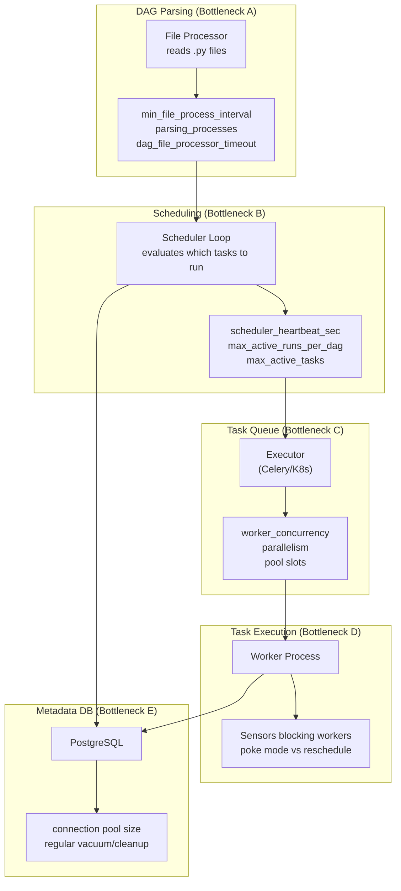

# 27 — Performance Optimization

## 📂 Navigation
⬅️ **Prev:** | 🏠 **[Home](../../00_Learning_Guide/Learning_Path.md)** | ➡️ **Next:**

---

## 📌 Learning Priority

**Must Learn** — core concepts, needed to understand the rest of this file:
[Performance Bottlenecks Overview](#1-understanding-the-performance-bottlenecks) · [Avoid Top-Level DB Calls](#avoid-top-level-db-calls) · [Sensor reschedule Mode](#6-sensor-optimization)

**Should Learn** — important for real projects and interviews:
[Scheduler Parsing Tuning](#parsing-tuning) · [Pool Slots](#pool-slots) · [Database Optimization](#5-database-optimization) · [DAG Factory Pattern](#dag-factories-instead-of-many-files)

**Good to Know** — useful in specific situations, not needed daily:
[DAG Processor in Airflow 3](#3-dag-processor-airflow-3) · [Monitoring Scheduler Lag](#8-monitoring-scheduler-lag)

**Reference** — skim once, look up when needed:
[Worker Concurrency Config](#4-worker-concurrency) · [PostgreSQL autovacuum Tuning](#postgresql-autovacuum-tuning)

---

## The Story

Your Airflow cluster runs 1000 DAGs. The scheduler is lagging — tasks submitted at 10:00 don't start running until 10:05. The task queue fills up. The UI times out loading the DAG list. New DAGs take 3 minutes to appear after being added. Your on-call rotation is getting pages every night. Performance tuning is the difference between a reliable data platform and a frustrating one that erodes trust.

---

## 1. Understanding the Performance Bottlenecks



---

## 2. Scheduler Performance

The scheduler loop runs continuously. It parses DAG files, evaluates which DAG runs and tasks are due, and submits tasks to the executor. The key parameters:

### Parsing Tuning

```ini
[scheduler]
# How often to re-parse each DAG file (seconds)
# Default: 30. For stable DAGs, increase to 300–600.
min_file_process_interval = 300

# Number of parallel DAG file parsing processes
# Default: 2. Set to (CPU cores - 1), max ~4 for most deployments.
parsing_processes = 4

# Kill file processor if parsing takes longer than this (seconds)
# Default: 50. Increase if you have complex DAGs with slow imports.
dag_file_processor_timeout = 120

# Process DAG files in modification-time order (changed files first)
# Options: modified_time, random_seeded_by_host, alphabetical
file_parsing_sort_mode = modified_time
```

### Scheduling Loop Tuning

```ini
[scheduler]
# How often the scheduler wakes up to check for tasks to run (seconds)
# Default: 5. Lower = more responsive, higher DB load.
scheduler_heartbeat_sec = 5

# Max concurrent runs per DAG globally
# Default: 16. Prevent runaway catchup from overwhelming workers.
max_active_runs_per_dag = 3

# Global max concurrent task instances
# Default: 16. Scale with your executor's capacity.
max_active_tasks = 100

# Enable DAG processor as a standalone process (Airflow 3)
standalone_dag_processor = True
```

---

## 3. DAG Processor (Airflow 3)

Airflow 3 introduced the `standalone_dag_processor` as a separate process/component:

```bash
# Start DAG processor separately (production deployment)
airflow dag-processor
```

This allows the DAG processing to scale independently from the scheduler, and prevents slow DAG parsing from blocking task scheduling.

```ini
[dag_processor]
# Number of file processor workers
parsing_processes = 4

# Kill a file processor after this many seconds
dag_file_processor_timeout = 120

# Re-parse each file every N seconds
min_file_process_interval = 300
```

---

## 4. Worker Concurrency

```ini
# Celery executor
[celery]
# Tasks per worker process
# Default: 16. Set based on task type:
#   - I/O bound (HTTP, SQL): 16–32
#   - CPU bound (Pandas, ML): 2–4 (match CPU cores)
worker_concurrency = 16

[core]
# Global max running task instances across all workers combined
parallelism = 128
```

### Pool Slots

Pools provide fine-grained concurrency control for resource-intensive tasks:

```python
# Create pools via CLI
airflow pools set warehouse_heavy 5 "Slow warehouse queries, max 5 concurrent"
airflow pools set external_api 10 "Rate-limited API calls"

# Assign tasks to pools in DAGs
task = SQLExecuteQueryOperator(
    task_id="heavy_query",
    pool="warehouse_heavy",
    pool_slots=1,  # this task uses 1 slot (default)
)

# A task that uses 2 slots (counts as 2 for concurrency purposes)
big_task = PythonOperator(
    task_id="huge_export",
    pool="warehouse_heavy",
    pool_slots=2,
)
```

---

## 5. Database Optimization

The metadata database is the shared bottleneck for all Airflow components.

### Use PostgreSQL, Not MySQL
PostgreSQL handles Airflow's concurrent read/write pattern dramatically better than MySQL. SQLite is for development only.

### Connection Pool Size

```ini
[database]
# SQLAlchemy connection pool
# Tune based on: (scheduler + workers + webserver) * typical_db_connections
sql_alchemy_pool_size = 5         # Base connections per process
sql_alchemy_max_overflow = 10     # Additional connections allowed under load
sql_alchemy_pool_timeout = 30     # Seconds to wait for a connection
sql_alchemy_pool_recycle = 1800   # Recycle connections every 30 minutes (prevent stale)
```

### Regular Maintenance

Over time, the metadata database grows with task instance records, XCom data, and log entries. Clean up regularly:

```bash
# Remove task instance records older than 30 days
airflow db clean --clean-before-timestamp "$(date -d '-30 days' --iso-8601=seconds)" \
  --tables task_instance,dag_run,xcom,log

# Dry run first to see what would be deleted
airflow db clean --clean-before-timestamp "2026-01-01" --dry-run

# Schedule this as a DAG for automatic cleanup
```

```python
# dags/airflow_db_cleanup.py
from airflow.sdk import DAG
from airflow.operators.bash import BashOperator
from datetime import datetime, timedelta

with DAG(
    dag_id="airflow_db_cleanup",
    schedule="0 2 * * 0",  # Every Sunday at 2 AM
    start_date=datetime(2026, 1, 1),
    catchup=False,
    tags=["maintenance"],
) as dag:
    BashOperator(
        task_id="clean_old_records",
        bash_command=(
            'airflow db clean '
            '--clean-before-timestamp "$(date -d \'-90 days\' --iso-8601=seconds)" '
            '--tables task_instance,dag_run,xcom,log '
            '--yes'
        ),
    )
```

### PostgreSQL `autovacuum` Tuning
```sql
-- For the task_instance table (high write rate)
ALTER TABLE task_instance SET (
    autovacuum_vacuum_scale_factor = 0.01,
    autovacuum_analyze_scale_factor = 0.005
);
```

---

## 6. Sensor Optimization

Sensors are a common performance killer. Each sensor in `poke` mode holds a worker slot for its entire duration.

```python
# BAD: 100 sensors in poke mode = 100 worker slots permanently occupied
sensor = ExternalTaskSensor(
    task_id="wait",
    poke_interval=60,
    mode="poke",       # Holds worker slot while sleeping!
)

# GOOD: reschedule mode releases worker slot between pokes
sensor = ExternalTaskSensor(
    task_id="wait",
    poke_interval=300,        # Every 5 minutes
    timeout=7200,             # 2-hour max
    mode="reschedule",        # Returns worker slot between polls
    exponential_backoff=True, # Grow interval if repeatedly not ready
)

# BEST: deferrable sensors for Kubernetes/ECS (zero worker slots)
sensor = S3KeySensor(
    task_id="wait_for_file",
    bucket_name="my-bucket",
    bucket_key="data/{{ ds }}/file.parquet",
    deferrable=True,
)
```

---

## 7. Code-Level Optimizations

### Avoid Top-Level DB Calls

The scheduler imports every DAG file repeatedly to detect changes. Any code at module level runs on every import:

```python
# BAD: DB query runs on every DAG file import (every 300 seconds)
from airflow.models import Variable
ENV = Variable.get("environment")   # This hits the DB on every parse!

with DAG("my_dag", ...) as dag:
    ...
```

```python
# GOOD: Defer all DB/network calls into task callables
with DAG("my_dag", ...) as dag:
    def get_env():
        from airflow.models import Variable
        return Variable.get("environment")  # Only runs when task executes

    PythonOperator(task_id="use_env", python_callable=get_env)
```

### Lazy Imports

```python
# BAD: Heavy library loaded on every DAG parse
import pandas as pd
import numpy as np
import sklearn

with DAG(...) as dag:
    ...
```

```python
# GOOD: Import inside task functions
with DAG(...) as dag:
    def process():
        import pandas as pd    # Only imported when task runs
        import numpy as np
        ...

    PythonOperator(task_id="process", python_callable=process)
```

### DAG Factories Instead of Many Files

```python
# BAD: 50 nearly-identical DAG files, each parsed separately
# dags/etl_customers.py, dags/etl_orders.py, dags/etl_products.py ...

# GOOD: One file generates all 50 DAGs
# dags/etl_factory.py
TABLES = ["customers", "orders", "products", "inventory"]  # config, not DB call

for table in TABLES:
    with DAG(
        dag_id=f"etl_{table}",
        schedule="@daily",
        start_date=datetime(2026, 1, 1),
    ) as dag:
        extract = PythonOperator(task_id="extract", python_callable=run_extract, op_kwargs={"table": table})
        load = PythonOperator(task_id="load", python_callable=run_load, op_kwargs={"table": table})
        extract >> load

    globals()[f"etl_{table}"] = dag  # Register with Airflow's DAG discovery
```

### Avoid Dynamic Task Mapping with Too Many Mapped Tasks

```python
# Can create thousands of task instances — be careful
# Each mapped task instance is a DB row
task.expand(item=very_large_list)  # If list has 10,000 items: 10,000 TI rows

# Better: process in chunks
task.expand(chunk=chunked(large_list, size=100))  # 100 tasks instead of 10,000
```

---

## 8. Monitoring Scheduler Lag

Airflow emits StatsD metrics. The key metric for scheduler health:

```
scheduler.scheduler_loop_duration   ← how long each scheduling loop takes
scheduler.tasks.starving            ← tasks waiting for slots
scheduler.tasks.executable          ← tasks ready but not yet submitted
dag.loading-duration.<dag_id>       ← time to parse each DAG file
```

Set up Grafana dashboards to alert when:
- `scheduler_loop_duration` > 10 seconds consistently
- `tasks.starving` > 0 for extended periods
- `dag.loading-duration` > 5 seconds for any DAG

---

## Key Takeaways

- Measure first: use `airflow db check` and StatsD metrics to identify the actual bottleneck before tuning
- Increasing `min_file_process_interval` is the highest-impact, lowest-risk tuning for most deployments
- Sensors in `poke` mode are a worker slot leak — switch to `reschedule` universally
- Never put `Variable.get()`, `Connection.get()`, or any DB/network call at DAG module level
- Use `airflow db clean` regularly — a large metadata DB degrades every component
- The DAG factory pattern reduces file count without reducing functionality
- PostgreSQL with tuned `autovacuum` significantly outperforms MySQL for Airflow workloads
