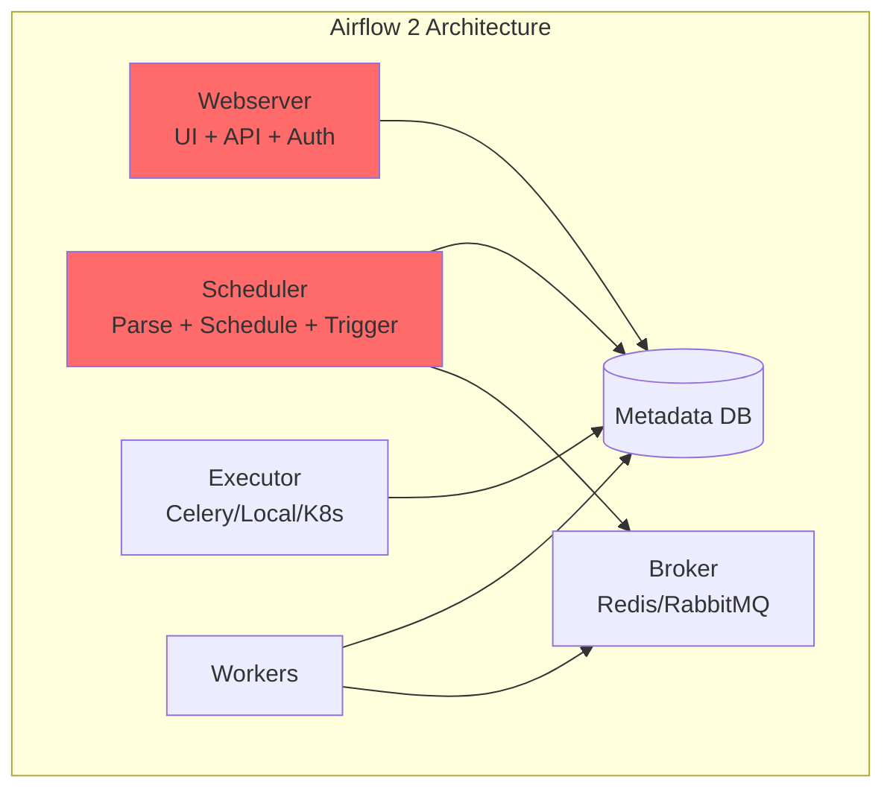
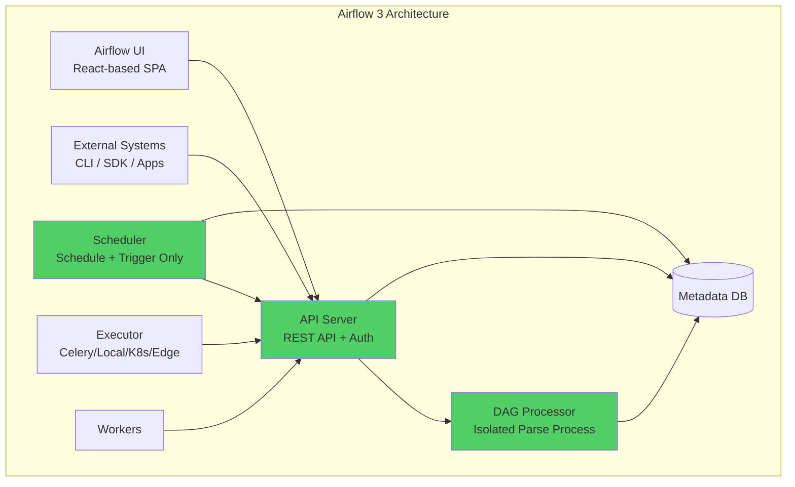

# What's New in Airflow 3

## Navigation
⬅️ **Prev:** | 🏠 **[Home](../../00_Learning_Guide/Learning_Path.md)** | ➡️ **Next: [Asset-Driven Scheduling](../31_Asset_Driven_Scheduling/Theory.md)**

---

## The Story

Airflow 3 is the biggest architectural overhaul since Airflow 2. The core team rebuilt how components communicate, how DAGs are parsed, and how the UI works. If you're upgrading from Airflow 2, this section tells you exactly what changed and why.

The problems Airflow 2 had were well-known: the Webserver was doing too many jobs, DAG parsing happened in the Scheduler process causing instability, the auth system was bolted on via Flask AppBuilder, and there was no consistent internal API — components communicated through the database directly. Airflow 3 fixes all of this.

---

## Architecture Changes

### The Old Architecture (Airflow 2)

In Airflow 2, the Scheduler handled DAG parsing AND scheduling. The Webserver served the UI AND handled API requests AND managed authentication. Workers connected to the Scheduler via the metadata database or via a broker (Celery). Everything was loosely connected through a shared database, which created tight coupling and instability.



### The New Architecture (Airflow 3)

Airflow 3 separates concerns cleanly. Each component has a single responsibility. Communication between components goes through a formal Internal API — no more direct DB writes from workers.



### Component Breakdown

**API Server** (replaces Webserver)
- Serves the REST API for all components
- Hosts the new React-based UI (served from the API Server)
- Handles authentication via the pluggable Auth Manager
- Workers and other components call the API Server, not the DB directly

**DAG Processor** (new separate component)
- Parses DAG files in an isolated process
- Previously this ran inside the Scheduler — a DAG with an infinite loop could crash the Scheduler
- Now a broken DAG only crashes the DAG Processor, which restarts independently
- Can be scaled independently for large DAG repositories

**Scheduler** (slimmed down)
- No longer parses DAGs
- Only responsible for creating DagRuns and TaskInstances based on schedules and asset events
- Much more stable as a result

**Internal API**
- All internal inter-component communication goes through defined API contracts
- Workers no longer write directly to the database
- Enables future components (like Edge Workers) to communicate securely over HTTP

---

## What Was Removed

### SubDAGs — Use TaskGroup Instead

SubDAGs were deprecated in Airflow 2.x and are fully removed in Airflow 3. They had serious problems: they used a separate DagRun, caused deadlocks with pool slots, and were confusing to debug.

```python
# Airflow 2 — SubDAG (REMOVED in v3)
from airflow.operators.subdag import SubDagOperator

def create_subdag(parent_dag_name, child_dag_name, args):
    with DAG(f"{parent_dag_name}.{child_dag_name}", default_args=args) as dag:
        t1 = BashOperator(task_id="task_1", bash_command="echo 1")
        t2 = BashOperator(task_id="task_2", bash_command="echo 2")
    return dag

with DAG("parent_dag", ...) as dag:
    subdag = SubDagOperator(
        task_id="my_subdag",
        subdag=create_subdag("parent_dag", "my_subdag", default_args),
    )
```

```python
# Airflow 3 — TaskGroup (correct approach)
from airflow.utils.task_group import TaskGroup

with DAG("parent_dag", ...) as dag:
    with TaskGroup("my_task_group") as tg:
        t1 = BashOperator(task_id="task_1", bash_command="echo 1")
        t2 = BashOperator(task_id="task_2", bash_command="echo 2")

    downstream_task = BashOperator(task_id="after_group", bash_command="echo done")
    tg >> downstream_task
```

### SequentialExecutor Limitations

SequentialExecutor still exists but is only suitable for unit testing. It has always been single-threaded and cannot run tasks in parallel. In production you should use LocalExecutor (minimum) or CeleryExecutor/KubernetesExecutor.

### FAB-Based Auth (Default Changed)

Flask AppBuilder auth is no longer the default. Airflow 3 ships with a new Simple Auth Manager for development and a pluggable Auth Manager interface for production. FAB auth is still available as `airflow.providers.fab.auth_manager.FabAuthManager` but must be explicitly configured.

### Removed Parameters and APIs

- `execution_date` parameter replaced by `logical_date` throughout the codebase
- `provide_context=True` on PythonOperator is removed — context is always provided
- `dag.run()` direct method removed — use the API
- `airflow db init` is replaced by `airflow db migrate`
- `airflow webserver` command replaced by `airflow api-server`

---

## What's New

### Assets (formerly Datasets)

The most significant new feature for pipeline design. In Airflow 2.4+, Datasets were introduced for data-driven scheduling. In Airflow 3, they are renamed to **Assets** and significantly enhanced.

- New `@asset` decorator for defining asset-producing functions directly
- Asset aliases for grouping and referencing
- Better lineage tracking in the UI
- Assets are first-class citizens in the scheduler

See [Asset-Driven Scheduling](../31_Asset_Driven_Scheduling/Theory.md) for full coverage.

### Edge Executor

A new executor type designed for running tasks on remote, lightweight, or resource-constrained nodes. Edge Workers communicate with the central API Server over HTTP — no direct database access or broker required.

Use cases: IoT devices, remote data center agents, laptop-based development workers, hybrid cloud scenarios.

See [Edge Executor](../34_Edge_Executor/Theory.md) for full coverage.

### New Auth Manager

A pluggable authentication and authorization interface. Swap in any auth system — LDAP, OAuth2, SAML, custom SSO — without changing Airflow's core.

See [New Auth Manager](../33_New_Auth_Manager/Theory.md) for full coverage.

### DAG Versioning

Airflow 3 tracks changes to DAG definitions. When you modify a DAG, the previous version is stored. Historical DagRuns are displayed with the version of the DAG that was active at that time — eliminating the confusion of seeing new task structures overlaid on old runs.

See [DAG Versioning](../32_DAG_Versioning/Theory.md) for full coverage.

### New React UI

The Airflow 2 UI was a server-rendered Flask application. Airflow 3 ships a completely rewritten React-based single-page application (SPA). Key improvements:

- Graph view is significantly faster for large DAGs
- New dataset/asset lineage view
- Improved task logs with streaming
- Better filtering and search across DagRuns
- DAG versioning UI

### ObjectStorage API

A unified file I/O interface that works across S3, GCS, Azure Blob, and local filesystem. Write `ObjectStoragePath("s3://bucket/key")` and the same code works against any backend by changing the connection.

See [Object Storage](../36_Object_Storage/Theory.md) for full coverage.

### Event-Driven Scheduling

Beyond asset-based scheduling, Airflow 3 formalizes external event triggers via the REST API and introduces improved webhook support.

See [Event-Driven Scheduling](../35_Event_Driven_Scheduling/Theory.md) for full coverage.

### TaskFlow API Improvements

- `@task.branch` for branching without BranchPythonOperator
- `@task.sensor` for sensor behavior in TaskFlow style
- Improved type hints and IDE support
- `@asset` decorator integration

```python
# v3 — @task.branch decorator
from airflow.decorators import task

@task.branch
def decide_path(value: int) -> str:
    if value > 100:
        return "high_value_task"
    return "low_value_task"
```

---

## Airflow 2 vs Airflow 3: Full Comparison Table

| Area | Airflow 2 | Airflow 3 | Action Required |
|------|-----------|-----------|-----------------|
| **Web UI server** | `airflow webserver` | `airflow api-server` | Update startup scripts |
| **DB initialization** | `airflow db init` | `airflow db migrate` | Update CI/CD scripts |
| **DAG parsing** | Inside Scheduler process | Separate `airflow dag-processor` | Add new component to deployment |
| **Auth system** | FAB (Flask AppBuilder) | Pluggable Auth Manager | Reconfigure auth |
| **Default auth** | FAB | Simple Auth Manager | Set `auth_manager` in config |
| **SubDAGs** | Deprecated | Removed | Migrate to TaskGroup |
| **Datasets** | `Dataset("uri")` | `Asset("uri")` (renamed) | Update imports and class names |
| **execution_date** | Primary field | Replaced by `logical_date` | Update DAG code |
| **provide_context** | Optional param | Always provided, param removed | Remove from PythonOperator calls |
| **Internal comms** | Direct DB access | Internal API (HTTP) | Transparent — no action needed |
| **Workers DB access** | Direct | Via API Server | Transparent — network config may be needed |
| **Edge computing** | Not supported | Edge Executor | New capability |
| **DAG versioning** | Not available | Built-in | No action — automatic |
| **UI technology** | Jinja/Flask rendered | React SPA | No action — automatic |
| **ObjectStorage** | Not available | Unified API | Optional adoption |
| **@asset decorator** | Not available | Available | New capability |
| **Config: `[webserver]`** | Used for webserver | Partially replaced by `[api_server]` | Update airflow.cfg |
| **Config: `[scheduler] parsing`** | In scheduler section | Moved to `[dag_processor]` | Update airflow.cfg |

---

## Breaking Changes Table

These are code-level changes that will cause errors if not updated when migrating from Airflow 2 to Airflow 3.

| Breaking Change | Airflow 2 Code | Airflow 3 Code |
|-----------------|----------------|----------------|
| Dataset renamed to Asset | `from airflow.datasets import Dataset` | `from airflow.sdk import Asset` |
| SubDagOperator removed | `from airflow.operators.subdag import SubDagOperator` | Use `TaskGroup` |
| execution_date removed from context | `context["execution_date"]` | `context["logical_date"]` |
| provide_context removed | `PythonOperator(provide_context=True, ...)` | Remove `provide_context=True` |
| db init removed | `airflow db init` | `airflow db migrate` |
| webserver command removed | `airflow webserver` | `airflow api-server` |
| FAB not default | `[webserver] rbac = True` | Set `auth_manager = airflow.providers.fab.auth_manager.FabAuthManager` |
| Airflow 2 REST API path changes | `/api/v1/dags` | `/api/v2/dags` (version bump) |

---

## Migration Checklist

- [ ] Update Python dependencies: `apache-airflow>=3.0.0`
- [ ] Run `airflow db migrate` (not `db init` or `db upgrade`)
- [ ] Update Docker/K8s deployment to add `dag-processor` service
- [ ] Change `airflow webserver` to `airflow api-server` in startup scripts
- [ ] Update `airflow.cfg`: replace `[webserver]` auth settings with `auth_manager` setting
- [ ] Update DAG code: replace `Dataset` imports with `Asset`
- [ ] Update DAG code: replace `SubDagOperator` with `TaskGroup`
- [ ] Update DAG code: remove `provide_context=True` from all `PythonOperator` calls
- [ ] Update DAG code: replace `context["execution_date"]` with `context["logical_date"]`
- [ ] Update CI/CD scripts: replace `airflow db init` with `airflow db migrate`
- [ ] Update REST API clients: version bump from `/api/v1/` to `/api/v2/`
- [ ] Test all DAGs in staging environment
- [ ] Verify auth manager works for all users/roles
- [ ] Verify asset-based scheduling works if using Datasets from v2

For detailed migration steps with code examples, see [Migration Guide](Migration_Guide.md).

---

## Navigation
⬅️ **Prev:** | 🏠 **[Home](../../00_Learning_Guide/Learning_Path.md)** | ➡️ **Next: [Asset-Driven Scheduling](../31_Asset_Driven_Scheduling/Theory.md)**
