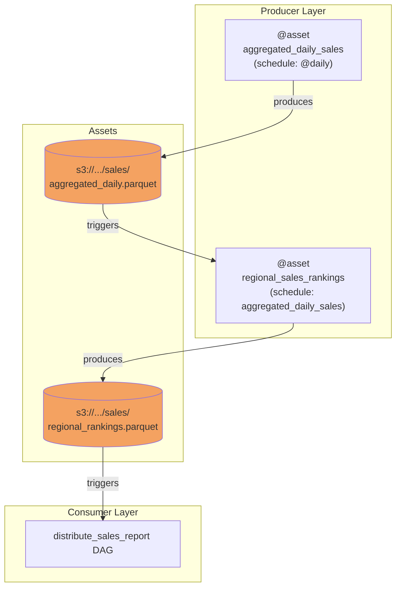

# Asset-Driven Scheduling — Code Examples

## Navigation
⬅️ **Prev: [What's New in Airflow 3](../30_Whats_New_in_Airflow_3/Theory.md)** | 🏠 **[Home](../../00_Learning_Guide/Learning_Path.md)** | ➡️ **Next: [DAG Versioning](../32_DAG_Versioning/Theory.md)**

---

## Example 1: Simple Producer-Consumer Pair

The most fundamental pattern. One DAG writes data and marks an asset as updated. Another DAG waits for that asset and runs as soon as it's updated.

```python
# dags/assets.py — shared asset definitions
from airflow.sdk import Asset

DAILY_ORDERS = Asset(
    uri="s3://data-lake/orders/daily.parquet",
    name="daily_orders",
    group="commerce",
    extra={"format": "parquet", "owner": "data-engineering"},
)
```

```python
# dags/producer_orders.py
from airflow import DAG
from airflow.decorators import task
from datetime import datetime
from assets import DAILY_ORDERS

with DAG(
    dag_id="extract_orders",
    start_date=datetime(2024, 1, 1),
    schedule="@daily",
    tags=["producer", "orders"],
) as dag:

    @task
    def connect_to_source() -> dict:
        """Verify connection to order management system."""
        print("Checking source system connectivity")
        return {"status": "connected", "record_count": 15420}

    @task(outlets=[DAILY_ORDERS])    # <-- marks asset as updated on success
    def extract_and_save(connection_info: dict) -> str:
        """Extract orders and write to S3."""
        import pandas as pd

        # Simulate extraction
        df = pd.DataFrame({
            "order_id": range(connection_info["record_count"]),
            "amount": [99.99] * connection_info["record_count"],
            "status": ["completed"] * connection_info["record_count"],
        })

        # Write to S3 (using ObjectStoragePath or boto3)
        output_path = "s3://data-lake/orders/daily.parquet"
        print(f"Writing {len(df)} orders to {output_path}")
        # df.to_parquet(output_path)  # actual write

        return output_path

    @task
    def log_completion(output_path: str):
        """Record extraction metadata."""
        print(f"Extraction complete. Output: {output_path}")

    info = connect_to_source()
    path = extract_and_save(info)
    log_completion(path)
```

```python
# dags/consumer_orders.py
from airflow import DAG
from airflow.decorators import task
from datetime import datetime
from assets import DAILY_ORDERS

with DAG(
    dag_id="process_orders",
    start_date=datetime(2024, 1, 1),
    schedule=[DAILY_ORDERS],    # <-- triggered by asset update, no fixed time
    tags=["consumer", "orders"],
) as dag:

    @task
    def load_fresh_orders(**context) -> int:
        """Load the freshly-updated orders."""
        # Inspect which asset event triggered this run
        triggering_events = context.get("triggering_asset_events", {})
        for uri, events in triggering_events.items():
            for event in events:
                print(f"Triggered by: {uri}")
                print(f"Source run: {event.source_dag_id} / {event.source_run_id}")
                print(f"Updated at: {event.timestamp}")

        # Load the data
        # df = pd.read_parquet("s3://data-lake/orders/daily.parquet")
        print("Loading orders from S3")
        return 15420  # simulated count

    @task
    def calculate_metrics(order_count: int) -> dict:
        """Calculate daily order metrics."""
        return {
            "total_orders": order_count,
            "target_achievement": order_count / 20000 * 100,
        }

    @task
    def push_to_dashboard(metrics: dict):
        """Push metrics to dashboard."""
        print(f"Dashboard updated: {metrics}")

    count = load_fresh_orders()
    metrics = calculate_metrics(count)
    push_to_dashboard(metrics)
```

---

## Example 2: Multiple Asset Dependencies

A reporting DAG that only runs when three upstream datasets are all fresh — orders, inventory, and customer data.

```python
# dags/assets.py — extend with more assets
from airflow.sdk import Asset

DAILY_ORDERS = Asset("s3://data-lake/orders/daily.parquet")
DAILY_INVENTORY = Asset("s3://data-lake/inventory/current.parquet")
CUSTOMER_PROFILES = Asset("s3://data-lake/customers/profiles.parquet")
```

```python
# dags/produce_inventory.py
from airflow import DAG
from airflow.decorators import task
from datetime import datetime
from assets import DAILY_INVENTORY

with DAG(
    dag_id="sync_inventory",
    start_date=datetime(2024, 1, 1),
    schedule="@daily",
) as dag:

    @task(outlets=[DAILY_INVENTORY])
    def sync_from_wms():
        """Sync inventory from Warehouse Management System."""
        print("Syncing inventory — runs independently of orders")
        # May finish before or after orders extraction
```

```python
# dags/produce_customers.py
from airflow import DAG
from airflow.decorators import task
from datetime import datetime
from assets import CUSTOMER_PROFILES

with DAG(
    dag_id="refresh_customers",
    start_date=datetime(2024, 1, 1),
    schedule="@weekly",   # customers refresh less frequently
) as dag:

    @task(outlets=[CUSTOMER_PROFILES])
    def refresh_from_crm():
        """Pull latest customer data from CRM."""
        print("Customer profiles refreshed")
```

```python
# dags/unified_report.py — runs only when ALL THREE are fresh
from airflow import DAG
from airflow.decorators import task
from datetime import datetime
from assets import DAILY_ORDERS, DAILY_INVENTORY, CUSTOMER_PROFILES

with DAG(
    dag_id="unified_business_report",
    start_date=datetime(2024, 1, 1),
    # ALL THREE must be updated since last run — AND logic
    schedule=[DAILY_ORDERS, DAILY_INVENTORY, CUSTOMER_PROFILES],
    tags=["reporting", "consumer"],
) as dag:

    @task
    def verify_inputs(**context) -> dict:
        """Log which assets triggered this run."""
        events = context.get("triggering_asset_events", {})
        print(f"Assets that triggered this run: {list(events.keys())}")

        return {
            "orders_uri": "s3://data-lake/orders/daily.parquet",
            "inventory_uri": "s3://data-lake/inventory/current.parquet",
            "customers_uri": "s3://data-lake/customers/profiles.parquet",
        }

    @task
    def join_datasets(paths: dict) -> int:
        """Join all three datasets."""
        print(f"Joining {paths}")
        # df_orders = pd.read_parquet(paths["orders_uri"])
        # df_inventory = pd.read_parquet(paths["inventory_uri"])
        # df_customers = pd.read_parquet(paths["customers_uri"])
        # merged = df_orders.merge(df_customers, ...).merge(df_inventory, ...)
        return 15000  # row count

    @task
    def generate_report(row_count: int):
        """Generate and distribute the unified report."""
        print(f"Report generated with {row_count} rows")
        # send email, push to S3, update dashboard

    paths = verify_inputs()
    count = join_datasets(paths)
    generate_report(count)
```

```python
# dags/flexible_report.py — OR logic: run when EITHER orders or events update
from airflow import DAG
from airflow.decorators import task
from airflow.sdk import Asset, AssetAny
from datetime import datetime

ORDERS = Asset("s3://data-lake/orders/daily.parquet")
EVENTS = Asset("s3://data-lake/events/stream.json")

with DAG(
    dag_id="flexible_alerts",
    start_date=datetime(2024, 1, 1),
    schedule=AssetAny(ORDERS, EVENTS),   # OR: either one triggers the DAG
) as dag:

    @task
    def check_alerts(**context):
        events = context.get("triggering_asset_events", {})
        triggered_by = list(events.keys())
        print(f"Alert check triggered by: {triggered_by}")
```

---

## Example 3: @asset Decorator with Asset Metadata

Using the `@asset` decorator to combine asset definition and producing function, with rich metadata and chained consumers.

```python
# dags/asset_decorated.py
from airflow.sdk import asset, Asset
from airflow import DAG
from airflow.decorators import task
from datetime import datetime

# @asset creates the Asset AND its producing DAG in one declaration
@asset(
    uri="s3://data-lake/sales/aggregated_daily.parquet",
    schedule="@daily",
    start_date=datetime(2024, 1, 1),
    # Additional DAG-level config
    tags=["sales", "aggregation"],
    default_args={"retries": 2, "retry_delay": 300},
)
def aggregated_daily_sales():
    """
    Aggregates raw transaction data into daily sales summary.
    Reads from: s3://data-lake/transactions/raw/
    Writes to: s3://data-lake/sales/aggregated_daily.parquet
    """
    import pandas as pd

    # Read raw transactions
    # df_raw = pd.read_parquet("s3://data-lake/transactions/raw/")
    df_raw = pd.DataFrame({
        "transaction_id": range(1000),
        "amount": [49.99] * 1000,
        "product_id": [f"P{i % 50}" for i in range(1000)],
        "region": ["north", "south", "east", "west"] * 250,
    })

    # Aggregate
    daily_summary = (
        df_raw
        .groupby(["product_id", "region"])
        .agg(
            total_revenue=("amount", "sum"),
            transaction_count=("transaction_id", "count"),
        )
        .reset_index()
    )

    print(f"Aggregated {len(df_raw)} transactions into {len(daily_summary)} rows")
    # daily_summary.to_parquet("s3://data-lake/sales/aggregated_daily.parquet")

    return {
        "row_count": len(daily_summary),
        "total_revenue": float(df_raw["amount"].sum()),
    }


@asset(
    uri="s3://data-lake/sales/regional_rankings.parquet",
    # This asset consumes aggregated_daily_sales and produces its own asset
    schedule=[aggregated_daily_sales],   # reference the @asset function directly
    start_date=datetime(2024, 1, 1),
    tags=["sales", "rankings"],
)
def regional_sales_rankings(**context):
    """
    Computes regional sales rankings from the daily aggregation.
    Triggered automatically when aggregated_daily_sales is updated.
    """
    triggering = context.get("triggering_asset_events", {})
    print(f"Computing rankings. Triggered by: {list(triggering.keys())}")

    # Read the upstream asset
    # df = pd.read_parquet("s3://data-lake/sales/aggregated_daily.parquet")
    df = pd.DataFrame({
        "region": ["north", "south", "east", "west"],
        "total_revenue": [45000, 32000, 61000, 28000],
    })

    df["rank"] = df["total_revenue"].rank(ascending=False).astype(int)
    df_ranked = df.sort_values("rank")

    print(f"Rankings: {df_ranked.to_dict('records')}")
    # df_ranked.to_parquet("s3://data-lake/sales/regional_rankings.parquet")

    return df_ranked.to_dict("records")


# Final consumer DAG — uses explicit DAG definition (complex multi-task logic)
from airflow.sdk import AssetAlias

# Create an alias so downstream consumers don't need to know the exact URI
RANKINGS_ALIAS = AssetAlias("latest_regional_rankings")

with DAG(
    dag_id="distribute_sales_report",
    start_date=datetime(2024, 1, 1),
    # Consume via alias — more stable than hardcoding URI
    schedule=[regional_sales_rankings],
    tags=["reporting", "distribution"],
) as dag:

    @task
    def format_email_report(**context) -> str:
        """Format rankings into email HTML."""
        events = context.get("triggering_asset_events", {})
        print(f"Formatting report. Upstream events: {list(events.keys())}")

        # Load rankings
        # rankings = pd.read_parquet("s3://data-lake/sales/regional_rankings.parquet")
        html = "<h1>Daily Sales Rankings</h1><p>Report generated by Airflow 3</p>"
        return html

    @task
    def send_to_stakeholders(html_content: str):
        """Email report to stakeholders."""
        print(f"Sending email: {len(html_content)} chars")
        # send_email(to=["executives@company.com"], subject="Daily Sales", html_content=html_content)

    @task
    def update_slack_digest(html_content: str):
        """Post summary to Slack channel."""
        print(f"Posting to Slack")
        # slack_hook.send_message(text="Daily sales report ready")

    report = format_email_report()
    send_to_stakeholders(report)
    update_slack_digest(report)
```

---

## Visualizing the Full Chain



---

## Navigation
⬅️ **Prev: [What's New in Airflow 3](../30_Whats_New_in_Airflow_3/Theory.md)** | 🏠 **[Home](../../00_Learning_Guide/Learning_Path.md)** | ➡️ **Next: [DAG Versioning](../32_DAG_Versioning/Theory.md)**
