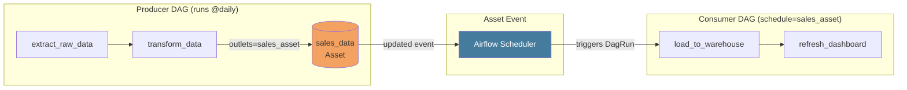

# Asset-Driven Scheduling in Airflow 3

## Navigation
⬅️ **Prev: [What's New in Airflow 3](../30_Whats_New_in_Airflow_3/Theory.md)** | 🏠 **[Home](../../00_Learning_Guide/Learning_Path.md)** | ➡️ **Next: [DAG Versioning](../32_DAG_Versioning/Theory.md)**

---

## The Story

Traditional Airflow: DAG A runs at 6am, DAG B runs at 7am hoping DAG A is done. What if DAG A finishes at 6:47am? DAG B either waits pointlessly or fails. What if there's an upstream delay and DAG A doesn't finish until 7:12am? DAG B has already started and is reading stale data.

Fixed schedules are assumptions about duration, and assumptions break. Assets fix this — DAG B runs WHEN the data is ready, not at a fixed time. The data itself becomes the trigger.

This is the shift from time-based coupling to data-based coupling. Your pipelines react to reality instead of betting on a schedule.

---

## What Are Assets?

An Asset in Airflow 3 is a named entity that represents a data artifact — a file, a database table, an API result, or any piece of data your pipeline produces or consumes. Assets are identified by a URI string.

Assets are not the data itself. They are a logical reference that Airflow tracks. When a task declares it produces an Asset, Airflow notes that the Asset was updated. When a DAG declares it should run when an Asset is updated, Airflow triggers it.

```python
from airflow.sdk import Asset

# Defining an Asset — just a URI string with optional metadata
daily_sales_report = Asset(
    uri="s3://data-warehouse/reports/daily_sales.parquet",
    name="daily_sales_report",        # optional human-readable name
    group="sales",                     # optional grouping
    extra={"owner": "data-team",       # optional metadata
            "format": "parquet",
            "sla_minutes": 60},
)
```

The URI is the primary identifier. Two `Asset` objects with the same URI refer to the same asset, regardless of where they're defined.

---

## Defining Assets

```python
from airflow.sdk import Asset

# Minimal definition
user_events = Asset("s3://bucket/events/users.json")

# Full definition with metadata
processed_orders = Asset(
    uri="s3://data-lake/orders/processed/",
    name="processed_orders",
    group="commerce",
    extra={
        "description": "Orders after deduplication and validation",
        "format": "parquet",
        "partition_key": "order_date",
    },
)

# Database table as an asset
customer_summary = Asset(
    uri="postgres://warehouse/public/customer_summary",
    name="customer_summary_table",
)
```

---

## Asset-Producing DAGs (outlets)

A task declares it produces an asset using `outlets=[asset]`. When that task completes successfully, Airflow marks the asset as updated.

```python
from airflow import DAG
from airflow.decorators import task
from airflow.sdk import Asset
from datetime import datetime

# Define the asset
sales_data = Asset("s3://data-lake/sales/daily.parquet")

with DAG(
    dag_id="produce_sales_data",
    start_date=datetime(2024, 1, 1),
    schedule="@daily",
) as dag:

    @task(outlets=[sales_data])   # This task produces the asset
    def extract_and_save():
        import pandas as pd
        # ... extract data ...
        df = pd.DataFrame({"sales": [100, 200, 300]})
        # ... save to S3 ...
        # When this task completes successfully, Airflow marks sales_data as updated
        return "done"

    extract_and_save()
```

Multiple tasks can produce the same asset. Multiple assets can be produced by one task:

```python
asset_a = Asset("s3://bucket/table_a.csv")
asset_b = Asset("s3://bucket/table_b.csv")

@task(outlets=[asset_a, asset_b])   # produces two assets at once
def produce_both():
    # ... write both files ...
    pass
```

---

## Asset-Consuming DAGs (schedule)

A DAG declares it runs when assets are updated by passing assets as the `schedule` parameter.

```python
from airflow import DAG
from airflow.decorators import task
from airflow.sdk import Asset
from datetime import datetime

# Reference the same asset URI
sales_data = Asset("s3://data-lake/sales/daily.parquet")

with DAG(
    dag_id="consume_sales_data",
    start_date=datetime(2024, 1, 1),
    schedule=[sales_data],    # Run when this asset is updated
) as dag:

    @task
    def process_sales():
        # This DAG runs automatically whenever produce_sales_data
        # successfully updates the sales_data asset
        print("Processing fresh sales data")

    process_sales()
```

---

## The Full Picture: Producer → Asset → Consumer



When `transform_data` completes:
1. Airflow marks `sales_data` as updated
2. The Scheduler detects the consumer DAG's dependency is satisfied
3. A new DagRun is created for the consumer DAG
4. The consumer DAG runs immediately — no fixed schedule needed

---

## Multiple Asset Dependencies (AND Logic)

By default, listing multiple assets in `schedule` creates AND logic: all assets must be updated before the DAG runs.

```python
from airflow.sdk import Asset

orders_asset = Asset("s3://data/orders.parquet")
inventory_asset = Asset("s3://data/inventory.parquet")
customers_asset = Asset("s3://data/customers.parquet")

# This DAG only runs when ALL THREE assets have been updated
with DAG(
    dag_id="unified_report",
    start_date=datetime(2024, 1, 1),
    schedule=[orders_asset, inventory_asset, customers_asset],
) as dag:

    @task
    def build_unified_report():
        # Safe to assume all three datasets are fresh
        print("All inputs ready — building report")

    build_unified_report()
```

Airflow tracks which assets have been updated since the last DagRun. Only when ALL listed assets have been updated (at least once) does Airflow trigger a new run.

### Conditional Asset Scheduling (OR Logic)

For OR logic (run when ANY asset is updated), use `AssetAny`:

```python
from airflow.sdk import Asset, AssetAny, AssetAll

orders = Asset("s3://data/orders.parquet")
events = Asset("s3://data/events.json")

# Run when orders OR events is updated
with DAG(
    dag_id="flexible_pipeline",
    schedule=AssetAny(orders, events),
) as dag:
    ...

# Run when (orders AND events) — equivalent to schedule=[orders, events]
with DAG(
    dag_id="strict_pipeline",
    schedule=AssetAll(orders, events),
) as dag:
    ...

# Complex: (orders AND events) OR (customers)
customers = Asset("s3://data/customers.parquet")

with DAG(
    dag_id="complex_pipeline",
    schedule=AssetAny(AssetAll(orders, events), customers),
) as dag:
    ...
```

---

## The @asset Decorator (New in Airflow 3)

In Airflow 3, you can define an asset and its producing function together using the `@asset` decorator. This is a more functional, concise pattern.

```python
from airflow.sdk import asset, Asset
from datetime import datetime

# @asset creates both the asset and the DAG that produces it
@asset(
    uri="s3://data-lake/sales/daily.parquet",
    schedule="@daily",
    start_date=datetime(2024, 1, 1),
)
def daily_sales():
    """This function IS the asset-producing task."""
    import pandas as pd
    df = pd.DataFrame({"sales": [100, 200, 300]})
    # save df to S3
    return df

# daily_sales is now both an Asset reference and a DAG
# You can use it in a consumer DAG's schedule:
from airflow import DAG

with DAG(
    dag_id="downstream_report",
    schedule=[daily_sales],   # Reference the @asset decorated function directly
    start_date=datetime(2024, 1, 1),
) as dag:

    @task
    def build_report():
        print("Sales data is ready")

    build_report()
```

The `@asset` decorator is syntactic sugar — it creates:
1. An `Asset` object with the given URI
2. A DAG with a single task that runs the decorated function
3. An outlet connection from that task to the asset

---

## Asset Aliases (New in Airflow 3)

Asset aliases let you create stable references that can point to different underlying assets. Useful when asset URIs change or when you want to reference a "latest" version without hardcoding the URI.

```python
from airflow.sdk import Asset, AssetAlias

# Define the real asset
versioned_report = Asset("s3://data/reports/2024-03-15/sales.parquet")

# Create an alias — "latest_sales_report" always points to the most recent
latest_report = AssetAlias("latest_sales_report")

# Producer updates both the asset and the alias
@task(outlets=[versioned_report, latest_report])
def generate_report():
    # ... generate and upload report ...
    pass

# Consumer can schedule on the alias
with DAG(
    dag_id="report_consumer",
    schedule=[latest_report],   # Will trigger whenever the alias is updated
) as dag:
    ...
```

---

## Asset Lineage in the UI

Airflow 3's UI includes an asset lineage view. It shows:

- Which DAGs produce which assets
- Which DAGs consume which assets
- The full dependency graph across multiple producer-consumer chains
- Asset update history (when was each asset last updated)
- Which DagRuns were triggered by each asset update

Navigate to: **Assets** menu → select an asset → **Lineage** tab.

---

## Airflow 2 Datasets vs Airflow 3 Assets

| Feature | Airflow 2 (Datasets) | Airflow 3 (Assets) |
|---------|---------------------|-------------------|
| Class name | `Dataset` | `Asset` |
| Import path | `from airflow.datasets import Dataset` | `from airflow.sdk import Asset` |
| @asset decorator | Not available | Available |
| Asset aliases | Not available | `AssetAlias` |
| AssetAny / AssetAll | Not available | Available |
| Extra metadata | Basic | Enhanced with `group`, richer `extra` |
| UI lineage view | Basic | Full lineage graph |
| Multiple asset logic | AND only | AND, OR, complex combinations |
| Asset groups | Not available | `group=` parameter |

If you have existing Datasets in Airflow 2, rename `Dataset` to `Asset` and update the import. The URI-based matching means existing DagRun history is preserved.

---

## Best Practices

**Use descriptive URIs that reflect actual data locations.** `s3://bucket/path/file.csv` is better than `my_dataset`. The URI should be where the data actually lives.

**One asset per logical data entity.** Don't create one asset for an entire schema — create one per table or file that downstream pipelines depend on.

**Keep asset definitions in a shared module.** Define assets in `dags/assets.py` and import them into producer and consumer DAGs. This ensures the URI string is identical (no typos).

```python
# dags/assets.py
from airflow.sdk import Asset

SALES_ASSET = Asset("s3://data-lake/sales/daily.parquet")
INVENTORY_ASSET = Asset("s3://data-lake/inventory/current.parquet")
CUSTOMER_ASSET = Asset("s3://data-lake/customers/active.parquet")
```

```python
# dags/producer.py
from assets import SALES_ASSET

@task(outlets=[SALES_ASSET])
def produce():
    ...
```

```python
# dags/consumer.py
from assets import SALES_ASSET

with DAG(schedule=[SALES_ASSET]) as dag:
    ...
```

---

## Navigation
⬅️ **Prev: [What's New in Airflow 3](../30_Whats_New_in_Airflow_3/Theory.md)** | 🏠 **[Home](../../00_Learning_Guide/Learning_Path.md)** | ➡️ **Next: [DAG Versioning](../32_DAG_Versioning/Theory.md)**
