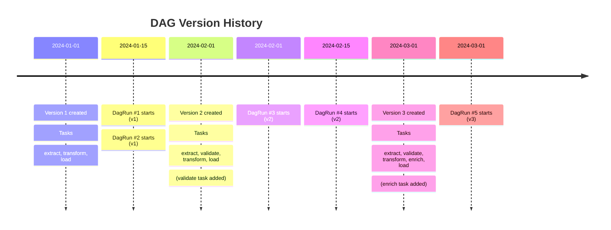

# DAG Versioning in Airflow 3

## Navigation
⬅️ **Prev: [Asset-Driven Scheduling](../31_Asset_Driven_Scheduling/Theory.md)** | 🏠 **[Home](../../00_Learning_Guide/Learning_Path.md)** | ➡️ **Next: [New Auth Manager](../33_New_Auth_Manager/Theory.md)**

---

## The Story

You updated a DAG that was in mid-run. Old runs now show the new task structure — tasks that didn't exist when those runs started appear as "missing", and tasks you renamed show as failed. It's confusing. You can't tell what the DAG looked like when a given run executed.

DAG versioning in Airflow 3 solves this by tracking changes to DAG definitions. When you modify a DAG, the previous version is stored in the metadata database. Historical DagRuns are displayed with the version of the DAG that was active at that time — eliminating the confusion of seeing new task structures overlaid on old runs.

---

## How DAG Versioning Works

### Version Creation

Every time Airflow's DAG Processor parses a DAG file and detects a structural change, it creates a new version entry in the metadata database. A version is created when:

- A task is added to the DAG
- A task is removed from the DAG
- A task is renamed
- Task dependencies change (the order of `>>` operations)
- The DAG's schedule, start_date, or other structural parameters change

**Not every parse creates a new version.** The DAG Processor computes a hash of the DAG structure. If the hash matches the current version, no new version is created. Minor changes like updating a task's `bash_command` string (without changing task structure) may or may not create a new version depending on what's included in the structural hash.

### Version Storage

Versions are stored in the `dag_version` table in the metadata database. Each version contains:

- A version number (incrementing integer per DAG)
- A timestamp of when it was created
- A serialized representation of the DAG structure at that point
- The DAG's git commit hash (if `[dag_processor] store_serialized_dags_source` is enabled)

### Version Assignment to DagRuns

When a DagRun is created, it is tagged with the current DAG version at creation time. The version is immutable for that run — even if the DAG changes while the run is executing, the run retains its original version tag.



DagRuns 1 and 2 are stored as v1 runs. When you view them in the UI, you see the v1 task structure (extract, transform, load) — not the current v3 structure. This is the core benefit.

---

## Impact on Historical Runs

### Before DAG Versioning (Airflow 2 behavior)

In Airflow 2, all historical runs displayed the current DAG structure. If you added a `validate` task in February and then viewed a January run, you would see `validate` as a task that "never ran" in January. This was technically accurate but visually confusing — it looked like a skipped or missing task.

If you renamed a task (e.g., `transform` → `transform_v2`), the old run would show `transform_v2` as never having run, and `transform` would be absent, even though the original task completed successfully.

### With DAG Versioning (Airflow 3 behavior)

Each historical run is rendered with the DAG structure that was active when it ran. A January run shows the January task structure. A March run shows the March task structure. There is no pollution of old runs with new task definitions.

This dramatically improves:
- **Debugging**: When investigating a failed run from 2 months ago, you see exactly what the pipeline looked like then
- **Auditing**: Compliance teams can see what code ran on a given date
- **SLA review**: You can compare runs across versions without confusion

---

## Viewing Versions in the UI

### DAG Page — Version Selector

On any DAG's detail page in the Airflow 3 UI:
1. A **Version** dropdown appears at the top of the page
2. You can select any historical version to see that version's task graph
3. The graph view updates to show that version's structure

### DagRun Page — Version Tag

Each DagRun in the run list shows its version number. Clicking a DagRun shows the task graph using that run's version — not the current version.

### Version History Tab

The DAG detail page has a **Versions** tab listing all versions with:
- Version number
- Creation timestamp
- Summary of changes (tasks added/removed)
- Link to view that version's graph

---

## Best Practices for DAG Changes

### Additive Changes Are Safe

Adding new tasks or changing task logic (but not structure) is safe at any time. Running DagRuns continue with their version. New DagRuns pick up the new version.

### Destructive Changes Require Care

Removing tasks or renaming tasks while runs are in progress creates edge cases:

```
# Situation: rename task while a run is executing
# v1:  extract >> transform >> load
# v2:  extract >> transform_v2 >> load (renamed)

# A DagRun that started on v1 and is mid-execution:
# - extract: COMPLETE (v1)
# - transform: RUNNING (v1) — but you renamed it to transform_v2
# - load: not started

# Result: The run completes under v1. transform completes successfully.
# The v2 definition (transform_v2) is picked up by new runs only.
```

The safest approach for significant restructuring is to **use a new DAG ID** rather than modifying an existing one. Let the old DAG run to completion (or pause it) and create `my_dag_v2`. This is explicit, auditable, and avoids all version edge cases.

### Versioning and Backfills

Backfills in Airflow 3 use the current DAG version by default. If you are backfilling periods that predate the current version, the tasks run with the current code but are displayed in the UI under the original version for that time period.

If the task structure changed significantly between versions, be careful with backfills — a task that didn't exist in the original run might be required in the current version.

### Version Cleanup

Versions accumulate over time. The metadata database grows with every structural change. Configure cleanup:

```ini
# airflow.cfg
[scheduler]
# Keep only the last N versions per DAG
max_dag_versions_to_store = 10
```

Old versions beyond the limit are purged. DagRuns associated with purged versions retain their task instance data but lose the visual version graph — they fall back to showing the earliest retained version.

---

## DAG Versioning and Code Reviews

DAG versioning in Airflow complements (but does not replace) version control in git. Best practice is to use both:

| Concern | Tool |
|---------|------|
| Track code changes | git |
| Review changes before deploy | Pull requests |
| Associate runs with code | DAG versioning in Airflow |
| Rollback code | git revert + redeploy |
| View run history by version | Airflow UI version selector |

If you store DAG files in git, you can configure the DAG Processor to record the git commit hash with each version:

```ini
# airflow.cfg
[dag_processor]
store_dag_code = True
```

This lets you trace a DagRun back to the exact git commit that produced it.

---

## Navigation
⬅️ **Prev: [Asset-Driven Scheduling](../31_Asset_Driven_Scheduling/Theory.md)** | 🏠 **[Home](../../00_Learning_Guide/Learning_Path.md)** | ➡️ **Next: [New Auth Manager](../33_New_Auth_Manager/Theory.md)**
