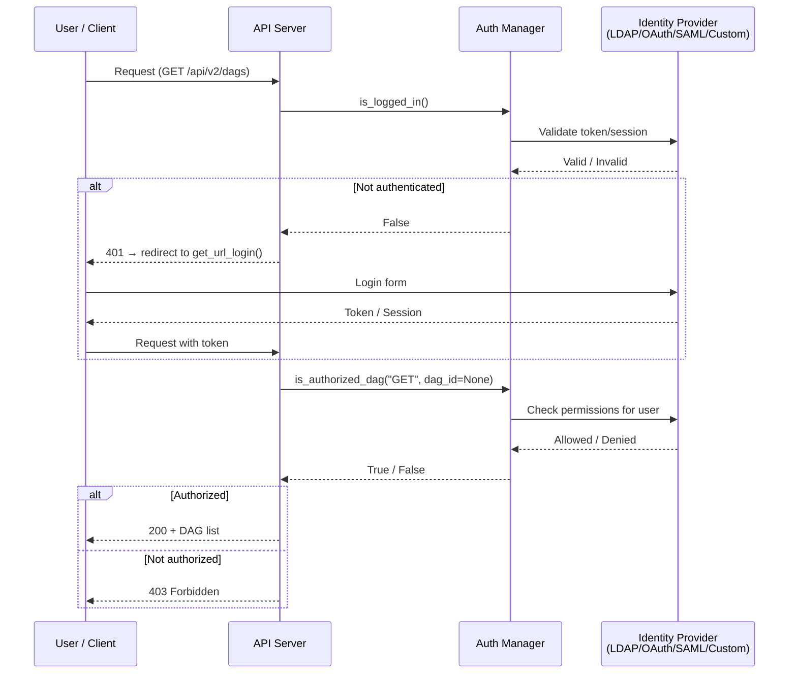

# New Auth Manager in Airflow 3

## Navigation
⬅️ **Prev: [DAG Versioning](../32_DAG_Versioning/Theory.md)** | 🏠 **[Home](../../00_Learning_Guide/Learning_Path.md)** | ➡️ **Next: [Edge Executor](../34_Edge_Executor/Theory.md)**

---

## 📌 Learning Priority

**Must Learn** — core concepts, needed to understand the rest of this file:
[Auth Manager Interface](#the-auth-manager-interface) · [Auth Flow](#auth-flow) · [Available Auth Managers](#available-auth-managers)

**Should Learn** — important for real projects and interviews:
[FAB Auth Manager](#fab-auth-manager-airflow-2-compatible--now-a-provider) · [JWT API Authentication](#api-authentication-jwt-tokens) · [Migrating from Airflow 2](#migrating-from-airflow-2-fab-auth-to-airflow-3)

**Good to Know** — useful in specific situations, not needed daily:
[Custom Auth Manager](#custom-auth-manager) · [Multi-Tenancy Support](#multi-tenancy-support)

**Reference** — skim once, look up when needed:
[RBAC Roles Table](#rbac-with-the-new-auth-manager) · [Simple Auth Manager](#simple-auth-manager-new-in-airflow-3--development-default)

---

## The Story

Airflow 2 used Flask AppBuilder (FAB) for auth — powerful but tightly coupled. Authentication, authorization, user management, and role definitions were all baked into FAB's data model and embedded in the Webserver. Swapping to LDAP meant configuring FAB's LDAP integration. Adding SAML meant FAB's SAML plugin. Custom SSO meant extending FAB views.

Airflow 3 introduces a pluggable Auth Manager interface, letting you plug in any auth system: LDAP, OAuth, SAML, or your company's custom SSO. The interface defines what Airflow needs (can this user access DAG X? is this user an admin?) and your auth manager answers those questions however it wants. Airflow doesn't care how.

---

## The Auth Manager Interface

The `BaseAuthManager` abstract class defines the contract every auth manager must fulfill:

```python
# Conceptual — the interface Airflow 3 expects
from airflow.auth.managers.base_auth_manager import BaseAuthManager

class MyCustomAuthManager(BaseAuthManager):

    def is_logged_in(self) -> bool:
        """Is the current request authenticated?"""
        ...

    def get_user(self) -> UserModel:
        """Return the current user object."""
        ...

    def is_authorized_dag(
        self,
        method: str,        # GET, POST, PUT, DELETE
        access_entity: str | None,  # specific dag_id or None for all
    ) -> bool:
        """Can the current user perform method on this DAG?"""
        ...

    def is_authorized_connection(self, method: str, ...) -> bool: ...
    def is_authorized_variable(self, method: str, ...) -> bool: ...
    def is_authorized_pool(self, method: str, ...) -> bool: ...
    def is_authorized_asset(self, method: str, ...) -> bool: ...
    def get_url_login(self, **kwargs) -> str:
        """URL to redirect unauthenticated users to."""
        ...
    def get_url_logout(self) -> str: ...
```

The API Server calls these methods on every request. The auth manager decides the answer — checking a database, querying LDAP, validating a JWT token, or delegating to an external service.

---

## Auth Flow



---

## Available Auth Managers

### Simple Auth Manager (New in Airflow 3 — Development Default)

A minimal auth manager that stores users and passwords in `airflow.cfg`. Not for production — there's no encryption and no integration with external systems.

```ini
# airflow.cfg
[core]
auth_manager = airflow.auth.managers.simple.SimpleAuthManager

[simple_auth_manager]
# Comma-separated list of usernames with admin access
admin_users = admin,developer

# Passwords defined as environment variables:
# AIRFLOW_SIMPLE_AUTH_MANAGER_PASSWORDS_ADMIN=mypassword
# AIRFLOW_SIMPLE_AUTH_MANAGER_PASSWORDS_DEVELOPER=devpass
```

Use for: local development, quick demos, testing.

### FAB Auth Manager (Airflow 2 Compatible — Now a Provider)

Flask AppBuilder auth is still available but is now delivered as a provider package rather than built into core Airflow.

```bash
pip install apache-airflow-providers-fab
```

```ini
# airflow.cfg
[core]
auth_manager = airflow.providers.fab.auth_manager.FabAuthManager
```

The FAB auth manager supports:
- Username/password with DB storage
- OAuth (Google, GitHub, Azure AD, etc.)
- LDAP
- Kerberos
- Remote user auth (for reverse proxy setups)

If you're migrating from Airflow 2 and already have FAB users/roles configured, install the FAB provider and set this config — existing users and roles are preserved.

### Custom Auth Manager

For enterprise SSO, custom permissions systems, or multi-tenant setups, implement your own.

```python
# my_auth_manager/auth_manager.py
from airflow.auth.managers.base_auth_manager import BaseAuthManager
from airflow.auth.managers.models.resource_details import (
    DagDetails, ConnectionDetails, VariableDetails,
)
from flask import request
import jwt

class CompanySSOAuthManager(BaseAuthManager):

    def is_logged_in(self) -> bool:
        """Check JWT token from Authorization header."""
        auth_header = request.headers.get("Authorization", "")
        if not auth_header.startswith("Bearer "):
            return False
        token = auth_header[7:]
        try:
            self._current_user = jwt.decode(
                token,
                self.app.config["SSO_PUBLIC_KEY"],
                algorithms=["RS256"],
            )
            return True
        except jwt.InvalidTokenError:
            return False

    def get_user(self):
        return self._current_user

    def is_authorized_dag(self, method: str, details: DagDetails | None = None) -> bool:
        """Check against company's permission service."""
        user = self.get_user()
        dag_id = details.id if details else None
        return self._check_permission(user["sub"], f"airflow:dag:{dag_id or '*'}:{method}")

    def _check_permission(self, user_id: str, permission: str) -> bool:
        """Call internal permission service."""
        import requests as req
        response = req.get(
            f"https://permissions.company.internal/check",
            params={"user": user_id, "permission": permission},
            headers={"X-Service-Token": self.app.config["SERVICE_TOKEN"]},
        )
        return response.json().get("allowed", False)

    def get_url_login(self, **kwargs) -> str:
        return "https://sso.company.internal/login?redirect=https://airflow.company.internal"

    def get_url_logout(self) -> str:
        return "https://sso.company.internal/logout"
```

```ini
# airflow.cfg
[core]
auth_manager = my_auth_manager.auth_manager.CompanySSOAuthManager

[company_sso]
sso_public_key_path = /secrets/sso_public_key.pem
service_token_env = AIRFLOW_SERVICE_TOKEN
```

---

## RBAC with the New Auth Manager

Each auth manager defines its own roles model. With the FAB auth manager, the roles are the same as Airflow 2:

| Role | Access Level |
|------|-------------|
| `Admin` | Full access to all resources |
| `User` | View and trigger DAGs, view task logs |
| `Viewer` | View only — no trigger, no edit |
| `Op` | Operate — trigger, clear, mark state; no admin |
| `Public` | No access (for unauthenticated users) |

With a custom auth manager, you define your own roles and the authorization logic. Airflow doesn't enforce a specific role model — it only calls `is_authorized_*` methods and acts on True/False responses.

---

## API Authentication: JWT Tokens

The Airflow 3 API Server supports JWT-based authentication for REST API access. This is separate from the UI session auth.

```python
import requests

# Step 1: Get a token
response = requests.post(
    "http://airflow:8080/auth/token",
    json={"username": "admin", "password": "admin"},
)
token = response.json()["access_token"]

# Step 2: Use token in subsequent requests
headers = {"Authorization": f"Bearer {token}"}

# Trigger a DAG run
response = requests.post(
    "http://airflow:8080/api/v2/dags/my_dag/dagRuns",
    json={"conf": {"date": "2024-03-15"}},
    headers=headers,
)
print(response.json())
```

JWT tokens have an expiry. Refresh using the refresh token endpoint:

```python
refresh_response = requests.post(
    "http://airflow:8080/auth/token/refresh",
    json={"refresh_token": refresh_token},
)
new_access_token = refresh_response.json()["access_token"]
```

Configure token lifetime:

```ini
# airflow.cfg
[api_server]
# Access token lifetime in seconds (default: 900 = 15 minutes)
access_token_lifetime = 900
# Refresh token lifetime in seconds (default: 2592000 = 30 days)
refresh_token_lifetime = 2592000
```

---

## Migrating from Airflow 2 FAB Auth to Airflow 3

If you were using FAB auth in Airflow 2:

1. Install the FAB provider: `pip install apache-airflow-providers-fab`
2. Set the auth manager in config:
   ```ini
   [core]
   auth_manager = airflow.providers.fab.auth_manager.FabAuthManager
   ```
3. Run `airflow db migrate` — existing FAB users/roles are preserved
4. Verify all users can log in
5. Verify RBAC roles still work as expected

If you were using OAuth or LDAP via FAB, those configurations move into the FAB provider's configuration namespace rather than the `[webserver]` section.

---

## Multi-Tenancy Support

Airflow 3's auth manager interface supports multi-tenancy through DAG-level access control. Implement `is_authorized_dag` to check not just the user's global role, but also the specific DAG ID:

```python
def is_authorized_dag(self, method: str, details: DagDetails | None = None) -> bool:
    user = self.get_user()
    dag_id = details.id if details else None

    # Global admin always allowed
    if user.get("role") == "admin":
        return True

    # Team-based access
    if dag_id and dag_id.startswith("team_a_"):
        return "team_a" in user.get("teams", [])

    if dag_id and dag_id.startswith("team_b_"):
        return "team_b" in user.get("teams", [])

    # Viewer can see all DAGs
    return method == "GET"
```

This lets you run one Airflow installation serving multiple teams, where each team only sees and controls their own DAGs.

---

## Navigation
⬅️ **Prev: [DAG Versioning](../32_DAG_Versioning/Theory.md)** | 🏠 **[Home](../../00_Learning_Guide/Learning_Path.md)** | ➡️ **Next: [Edge Executor](../34_Edge_Executor/Theory.md)**
