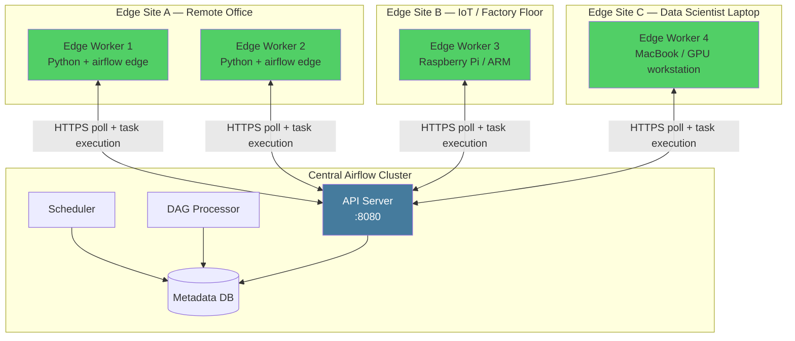

# Edge Executor in Airflow 3

## Navigation
⬅️ **Prev: [New Auth Manager](../33_New_Auth_Manager/Theory.md)** | 🏠 **[Home](../../00_Learning_Guide/Learning_Path.md)** | ➡️ **Next: [Event-Driven Scheduling](../35_Event_Driven_Scheduling/Theory.md)**

---

## The Story

Your company has data engineers running pipelines on laptops, IoT devices, and remote servers that can't run a full Airflow cluster. You have a factory floor with a local server that runs quality control checks on sensor data — but that server has no reliable connection to your central database and can't run a Celery broker. You have a data science team with GPU workstations that need to run ML training tasks locally.

Edge Executor is Airflow 3's answer. A lightweight executor that runs tasks at the "edge" — on remote machines, IoT devices, or low-resource nodes — with minimal dependencies. The edge worker connects to the central Airflow API Server over HTTP. No broker, no direct database access, just an HTTP connection.

---

## What Is the Edge Executor?

The Edge Executor extends Airflow's execution model beyond the central cluster. Traditional executors (LocalExecutor, CeleryExecutor, KubernetesExecutor) run tasks on machines that are part of the Airflow deployment infrastructure — they need access to the metadata database or a message broker.

Edge Workers are different:
- They run on machines completely separate from the Airflow cluster
- They only need HTTPS access to the API Server
- No broker (no Redis/RabbitMQ required)
- No direct database access
- Minimal dependencies — just `apache-airflow` and the edge worker component
- Can be registered dynamically without cluster reconfiguration

---

## Architecture



### How the Edge Worker Communicates

The Edge Worker uses an HTTP polling model:

1. The Edge Worker sends a `GET /api/v2/edge/worker/tasks` request to the API Server asking "do you have any tasks for me?"
2. The API Server returns tasks assigned to this worker's queue
3. The Edge Worker executes the task locally
4. The Edge Worker reports task state updates back via `PATCH /api/v2/edge/tasks/{task_instance_id}`
5. Task logs are streamed back to the API Server via periodic `POST /api/v2/edge/logs/{task_instance_id}`

The polling interval is configurable. In low-latency environments, set it to 1–5 seconds. In battery-constrained IoT deployments, set it to 30–60 seconds.

---

## Use Cases

**Remote data processing**: A regional office has a local SQL Server. A task runs a stored procedure on that server. Rather than exposing the database to the internet, an Edge Worker runs locally at the office and connects to the local database.

**IoT and sensor pipelines**: A factory floor sensor generates quality control data. An Edge Worker on the factory floor processes the data locally, reducing bandwidth — only the aggregated results travel to the central system.

**GPU workstations**: ML training tasks require specific GPU hardware. Edge Workers on GPU machines pick up training tasks from the central Airflow scheduler. The scheduler doesn't need to know about GPU allocations.

**Hybrid cloud**: Some tasks must run on-premises due to data residency requirements. Edge Workers on-premises handle those tasks while other tasks run in the cloud.

**Developer machines**: Data engineers test DAGs locally by running an Edge Worker on their laptop. Tasks execute in their local environment without needing a full Airflow stack.

---

## Configuration

### Central Airflow: Enable Edge Executor

```ini
# airflow.cfg — on the central Airflow cluster
[core]
executor = EdgeExecutor

# OR combine with another executor (tasks can run locally or at edge)
executor = LocalExecutor,EdgeExecutor
```

```ini
[edge]
# API endpoint that edge workers connect to
api_url = https://airflow.company.internal:8080

# How long to wait for an edge worker to pick up a task
task_fetch_interval = 5  # seconds
```

### Edge Worker: Installation

On the edge machine (minimal installation):

```bash
# Install only the edge worker components
pip install "apache-airflow[edge]>=3.0.0"

# OR full airflow (if the edge machine also runs other Airflow components)
pip install apache-airflow>=3.0.0
```

### Edge Worker: Configuration

```ini
# airflow.cfg on the edge worker machine
[edge]
# Central API Server URL
api_url = https://airflow.company.internal:8080

# Token for authenticating to the API Server
worker_token = your-secure-token-here

# Worker name (unique identifier for this edge worker)
worker_name = factory-floor-worker-01

# Queue(s) this worker will pick tasks from
queues = factory_floor,local_processing

# How often to poll for new tasks (seconds)
poll_interval = 10

# Max concurrent tasks
concurrency = 4
```

### Starting the Edge Worker

```bash
# Start the edge worker
airflow edge worker start

# Start with specific queues
airflow edge worker start --queues factory_floor,local_processing

# Start with concurrency limit
airflow edge worker start --concurrency 4

# Start as a background process
airflow edge worker start --daemon
```

---

## Assigning Tasks to Edge Workers

Tasks are assigned to Edge Workers via Airflow's queue mechanism. Set the `queue` parameter on operators:

```python
from airflow import DAG
from airflow.operators.python import PythonOperator
from airflow.operators.bash import BashOperator
from datetime import datetime

with DAG(
    dag_id="hybrid_pipeline",
    start_date=datetime(2024, 1, 1),
    schedule="@hourly",
) as dag:

    # Runs on central cluster (no queue specified = default queue)
    fetch_config = PythonOperator(
        task_id="fetch_config",
        python_callable=lambda: {"source": "remote_db"},
    )

    # Runs on factory floor edge worker
    run_quality_check = PythonOperator(
        task_id="run_quality_check",
        python_callable=check_sensor_quality,
        queue="factory_floor",   # Edge worker picks this up
    )

    # Runs on GPU workstation edge worker
    run_ml_inference = PythonOperator(
        task_id="run_ml_inference",
        python_callable=run_model_inference,
        queue="gpu_workers",   # GPU edge worker picks this up
    )

    # Runs on central cluster
    store_results = PythonOperator(
        task_id="store_results",
        python_callable=store_to_warehouse,
    )

    fetch_config >> run_quality_check >> run_ml_inference >> store_results
```

---

## Comparison: Executor Types

| Feature | LocalExecutor | CeleryExecutor | KubernetesExecutor | EdgeExecutor |
|---------|--------------|----------------|-------------------|-------------|
| **Runs tasks on** | Same machine as Scheduler | Celery worker nodes | Kubernetes pods | Remote edge machines |
| **Requires broker** | No | Yes (Redis/RabbitMQ) | No | No |
| **Requires DB access from workers** | Yes | Yes | Yes | No — only API |
| **Scales horizontally** | No | Yes | Yes | Yes |
| **Remote/isolated nodes** | No | Partial | No | Yes |
| **Network requirement** | None | Broker + DB | K8s API | HTTPS to API Server |
| **Resource overhead** | Low | Medium (broker) | Medium (K8s) | Very low |
| **Use case** | Single node, dev | Multi-node prod | Cloud-native prod | Hybrid, IoT, remote |
| **Task isolation** | Process | Process | Container | Process |

---

## Limitations

**Security responsibility shifts**: Edge Workers authenticate to the API Server with a token. Protect that token — it grants the ability to receive and execute tasks. Rotate tokens regularly.

**Network dependency**: The Edge Worker requires HTTPS access to the API Server. If the connection drops, the worker stops receiving tasks but will resume when the connection restores. Tasks already running continue to execute and report back when connectivity returns.

**No direct log access**: Logs are streamed from the edge worker to the API Server. In the UI, you see logs after the worker posts them. Real-time log streaming has a slight delay compared to central workers.

**Python environment parity**: The edge worker's Python environment must have all required task dependencies installed. Unlike KubernetesExecutor, there's no automatic container with dependencies — you manage the edge environment yourself.

**DAG file distribution**: The edge worker must have access to the DAG files. Either mount the same DAG directory, sync files via git pull on the edge machine, or use a DAG serialization approach.

---

## Navigation
⬅️ **Prev: [New Auth Manager](../33_New_Auth_Manager/Theory.md)** | 🏠 **[Home](../../00_Learning_Guide/Learning_Path.md)** | ➡️ **Next: [Event-Driven Scheduling](../35_Event_Driven_Scheduling/Theory.md)**
