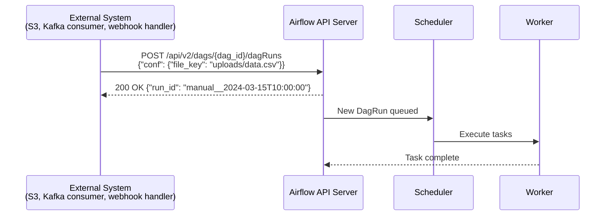
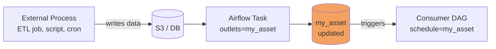

# Event-Driven Scheduling in Airflow 3

## Navigation
⬅️ **Prev: [Edge Executor](../34_Edge_Executor/Theory.md)** | 🏠 **[Home](../../00_Learning_Guide/Learning_Path.md)** | ➡️ **Next: [Object Storage](../36_Object_Storage/Theory.md)**

---

## 📌 Learning Priority

**Must Learn** — core concepts, needed to understand the rest of this file:
[Forms of Event-Driven Scheduling in Airflow 3](#forms-of-event-driven-scheduling-in-airflow-3) · [REST API Triggers](#1-rest-api-triggers-webhook-pattern) · [Asset-Driven Scheduling](#2-asset-driven-scheduling-data-events)

**Should Learn** — important for real projects and interviews:
[Custom Triggers Deferrable Operators](#3-custom-triggers-deferrable-operators) · [DAG Run Configuration](#dag-run-configuration-passing-event-data)

**Good to Know** — useful in specific situations, not needed daily:
[Webhook Integration Patterns](#webhook-integration-patterns)

**Reference** — skim once, look up when needed:
[Comparison Scheduling Approaches](#comparison-scheduling-approaches)

---

## The Story

A new file lands in S3. A Kafka message arrives. An API sends a webhook. In Airflow 3, these external events can directly trigger DAG runs — no polling, no fixed schedules, just react to what happens.

Traditional scheduling is about predicting the future: "the file will be ready at 6am so I'll schedule the DAG at 6:05am." Event-driven scheduling is about reacting to the present: "the file is here NOW, run the DAG now." The difference is 55 minutes of unnecessary latency versus immediate response.

Airflow 3 brings three forms of event-driven scheduling together into a coherent model: webhook-triggered DAG runs via the REST API, asset-driven scheduling (where data readiness is the event), and custom triggers for complex event patterns.

---

## Forms of Event-Driven Scheduling in Airflow 3

### 1. REST API Triggers (Webhook Pattern)

The simplest form. An external system calls the Airflow REST API to trigger a DAG run. The external system becomes the scheduler — Airflow reacts to its call.

**Flow:**



The DAG itself has `schedule=None` — it only runs when explicitly triggered:

```python
from airflow import DAG
from airflow.decorators import task
from datetime import datetime

with DAG(
    dag_id="process_uploaded_file",
    start_date=datetime(2024, 1, 1),
    schedule=None,          # No automatic schedule — event-triggered only
    catchup=False,
) as dag:

    @task
    def process(**context) -> str:
        conf = context["dag_run"].conf or {}
        file_key = conf.get("file_key", "no file specified")
        print(f"Processing file: {file_key}")
        return file_key

    @task
    def notify(file_key: str):
        print(f"Processing complete for: {file_key}")

    notify(process())
```

The external webhook handler:

```python
# webhook_handler.py — runs separately, not in Airflow
import requests

def handle_s3_event(event_payload: dict):
    """Called when S3 sends an event notification."""
    file_key = event_payload["Records"][0]["s3"]["object"]["key"]

    airflow_response = requests.post(
        "https://airflow.company.internal/api/v2/dags/process_uploaded_file/dagRuns",
        json={"conf": {"file_key": file_key, "bucket": "my-uploads"}},
        headers={"Authorization": f"Bearer {get_airflow_token()}"},
    )

    if airflow_response.status_code == 200:
        run_id = airflow_response.json()["run_id"]
        print(f"Triggered DAG run: {run_id}")
    else:
        print(f"Failed to trigger: {airflow_response.text}")
```

### 2. Asset-Driven Scheduling (Data Events)

The most Airflow-native form of event-driven scheduling. When a task produces data and marks an asset as updated, downstream DAGs trigger immediately.

The "event" here is data readiness — not time, not an external webhook call. See [Asset-Driven Scheduling Theory](../31_Asset_Driven_Scheduling/Theory.md) for full coverage.



### 3. Custom Triggers (Deferrable Operators)

For complex event patterns — waiting for a Kafka message, polling an API until a condition is met, listening for a CloudWatch alarm — Airflow 3 uses **Deferrable Operators** with the **Triggerer** component.

A deferrable operator suspends itself (returns a trigger to the Triggerer) and doesn't occupy a worker slot while waiting. When the trigger fires, the task resumes on a worker.

```python
from airflow.sensors.base import BaseSensorOperator
from airflow.triggers.base import BaseTrigger, TriggerEvent
from airflow.utils.context import Context
import asyncio

class KafkaMessageTrigger(BaseTrigger):
    """Async trigger that fires when a Kafka message arrives."""

    def __init__(self, topic: str, bootstrap_servers: str):
        super().__init__()
        self.topic = topic
        self.bootstrap_servers = bootstrap_servers

    def serialize(self) -> tuple:
        return (
            "my_package.triggers.KafkaMessageTrigger",
            {"topic": self.topic, "bootstrap_servers": self.bootstrap_servers},
        )

    async def run(self):
        """Async method that runs in the Triggerer process."""
        from aiokafka import AIOKafkaConsumer
        consumer = AIOKafkaConsumer(
            self.topic,
            bootstrap_servers=self.bootstrap_servers,
        )
        await consumer.start()
        try:
            async for msg in consumer:
                # Fire the trigger when a message arrives
                yield TriggerEvent({"value": msg.value.decode(), "offset": msg.offset})
                return  # Stop after first message
        finally:
            await consumer.stop()


class WaitForKafkaMessageOperator(BaseSensorOperator):
    """Operator that defers until a Kafka message arrives."""

    def __init__(self, topic: str, bootstrap_servers: str, **kwargs):
        super().__init__(**kwargs)
        self.topic = topic
        self.bootstrap_servers = bootstrap_servers

    def execute(self, context: Context):
        # Immediately defer — don't occupy a worker slot while waiting
        self.defer(
            trigger=KafkaMessageTrigger(
                topic=self.topic,
                bootstrap_servers=self.bootstrap_servers,
            ),
            method_name="execute_complete",
        )

    def execute_complete(self, context: Context, event: dict):
        """Called when the trigger fires."""
        print(f"Kafka message received: {event}")
        return event["value"]
```

Usage in a DAG:

```python
with DAG(
    dag_id="kafka_event_pipeline",
    start_date=datetime(2024, 1, 1),
    schedule=None,   # Triggered externally or kept running with perpetual trigger
) as dag:

    wait_for_event = WaitForKafkaMessageOperator(
        task_id="wait_for_kafka",
        topic="order.completed",
        bootstrap_servers="kafka:9092",
        deferrable=True,  # Use the deferrable mode
    )

    @task
    def process_event(message: str):
        print(f"Processing: {message}")

    process_event(wait_for_event)
```

---

## Comparison: Scheduling Approaches

```mermaid
graph TD
    subgraph "Time-Based (Traditional)"
        T1[schedule='@daily'] -->|"6:00 AM every day"| DR1[DagRun]
        DR1 -->|"hope data is ready"| RISK[Risk: stale or missing data]
    end

    subgraph "Event-Driven (Airflow 3)"
        EV1[S3 file arrives] -->|"immediately"| WH[Webhook → POST /api/v2/...]
        EV2[Asset updated] -->|"immediately"| AS[Asset event → Scheduler]
        EV3[Kafka message] -->|"immediately"| TRG[Trigger fires]
        WH --> DR2[DagRun - within seconds]
        AS --> DR2
        TRG --> DR2
        DR2 --> FRESH[Guaranteed fresh data]
    end

    style RISK fill:#ff6b6b
    style FRESH fill:#51cf66
```

| Approach | Latency | Reliability | Complexity |
|----------|---------|-------------|------------|
| Fixed cron schedule | Minutes to hours | Low (timing assumptions) | Low |
| Asset-driven | Seconds | High (data readiness guarantee) | Low |
| Webhook/REST trigger | Seconds | High (explicit trigger) | Medium |
| Deferrable operator | Seconds | High (async wait) | High |

---

## Webhook Integration Patterns

### Pattern 1: S3 Event Notification → Airflow

AWS S3 can send event notifications to SNS, SQS, or Lambda. A Lambda function calls the Airflow API:

```
S3 Upload → S3 Event → Lambda → Airflow REST API → DagRun
```

```python
# Lambda function (Python runtime)
import boto3
import requests
import os

def lambda_handler(event, context):
    for record in event["Records"]:
        key = record["s3"]["object"]["key"]
        bucket = record["s3"]["bucket"]["name"]

        requests.post(
            os.environ["AIRFLOW_API_URL"] + "/api/v2/dags/process_s3_file/dagRuns",
            json={"conf": {"key": key, "bucket": bucket}},
            headers={"Authorization": f"Bearer {os.environ['AIRFLOW_TOKEN']}"},
        )
```

### Pattern 2: GitHub Actions → Airflow (CI/CD Integration)

After a successful deployment, trigger a data validation DAG:

```yaml
# .github/workflows/deploy.yml
- name: Trigger Airflow validation
  run: |
    curl -X POST \
      "${{ secrets.AIRFLOW_URL }}/api/v2/dags/post_deploy_validation/dagRuns" \
      -H "Authorization: Bearer ${{ secrets.AIRFLOW_TOKEN }}" \
      -H "Content-Type: application/json" \
      -d '{"conf": {"git_sha": "${{ github.sha }}", "environment": "production"}}'
```

### Pattern 3: Kafka Consumer → Airflow (Streaming-to-Batch Bridge)

A lightweight Kafka consumer listens for specific events and batches them before triggering Airflow:

```python
# kafka_to_airflow_bridge.py
from kafka import KafkaConsumer
import requests
import json
from collections import defaultdict
import time

consumer = KafkaConsumer("order.completed", bootstrap_servers=["kafka:9092"])
pending_orders = []
BATCH_SIZE = 100
BATCH_TIMEOUT = 60  # seconds

for message in consumer:
    order = json.loads(message.value)
    pending_orders.append(order["order_id"])

    if len(pending_orders) >= BATCH_SIZE:
        # Trigger Airflow with a batch
        requests.post(
            "http://airflow:8080/api/v2/dags/process_order_batch/dagRuns",
            json={"conf": {"order_ids": pending_orders}},
            headers={"Authorization": f"Bearer {AIRFLOW_TOKEN}"},
        )
        pending_orders = []
```

---

## DAG Run Configuration: Passing Event Data

Event payloads are passed to DAGs via `conf`:

```python
with DAG("event_pipeline", schedule=None) as dag:

    @task
    def handle_event(**context):
        # Access event data passed in the trigger
        conf = context["dag_run"].conf or {}

        # From S3 webhook
        file_key = conf.get("file_key")
        bucket = conf.get("bucket")

        # From Kafka bridge
        order_ids = conf.get("order_ids", [])

        # From GitHub Actions
        git_sha = conf.get("git_sha")
        environment = conf.get("environment", "staging")

        print(f"Event data: {conf}")
```

🚀 **Apply this:** Replace sensors with Asset triggers → [Project 06 — Event-Driven Asset Pipeline](../../09_Capstone_Projects/06_Event_Driven_Asset_Pipeline/01_MISSION.md)
---

## Navigation
⬅️ **Prev: [Edge Executor](../34_Edge_Executor/Theory.md)** | 🏠 **[Home](../../00_Learning_Guide/Learning_Path.md)** | ➡️ **Next: [Object Storage](../36_Object_Storage/Theory.md)**
