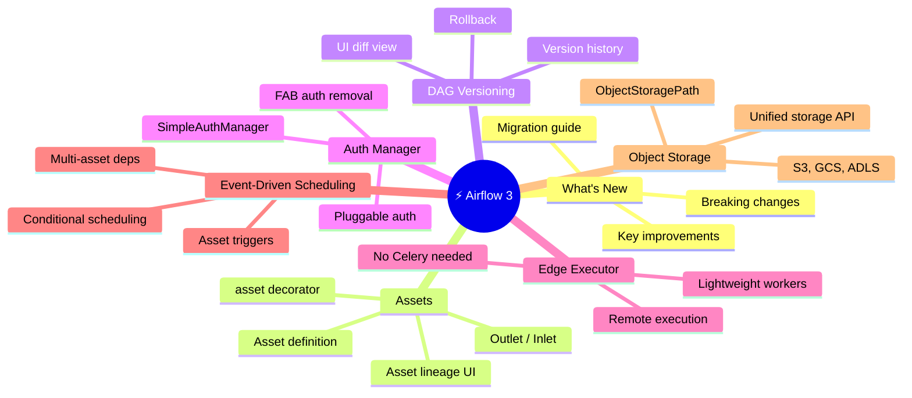
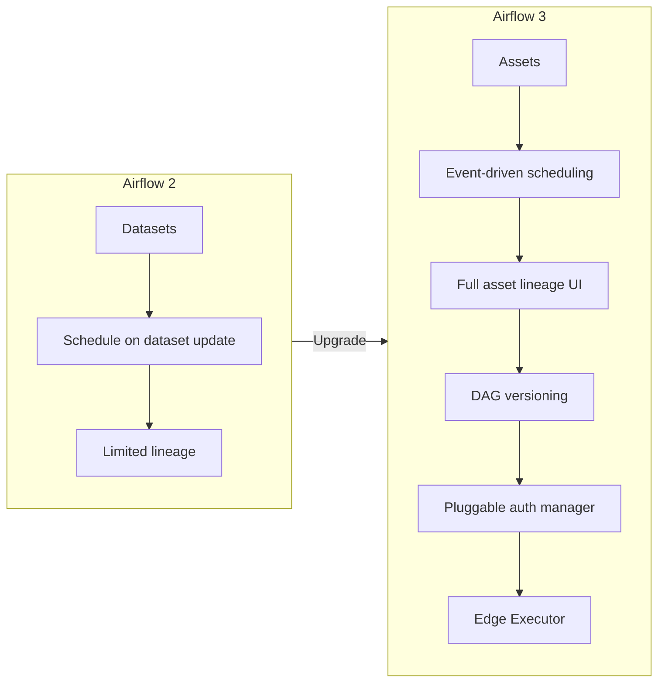

⬅️ [Expert Track](../04_Expert/Readme.md) &nbsp;|&nbsp; 🏠 [Home](../00_Learning_Guide/Readme.md) &nbsp;|&nbsp; [Airflow on Cloud ➡️](../06_Airflow_on_Cloud/Readme.md)

---

# ⚡ Airflow 3 Features

> *Airflow 3 is not just an upgrade — it's a rethinking of how pipelines are triggered and organised. Assets replace Datasets, the UI is rebuilt, the scheduler is faster, and event-driven scheduling is now first-class.*

**[Start Here → What's New in Airflow 3 (Theory.md)](30_Whats_New_in_Airflow_3/Theory.md)**

---

## At a Glance

| | |
|---|---|
| **Topics** | 7 modules |
| **Est. Time** | 8–10 hours |
| **Prerequisites** | 🟣 Expert Track, or Airflow 2 production experience |
| **Unlocks** | ☁️ Airflow on Cloud |

---

## Section Map

---

## Topics

| Module | File | Description |
|--------|------|-------------|
| 30 | [What's New → Theory.md](30_Whats_New_in_Airflow_3/Theory.md) | All major changes, breaking changes, migration guide |
| 31 | Assets → Theory.md | Asset model, @asset decorator, outlets and inlets |
| 31 | Assets → Code Example | Asset-driven DAG patterns |
| 32 | DAG Versioning → Theory.md | Version tracking, UI diff, rollback strategies |
| 33 | Auth Manager → Theory.md | Pluggable authentication, SimpleAuthManager |
| 34 | Edge Executor → Theory.md | Lightweight remote execution without Celery |
| 34 | Edge Executor → Setup Guide | Configuring Edge Executor for production |
| 35 | Event-Driven Scheduling → Theory.md | Asset triggers, multi-asset dependencies |
| 35 | Event-Driven → Code Example | Producer/consumer DAG pattern |
| 36 | Object Storage → Theory.md | Unified storage API, ObjectStoragePath |
| 36 | Object Storage → Code Example | Reading/writing across S3, GCS, ADLS |

---

## What Changed from Airflow 2

---

## Before You Start

- Either complete the Expert Track, or have 6+ months Airflow 2 production experience
- Run `pip install apache-airflow==3.0.0` to follow along (don't use Airflow 2 for these examples)
- The Assets module is the most important — start there even if you skip others

---

⬅️ [Expert Track](../04_Expert/Readme.md) &nbsp;|&nbsp; 🏠 [Home](../00_Learning_Guide/Readme.md) &nbsp;|&nbsp; [Airflow on Cloud ➡️](../06_Airflow_on_Cloud/Readme.md)

