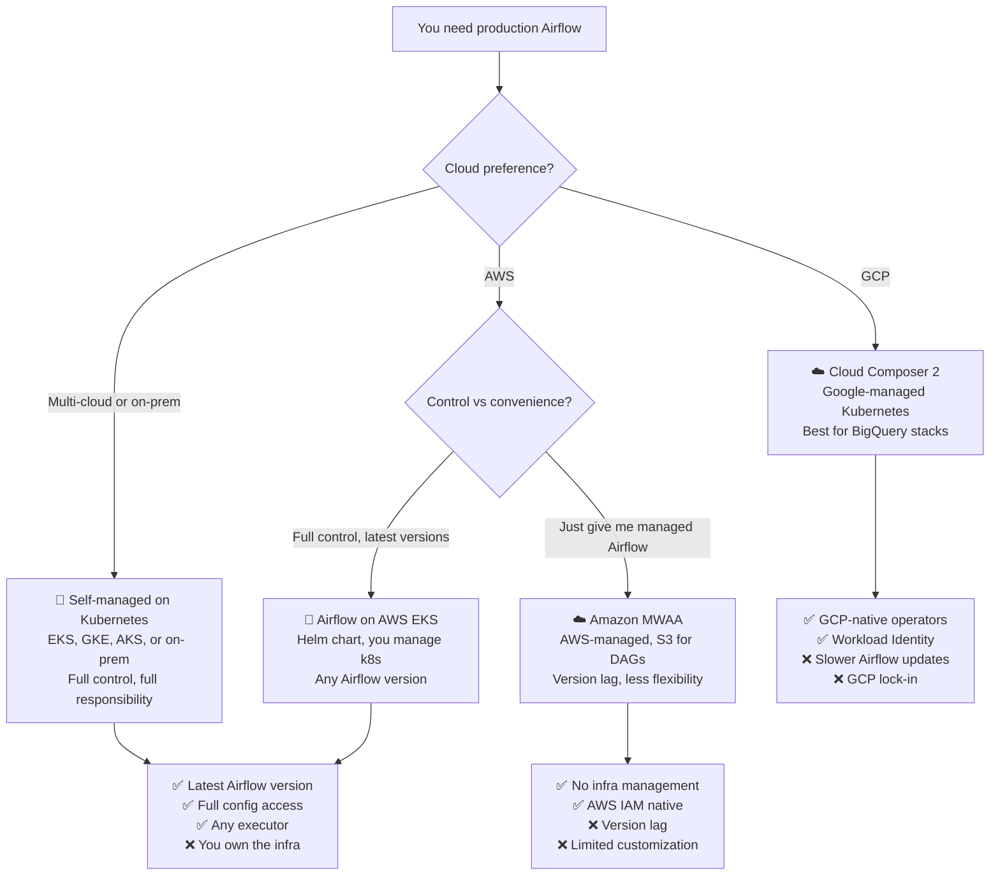
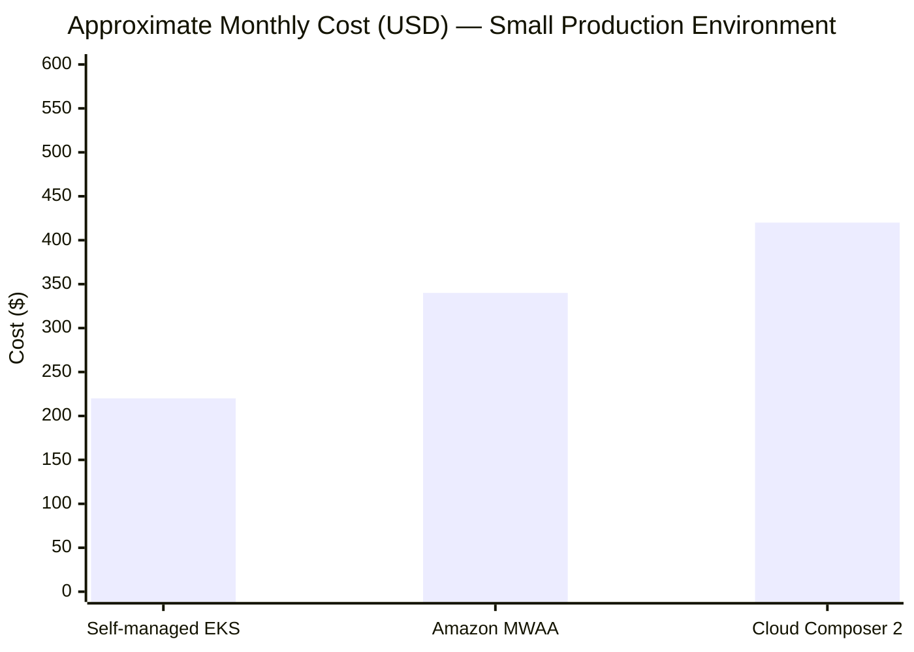
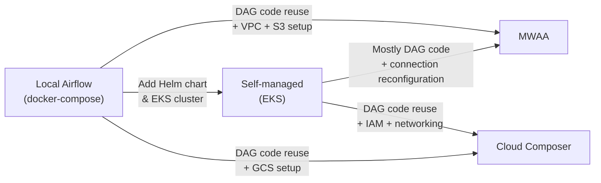

# ☁️ Cloud Overview — Choosing Your Airflow Deployment

> *You've mastered Airflow locally. Now you need to run it 24/7 at scale. Three paths: manage it yourself on Kubernetes, let AWS handle it with MWAA, or let GCP handle it with Cloud Composer. Each has trade-offs — and picking the wrong one will cost you months of pain.*

---

## 📌 Learning Priority

**Must Learn** — core concepts, needed to understand the rest of this file:
[The Three Paths](#the-three-paths) · [Self-Managed vs Managed](#self-managed-vs-managed-the-core-trade-off) · [When to Choose Each](#when-to-choose-each)

**Should Learn** — important for real projects and interviews:
[Cost Comparison](#cost-comparison) · [Operational Complexity](#operational-complexity)

**Good to Know** — useful in specific situations, not needed daily:
[Migration Path](#migration-path)

---

## The Production Problem

Running Airflow locally is one command: `airflow standalone`. Running it in production means answering a harder question:

**Who manages the infrastructure?**

When a scheduler pod crashes at 3am, who restarts it? When you need to upgrade Airflow, who tests the migration? When a DAG causes 500 concurrent tasks and your workers run out of memory, who scales the cluster?

There are three answers to that question, and they map to three deployment paths.

---

## The Three Paths

---

## Self-Managed vs Managed: The Core Trade-off

### Self-Managed (EKS / GKE / on-prem)

You install Airflow using the official Helm chart on a Kubernetes cluster you control.

**You get:**
- The latest Airflow version the day it ships
- Full access to `airflow.cfg` — every tunable parameter
- Any executor: LocalExecutor, CeleryExecutor, KubernetesExecutor
- Choice of metadata DB: RDS, Cloud SQL, self-hosted Postgres
- No vendor lock-in

**You own:**
- Kubernetes cluster upgrades
- Airflow version upgrades (testing, migration scripts)
- Worker scaling configuration (KEDA, HPA)
- Log storage infrastructure
- On-call when the scheduler crashes

---

### Managed (MWAA / Cloud Composer)

The cloud provider runs Airflow for you. You interact via a console or CLI.

**You get:**
- No infrastructure management
- Native cloud IAM integration (no separate secrets to manage)
- Scaling handled automatically
- SLA from the cloud provider

**You accept:**
- Version lag: MWAA and Composer often support Airflow versions that are 1–2 minor versions behind open source
- Limited configuration: not all `airflow.cfg` settings are exposed
- Vendor lock-in: your DAG deployment method, logging, and auth are cloud-specific
- Higher cost: managed services carry a premium

---

## Cost Comparison

| Deployment | Rough Monthly Cost | What's Included |
|-----------|-------------------|-----------------|
| Self-managed EKS (2 workers, t3.large) | ~$150–250 | EKS control plane ($73) + EC2 nodes + RDS |
| Amazon MWAA mw1.small | ~$320–380 | All-in, includes managed scheduler and workers |
| Cloud Composer 2 (small) | ~$300–500 | GKE-based, includes all components |

*These are rough estimates. Actual costs depend on region, task volume, and instance sizing.*

---

## Operational Complexity

| Task | Self-managed | MWAA | Cloud Composer |
|------|-------------|------|----------------|
| Initial setup | High (Helm, k8s) | Low (console wizard) | Low (gcloud CLI) |
| Airflow upgrade | Manual, you test | AWS handles | Google handles |
| Scaling workers | Manual (KEDA/HPA) | Automatic | Automatic |
| Adding Python packages | `requirements.txt` in image | `requirements.txt` in S3 | `requirements.txt` in GCS |
| Debugging infra issues | You investigate k8s | AWS Support | Google Support |
| Custom executor | Yes | No (uses CeleryExecutor) | No (uses KubernetesExecutor) |

---

## When to Choose Each

### Choose Self-Managed EKS/GKE when:
- You need the latest Airflow version (especially for Airflow 3 features)
- You need a specific executor (e.g., KubernetesExecutor with custom pod templates)
- You have a platform/DevOps team who can own Kubernetes
- Cost optimisation is critical (can be cheaper at scale)
- You need advanced configuration (scheduler parallelism, custom plugins in the image)

### Choose MWAA when:
- Your data stack is primarily AWS (S3, Redshift, Glue, EMR)
- You don't have a Kubernetes team
- You can accept Airflow being 1–2 versions behind open source
- You want AWS-native IAM and CloudWatch integration out of the box
- Your DAGs don't need unusual Airflow configs

### Choose Cloud Composer when:
- Your data stack is primarily GCP (BigQuery, GCS, Dataflow, Dataproc)
- You want Google operators pre-installed and maintained
- You want Workload Identity (no service account keys to manage)
- You're already on GKE for other workloads

---

## Migration Path

Moving between options later is possible but painful. The DAG code itself is portable — the infrastructure and connection setup is not.

**Rule of thumb:** Start with self-managed if you want flexibility. Start with managed if you want speed.

---

## Next Steps

| Ready for... | Go to |
|-------------|-------|
| Full control on AWS | [AWS EKS → Theory.md](../38_AWS_EKS/Theory.md) |
| Managed on AWS | [MWAA → Theory.md](../39_MWAA/Theory.md) |
| Managed on GCP | [GCP Composer → Theory.md](../40_GCP_Composer/Theory.md) |
| Side-by-side comparison | [Comparison.md](./Comparison.md) |
