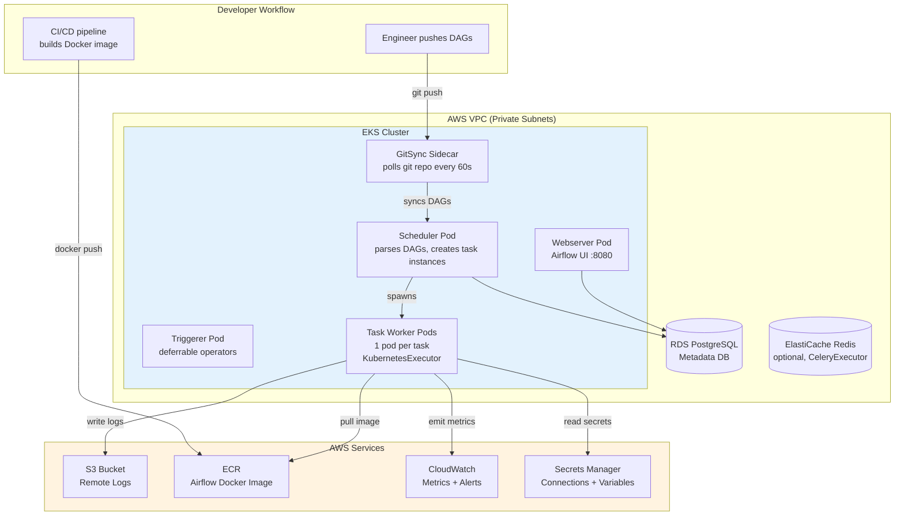
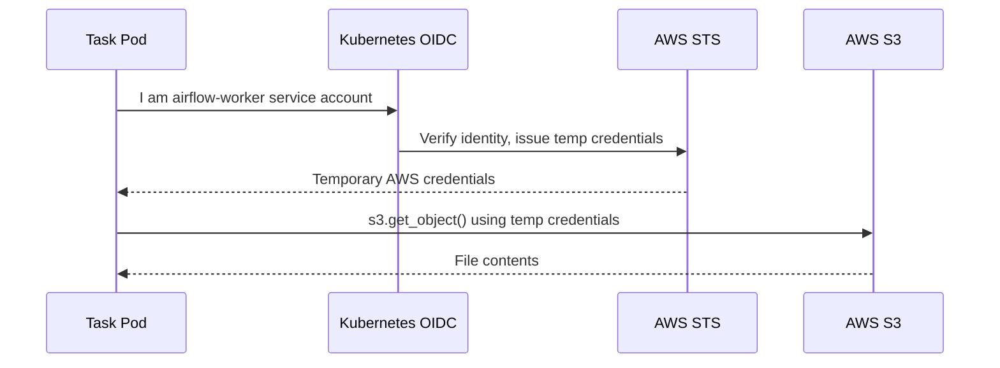
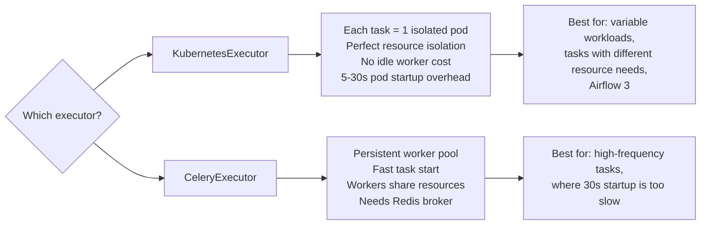

# 🔧 Airflow 3 on AWS EKS

> *Running Airflow on AWS EKS gives you full control — any Airflow version, any configuration, infinite scaling. The trade-off: you own the infrastructure. When a scheduler pod crashes at 3am, that's your problem. But when you need Airflow 3 on day one, KubernetesExecutor with custom pod templates, and your company's specific Docker image — EKS is the only option.*

---

## The Story

You've been running Airflow on your laptop with Docker Compose. It works perfectly for developing DAGs. Then your manager says: *"We need this running 24/7, processing 500 tasks a day."*

Docker Compose on one machine means one point of failure. If the machine restarts, Airflow stops. If a runaway task consumes all CPU, the scheduler slows down. If you need to run 100 tasks in parallel, you're limited to the RAM of a single server.

EKS solves this. Every task gets its own Kubernetes pod. Pods run in parallel across multiple EC2 instances. When tasks finish, pods disappear — no idle resources. The EC2 cluster autoscales up when work arrives and back down when it's done.

This is the most powerful Airflow setup. It's also the most work to maintain. Let's build it.

---

## Architecture



---

## Why EKS Over MWAA?

Before building this, make sure you actually need it. MWAA is faster to set up. EKS is worth it when:

| You need... | EKS? |
|-------------|------|
| Airflow 3 features on day one | Yes — MWAA version lags by months |
| KubernetesExecutor (task-per-pod) | Yes — MWAA uses CeleryExecutor only |
| Custom Docker image with your libraries | Yes |
| Full `airflow.cfg` access | Yes — MWAA exposes only some settings |
| Cost under $200/month | Possible — MWAA minimum is ~$320 |
| Zero Kubernetes expertise on team | No — start with MWAA |

---

## Component Deep-Dive

### EKS Cluster

AWS manages the Kubernetes control plane (API server, etcd). You manage the data plane: the EC2 node group that runs your pods.

```
Recommended node sizing:
- Development:    t3.medium  (2 vCPU, 4 GB RAM)
- Production:     m5.large   (2 vCPU, 8 GB RAM)
- High-volume:    m5.xlarge  (4 vCPU, 16 GB RAM)

Node group settings:
- min-nodes: 2   (for HA — one node can fail)
- max-nodes: 10  (scale up for peak workloads)
- Enable Cluster Autoscaler
```

### The Helm Chart

The official `apache-airflow/airflow` Helm chart deploys:
- Webserver deployment (1–2 replicas)
- Scheduler deployment (1 active, 1 standby in Airflow 3)
- Triggerer deployment (for deferrable operators)
- Service account with IRSA annotation
- ConfigMaps for `airflow.cfg` overrides
- Secret for Fernet key and database password

### GitSync: The Clean DAG Deployment Pattern

Instead of manually copying files to pods, a GitSync sidecar container runs alongside every Airflow pod and continuously pulls your DAG repository from Git.

```
Push DAG to GitHub → GitSync detects change →
DAG synced to pod filesystem → Scheduler parses it →
DAG appears in UI
Total time: ~60 seconds
```

```yaml
# In values.yaml
dags:
  gitSync:
    enabled: true
    repo: https://github.com/your-org/airflow-dags.git
    branch: main
    depth: 1
    wait: 60          # poll every 60 seconds
    subPath: "dags/"
    credentialsSecret: git-credentials  # for private repos
```

### RDS PostgreSQL: The Metadata Database

Airflow stores every DAG run, task instance, connection, and variable in a PostgreSQL database. On EKS, you provision this as an RDS instance — outside the cluster, so it survives pod restarts.

**Never use the in-cluster PostgreSQL in the Helm chart for production.** It has no persistent volume by default and will lose all data if the pod restarts.

```
RDS sizing guide:
- Development:   db.t3.micro   (1 vCPU, 1 GB RAM)
- Production:    db.t3.medium  (2 vCPU, 4 GB RAM) + Multi-AZ
- High-volume:   db.r5.large   (2 vCPU, 16 GB RAM) + Read replica
```

### IRSA: AWS Credentials Without Secrets

IAM Roles for Service Accounts (IRSA) lets Airflow pods call AWS services (S3, Secrets Manager, Glue, etc.) using an IAM role — no access keys in code.



No environment variables. No secret files. The pod just works.

---

## Executor Choice



**Recommendation for most teams: KubernetesExecutor.** It's what Kubernetes was built for, and it aligns with Airflow 3's architecture.

---

## Monitoring

Key metrics to watch and alert on:

| Metric | What it tells you | Alert if... |
|--------|-------------------|-------------|
| `airflow.scheduler.heartbeat` | Scheduler alive | No heartbeat for 30s |
| `airflow.executor.running_tasks` | Active tasks | Sustained at max concurrency |
| `airflow.dagbag.size` | DAG count | Drops unexpectedly |
| `airflow.dag.loading_duration_ms` | DAG parse time | > 30 seconds |
| RDS CPU | Database health | > 80% for 5 minutes |
| Node memory | EC2 health | > 85% |

Configure StatsD → CloudWatch Exporter in `values.yaml`:

```yaml
config:
  metrics:
    statsd_on: "True"
    statsd_host: "localhost"
    statsd_port: "8125"
    statsd_prefix: "airflow"
```

---

## See Also

- [Step-by-step Setup Guide →](./Setup_Guide.md) — Every command to deploy Airflow 3 on EKS
- [Cloud Comparison →](../37_Cloud_Overview/Comparison.md) — EKS vs MWAA vs Composer feature table
- [Cloud Overview →](../37_Cloud_Overview/Theory.md) — Decision framework
