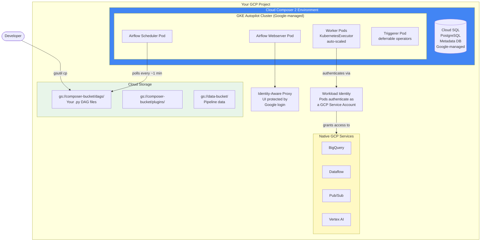
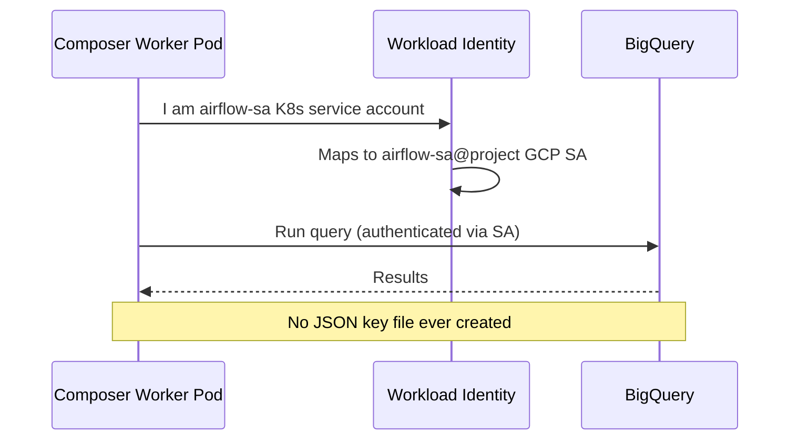

# ☁️ Google Cloud Composer — Managed Airflow on GCP

> *Cloud Composer is Google's managed Airflow. If your data lives in BigQuery and GCS, Composer integrates natively — Google operators pre-installed, Workload Identity for auth, no JSON key files to manage. You upload DAGs to a GCS bucket, and Airflow runs them. The friction of "how do I connect Airflow to BigQuery?" simply disappears.*

---

## 📌 Learning Priority

**Must Learn** — core concepts, needed to understand the rest of this file:
[Architecture](#architecture) · [Deploying DAGs](#deploying-dags) · [Workload Identity No JSON Keys Needed](#workload-identity-no-json-keys-needed)

**Should Learn** — important for real projects and interviews:
[Pre-Installed Google Operators](#pre-installed-google-operators) · [Composer vs MWAA](#composer-vs-mwaa)

**Good to Know** — useful in specific situations, not needed daily:
[Creating a Composer 2 Environment](#creating-a-composer-2-environment) · [Cost Model](#cost-model)

**Reference** — skim once, look up when needed:
[Composer 2 vs Composer 1](#composer-2-vs-composer-1) · [Installing Python Packages](#installing-python-packages)

---

## The Story

Your data stack is on Google Cloud. Analysts query BigQuery all day. Raw data lands in GCS from Pub/Sub. Transformations run on Dataflow. You need Airflow to orchestrate all of it.

You could run self-managed Airflow on GKE. You'd configure a BigQuery connection, create a service account JSON file, upload it to Airflow, reference it in every operator. Then do the same for GCS, Dataflow, Pub/Sub, Vertex AI.

Or you could use Cloud Composer.

With Composer, your Airflow instance runs inside your GCP project, using a service account you control. A `BigQueryInsertJobOperator` task authenticates automatically via Workload Identity — no connection setup, no key files. The same for GCS, Dataflow, Pub/Sub. It just works.

You deploy a DAG by running `gsutil cp my_dag.py gs://your-composer-bucket/dags/`. Within 2 minutes, it's in Airflow.

If your data stack is on GCP, Composer is the fastest path to production Airflow.

---

## Architecture



---

## Composer 2 vs Composer 1

Always use Composer 2 for new environments. Composer 1 uses a standard GKE cluster (always-on nodes), while Composer 2 uses GKE Autopilot (nodes provision on demand).

| | Composer 1 | Composer 2 |
|--|-----------|-----------|
| GKE type | Standard (always-on) | Autopilot (serverless pods) |
| Idle cost | High — nodes run 24/7 | Low — pods scale down |
| Scaling | Manual configuration | Automatic |
| Startup time | Slower | Faster |
| Cost model | Per-node + overhead | Per-pod CPU/memory-second |
| Recommended | Legacy only | Yes — use this |

---

## Creating a Composer 2 Environment

### Via gcloud CLI

```bash
# Enable required APIs (one-time)
gcloud services enable composer.googleapis.com
gcloud services enable container.googleapis.com

# Create a service account for Composer to use
gcloud iam service-accounts create airflow-sa \
  --display-name="Airflow Composer SA"

# Grant it BigQuery access (add more roles as needed)
gcloud projects add-iam-policy-binding YOUR_PROJECT \
  --member="serviceAccount:airflow-sa@YOUR_PROJECT.iam.gserviceaccount.com" \
  --role="roles/bigquery.dataEditor"

gcloud projects add-iam-policy-binding YOUR_PROJECT \
  --member="serviceAccount:airflow-sa@YOUR_PROJECT.iam.gserviceaccount.com" \
  --role="roles/storage.objectAdmin"

# Create the Composer 2 environment
# Takes 20–40 minutes
gcloud composer environments create my-airflow-env \
  --location us-central1 \
  --image-version composer-2.6.3-airflow-2.7.3 \
  --service-account airflow-sa@YOUR_PROJECT.iam.gserviceaccount.com \
  --environment-size small

# Check status
gcloud composer environments describe my-airflow-env \
  --location us-central1 \
  --format="value(state)"
# Outputs: RUNNING when ready
```

### Via GCP Console

1. Navigate to **Cloud Composer** in the GCP Console
2. Click **Create Environment** → select **Composer 2**
3. Fill in: name, location, Airflow version, service account
4. Leave other settings as defaults for your first environment
5. Click **Create** — wait 20–40 minutes

---

## Deploying DAGs

DAGs are deployed by uploading `.py` files to the GCS bucket that Composer creates for your environment.

```bash
# Find your environment's DAG bucket
BUCKET=$(gcloud composer environments describe my-airflow-env \
  --location us-central1 \
  --format="value(config.dagGcsPrefix)")
echo $BUCKET
# gs://us-central1-my-airflow-env-abc123-bucket/dags

# Deploy a single DAG
gsutil cp my_dag.py $BUCKET/my_dag.py

# Sync an entire DAGs folder
gsutil -m rsync -r ./dags/ $BUCKET

# Remove a DAG
gsutil rm $BUCKET/old_dag.py

# List deployed DAGs
gsutil ls $BUCKET
```

Composer picks up new DAGs within 1–3 minutes.

---

## Installing Python Packages

```bash
# Method 1: Update from requirements.txt file
gcloud composer environments update my-airflow-env \
  --location us-central1 \
  --update-pypi-packages-from-file requirements.txt

# Method 2: Install individual package
gcloud composer environments update my-airflow-env \
  --location us-central1 \
  --update-pypi-package apache-airflow-providers-snowflake==4.0.0

# Remove a package
gcloud composer environments update my-airflow-env \
  --location us-central1 \
  --remove-pypi-package old-package

# Check what's installed
gcloud composer environments describe my-airflow-env \
  --location us-central1 \
  --format="value(config.softwareConfig.pypiPackages)"
```

Package installs trigger an environment update (~10–20 minutes). During this time, the environment continues running — unlike MWAA, which pauses during rebuilds.

---

## Workload Identity: No JSON Keys Needed

Workload Identity is the killer feature of Composer for GCP-native teams. Kubernetes pods authenticate as a GCP service account without any key files.



In practice, your DAG code looks like this — no `gcp_conn_id` needed:

```python
from airflow.providers.google.cloud.operators.bigquery import BigQueryInsertJobOperator

run_query = BigQueryInsertJobOperator(
    task_id="run_bq_query",
    configuration={
        "query": {
            "query": """
                SELECT
                    date,
                    SUM(revenue) as total_revenue
                FROM `my_project.sales.transactions`
                WHERE date = '{{ ds }}'
                GROUP BY date
            """,
            "useLegacySql": False,
        }
    },
    # No gcp_conn_id needed — uses Workload Identity automatically
)
```

---

## Pre-Installed Google Operators

Composer comes with the full `apache-airflow-providers-google` package pre-installed. You get hundreds of GCP operators out of the box:

| Service | Operator Examples |
|---------|------------------|
| BigQuery | `BigQueryInsertJobOperator`, `BigQueryCreateEmptyTableOperator`, `BigQueryCheckOperator` |
| GCS | `GCSCreateBucketOperator`, `GCSToGCSOperator`, `GCSDeleteObjectsOperator` |
| Dataflow | `DataflowCreateJavaJobOperator`, `DataflowTemplatedJobStartOperator` |
| Pub/Sub | `PubSubCreateTopicOperator`, `PubSubPublishMessageOperator` |
| Dataproc | `DataprocCreateClusterOperator`, `DataprocSubmitJobOperator` |
| Vertex AI | `CreateCustomTrainingJobOperator`, `BatchPredictionJobOperator` |

A complete GCP pipeline:

```python
from airflow.sdk import DAG
from airflow.providers.google.cloud.operators.bigquery import BigQueryInsertJobOperator
from airflow.providers.google.cloud.transfers.gcs_to_bigquery import GCSToBigQueryOperator
from airflow.providers.google.cloud.operators.dataflow import DataflowTemplatedJobStartOperator
from datetime import datetime

with DAG(
    dag_id="gcp_native_pipeline",
    start_date=datetime(2024, 1, 1),
    schedule="@daily",
    catchup=False,
) as dag:

    # Step 1: Load GCS CSV to BigQuery staging table
    load_to_staging = GCSToBigQueryOperator(
        task_id="load_to_staging",
        bucket="my-data-bucket",
        source_objects=["raw/{{ ds }}/sales.csv"],
        destination_project_dataset_table="my_project.staging.daily_sales",
        source_format="CSV",
        write_disposition="WRITE_TRUNCATE",
        skip_leading_rows=1,
    )

    # Step 2: Transform via BigQuery SQL
    transform = BigQueryInsertJobOperator(
        task_id="transform",
        configuration={
            "query": {
                "query": """
                    INSERT INTO `my_project.warehouse.sales`
                    SELECT * FROM `my_project.staging.daily_sales`
                    WHERE revenue > 0
                """,
                "useLegacySql": False,
            }
        },
    )

    load_to_staging >> transform
```

---

## Cost Model

Composer 2 pricing has four components:

| Component | Description |
|-----------|-------------|
| Composer environment fee | Flat ~$0.10/hour per environment |
| GKE Autopilot pods | Pay for CPU/memory-seconds while pods run |
| Cloud SQL | Managed PostgreSQL instance cost |
| GCS storage | Minimal — DAGs and logs |

**Typical monthly cost:**
- Light use (dev, few DAGs): ~$150–250/month
- Moderate production: ~$400–600/month
- Heavy production: $700–1,200+/month

**Cost optimisation tips:**
- Set low `max_workers` for dev environments
- Use `@once` or `None` schedule for DAGs during development
- Clean up old task logs from the GCS bucket regularly
- Use Composer 2 (Autopilot) — pods scale down between bursts

---

## Accessing the Airflow UI

Composer's UI is protected by Identity-Aware Proxy (IAP). You log in with your Google account.

```bash
# Get the Airflow UI URL
gcloud composer environments describe my-airflow-env \
  --location us-central1 \
  --format="value(config.airflowUri)"

# Grant a team member access
gcloud projects add-iam-policy-binding YOUR_PROJECT \
  --member="user:engineer@company.com" \
  --role="roles/composer.user"
```

No username/password to manage — Google handles authentication.

---

## Composer vs MWAA

| | Cloud Composer 2 | Amazon MWAA |
|--|-----------------|------------|
| Best for | GCP-heavy stacks | AWS-heavy stacks |
| Auth model | Workload Identity (GCP SA) | IAM Execution Role (AWS) |
| Pre-installed operators | All google-cloud providers | Core providers only |
| Executor | KubernetesExecutor | CeleryExecutor |
| Package update downtime | No (rolling update) | Yes (10–25 min rebuild) |
| DAG deployment | `gsutil cp` to GCS | `aws s3 cp` to S3 |
| Airflow version lag | 3–6 months | 3–6 months |
| Cost (small env) | ~$300–500/mo | ~$320–380/mo |

---

## See Also

- [Cloud Overview →](../37_Cloud_Overview/Theory.md) — Full decision framework
- [Comparison Table →](../37_Cloud_Overview/Comparison.md) — Detailed feature comparison
- [AWS EKS →](../38_AWS_EKS/Theory.md) — Self-managed option for maximum control
